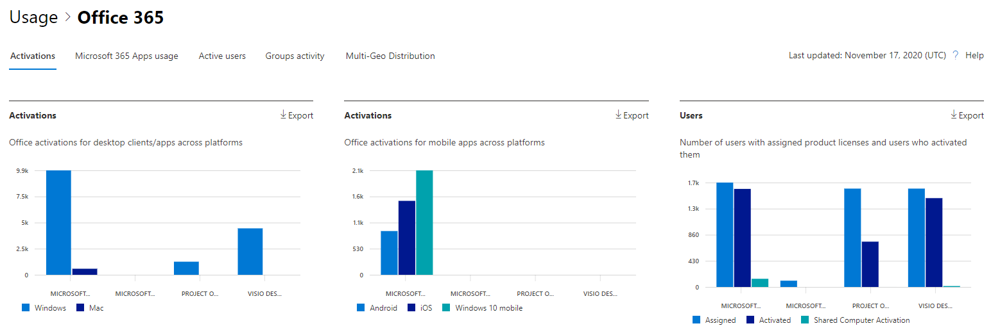

# 管理センターの microsoft 365 レポート-Microsoft Office のライセンス認証

Microsoft 365 **Reports** dashboard には、組織内の製品全体にわたるアクティビティの概要が表示されます。 これにより、個別の製品レベルのレポートを詳細に確認して、各製品内のアクティビティについてより詳しく知ることができます。 [レポートの概要に関するトピック](activity-reports.md)を参照してください。
  
[Office ライセンス認証] レポートでは、Office サブスクリプションのライセンス認証を行ったユーザーを少なくとも 1 台のデバイスで確認できます。 エンタープライズ、プロジェクト、Visio Pro for Office 365 のサブスクリプションのライセンス認証のための Microsoft 365 アプリ、およびデスクトップとデバイス間でのライセンス認証の内訳について説明します。 このレポートは、Office サブスクリプションのライセンス認証について、追加のヘルプやサポートが必要なユーザーを特定するときにも役立ちます。
  
> [!NOTE]
> レポートを表示するには、Microsoft 365 または Exchange、SharePoint、Teams サービス、Teams 通信、または Skype for Business 管理者のグローバル管理者、グローバル閲覧者またはレポート閲覧者である必要があります。  
  
## Office ライセンス認証レポートにアクセスする方法

1. 管理センターで、[**レポート**] \> [<a href="https://go.microsoft.com/fwlink/p/?linkid=2074756" target="_blank">使用状況</a>] ページの順に移動します。 
2. ダッシュボードのホームページから、Office ライセンス認証カードの [ **詳細表示** ] ボタンをクリックします。
  
## Office ライセンス認証レポートを解釈する
  
[ **アクティブ** 化] タブを選択すると、Office 365 レポートのライセンス認証を表示できます。 

レポートに列を追加または削除するには、[ **列の選択** ] を選択します。    

また、[**エクスポート**] リンクを選択して、レポート データを Excel の .csv ファイルにエクスポートすることもできます。 これにより、すべてのユーザーのデータがエクスポートされ、単純な並べ替えとフィルター処理を行ってさらに分析することができます。 ユーザー数が 2000 未満である場合は、レポート自体のテーブル内で並べ替えとフィルター処理を行うことができます。 ユーザー数が 2000 を超える場合は、フィルター処理と並べ替えを行うために、データをエクスポートする必要があります。 

|アイテム|説明|
|:-----|:-----|
|**測定基準**|**定義**|
|ユーザー名    |ユーザーの電子メール アドレス。    |
|表示名    |ユーザーの完全な名前。    |
|製品のライセンス    |このユーザーに割り当てられている製品。    |
|最後にアクティブ化された日付 (UTC)    |ユーザーがデスクトップまたはデバイスで Office をライセンス認証した日付。    |
|Windows コンピューターでのライセンス認証    |ユーザーが Office のライセンス認証を行った Windows デスクトップの数。    |
|Mac コンピューターでのライセンス認証   |ユーザーが Office のライセンス認証を行った Mac デスクトップの数。|
|Windows 10 の電話とタブレットでのライセンス認証    |ユーザーが Office のライセンス認証を行った Windows 10 モバイルデバイスの数。    |
|IOS 電話とタブレットでのライセンス認証    |ユーザーが Office のライセンス認証を行った iOS デバイスの数。|
|Android フォンおよびタブレットでのライセンス認証    |ユーザーが Office のライセンス認証を行った Android デバイスの数。    |
|共有コンピューターのライセンス認証の使用 |これは、ユーザーが共有コンピューターのライセンス認証を使用して Office を使用した場合に当てはまります。|
|||
   