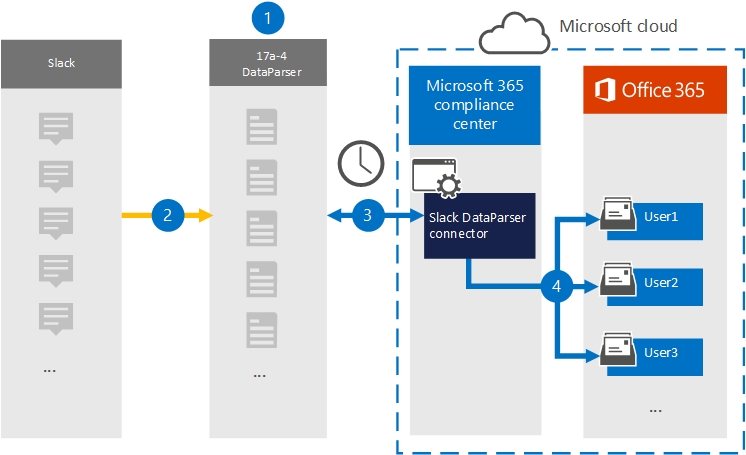

# Slack データをアーカイブするコネクタをセットアップする (プレビュー)

[17a-4 LLC の DataParser](https://www.17a-4.com/slack-dataparser/)を使用して、Slack プラットフォームから組織のユーザー メールボックスにデータをインポートMicrosoft 365します。 DataParser には、サードパーティのデータ ソースからアイテムをキャプチャし、それらのアイテムをデータ ソースにインポートするように構成された Slack コネクタMicrosoft 365。 Slack DataParser コネクタは Slack データを電子メール メッセージ形式に変換し、それらのアイテムをユーザー メールボックスにインポートMicrosoft 365。

Slack データをユーザー のメールボックスに保存した後、訴訟ホールド、電子情報開示、保持ポリシーと保持ラベル、通信コンプライアンスなどのコンプライアンス機能Microsoft 365を適用できます。 Slack コネクタを使用してデータをインポートおよびアーカイブMicrosoft 365、組織が政府機関および規制ポリシーに準拠しつ付けるのに役立ちます。

## Slack データのアーカイブの概要

次の概要では、データ コネクタを使用して Slack データをアーカイブするプロセスについて説明Microsoft 365。

1. 組織は 17a-4 を使用して Slack DataParser を設定および構成します。

2. 定期的に、Slack アイテムは DataParser によって収集されます。 DataParser は、メッセージのコンテンツを電子メール メッセージ形式に変換します。

3. Microsoft 365 コンプライアンス センター で作成した Slack DataParser コネクタは、DataParser に接続し、Microsoft クラウド内Azure Storageセキュリティで保護された場所にメッセージを転送します。

4. **Slack DataParser** という名前の受信トレイ フォルダー内のサブフォルダーがユーザー メールボックスに作成され、Slack アイテムがそのフォルダーにインポートされます。 コネクタは *、Email* プロパティの値を使用してアイテムをインポートするメールボックスを決定します。 すべての Slack アイテムには、このプロパティが含まれるので、すべての参加者の電子メール アドレスが設定されます。

## コネクタをセットアップする前に

- Microsoft コネクタ用の DataParser アカウントを作成します。 これを行うには [、17a-4 LLC にお問い合わせください](https://www.17a-4.com/contact/)。 手順 1 でコネクタを作成する場合は、このアカウントにサインインする必要があります。

- 手順 1 で Slack DataParser コネクタを作成し (手順 3 で完了する) ユーザーは、Exchange Online のメールボックスインポートエクスポートの役割に割り当てる必要があります。 この役割は、データ コネクタ ページの[データ コネクタ] ページにコネクタを追加Microsoft 365 コンプライアンス センター。 既定では、この役割はグループ内の役割グループExchange Online。 [メールボックスのインポートエクスポート] 役割は、組織の [組織の管理] 役割グループに追加Exchange Online。 または、役割グループを作成し、メールボックスインポートエクスポートの役割を割り当て、適切なユーザーをメンバーとして追加できます。 詳細については、「グループ内の[役割グループを](/Exchange/permissions-exo/role-groups#create-role-groups)管理する」の「役割グループの作成」または「役割グループの変更」セクションを参照Exchange Online。

## 手順 1: Slack DataParser コネクタをセットアップする

最初の手順は、Slack データ用の 17a-4 コネクタを作成し、Microsoft 365 コンプライアンス センターの [データ コネクタ] ページにアクセスすることです。

1. [データ コネクタ <https://compliance.microsoft.com> ] **Slack**  >  **DataParser に移動し、[データ コネクタ] をクリックします**。

2. Slack **DataParser 製品の説明ページで、[** コネクタの追加] **をクリックします**。

3. [サービス条件 **] ページで、[** 同意する] を **クリックします**。

4. コネクタを識別する一意の名前を入力し、[次へ] を **クリックします**。

5. 17a-4 アカウントにサインインし、Slack DataParser 接続ウィザードの手順を完了します。

## 手順 2: Slack DataParser コネクタを構成する

17a-4 サポートを使用して Slack DataParser コネクタを構成します。

## 手順 3: ユーザーをマップする

Slack DataParser コネクタは、データをユーザーにインポートする前に、ユーザー Microsoft 365メール アドレスに自動的にマップMicrosoft 365。

## 手順 4: Slack DataParser コネクタを監視する

Slack DataParser コネクタを作成した後、コネクタの状態を [データ] ページで表示Microsoft 365 コンプライアンス センター。

1. 左側の <https://compliance.microsoft.com> ナビゲーションで [ **データ コネクタ] に** 移動してクリックします。

2. [コネクタ **] タブをクリック** し、作成した Slack DataParser コネクタを選択して、コネクタのプロパティと情報を含むフライアウト ページを表示します。

3. [**ソースを含むコネクタの状態**] で、[ログのダウンロード] リンクをクリックして、コネクタの状態ログを開く (または保存) します。  このログには、Microsoft クラウドにインポートされたデータが含まれます。

## 既知の問題

現時点では、10 MB を超える添付ファイルやアイテムのインポートはサポートされていません。 大きいアイテムのサポートは、後日利用できます。
