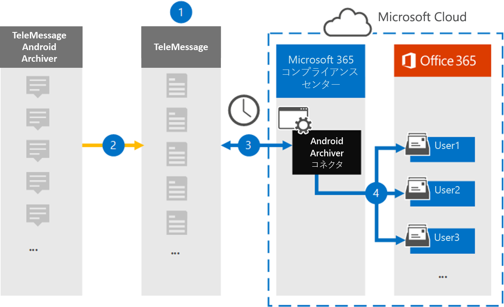

# Android モバイル データをアーカイブするコネクタをセットアップする

Microsoft 365 コンプライアンス センターの TeleMessage コネクタを使用して、Android 携帯電話から SMS、MMS、音声通話、通話ログをインポートおよびアーカイブします。 コネクタをセットアップして構成した後、組織の TeleMessage アカウントに毎日 1 回接続し、TeleMessage Android Archiver を使用して従業員のモバイル通信を Microsoft 365 のメールボックスにインポートします。

Android 携帯電話のデータをユーザー メールボックスに保存した後、訴訟ホールド、コンテンツ検索、Microsoft 365 保持ポリシーなどの Microsoft 365 コンプライアンス機能を Android Archiver データに適用できます。 たとえば、コンテンツ検索を使用して Android Archiver モバイル通信を検索したり、Android Archiver コネクタ データを含むメールボックスを高度な電子情報開示ケースの保管担当者に関連付けできます。 Android Archiver コネクタを使用して Microsoft 365 でデータをインポートおよびアーカイブすると、組織が政府および規制ポリシーに準拠しつ付けるのに役立ちます。

## Android モバイル データのアーカイブの概要

次の概要では、コネクタを使用して Microsoft 365 の Android モバイル データをアーカイブするプロセスについて説明します。

1. 組織は、TeleMessage を使用して Android アーカイブ コネクタをセットアップします。 詳細については [、「Android Archiver」を参照してください](https://www.telemessage.com/office365-activation-for-android-archiver/)。

2. 24 時間に 1 回、組織の Android 携帯電話からの SMS、MMS、音声通話、通話ログが TeleMessage サイトにコピーされます。

3. Microsoft 365 コンプライアンス センターで作成した Android Archiver コネクタは、毎日 TeleMessage サイトに接続し、過去 24 時間の Android データを Microsoft Cloud の安全な Azure Storage の場所に転送します。 コネクタは、Android データを電子メール メッセージ形式に変換します。

4. コネクタは、モバイル通信アイテムを特定のユーザーのメールボックスにインポートします。 Android Archiver という名前の新しいフォルダーが特定のユーザーのメールボックスに作成され、アイテムがインポートされます。 コネクタは、User の [電子メール アドレス] プロパティの値を使用 *してマッピングを行* います。 すべての電子メール メッセージには、このプロパティが含まれるので、電子メール メッセージのすべての参加者の電子メール アドレスが設定されます。 *User* の [電子メール アドレス] プロパティの値を使用した自動ユーザー マッピングに加えて、CSV マッピング ファイルをアップロードしてカスタム マッピングを定義できます。 このマッピング ファイルには、ユーザーのモバイル番号と、各ユーザーの対応する Microsoft 365 メールボックス アドレスが含まれている必要があります。 自動ユーザー マッピングを有効にしてカスタム マッピングを提供する場合、すべての電子メール アイテムについて、コネクタは最初にカスタム マッピング ファイルを確認します。 ユーザーの携帯電話番号に対応する有効な Microsoft 365 ユーザーが見つからなかった場合、コネクタは電子メール アイテムのユーザーの電子メール アドレス プロパティを使用します。 カスタム マッピング ファイルまたは電子メール アイテムのユーザーの電子メール アドレス プロパティに有効なMicrosoft 365 ユーザーがコネクタで見つからなかった場合、アイテムはインポートされません。

## はじめに

Android 通信データのアーカイブに必要な実装手順の一部は Microsoft 365 の外部であり、コンプライアンス センターでコネクタを作成する前に完了する必要があります。

- [TeleMessage から Android Archiver サービスを注文し](https://www.telemessage.com/mobile-archiver/order-mobile-archiver-for-o365)、組織の有効な管理アカウントを取得します。 コネクタを作成するときに、このアカウントにサインインする必要があります。

- テレメッセージ アカウントに Android Archiver サービスが必要なすべてのユーザーを登録します。 ユーザーを登録する場合は、Microsoft 365 アカウントに使用されているのと同じメール アドレスを使用してください。

- 従業員の携帯電話に TeleMessage Android Archiver アプリをインストールしてアクティブ化します。

- Android Archiver コネクタを作成するユーザーには、Exchange Online のメールボックスインポートエクスポートの役割が割り当てられている必要があります。 これは、Microsoft 365 コンプライアンス センターの **[** データ コネクタ] ページにコネクタを追加するために必要です。 既定では、この役割は Exchange Online のどの役割グループにも割り当てられていません。 Exchange Online の [組織の管理] 役割グループにメールボックスインポートエクスポート役割を追加できます。 または、役割グループを作成し、メールボックスインポートエクスポートの役割を割り当て、適切なユーザーをメンバーとして追加できます。 詳細については、「Exchange Online[で役割](/Exchange/permissions-exo/role-groups#create-role-groups)グループを管理する」の記事の「役割グループの作成」または「役割グループの変更」セクションを参照してください。

## Android Archiver コネクタの作成

最後の手順は、Microsoft 365 コンプライアンス センターに Android Archiver コネクタを作成します。 コネクタは、指定した情報を使用して、TeleMessage サイトに接続し、Microsoft 365 の対応するユーザー メールボックス ボックスに Android 通信を転送します。

1. [データ [https://compliance.microsoft.com](https://compliance.microsoft.com) コネクタ] **Android Archiver** に  >  **移動し、[データ コネクタ] をクリックします**。

2. **[Android Archiver 製品の説明]** ページで、[コネクタの追加]**をクリックします**。

3. [サービス条件 **] ページで、[** 同意する] を **クリックします**。

4. **[TeleMessage へのログイン]** ページの [手順 3] で、次のボックスに必要な情報を入力し、[次へ] を **クリックします**。

   - **ユーザー名:** TeleMessage ユーザー名。

   - **パスワード:** TeleMessage パスワード。

5. コネクタを作成したら、ポップアップ ウィンドウを閉じ、[次へ] を **クリックします**。

6. [ユーザー マッピング **] ページで** 、自動ユーザー マッピングを有効にして、[次へ] を **クリックします**。 カスタム マッピングが必要な場合は、CSV ファイルをアップロードし、[次へ] を **クリックします**。

7. 設定を確認し、[完了] を **クリックして** コネクタを作成します。

8. [データ コネクタ] ページの [コネクタ] **タブに移動** して、新しいコネクタのインポート プロセスの進行状況を確認します。

## 既知の問題

- 現時点では、10 MB を超える添付ファイルやアイテムのインポートはサポートされていません。 大きいアイテムのサポートは、後日利用できます。