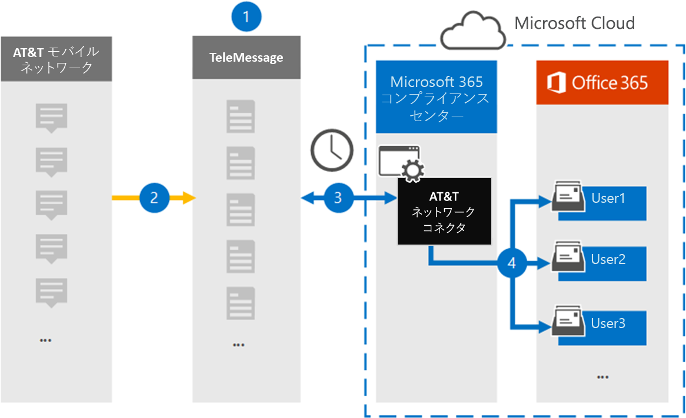

# T SMS/MMS データを AT&アーカイブするコネクタを設定する

Microsoft 365 コンプライアンス センターの TeleMessage コネクタを使用して、AT&T Mobile Network から SMS および MMS データをインポートおよびアーカイブします。 コネクタをセットアップして構成した後、毎日 1 回、組織の AT&T Network に接続し、SMS および MMS データを Microsoft 365 のメールボックスにインポートします。

SMS および MMS メッセージがユーザー メールボックスに保存された後、訴訟ホールド、コンテンツ検索、Microsoft 365 アイテム保持ポリシーなどの Microsoft 365 コンプライアンス機能を AT&T Network データに適用できます。 たとえば、コンテンツ検索を使用して AT&T ネットワーク データを検索したり、AT&T ネットワーク コネクタ データを含むメールボックスを Advanced eDiscovery ケースの保管担当者に関連付けできます。 AT&T Network コネクタを使用して Microsoft 365 のデータをインポートおよびアーカイブすると、組織が政府や規制のポリシーに準拠しつながっているのに役立ちます。

## AT&T ネットワーク データのアーカイブの概要

次の概要では、コネクタを使用して、Microsoft 365 の T ネットワーク&をアーカイブするプロセスについて説明します。

1. 組織は TeleMessage と一緒に、T ネットワーク コネクタの AT&セットアップします。 詳細については、「AT&[T Network Archiver」を参照してください](https://www.telemessage.com/office365-activation-for-atnt-network-archiver/)。

2. 24 時間ごとに、組織の AT ネットワークからの SMS メッセージと MMS&TeleMessage サイトにコピーされます。

3. Microsoft 365 コンプライアンス センターで作成する AT&T ネットワーク コネクタは、毎日 TeleMessage サイトに接続し、過去 24 時間の SMS メッセージと MMS メッセージを Microsoft Cloud のセキュリティで保護された Azure Storage の場所に転送します。 コネクタは、SMS メッセージと MMS メッセージのコンテンツを電子メール メッセージ形式に変換します。

4. コネクタは、モバイル通信アイテムを特定のユーザーのメールボックスにインポートします。 AT&**T SMS/MMS ネットワーク** アーカイブーという名前の新しいフォルダーがユーザーのメールボックスに作成され、アイテムがインポートされます。 コネクタは、ユーザーの電子メール アドレス プロパティの値を使用して *、このマッピングを行* います。 すべての SMS および MMS メッセージには、このプロパティが含まれるので、メッセージのすべての参加者の電子メール アドレスが設定されます。
 
   ユーザーの電子メール アドレス プロパティの値を使用した自動ユーザー マッピングに加えて、CSV マッピング ファイルをアップロードしてカスタム マッピングを定義できます。 このマッピング ファイルには、組織内のユーザーの携帯電話番号と対応する Microsoft 365 電子メール アドレスが含まれている。 自動ユーザー マッピングとカスタム マッピングの両方を有効にした場合、すべての電子メール アイテムについて、コネクタは最初にカスタム マッピング ファイルを確認します。 携帯電話番号に対応する有効な Microsoft 365 ユーザーが見つからなかった場合、コネクタはインポートしようとしているアイテムの電子メール アドレス プロパティの値を使用します。 コネクタがカスタム マッピング ファイルまたは電子メール アイテムの電子メール アドレス プロパティに有効な Microsoft 365 ユーザーを見つからなかった場合、アイテムはインポートされません。

## はじめに

AT&T Network データをアーカイブするために必要な実装手順のいくつかは Microsoft 365 の外部にあるので、コンプライアンス センターでコネクタを作成する前に完了する必要があります。

- [TeleMessage からモバイル アーカイブ サービスを注文](https://www.telemessage.com/mobile-archiver/order-mobile-archiver-for-o365/)し、組織の有効な管理アカウントを取得します。 コンプライアンス センターでコネクタを作成するときに、このアカウントにサインインする必要があります。

- TeleMessage オンボード フォームに入力し、&AT&T からメッセージ アーカイブ サービスを注文できるよう、AT&T アカウントと請求連絡先の詳細を取得します。

- T SMS/MMS ネットワーク アーカイブ&AT を必要とするすべてのユーザーを TeleMessage アカウントに登録します。 ユーザーを登録する場合は、Microsoft 365 アカウントと同じメール アドレスを使用してください。

- 従業員は、会社が所有し、会社が責任を持つ携帯電話を AT&T モバイル ネットワーク上に持っている必要があります。 Microsoft 365 のアーカイブ メッセージは、従業員が所有するデバイスや "Bring Your Own Devices (BYOD) デバイスでは使用できません。

- T ネットワーク コネクタを使用して AT&ユーザーには、Exchange Online の "Mailbox Import Export/メールボックスのインポートエクスポート" 役割が割り当てられている必要があります。 これは、Microsoft 365コンプライアンス センターの [データ コネクタ] ページでコネクタを追加するために必要です。 既定では、この役割は Exchange Online のどの役割グループにも割り当てられていません。 "Mailbox Import Export/メールボックスのインポートとエクスポート" 役割は、Exchange Online の "Organization Management/組織の管理" 役割グループに追加できます。 または、役割グループを作成し、Mailbox Import Export 役割を割り当て、適切なユーザーをメンバーとして追加できます。 詳細については、「Exchange Online[で役割](https://docs.microsoft.com/Exchange/permissions-exo/role-groups#create-role-groups)グループを管理する」の「役割グループの作成」または「役割グループの変更」セクションを参照してください。

## AT&T ネットワーク コネクタを作成する

前のセクションで説明した前提条件を完了したら、Microsoft 365 コンプライアンス センターで AT&T Network コネクタを作成できます。 このコネクタは、指定した情報を使用して TeleMessage サイトに接続し、SMS メッセージと MMS メッセージを Microsoft 365 の対応するユーザー メールボックス ボックスに転送します。

1. T [https://compliance.microsoft.com](https://compliance.microsoft.com/) Network で [データ コネクタ] に **移動**  \  **&クリックします**。

2. AT&**T Network 製品の説明** ページで、[コネクタの追加] **をクリックします。**

3. [サービス条件 **] ページで、[** 承諾] を **クリックします**。

4. **[TeleMessage へのログイン**] ページの手順 3 で、次のボックスに必要な情報を入力し、[次へ] をクリック **します**。

   - **ユーザー名:** TeleMessage ユーザー名。

   - **パスワード:** TeleMessage パスワード。

5. コネクタを作成したら、ポップアップ ウィンドウを閉じて次のページに移動できます。

6. [ユーザー マッピング **] ページで** 、自動ユーザー マッピングを有効にする。 カスタム マッピングを有効にするには、ユーザー マッピング情報を含む CSV ファイルをアップロードし、[次へ] をクリック **します**。

7. 設定を確認し、[完了] を **クリックして** コネクタを作成します。

8. コンプライアンス センターの **[データ** コネクタ] ページの [コネクタ] タブに移動して、新しいコネクタのインポート プロセスの進行状況を確認します。

## 既知の問題

- 現時点では、添付ファイルまたは 10 MB を超えるアイテムのインポートはサポートされていません。 より大きなアイテムのサポートは、後日利用可能になります。
