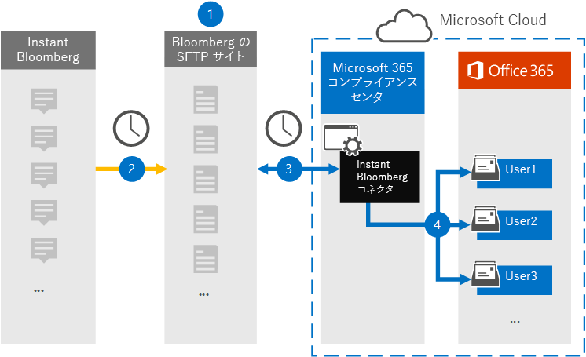

# コネクタをセットアップしてインスタント ブルームバーグ データをアーカイブする

Microsoft 365 コンプライアンス センターのネイティブ コネクタを使用して [、Instant Bloomberg](https://www.bloomberg.com/professional/product/collaboration/) コラボレーション ツールから金融サービス のチャット データをインポートおよびアーカイブします。 コネクタをセットアップして構成した後、組織の Bloomberg セキュア FTP サイト (SFTP) に毎日 1 回接続し、チャット メッセージのコンテンツを電子メール メッセージ形式に変換し、それらのアイテムを Microsoft 365 のメールボックスにインポートします。

Instant Bloomberg データがユーザー メールボックスに保存された後、訴訟ホールド、コンテンツ検索、In-Place アーカイブ、監査、通信コンプライアンス、Microsoft 365 アイテム保持ポリシーなどの Microsoft 365 コンプライアンス機能を Instant Bloomberg データに適用できます。 たとえば、コンテンツ検索を使用して Instant Bloomberg チャット メッセージを検索したり、Instant Bloomberg データを含むメールボックスを Advanced eDiscovery ケースの保管担当者に関連付けできます。 Instant Bloomberg コネクタを使用して Microsoft 365 のデータをインポートおよびアーカイブすると、組織が政府や規制のポリシーに準拠しつながっているのに役立ちます。

## Instant Bloomberg データのアーカイブの概要

次の概要では、コネクタを使用して、Microsoft 365 のインスタント ブルーミング チャット データをアーカイブするプロセスについて説明します。 

1. 組織は Bloomberg と共同で Bloomberg SFTP サイトをセットアップします。 また、Bloomberg と共同で、チャット メッセージを Bloomberg SFTP サイトにコピーする Instant Bloomberg を構成します。

2. 24 時間ごとに、Instant Bloomberg からのチャット メッセージが Bloomberg SFTP サイトにコピーされます。

3. Microsoft 365 コンプライアンス センターで作成する Instant Bloomberg コネクタは、毎日 Bloomberg SFTP サイトに接続し、過去 24 時間のチャット メッセージを Microsoft Cloud のセキュリティで保護された Azure Storage 領域に転送します。 コネクタは、チャットチャットの内容を電子メール メッセージ形式に変換します。

4. コネクタは、チャット メッセージ アイテムを特定のユーザーのメールボックスにインポートします。 InstantBloomberg という名前の新しいフォルダーが特定のユーザーのメールボックスに作成され、アイテムがインポートされます。 コネクタは *、CorporateEmailAddress* プロパティの値を使用してこれを行います。 すべてのチャット メッセージには、このプロパティが含まれるので、チャット メッセージのすべての参加者の電子メール アドレスが設定されます。 *CorporateEmailAddress* プロパティの値を使用した自動ユーザー マッピングに加えて、CSV マッピング ファイルをアップロードしてカスタム マッピングを定義できます。 このマッピング ファイルには、Bloomberg UUID と、各ユーザーの対応する Microsoft 365 メールボックス アドレスが含まれている必要があります。 自動ユーザー マッピングを有効にしてカスタム マッピングを提供する場合、すべてのチャット アイテムについて、コネクタは最初にカスタム マッピング ファイルを確認します。 ユーザーの Bloomberg UUID に対応する有効な Microsoft 365 ユーザーが見つからない場合、コネクタはチャット アイテムの *CorporateEmailAddress* プロパティを使用します。 コネクタが、カスタム マッピング ファイルまたはチャット アイテムの *CorporateEmailAddress* プロパティのどちらでも有効な Microsoft 365 ユーザーを見つからなかった場合、アイテムはインポートされません。

## はじめに

Instant Bloomberg データをアーカイブするために必要な実装手順の一部は Microsoft 365 の外部にあるので、コンプライアンス センターでコネクタを作成する前に完了する必要があります。

- [Bloomberg Anywhere にサブスクライブします](https://www.bloomberg.com/professional/product/remote-access/?bbgsum-page=DG-WS-PROF-PROD-BBA)。 これは、設定と構成が必要な Bloomberg SFTP サイトにアクセスするために Bloomberg Anywhere にログインするために必要です。

- Bloomberg SFTP (セキュア ファイル転送プロトコル) サイトをセットアップします。 Bloomberg と共同で SFTP サイトをセットアップした後、Instant Bloomberg のデータは毎日 SFTP サイトにアップロードされます。 手順 2 で作成したコネクタは、この SFTP サイトに接続し、チャット データを Microsoft 365 メールボックスに転送します。 SFTP は、転送プロセス中にメールボックスに送信される Instant Bloomberg チャット データも暗号化します。

  Bloomberg SFTP (BB-SFTP とも呼ばれる) の詳細については、次の *情報を参照してください*。

  - Bloomberg サポートの「SFTP Connectivity Standards」ドキュメント [を参照してください](https://www.bloomberg.com/professional/support/documentation/)。

  - [Bloomberg カスタマー サポートにお問い合わせください](https://service.bloomberg.com/portal/sessions/new?utm_source=bloomberg-menu&utm_medium=csc)。

  Bloomberg と共同で SFTP サイトをセットアップすると、Bloomberg 実装の電子メール メッセージに応答した後、Bloomberg から情報が提供されます。 次の情報のコピーを保存します。 手順 3 でコネクタをセットアップするために使用します。

  - 組織の ID であり、Bloomberg SFTP サイトへのログインに使用される会社コード。

  - Bloomberg SFTP サイトのパスワード

  - Bloomberg SFTP サイトの URL (例: sftp.bloomberg.com)

  - Bloomberg SFTP サイトのポート番号

- 手順 3 で Instant Bloomberg コネクタを作成するユーザー (および手順 1 で公開キーと IP アドレスをダウンロードするユーザー) には、Exchange Online の Mailbox Import Export 役割が割り当てられている必要があります。 これは、Microsoft 365コンプライアンス センターの [データ コネクタ] ページでコネクタを追加するために必要です。 既定では、この役割は Exchange Online のどの役割グループにも割り当てられていません。 "Mailbox Import Export/メールボックスのインポートとエクスポート" 役割は、Exchange Online の "Organization Management/組織の管理" 役割グループに追加できます。 または、役割グループを作成し、Mailbox Import Export 役割を割り当て、適切なユーザーをメンバーとして追加できます。 詳細については、「Exchange Online[で役割](https://docs.microsoft.com/Exchange/permissions-exo/role-groups#create-role-groups)グループを管理する」の「役割グループの作成」または「役割グループの変更」セクションを参照してください。

## 手順 1: SSH および PGP 公開キーを取得する

最初の手順では、セキュア シェル (SSH) と Pretty Good Privacy (PGP) の公開キーのコピーを取得します。 手順 2 でこれらのキーを使用して、(手順 3 で作成した) コネクタが SFTP サイトに接続し、インスタント Bloomberg チャット データを Microsoft 365 メールボックスに転送することを許可する Bloomberg SFTP サイトを構成します。 この手順では、Bloomberg SFTP サイトを構成するときに使用する IP アドレスも取得します。

1. [Data <https://compliance.microsoft.com> connectors Instant Bloomberg] に移動し、[Data   >  **connectors] をクリックします**。

2. Instant **Bloomberg 製品の説明** ページで、[コネクタの追加] **をクリックします。**

3. [サービス条件 **] ページで、[** 承諾] を **クリックします**。

4. 手順 1 の下にある **Bloomberg SFTP** サイトの資格情報の追加で **、SSH** キーのダウンロード **、PGP** キーのダウンロード **、IP** アドレス リンクのダウンロードをクリックして、各ファイルのコピーをローカル コンピューターに保存します。 これらのファイルには、手順 2 で Bloomberg SFTP サイトを構成するために使用される次の項目が含まれています。

   - SSH 公開キー: このキーは、コネクタが Bloomberg SFTP サイトに接続するときにセキュリティで保護されたリモート ログインを有効にするためのセキュア シェル (SSH) を構成するために使用されます。

   - PGP 公開キー: このキーは、Bloomberg SFTP サイトから Microsoft 365 に転送されるデータの暗号化を構成するために使用されます。

   - IP アドレス: Bloomberg SFTP サイトは、この IP アドレスからの接続要求のみを受け付けするように構成されています。この IP アドレスは、手順 3 で作成した Instant Bloomberg コネクタによって使用されます。 

5. [ **キャンセル] を** クリックしてウィザードを閉じます。 手順 3 でこのウィザードに戻り、コネクタを作成します。

## 手順 2: Bloomberg SFTP サイトを構成する

次の手順では、SSH および PGP 公開キーと、手順 1 で取得した IP アドレスを使用して、Bloomberg SFTP サイトの SSH 認証と PGP 暗号化を構成します。 これにより、手順 3 で作成した Instant Bloomberg コネクタは Bloomberg SFTP サイトに接続し、Instant Bloomberg データを Microsoft 365 に転送できます。 Bloomberg SFTP サイトをセットアップするには、Bloomberg カスタマー サポートと一緒に作業する必要があります。 [Bloomberg カスタマー サポートにお問い](https://service.bloomberg.com/portal/sessions/new?utm_source=bloomberg-menu&utm_medium=csc)合わせください。 

> [!IMPORTANT]
> Bloomberg は、手順 1 でダウンロードした 3 つのファイルを電子メール メッセージに添付し、Bloomberg SFTP サイトをセットアップする際に顧客サポート チームに送信することを推奨します。

## 手順 3: インスタント Bloomberg コネクタを作成する

最後の手順では、Microsoft 365 コンプライアンス センターで Instant Bloomberg コネクタを作成します。 コネクタは、入力した情報を使用して Bloomberg SFTP サイトに接続し、Microsoft 365 の対応するユーザー メールボックス ボックスにチャット メッセージを転送します。

1. [Data <https://compliance.microsoft.com> connectors Instant Bloomberg] に移動し、[Data   >  **connectors] をクリックします**。

2. Instant **Bloomberg 製品の説明** ページで、[コネクタの追加] **をクリックします。**

3. [サービス条件 **] ページで、[** 承諾] を **クリックします**。

4. **[Bloomberg SFTP** サイトの資格情報の追加] ページの手順 3 で、次のボックスに必要な情報を入力し、[次へ] をクリック **します**。

    - **会社コード:** Bloomberg SFTP サイトのユーザー名として使用される組織の ID。

    - **パスワード:** Bloomberg SFTP サイトのパスワード。

    - **SFTP URL:** Bloomberg SFTP サイトの URL (例: sftp.bloomberg.com)。

    - **SFTP ポート:** Bloomberg SFTP サイトのポート番号。 コネクタはこのポートを使用して SFTP サイトに接続します。

5. [インポート **するデータ型の選択]** ページで、メッセージからインポートする必要なデータ型を選択 **します。**

6. [ユーザー マッピング **] ページで** 、自動ユーザー マッピングを有効にし、必要に応じてカスタム ユーザー マッピングを提供します。

   > [!NOTE]
   > コネクタは、チャット メッセージ アイテムを特定のユーザーのメールボックスにインポートします。 **InstantBloomberg という名前の** 新しいフォルダーが特定のユーザーのメールボックスに作成され、アイテムがインポートされます。 コネクタは *、CorporateEmailAddress プロパティの値を使用して行* います。 すべてのチャット メッセージにはこのプロパティが含まれるので、このプロパティにはチャット メッセージのすべての参加者の電子メール アドレスが設定されます。 *CorporateEmailAddress* プロパティの値を使用した自動ユーザー マッピングに加えて、CSV マッピング ファイルをアップロードしてカスタム マッピングを定義できます。 マッピング ファイルには、Bloomberg UUID と、各ユーザーの対応する Microsoft 365 メールボックス アドレスが含まれている必要があります。 自動ユーザー マッピングを有効にしてカスタム マッピングを提供する場合、すべてのチャット アイテムについて、コネクタは最初にカスタム マッピング ファイルを確認します。 ユーザーの Bloomberg UUID に対応する有効な Microsoft 365 ユーザーが見つからない場合、コネクタはチャット アイテムの *CorporateEmailAddress* プロパティを使用します。 コネクタが、カスタム マッピング ファイルまたはチャット アイテムの *CorporateEmailAddress* プロパティのどちらかに有効な Microsoft 365 ユーザーを見つからなかった場合、アイテムはインポートされません。

7. [ **次へ]** をクリックし、設定を確認し、[準備] **をクリック** してコネクタを作成します。

8. [データ コネクタ **] ページに移動** して、新しいコネクタのインポート プロセスの進行状況を確認します。
