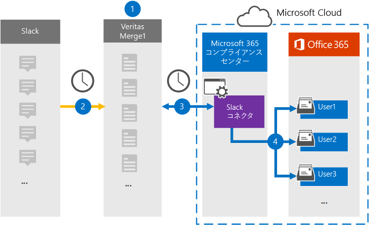

# Slack の電子情報開示データをアーカイブするコネクタを設定する

Microsoft 365 コンプライアンス センターの Globanet コネクタを使用して、ソーシャル メディア、インスタント メッセージング、およびドキュメント コラボレーション プラットフォームから Microsoft 365 組織内のメールボックスにサード パーティデータをインポートしてアーカイブします。 Globanet は、サード パーティのデータ ソースからアイテムを (定期的に) キャプチャし、それらのアイテムを Microsoft 365 にインポートするように構成された [Slack](https://globanet.com/slack/) コネクタを提供します。 Slack は Slack API からメッセージとファイルをプルし、電子メール メッセージ形式に変換してから、アイテムをユーザーのメールボックスにインポートします。

Slack の電子情報開示データがユーザー メールボックスに保存された後、訴訟ホールド、電子情報開示、保持ポリシーと保持ラベル、通信コンプライアンスなどの Microsoft 365 コンプライアンス機能を適用できます。 Slack コネクタを使用して Microsoft 365 のデータをインポートおよびアーカイブすると、組織が政府や規制のポリシーに準拠しつながっているのに役立ちます。

## Slack の電子情報開示データのアーカイブの概要

次の概要では、コネクタを使用して Microsoft 365 の Slack 情報をアーカイブするプロセスについて説明します。

1. 組織は Slack と共同で Slack サイトをセットアップおよび構成します。

2. 24 時間ごとに、Slack 電子情報開示からのチャット メッセージが Globanet Merge1 サイトにコピーされます。 コネクタは、チャット メッセージの内容を電子メール メッセージ形式に変換します。

3. Microsoft 365 コンプライアンス センターで作成する Slack 電子情報開示コネクタは、毎日 Globanet Merge1 サイトに接続し、チャット メッセージを Microsoft クラウド内のセキュリティで保護された Azure Storage の場所に転送します。

4. コネクタは、手順 3 で説明するように *、Email* プロパティの値と自動ユーザー マッピングを使用して、変換されたチャット メッセージ アイテムを特定のユーザーのメールボックスにインポートします。 **Slack** 電子情報開示という名前の受信トレイ フォルダー内の新しいサブフォルダーがユーザー メールボックスに作成され、チャット メッセージ アイテムがフォルダーにインポートされます。 コネクタは *、Email* プロパティの値を使用して、アイテムをインポートするメールボックスを決定します。 すべてのチャット メッセージには、このプロパティが含まれるので、チャット メッセージのすべての参加者の電子メール アドレスが設定されます。

## はじめに

- Microsoft コネクタ用の Globanet Merge1 アカウントを作成します。 アカウントを作成するには [、Globanet カスタマー サポートにお問い合わせください](https://globanet.com/ms-connectors-contact)。 このアカウントは、手順 1 でコネクタを作成するときにサインインします。

- 組織の Slack エンタープライズ アカウントのユーザー名とパスワードを取得します。 Slack を構成する場合は、手順 2 でこのアカウントにサインインする必要があります。

- 手順 1 で Slack 電子情報開示コネクタを作成し 、手順 3 で完了するユーザーは、Exchange Online のメールボックスインポートエクスポートの役割に割り当てられている必要があります。 この役割は、Microsoft 365コンプライアンス センターの [データ コネクタ] ページでコネクタを追加するために必要です。 既定では、この役割は Exchange Online の役割グループに割り当てられていない。 "Mailbox Import Export/メールボックスのインポートとエクスポート" 役割は、Exchange Online の "Organization Management/組織の管理" 役割グループに追加できます。 または、役割グループを作成し、Mailbox Import Export 役割を割り当て、適切なユーザーをメンバーとして追加できます。 詳細については、「Exchange Online[で役割](https://docs.microsoft.com/Exchange/permissions-exo/role-groups#create-role-groups)グループを管理する」の「役割グループの作成」または「役割グループの変更」セクションを参照してください。

## 手順 1: Slack 電子情報開示コネクタをセットアップする

最初の手順は、Microsoft 365 コンプライアンス センターの [Data **Connectors]** ページにアクセスし、Slack データ用のコネクタを作成することです。

1. Go to [https://compliance.microsoft.com](https://compliance.microsoft.com/) and then click Data **connectors**  >  **Slack eDiscovery**.

2. Slack の **電子情報開示製品の** 説明ページで、[コネクタの追加] **をクリックします**。

3. [サービス条件 **] ページで、[** 承諾] を **クリックします**。

4. コネクタを識別する一意の名前を入力し、[次へ] をクリック **します**。

5. コネクタを構成するには、Merge1 アカウントにサインインします。

## 手順 2: Slack の電子情報開示を構成する

2 番目の手順は、Merge1 サイトで Slack の電子情報開示コネクタを構成することです。 Globanet Merge1 サイトで Slack 電子情報開示コネクタを構成する方法の詳細については [、「Merge1 Third-Party Connectors User Guide](https://docs.ms.merge1.globanetportal.com/Merge1%20Third-Party%20Connectors%20Slack%20eDiscovery%20User%20Guide.pdf)」を参照してください。

[ Save **& Finish]** をクリックすると、Microsoft 365 コンプライアンス センターのコネクタ ウィザードの [ユーザー マッピング] ページが表示されます。

## 手順 3: ユーザーをマップし、コネクタのセットアップを完了する

1. [外部ユーザー **を Microsoft 365 ユーザーに** マップする] ページで、自動ユーザー マッピングを有効にします。

   Slack の電子情報開示アイテムには、組織内のユーザーの電子メール アドレスを含む Email というプロパティが含まれます。 コネクタでこのアドレスを Microsoft 365 ユーザーに関連付けできる場合、アイテムはユーザーのメールボックスにインポートされます。

2. [**次へ**] をクリックして設定を確認し、[データ コネクタ] ページに移動して、新しいコネクタのインポート プロセスの進行状況を確認します。

## 手順 4: Slack 電子情報開示コネクタを監視する

Slack 電子情報開示コネクタを作成した後、Microsoft 365 コンプライアンス センターでコネクタの状態を表示できます。

1. 左側の [https://compliance.microsoft.com](https://compliance.microsoft.com) ナビゲーションの **[データ コネクタ]** に移動してクリックします。

2. [ **コネクタ] タブを** クリックし **、Slack の電子** 情報開示コネクタを選択して、フライアウト ページを表示します。 このページには、コネクタに関するプロパティと情報が含まれる。

3. [**コネクタの状態とソース**]で、[ログのダウンロード] リンクをクリックして、コネクタの状態ログを開く (または保存する) 必要があります。 このログには、Microsoft クラウドにインポートされたデータに関する情報が含まれます。

## 既知の問題

- 現時点では、添付ファイルまたは 10 MB を超えるアイテムのインポートはサポートされていません。 より大きなアイテムのサポートは、後日利用可能になります。
