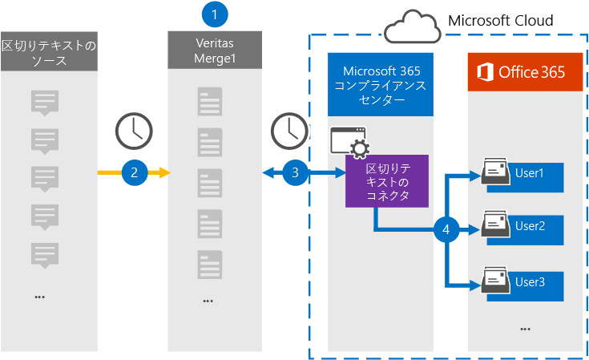

# テキストで区切られたデータをアーカイブするコネクタを設定する

Microsoft 365 コンプライアンス センターの Globanet コネクタを使用して、Microsoft 365 組織内のユーザー メールボックスにテキスト区切りのデータをインポートしてアーカイブします。 Globanet は、サード パーティのデータ ソースからアイテムを (定期的に) キャプチャし、それらのアイテムを Microsoft 365 にインポートするように構成されたテキスト区切りのコネクタを提供します。 コネクタは、テキスト区切りのデータ ソースから電子メール メッセージ形式にコンテンツを変換し、それらのアイテムを Microsoft 365 のユーザーのメールボックスにインポートします。

テキスト区切りのデータがユーザー のメールボックスに保存された後、訴訟ホールド、電子情報開示、アイテム保持ポリシー、保持ラベルなどの Microsoft 365 コンプライアンス機能を適用できます。 Microsoft 365 でテキスト区切りのデータ コネクタを使用してデータをインポートおよびアーカイブすると、組織が政府や規制のポリシーに準拠しつながっているのに役立ちます。

## テキスト区切りデータのアーカイブの概要

次の概要では、Microsoft 365 でコネクタを使用してテキスト区切りのソース情報をアーカイブするプロセスについて説明します。

1. 組織は、テキスト区切りのソースと一緒に、テキスト区切りのサイトを設定および構成します。

2. 24 時間ごとに、テキスト区切りのソースからのチャット メッセージが Globanet Merge1 サイトにコピーされます。 コネクタは、コンテンツを電子メール メッセージ形式に変換します。

3. Microsoft 365 コンプライアンス センターで作成するテキスト区切りのコネクタは、毎日 Globanet Merge1 サイトに接続し、Microsoft クラウド内のセキュリティで保護された Azure Storage の場所にメッセージを転送します。

4. コネクタは、手順 3 で説明したように、自動ユーザー マッピングの *Email* プロパティの値を使用して、変換されたメッセージ アイテムを特定のユーザーのメールボックスにインポートします。 受信トレイ フォルダー内の **Text- Delimited** という名前の新しいサブフォルダーがユーザー メールボックスに作成され、メッセージ アイテムがフォルダーにインポートされます。 コネクタは *、Email* プロパティの値を使用して、アイテムをインポートするメールボックスを決定します。 すべてのメッセージには、このプロパティが含まれるので、すべての参加者の電子メール アドレスが設定されます。

## はじめに

- Microsoft コネクタ用の Globanet Merge1 アカウントを作成します。 このアカウントを作成するには [、Globanet カスタマー サポートにお問い合わせください](https://globanet.com/ms-connectors-contact)。 このアカウントは、手順 1 でコネクタを作成するときにサインインします。

- 手順 1 でテキスト区切りのコネクタを作成する (および手順 3 で完了する) ユーザーは、Exchange Online の "Mailbox Import Export/メールボックスのインポートとエクスポート" 役割に割り当てられている必要があります。 この役割は、Microsoft 365コンプライアンス センターの [データ コネクタ] ページでコネクタを追加するために必要です。 既定では、この役割は Exchange Online の役割グループに割り当てられていない。 "Mailbox Import Export/メールボックスのインポートとエクスポート" 役割は、Exchange Online の "Organization Management/組織の管理" 役割グループに追加できます。 または、役割グループを作成し、Mailbox Import Export 役割を割り当て、適切なユーザーをメンバーとして追加できます。 詳細については、「Exchange Online[で役割](https://docs.microsoft.com/Exchange/permissions-exo/role-groups#create-role-groups)グループを管理する」の「役割グループの作成」または「役割グループの変更」セクションを参照してください。

## 手順 1: テキスト区切りのコネクタを設定する

最初の手順は、Microsoft 365 コンプライアンス センターの **[Data Connectors]** ページにアクセスし、テキストで区切られたデータのコネクタを作成することです。

1. データ コネクタ [https://compliance.microsoft.com](https://compliance.microsoft.com/) のテキスト区切り  >  **を** クリックします。

2. テキスト区切 **りの製品の説明ページ** で、[コネクタの追加] **をクリックします**。

3. [サービス条件 **] ページで、[** 承諾] を **クリックします**。

4. コネクタを識別する一意の名前を入力し、[次へ] をクリック **します**。

5. コネクタを構成するには、Merge1 アカウントにサインインします。

## 手順 2: Globanet Merge1 サイトでテキスト区切りのコネクタを構成する

2 番目の手順は、Merge1 サイトでテキスト区切りのコネクタを構成することです。 Globanet Merge1 サイトでテキスト区切りのコネクタを構成する方法については [、「Merge1 Third-Party Connectors User Guide](https://docs.ms.merge1.globanetportal.com/Merge1%20Third-Party%20Connectors%20text-delimited%20User%20Guide%20.pdf)」を参照してください。

[ Save **& Finish]** をクリックすると、Microsoft 365 コンプライアンス センターのコネクタ ウィザードの [ユーザー マッピング] ページが表示されます。

## 手順 3: ユーザーをマップし、コネクタのセットアップを完了する

ユーザーをマップし、Microsoft 365 コンプライアンス センターでコネクタのセットアップを完了するには、次の手順を実行します。

1. [外部ユーザー **を Microsoft 365 ユーザーに** マップする] ページで、自動ユーザー マッピングを有効にします。 テキスト区切りのソース アイテムには、組織内のユーザーの電子メール アドレスを含む *Email* というプロパティが含まれます。 コネクタでこのアドレスを Microsoft 365 ユーザーに関連付けできる場合、アイテムはユーザーのメールボックスにインポートされます。

2. [**次へ**] をクリックして設定を確認し、[データ コネクタ] ページに移動して、新しいコネクタのインポート プロセスの進行状況を確認します。

## 手順 4: テキスト区切りのコネクタを監視する

テキスト区切りコネクタを作成した後、Microsoft 365 コンプライアンス センターでコネクタの状態を表示できます。

1. 左側の [https://compliance.microsoft.com](https://compliance.microsoft.com) ナビゲーションの **[データ コネクタ]** に移動してクリックします。

2. [ **コネクタ] タブを** クリックし、 **テキスト区切りの** コネクタを選択して、フライアウト ページを表示します。 このページには、コネクタに関するプロパティと情報が含まれる。

3. [**コネクタの状態とソース**]で、[ログのダウンロード] リンクをクリックして、コネクタの状態ログを開く (または保存する) 必要があります。 このログには、Microsoft クラウドにインポートされたデータに関する情報が含まれます。

## 既知の問題

- 現時点では、添付ファイルまたは 10 MB を超えるアイテムのインポートはサポートされていません。 より大きなアイテムのサポートは、後日利用可能になります。
