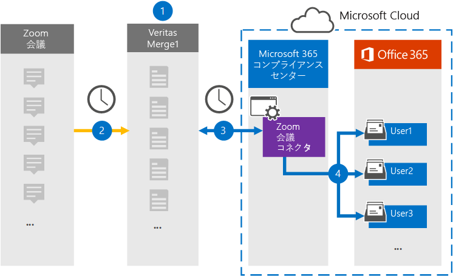

# ズーム 会議データをアーカイブするコネクタをセットアップする

コンプライアンス センターの Veritas コネクタを使用Microsoft 365、ズーム 会議からユーザー メールボックスにデータをインポートしてアーカイブMicrosoft 365します。 Veritas には、サードパーティのデータ ソースからアイテムを (定期的に) キャプチャし、それらのアイテムを Microsoft 365 にインポートするように構成された Zoom [Meetings](https://globanet.com/zoom/)コネクタが備Microsoft 365。 コネクタは、会議のコンテンツ (チャット、記録されたファイル、メタデータを含む) を Zoom Meetings アカウントから電子メール メッセージ形式に変換し、それらのアイテムを Microsoft 365 のユーザー メールボックスにインポートします。

Zoom Meetings データをユーザー メールボックスに格納した後、訴訟ホールド、電子情報開示、保持ポリシーと保持ラベル、通信コンプライアンスなどの Microsoft 365 コンプライアンス機能を適用できます。 ズーム 会議コネクタを使用して、組織が政府機関や規制Microsoft 365に準拠し、データをインポートおよびアーカイブできます。

## ズーム 会議データのアーカイブの概要

次の概要では、コネクタを使用してズーム 会議のデータをアーカイブするプロセスについて説明Microsoft 365。

1. 組織は、ズーム会議を使用して、ズーム会議サイトを設定および構成します。

2. 24 時間に 1 回、ズーム会議の会議アイテムが Veritas Merge1 サイトにコピーされます。 また、コネクタは会議のコンテンツを電子メール メッセージ形式に変換します。

3. Microsoft 365 コンプライアンス センターで作成した Zoom Meetings コネクタは、毎日 Veritas Merge1 に接続し、会議メッセージを Microsoft クラウド内の安全な Azure Storage 場所に転送します。

4. コネクタは、手順 3 で説明したように *、Email* プロパティと自動ユーザー マッピングの値を使用して、変換された会議アイテムを特定のユーザーのメールボックスにインポートします。 Zoom **Meetings** という名前の受信トレイ フォルダー内の新しいサブフォルダーがユーザー のメールボックスに作成され、そのフォルダーに会議アイテムがインポートされます。 コネクタは、Email プロパティの値を使用して *これを行* います。 すべての会議アイテムには、このプロパティが含まれるので、会議のすべての参加者の電子メール アドレスが設定されます。

## はじめに

- Microsoft コネクタ用の Veritas Merge1 アカウントを作成します。 このアカウントを作成するには [、Veritas カスタマー サポートにお問い合わせください](https://globanet.com/ms-connectors-contact)。 手順 1 でコネクタを作成するときに、このアカウントにサインインします。

- 組織の Zoom Business アカウントまたは Zoom アカウントのユーザー名とパスワードEnterpriseします。 Zoom Meetings コネクタを構成する場合は、手順 2 でこのアカウントにサインインする必要があります。

- Zoom Marketplace で次のアプリケーション [を作成します](https://marketplace.zoom.us)。

  - OAuth アプリケーション

  - JWT アプリケーション

  これらのアプリケーションを作成すると、Zoom プラットフォームはトークンの生成に使用される一意の資格情報のセットを生成します。 これらのトークンは、Zoom アカウントに接続し、アイテムを Merge1 サイトにコピーするときにコネクタを認証するために使用されます。 これらのトークンは、手順 2 でズーム コネクタを構成するときに使用します。

  OAuth アプリケーションと JWT アプリケーションを作成する方法の詳細な手順については [、「Merge1 サード](https://docs.ms.merge1.globanetportal.com/Merge1%20Third-Party%20Connectors%20Zoom%20Meetings%20User%20Guide%20.pdf)パーティ コネクタ ユーザー ガイド」を参照してください。

- 手順 1 で Zoom Meetings コネクタを作成し (および手順 3 で完了する) ユーザーは、Exchange Online のメールボックスインポートエクスポートの役割に割り当てる必要があります。 この役割は、コンプライアンス センターの [**データ** コネクタ] ページにコネクタを追加Microsoft 365必要です。 既定では、この役割はグループ内の役割グループExchange Online。 [メールボックスのインポートエクスポート] 役割は、組織の [組織の管理] 役割グループに追加Exchange Online。 または、役割グループを作成し、メールボックスインポートエクスポートの役割を割り当て、適切なユーザーをメンバーとして追加できます。 詳細については、「グループ内の[役割グループを](/Exchange/permissions-exo/role-groups#create-role-groups)管理する」の「役割グループの作成」または「役割グループの変更」セクションを参照Exchange Online。

## 手順 1: Zoom Meetings コネクタをセットアップする

最初の手順は、コンプライアンス センターの **データ** Microsoft 365にアクセスし、Zoom Meetings コネクタを作成することです。

1. [データ コネクタ [https://compliance.microsoft.com](https://compliance.microsoft.com/) のズーム会議 **] に移動し**  >  **、[データ コネクタ] をクリックします**。

2. [会議の **ズーム] 製品の** 説明ページで、[コネクタの追加] **をクリックします**。

3. [サービス条件 **] ページで、[** 同意する] を **クリックします**。

4. コネクタを識別する一意の名前を入力し、[次へ] を **クリックします**。

5. コネクタを構成するには、Merge1 アカウントにサインインします。

## 手順 2: Zoom Meetings コネクタを構成する

2 番目の手順は、Merge1 サイトで Zoom Meetings コネクタを構成することです。 Veritas Merge1 サイトで Zoom Meetings コネクタを構成する方法の詳細については [、「Merge1](https://docs.ms.merge1.globanetportal.com/Merge1%20Third-Party%20Connectors%20Zoom%20Meetings%20User%20Guide%20.pdf)サード パーティ コネクタ ユーザー ガイド」を参照してください。

[ファイルの **保存と&完了**] をクリックすると、コンプライアンス センターのコネクタ ウィザードの [ユーザー Microsoft 365] ページが表示されます。

## 手順 3: ユーザーをマップし、コネクタのセットアップを完了する

1. [外部ユーザー **をユーザーにマップMicrosoft 365] ページで**、自動ユーザー マッピングを有効にします。

   Zoom Meetings アイテムには、組織内のユーザーの電子メール アドレスを含む Email というプロパティが含まれます。 コネクタでこのアドレスをユーザーと関連付Microsoft 365、アイテムはユーザーのメールボックスにインポートされます。

2. [**次へ**] をクリックし、設定を確認し、[データ コネクタ] ページに移動して、新しいコネクタのインポート プロセスの進行状況を確認します。

## 手順 4: Zoom Meetings コネクタを監視する

Zoom Meetings コネクタを作成した後、コンプライアンス センターでコネクタのMicrosoft 365できます。

1. 左側の [https://compliance.microsoft.com](https://compliance.microsoft.com) ナビゲーションで [ **データ コネクタ] に** 移動してクリックします。

2. [コネクタ **] タブをクリック** し、[会議のズーム] **コネクタを選択** して、飛び出しページを表示します。 このページには、コネクタに関するプロパティと情報が含まれる。

3. [**ソースを含むコネクタの状態**] で、[ログのダウンロード] リンクをクリックして、コネクタの状態ログを開く (または保存) します。  このログには、Microsoft クラウドにインポートされたデータに関する情報が含まれます。

## 既知の問題

- 現時点では、10 MB を超える添付ファイルやアイテムのインポートはサポートされていません。 大きいアイテムのサポートは、後日利用できます。

- Zoom Meetings コネクタを機能するには、ズーム会議を設定するときに録音を有効にする必要があります。