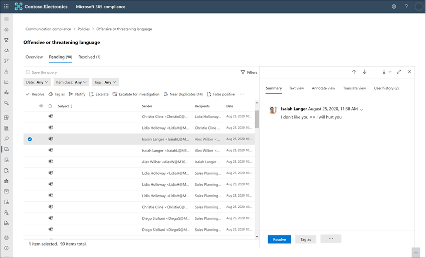

# 通信コンプライアンスのアラートを調査して修復する

通信コンプライアンス ポリシーを構成した後、Microsoft 365 コンプライアンス センターでポリシーの条件に一致するメッセージの問題に関するアラートの受信を開始します。 ここに示すワークフローの指示に従って、アラートの問題を調査して修復します。

## アラートを調査する

ポリシーによって検出された問題を調査する最初の手順は、Microsoft 365 コンプライアンス センターで通信コンプライアンスの警告を確認する手順です。 通信コンプライアンス ソリューション領域には、アラートグループの表示方法に応じて、アラートをすばやく調査するのに役立ついくつかの領域があります。

- **通信コンプライアンス ポリシー ページ**: Microsoft 365 組織の管理者アカウントの資格情報を使用してサインインする場合は、[通信コンプライアンス] を選択して通信コンプライアンス ポリシー ページを [https://compliance.microsoft.com](https://compliance.microsoft.com) **表示** します。  このページには、Microsoft 365 組織用に構成された通信コンプライアンス ポリシーと、推奨されるポリシー テンプレートへのリンクが表示されます。 一覧表示される各ポリシーには、レビューが必要なアラートの数、エスカレートされたアイテムと解決済みアイテムの数、ポリシーの現在の状態が含まれます。 ポリシーのどれかを選択すると、ポリシーに一致しているすべての保留中警告が表示されます。特定の通知を選択して、ポリシーの詳細ページを開き、修復アクションを開始します。
- **アラート**: 通信コンプライアンス **アラートに**  >  **移動し**、ポリシーの一致別にグループ化された過去 30 日間のアラートを表示します。 このビューでは、重要度順に並べ替えられているほとんどの通知を生成している通信コンプライアンスポリシーをすばやく確認できます。 修復アクションを開始するには、アラートに関連付けられているポリシーを選択して、[ポリシーの詳細] **ページを起動** します。 [ポリシーの詳細] ページでは、[概要] ページでアクティビティの概要を確認したり、[**保留中**] ページでアラート メッセージを確認して処理したり、解決済みページで閉じたアラートの履歴を確認できます。
- **レポート**: 通信コンプライアンス **レポートに**  >  **移動して、通信** コンプライアンス レポートウィジェットを表示します。 各ウィジェットは、ポリシーの一致や修復アクションに関するより深い洞察へのアクセスを含む、通信コンプライアンスのアクティビティと状態の概要を提供します。

### フィルターの使用

次に、メッセージを並べ替えて、簡単に通知を調べられるようにしてください。 [ポリシー **の詳細]** ページでは、通信コンプライアンスは複数のメッセージ フィールドに対する複数レベルのフィルター処理をサポートし、ポリシーの一致を含むメッセージをすばやく調査および確認するのに役立ちます。 フィルター処理は、構成された各ポリシーの保留中アイテムと解決済みアイテムに利用できます。 ポリシーのフィルタークエリの構成や、特定のポリシーで使用するカスタムフィルタークエリおよびカスタムフィルタークエリの構成または保存も可能です。 フィルター用のフィールドを構成すると、特定のフィルター値に対して構成可能な警告メッセージキューの上部に、フィルターフィールドが表示されます。

フィルターとフィールドの詳細の完全な一覧については、機能のリファレンス記事の [「](communication-compliance-feature-reference.md#filters) フィルター」を参照してください。

#### フィルターを構成するには

1. Microsoft [https://compliance.microsoft.com](https://compliance.microsoft.com) 365 組織の管理者アカウントの資格情報を使用してサインインします。

2. Microsoft 365 コンプライアンス センターで、通信コンプライアンスに **移動します**。

3. [ポリシー **] タブを** 選択し、調査用のポリシーを選択し、ダブルクリックして [ポリシー] ページ **を開** きます。

4. [ポリシー **] ページ** で、[保留中] タブまたは **[** 解決済み] タブを選択して、フィルター処理用のアイテムを表示します。

5. [フィルター] **コントロールを** 選択して、[フィルター] **詳細ページ** を開きます。

6. これらのアラートのフィルターを有効にするには、1 つ以上のチェック ボックスをオンにします。 日付、送信者、件名 */* タイトル、分類子など、さまざまなフィルター *から* 選択できます。

7. 選択したフィルターを既定のフィルターとして保存する場合は、[既定で保存] **を選択します**。 保存されたフィルターとしてこのフィルターを使用する場合は、[完了] を選択 **します**。

8. 選択したフィルターをフィルター クエリとして保存する場合は、フィルター値を少なくとも 1 つ構成した後、[クエリ コントロールを保存する] を選択します。 フィルター クエリの名前を入力し、[保存] を選択 **します**。 このフィルターは、このポリシーでのみ使用できます。[フィルターの詳細]ページの [保存済みフィルター クエリ]**セクションに** 一覧表示されます。

    

### 準重複分析と完全重複分析の使用

通信コンプライアンスポリシーでは、追加の構成手順を使用せずに、メッセージを自動的にスキャンし、準重複または完全重複にグループ化します。 このビューを使用すると、類似したメッセージに対して 1 対 1 またはグループとして迅速に対応し、レビュー担当者のメッセージ調査の負担を軽減できます。 重複が検出されると、修復アクション ツールバーに **準重複** および/または **完全重複** コントロールが表示されます。  このビューは、近い重複または正確な重複が見つからない場合は使用できません。

#### 重複を修復するには

1. Microsoft [https://compliance.microsoft.com](https://compliance.microsoft.com) 365 組織の管理者アカウントの資格情報を使用してサインインします。

2. Microsoft 365 コンプライアンス センターで、通信コンプライアンスに **移動します**。

3. [ポリシー **] タブを** 選択し、調査用のポリシーを選択し、ダブルクリックして [ポリシー] ページ **を開** きます。

4. [ポリシー **] ページで**、[保留中] タブまたは **[** 解決済み] タブを選択して、重複するメッセージを表示します。

5. [近 **重複] コントロールまたは [** 完全に重複] コントロール **を** 選択して、複製の詳細ページを開きます。

6. これらのメッセージの修復アクション コントロールに 1 つ以上のメッセージを選択します。

7. [**解決]、[****通知]、[****エスカレート**]、または [**ダウンロード**] を選択して、選択した重複メッセージにアクションを既定のフィルターとして適用します。

8. メッセージ **の修復アクション** を完了した後、[閉じる] を選択します。

    

## アラートを修復する

警告または構成したフィルター処理を開始する場所に関係なく、次の手順では、通知の修復を実行します。 [ポリシー] または [アラート] ページで次のワークフローを使用 **して** 、アラートの修復 **を開始** します。

### 手順 1: メッセージの基本を確認する

 場合によっては、メッセージを直ちに修復できるのがソースまたは件名から明らかです。 メッセージが偽陽性または誤ってポリシーと一致し、誤検知として解決される可能性があります。 **誤検知** コントロールを選択して、直ちに通知を解決して保留中通知キューから通知を削除します。 ソースまたは送信者の情報から、このような状況でのメッセージのルーティング方法や処理方法が既にわかる場合があります。 **タグ** を使用するか **エスカレート** コントロールの使用を検討して、該当するメッセージにタグを割り当てか、指定した校閲者にメッセージを送信します。

### 手順 2: メッセージの詳細を確認する

メッセージの基本を確認した後、メッセージを開いて詳細を調べ、さらに修復アクションを決定します。 メッセージを選択して、完全なメッセージヘッダーと本文情報を表示します。 正しい修正対策を決定するのに役立つさまざまなビューが利用できます。

- **ソースビュー**: このビューは、ウェブベースのメッセージングプラットフォームのほとんどで一般的に見られる標準的なメッセージビューです。 ヘッダー情報は通常のスタイルで書式設定され、メッセージ本文は、mbedded グラフィック ファイルと単語でラップされたテキストをサポートします。
- **テキスト ビュー**: テキスト ビューには、メッセージの行番号付きテキスト専用ビューが表示され、関連付けられた通信コンプライアンス ポリシーで一致する用語のメッセージと添付ファイルにキーワード強調表示が含まれます。 キーワードの強調表示は、長いメッセージや添付ファイルをスキャンして関心のある領域をすばやく検索するのに役立ちます。 場合によっては、強調表示されたテキストは、ポリシー条件に一致するメッセージの添付ファイルにのみ含まれます。 埋め込みファイルは表示されません。このビューの行番号は、複数のレビュー担当者間で関連する詳細を参照する場合に役立ちます。
- **ビューに注釈を付ける**: このビューでは、メッセージのビューに保存されているメッセージに、レビュー担当者が直接注釈を追加することができます。
- **ユーザー履歴**: ユーザー履歴ビューには、メッセージを送信するユーザーへの通信コンプライアンスポリシーにより生成された他のすべての警告が表示されます。
- **メッセージ詳細ビュー**: メッセージメタデータと構成情報の詳細ビュー。
- **パターン検出通知 (プレビュー)**: 時間の流中に動き回り、動きを引き起こして、ユーザーが同じ動作を発生する多くの問題を引き起こします。 検出 *されたパターン通知* はアラートの詳細に表示され、警告に注目します。 パターンの検出はポリシーごとに行い、送信者が少なくとも 2 つのメッセージを同じ受信者に送信した場合の過去 30 日間の動作を評価します。 調査担当者とレビュー担当者は、この通知を使用して繰り返し動作を識別し、必要に応じてアラートを評価できます。

    

### 手順 3: 修復アクションを決定する

アラートのメッセージの詳細を確認したので、いくつかの修復アクションを選択できます。

- **解決**: [解決] コントロール **を選択すると**、保留中の通知キューからすぐにメッセージが削除され、メッセージに対してそれ以上のアクションは実行されません。 [解決] **を** 選択すると、基本的に、追加の分類なしでアラートを閉じ、それ以上の操作のために再度開く操作を行う必要があります。 解決済みメッセージはすべて [解決済み] タブ **に表示** されます。
- **誤検知**: メッセージ レビュー ワークフローの任意の時点で、いつでもメッセージを誤検知として解決できます。 誤検知は、アラートが操作不可だったか、通知プロセスによって誤って生成されたアラートを示します。 メッセージを再度開け、すべての誤検知メッセージが [解決済み] タブ **に表示** されます。
- **Power Automate (プレビュー)**: Power Automate フローを使用して、アラート メッセージのプロセス タスクを自動化します。 既定では、通信コンプライアンスには、レビュー担当者がメッセージ通知を使用するユーザーの通知プロセスを自動化するために使用できる通信コンプライアンスアラート フロー テンプレートがある場合に、通知マネージャーが含まれます。 通信コンプライアンスでの Power Automate フローの作成と管理の詳細については、通信コンプライアンス機能のリファレンス [記事を参照](communication-compliance-feature-reference.md#power-automate-flows) してください。
- **タグ:** メッセージに準拠しているタグ、非準拠、または組織のポリシーと標準に関連する問題としてタグ付けします。  タグとタグ付けコメントを追加すると、エスカレーションや他の内部レビュー プロセスの一部としてポリシーアラートをマイクロフィルター処理できます。 タグ付けが完了したら、メッセージを解決して保留中のレビュー キューからメッセージを移動する方法も選択できます。
- **通知**: 通知コントロールを使用 **して** 、通知にカスタム通知テンプレートを割り当て、警告通知をユーザーに送信できます。 通信コンプライアンス設定領域で構成されている適切な通知テンプレートを選択し、メッセージを送信したユーザーに通知を電子メールで送信するを選択して、問題を解決します。
- **エスカ** レート : **エスカレート** コントロールを使用すると、組織内の他のユーザーがメッセージを確認する必要があるユーザーを選択できます。 通信コンプライアンス ポリシーで構成されているレビュー担当者の一覧から選択し、メッセージアラートの追加レビューを要求する電子メール通知を送信します。 指定されたレビュー担当者は、電子メール通知のリンクを使用して、確認のためにエスカレーションされたアイテムに直接アクセスできます。
- **調査のためのエスカ** レート : **エス** カレートを使用して調査制御を行い、1 つ以上のメッセージに対して新しい [Advanced eDiscovery](overview-ediscovery-20.md) ケースを作成できます。 新しいケースの名前とメモを指定し、ポリシーに一致するメッセージを送信したユーザーは、ケース保管担当者として自動的に割り当てられます。 ケースを管理するために追加のアクセス許可は必要ない。 ケースを作成しても、メッセージの新しいタグが解決または作成されません。 修復プロセス中に Advanced eDiscovery ケースを作成するときに、合計 100 件のメッセージを選択できます。 通信コンプライアンスによって監視される、すべての通信チャネル内のメッセージがサポートされます。 たとえば、ユーザーの新しい Advanced eDiscovery ケースを開く際に、50 の Microsoft Teams チャット、25 の Exchange Online 電子メール メッセージ、および 25 Yammer メッセージを選択できます。
- **分類の向上 (プレビュー)**: 分類子の種類の一致から作成されたアラートには、組織の誤検知を最小限に抑えるためにフィードバックが必要な場合があります。 通信コンプライアンス **の分類** が有効な場合に関するフィードバックを提供したり、この種類の一致に対応する他のトレーニング可能な分類子を提案したりするには、分類の改善コントロールを使用します。 分類子が一致または一致しないか、または他のトレーニング可能な分類子が将来この種類のアラート アクティビティに関連付ける必要があることを確認できます。

    1. 通知リストからメッセージを選択します。
    2. 省略記号を選択し、[分類の改善 **] を選択します**。
    3. [ **詳細分類子のフィードバック] ウィンドウ** で、アイテムが正の場合は [一致] を選択 **します**。  誤検知としてアイテムが誤ってカテゴリに含まれている場合は、[一致しない **] を選択します**。
    4. アイテムに適した別の分類子がある場合は、[他のトレーニング可能な分類子を提案する] の一覧 **から** 選択します。 このフィードバックにより、他の分類子がアイテムを評価します。

    > [!TIP]
    > すべての項目を選択し、コマンド バーで [詳細なフィードバックの提供] を選択すると、複数の項目に対するフィードバックを同時に提供できます。

    5. [**フィードバックの送信**] を選択して、マッチと非マッチの分類の評価を送信し、他のトレーニング可能な分類子を提案します。 分類子にフィードバックのインスタンスを 30 回提供すると、自動的に再トレーニングが行われます。 再トレーニングの完了には 1 ~ 4 時間かかる場合があります。 分類子は、1 日に 2 回のみ再トレーニングできます。

    > [!IMPORTANT]
    > この情報は、テナント内の分類子に移動します **が、Microsoft に戻るのではありません**。

    通信コンプライアンスの分類子の再トレーニングの詳細については、通信コンプライアンスの記事で分類子を再トレーニングする [方法に関する記事を参照](classifier-how-to-retrain-comms-compliance.md) してください。

    

- **Teams** でメッセージを削除する : **Teams** コントロールの [メッセージの削除] を使用すると、Microsoft Teams チャネルおよび 1 対 1 およびグループ チャットからのアラートで識別された不適切なメッセージとコンテンツをブロックできます。 削除されたメッセージとコンテンツは、ブロックされ、ビューからの削除に適用されるポリシーを説明するポリシー ヒントに置き換わります。 受信者には、該当するポリシーとレビュー プロセスの詳細を確認するリンクがポリシー ヒントに表示されます。 送信者は、ブロックされたメッセージとコンテンツのポリシー ヒントを受信しますが、削除に関するコンテキストについて、ブロックされたメッセージとコンテンツの詳細を確認できます。

    

### 手順 4: メッセージの詳細を通信コンプライアンスの外部にアーカイブする必要かどうかを決定する

別のストレージ ソリューションでメッセージをアーカイブする必要がある場合は、メッセージの詳細をエクスポートまたはダウンロードできます。 **ダウンロード** コントロールを選択すると、自動的に選択したメッセージを Microsoft 365 の外部のストレージに保存できる ZIP ファイルに追加します。
