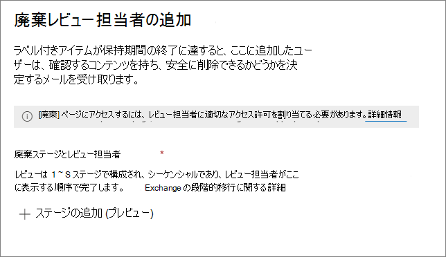

# コンテンツの処理

>*[セキュリティとコンプライアンスのための Microsoft 365 ライセンス ガイダンス](https://aka.ms/ComplianceSD)。*

Microsoft 365 コンプライアンス センターの **レコード管理** の [**処理**] タブを使用して、処理確認を管理し、保持期間の終了時に自動的に削除された [レコード](records-management.md#records)を表示します。 

## コンテンツの処理を表示するための前提条件

処理確認を管理し、レコードが削除されたことを確認するには、十分なアクセス許可があり、監査が有効になっている必要があります。

### 処理のアクセス許可

Microsoft365 コンプライアンス センターの [**処理**] タブに正常にアクセスするには、ユーザーは **処理管理** の管理者の役割を持っている必要があります。 2020 年 12 月より、この役割は、**レコード管理** の既定の管理者の役割グループに含まれるようになりました。

> [!NOTE]
> 既定で、グローバル管理者には **処理管理** の役割は付与されません。 

ユーザーに、保持およびレコード管理のためにその他の機能を表示および構成するためのアクセス許可を付与せずに、処理確認に必要なアクセス許可のみを付与するには、カスタムの役割グループ (たとえば、「処理確認」という名前) を作成して、このグループに処理管理の役割を付与します。

さらに、処理プロセス中にアイテムの内容を表示するには、**コンテンツ エクスプローラーのコンテンツ閲覧者** と **コンテンツ エクスプローラーのリスト閲覧者** の 2 つの役割グループにユーザーを追加します。 ユーザーがこれらの役割グループのアクセス許可を持っていない場合でも、処理確認操作を選択して処理確認を完了することができますが、コンプライアンス センターからアイテムのコンテンツを表示することができません。

これらのアクセス許可を構成する手順については、「[Office 365 セキュリティ/コンプライアンス センターへのアクセス権をユーザーに付与する](../security/office-365-security/grant-access-to-the-security-and-compliance-center.md)」をご覧ください。

### 監査を有効にする

最初の処理操作の少なくとも 1 日前に、監査が有効になっていることを確認してください。 詳細については、「[Office 365 セキュリティ&amp;コンプライアンス センターで監査ログを検索する](search-the-audit-log-in-security-and-compliance.md)」を参照してください。 

## 処理確認

コンテンツがその保存期間の終了に近づいたとき、そのコンテンツを確認して、完全に削除 (「破棄」) できるかどうかを確認する理由はいくつかあります。 たとえば、コンテンツを削除する代わりに、次のことを行う必要がある場合があります。
  
- 訴訟や監査に備え、関連コンテンツの削除を保留にします。

- 元の保持設定が一時的または暫定的な解決策であったためか、コンテンツに異なる保持期間を割り当てます。

- たとえば、コンテンツに研究的価値や歴史的価値がある場合は、コンテンツを既存の場所からアーカイブの場所に移動します。

保持期間の終了時に処理確認がトリガーされた場合:
  
- 選択したユーザーの元に、確認するコンテンツを知らせるメールが届きます。 これらの確認担当者は個々のユーザーか、メールが有効なセキュリティ グループです。 週単位で通知が送信されることに注意してください。
    
- 確認担当者は、Microsoft365 コンプライアンス センターの [**処理**] タブに移動してコンテンツを確認し、コンテンツを完全に削除するか、保持期間を延長するか、別の保持ラベルを適用するかを決定します。

処理確認には、Exchange メールボックス、SharePoint サイト、OneDrive アカウント、および Microsoft365 グループのコンテンツを含めることができます。 以上の場所で処理確認を待っているコンテンツは、確認担当者がコンテンツの完全削除を選択しない限り削除されません。

> [!NOTE]
> 処理確認をサポートするには、メールボックスに少なくとも 10 MB のデータが必要です。

保留中のすべての処理の概要は、[**概要**] タブで確認できます。例えば:

[**すべての保留中の処理を表示**] を選択すると、[**処理**] ページが表示されます。 以下に例を示します。

![Microsoft365 コンプライアンス センターの [処理] ページ](../media/disposition-tab.png)

### 処理確認の流れ

次の図は、保持ラベルが公開され、ユーザーが手動で適用した場合の処理確認の基本的な流れを示しています。 または、処理確認用に構成された保持ラベルをコンテンツに自動適用することもできます。
  

  
保持期間の終了時に処理確認をトリガーすることは、保持ラベルでのみ使用可能な構成オプションです。 このオプションは保持ポリシーでは使用できません。 これら 2 つの保持ソリューションの詳細については、「[保持ポリシーと保持ラベルの詳細](retention.md)」を参照してください。

保持ラベルの [**保持設定の定義**] ページから:

![ラベルの [保持] 設定ページ](../media/disposition-review-option.png)
 
この [**処理確認を開始する**] オプションを選択した後、ウィザードの次のページで処理確認の担当者を指定します。

確認担当者には、ユーザーまたはメール対応のセキュリティ グループを指定します。 Microsoft 365 グループ ([以前の Office 365 グループ](https://techcommunity.microsoft.com/t5/microsoft-365-blog/office-365-groups-will-become-microsoft-365-groups/ba-p/1303601)) は、このオプションではサポートされていません。

### コンテンツの表示と処理

確認担当者は、コンテンツを確認する準備ができたことをメールで通知されると、Microsoft365 コンプライアンス センターの **レコード管理** から [**処理**] タブに移動します。 確認担当者は、保持ラベルごとに処理を待機しているアイテムの数を確認し、保持ラベルを選択して、そのラベルが付いたすべてのコンテンツを表示できます。

保持ラベルを選択すると、[**保留中の処理**] タブからそのラベルのすべての保留中の処理が表示されます。操作を選択して妥当性コメントを入力できる 1 つ以上のアイテムを選択します。

写真からわかるように、サポートされている操作は次のとおりです。 
  
- アイテムを完全に削除する
- 保持期間を延長する
- 別の保持ラベルを適用する

場所とコンテンツへのアクセス許可があれば、**場所** 列のリンクを使用して、元の場所にあるドキュメントを表示できます。 処理確認中、コンテンツが元の場所から移動されることはありません。確認担当者が削除を選択するまで削除されることはありません。

メール通知が週単位で確認担当者に自動的に送信されます。 このスケジュールされたプロセスは、コンテンツの保持期間が終わるまでに、確認担当者は最大で 7 日、コンテンツが処理を待っているというメール通知を受信する場合があることを意味します。
  
すべての処理操作を監査でき、確認担当者が入力した妥当性テキストが保存され、[**処理アイテム**] ページの **コメント** 列に表示されます。
  
### 処理されたコンテンツが完全に削除されるまでの期間

処理確認を待っているコンテンツは、確認担当者がコンテンツの完全削除を選択しない限り削除されません。 確認担当者がこのオプションを選択すると、SharePoint サイトまたは OneDrive アカウントのコンテンツは、「[保持設定が所定の場所にあるコンテンツに作用するしくみ](retention.md#how-retention-settings-work-with-content-in-place)」セクションで説明する標準のクリーンアップ プロセスの対象になります。

## レコードの処理

[**レコード管理**] ページの [**処理**] タブを使用して、自動的に、または処理確認後に削除されたレコードを特定します。 これらのアイテムは、**種類** 列に **処分されたレコード** を表示します。 以下に例を示します。

レコード ラベルの [**処理されたアイテム**] タブに表示されるアイテムは、アイテムが処理されてから最大 7 年間保持され、その期間のレコードあたりのアイテム数は 100 万に制限されます。 **カウント** の数がこの 100 万の制限に近づいていて、レコードの処理の証明が必要な場合は、[Microsoft サポート](https://docs.microsoft.com/office365/admin/contact-support-for-business-products)に連絡し​​てください。

> [!NOTE]
> この機能は、[統合監査ログ](search-the-audit-log-in-security-and-compliance.md)からの情報に基づいているため、対応するイベントがキャプチャされるように、監査を[有効にして検索可能](turn-audit-log-search-on-or-off.md)にする必要があります。

監査では、[**ファイルとページのアクティビティ**] カテゴリで、**レコードとしてマークされている削除されたファイル** を検索 します。 この監査イベントは、ドキュメントとメールに適用されます。

## 表示をフィルター処理してエクスポートする

[**処理**] ページから保持ラベルを選択すると、[**保留中の処理**] タブ (該当する場合) と [**処理されたアイテム**] タブを使用して、表示をフィルター処理できます。より簡単にアイテムを見つけることができます。 

保留中の処理の場合、期間は有効期限に基づいています。 処理されたアイテムの場合、時間範囲は削除日に基づいています。
  
どちらの表示のアイテムに関する情報も .csv ファイルとしてエクスポートでき、Excel を使用して並べ替えて管理できます。

