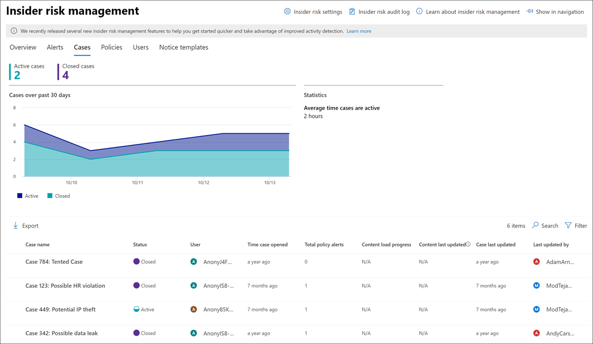

# Insider リスク管理ケース

ケースはインサイダーリスク管理の中心であり、ポリシーで定義されたリスク指標によって生成される問題を深く調査し、行動することができます。 ケースは、ユーザーのコンプライアンス関連の問題に対処するために追加のアクションが必要な場合に、アラートから手動で作成されます。 各ケースは 1 人のユーザーにスコープ設定され、ユーザーの複数の通知を既存のケースまたは新しいケースに追加できます。 

ケースの詳細を調査した後、次の操作を実行できます。

- ユーザーに通知を送信する
- ケースを良性として解決する
- ケースを ServiceNow インスタンスまたは電子メール受信者と共有する
- 調査のケースをエスカレートAdvanced eDiscoveryする

インサイダー リスク管理におけるケースの調査と管理の概要については、「Insider Risk Management Investigation and [Escalation」](https://www.youtube.com/watch?v=UONUSmkRC8s) ビデオをご覧ください。

## ケース ダッシュボード

インサイダー リスク管理 **ケース ダッシュボードを使用** すると、ケースの表示と対応が可能です。 ダッシュボードの各レポート ウィジェットには、過去 30 日間の情報が表示されます。

- **アクティブなケース**: 調査中のアクティブなケースの総数。
- **過去 30** 日間のケース : 作成されたケースの総数を、アクティブ状態と終了状態 *で**並べ替* えました。
- **統計**: アクティブなケースの平均時間 (時間、日、または月で一覧表示)。

ケース キューには、次のケース属性の現在の状態に加えて、組織のすべてのアクティブなケースと終了したケースが一覧表示されます。

- **ケース名**: アラートが確認され、ケースが作成された場合に定義されるケースの名前。  
- **Status**: ケースの状態 ([アクティブ] または [ *閉じた]* *のいずれか*)。
- **ユーザー**: ケースのユーザー。 ユーザー名の匿名化が有効になっている場合は、匿名化された情報が表示されます。
- **タイム ケースが開いた**: ケースを開いた後に経過した時刻。
- **ポリシーアラートの総数**: ケースに含まれるポリシー一致の数。 新しいアラートがケースに追加されると、この数は増える可能性があります。
- **最後に更新された** ケース : ケースの状態にケース ノートまたは変更が追加された後に経過した時刻。
- **最終更新日 :** ケースを最後に更新したインサイダー リスク管理アナリストまたは調査官の名前。

検索コントロール **を使用** して、特定のテキストのケース名を検索し、ケース フィルターを使用して、次の属性でケースを並べ替える。

- 状態
- ケースが起きてからの時間、開始日、終了日
- 最終更新、開始日、終了日

## フィルター ケース

組織内のアクティブなインサイダー リスク管理ポリシーの数と種類に応じて、大量のケースのキューを確認する作業は困難な場合があります。 ケース フィルターを使用すると、アナリストや調査担当者が複数の属性でケースを並べ替えるのに役立ちます。 ケース ダッシュボードでアラートをフィルター **処理するには、[** フィルター] コントロール **を選択** します。 1 つ以上の属性でケースをフィルター処理できます。

- **Status**: 1 つ以上のステータス値を選択して、ケース リストをフィルター処理します。 オプションは[アクティブ *] と [閉じた* ] *です*。
- **[タイム ケースを開く**]: ケースを開いた日付の開始日と終了日を選択します。
- **最終更新日:** ケースが更新された日付の開始日と終了日を選択します。

## ケースの調査

適切な是正措置を取る上で、インサイダーリスク管理アラートに関するより深い調査が重要です。 Insider リスク管理ケースは、ユーザー リスクアクティビティの履歴、アラートの詳細、一連のリスク イベント、およびリスクにさらされるコンテンツとメッセージを探索するための中心的な管理ツールです。 リスク アナリストや調査担当者は、ケースを使用してレビューのフィードバックとメモを一元化し、ケース解決を処理します。

ケースを選択すると、ケース管理ツールが開き、分析担当者と調査担当者がケースの詳細を調査します。

### ケースの概要

[ **ケースの概要]** タブは、リスク アナリストと調査担当者のケースの詳細を要約します。 [このケースについて] 領域に次 **の情報が含** まれています。

- **Status**: ケースの現在の状態 (アクティブまたはクローズ)。
- **作成されたケース**: ケースが作成された日付と時刻。
- **ユーザーのリスク スコア**: ケースのユーザーの現在の計算されたリスク レベル。 このスコアは 24 時間ごとに計算され、ユーザーに関連付けられているすべてのアクティブなアラートのアラート リスク スコアを使用します。
- **Email**: ケースのユーザーの電子メール エイリアス。
- **組織または部署**: ユーザーが割り当てられている組織または部署。
- **マネージャー名**: ユーザーのマネージャーの名前。
- **マネージャーの電子** メール: ユーザーのマネージャーの電子メール エイリアス。

[ **ケースの概要]** タブには、ケース **に** 関連付けられたポリシー一致アラートに関する次の情報を含む [アラート] セクションも含まれています。

- **ポリシーの一致**: ユーザー アクティビティの一致アラートに関連付けられたインサイダー リスク管理ポリシーの名前。
- **状態**: アラートの状態。
- **重大度**: アラートの重大度。
- **検出された時間**: アラートが生成された後に経過した時間。

### アラート

[ **アラート]** タブには、ケースに含まれる現在のアラートが要約されます。 新しいアラートは既存のケースに追加され、割り当てられたアラート キューに追加されます。 次のアラート属性がキューに一覧表示されます。

- 状態
- 重要度
- 検出された時間

キューからアラートを選択して、[アラートの詳細 **] ページを表示** します。

検索コントロールを使用して、特定のテキストのアラート名を検索し、アラート フィルターを使用して、次の属性でケースを並べ替える。

- 状態
- 重要度
- 検出された時間、開始日、終了日

フィルター コントロールを使用して、次を含むいくつかの属性でアラートをフィルター処理します。

- **Status**: 1 つ以上のステータス値を選択して、アラート リストをフィルター処理します。 オプションは、*確認済み*、*非表示*、*レビューが必要*、*解決済み* です。
- **重大度 :** 1 つ以上のアラート リスク重大度レベルを選択して、アラート リストをフィルター処理します。 オプションは、*高*、*中*、*低* です。
- **検出された時間**: アラートが作成された日時の開始日と終了日を選択します。
- **ポリシー**: 1 つ以上のポリシーを選択して、選択したポリシーによって生成されたアラートをフィルター処理します。

### ユーザー アクティビティ

[**ユーザーアクティビティ**] タブは、内部リスク分析とケースの調査を対象にした、最も強力なインサイダーリスク管理ツールの1つです。 このタブは、すべてのアラートの履歴タイムライン、アラートの詳細、ケース内のユーザーの現在のリスク スコア、一連のリスク イベント、およびケースのリスクを含む効果的なアクションを実行するコントロールなど、ケースの迅速なレビューを可能にするための構造です。

1. **時間フィルター**: 既定では、ケースで確認された過去 6 か月間のアラートがユーザー アクティビティ グラフに表示されます。 バブル グラフの [6 か月 *]、[3* か月]、または *[1**か月]* タブを選択すると、グラフ ビューを簡単にフィルター処理できます。
2. **リスク警告アクティビティと詳細**: リスク アクティビティは、ユーザー アクティビティ グラフに色付きバブルとして視覚的に表示されます。 バブルはリスクの異なるカテゴリに対して作成され、バブル サイズはカテゴリのリスク アクティビティの数に比例します。 バブルを選択すると、各リスク アクティビティの詳細が表示されます。 詳細は次のとおりです。
    - リスクアクティビティの **日付**。
    - リスク **アクティビティ カテゴリ**。 たとえば、*組織外に送信された添付ファイル* を含むメールや、オンラインからダウンロードされたファイルSharePoint *します*。
    - アラートの **リスクスコア**。 このスコアは、アラートリスクの重大度レベルを表すスコアの数値です。
    - アラートに関連付けられているイベント数。 リスク アクティビティに関連付けられた各ファイルまたは電子メールへのリンクも利用できます。
3. **リスク シーケンス (プレビュー)**: リスクの高いアクティビティの時系列順序は、リスク調査の重要な側面であり、これらの関連するアクティビティを特定することが、組織の全体的なリスクを評価する重要な部分です。 関連するアラート アクティビティは、接続線と一緒に表示され、これらのアクティビティが大きなリスク領域に関連付けられているのを強調表示します。 このアクティビティのビューは、調査員が孤立したイベントまたは 1 回限りのイベントと見なされた可能性があるリスク アクティビティに対して文字通り「点を接続する」のに役立ちます。 シーケンス内のバブルを選択して、関連付けられているすべてのリスク アクティビティの詳細を表示します。 詳細は次のとおりです。

    - **シーケンス** の名前。
    - **シーケンス** の **日付または** 日付の範囲。
    - **シーケンスの** リスク スコア。 このスコアは、シーケンス内の関連する各アクティビティのアラート リスク重大度レベルを組み合わせたシーケンスの数値スコアです。
    - **シーケンス内の各アラートに関連付けられているイベントの数**。 各リスク アクティビティに関連付けられた各ファイルまたは電子メールへのリンクも利用できます。
    - **アクティビティを順に表示します**。 バブル チャートにシーケンスを強調表示線として表示し、アラートの詳細を展開して、シーケンス内のすべての関連アラートを表示します。

4. **リスク アクティビティの凡例**: ユーザー アクティビティ グラフの下部全体で、色分けされた凡例を使用すると、各アラートのリスク カテゴリをすばやく特定できます。
5. **リスク アクティビティの年** 表: ケースに関連付けられているすべてのリスク アラートの完全な年表が一覧表示されます。その中には、対応するアラート バブルで利用可能なすべての詳細が含されます。
6. **ケース アクション**: ケースを解決するためのオプションは、ケース アクション ツールバーにあります。 ケースを解決したり、ユーザーに電子メール通知を送信したり、データまたはユーザー調査のケースをエスカレートすることができます。

### アクティビティ エクスプローラー (プレビュー)

>[!IMPORTANT]
>[アクティビティ エクスプローラー] タブは、組織でこの機能を使用した後にイベントをトリガーするユーザーのケース管理領域で使用できます。

[ **アクティビティ エクスプローラー]** タブを使用すると、リスク アナリストと調査担当者は、リスクアラートに関連付けられたアクティビティの詳細を確認できます。 たとえば、ケース管理アクションの一環として、調査担当者とアナリストはケースに関連付けられているすべてのリスク アクティビティを確認して詳細を確認する必要があります。 アクティビティ エクスプローラー **を使用すると**、レビュー担当者は、検出された危険なアクティビティのタイムラインをすばやく確認し、アラートに関連付けられているすべてのリスク アクティビティを特定してフィルター処理できます。

アクティビティ エクスプローラーの詳細については、「Insider リスク管理アラート [」の記事を参照](insider-risk-management-alerts.md#activity-explorer-preview) してください。

### コンテンツ エクスプローラー

リスク分析担当者と調査担当者は、[**コンテンツエクスプローラー**] のタブを使って、リスクアラートに関連する個々のファイルとメールのコピーを確認できます。 たとえば、ユーザーが SharePoint Online から何百ものファイルをダウンロードし、アクティビティがポリシー アラートをトリガーするときにアラートが作成された場合、アラート用にダウンロードされたファイルはすべてキャプチャされ、元のストレージ ソースからインサイダー リスク管理ケースにコピーされます。

コンテンツ エクスプローラーは、基本的で高度な検索機能とフィルター機能を備え、強力なツールです。 コンテンツ エクスプローラーの使用の詳細については [、「Insider リスク管理コンテンツ エクスプローラー」を参照してください](insider-risk-management-content-explorer.md)。

### ケースメモ

ケース **の [ケース メモ** ] タブでは、リスク アナリストと調査担当者がケースの作業に関するコメント、フィードバック、インサイトを共有します。 メモは、ケースに永続的に追加されます。メモを保存した後に、編集または削除することはできません。 アラートからケースが作成されると、「**アラートの確認とインサイダーリスクケースの作成**」ダイアログに入力されたコメントが、ケースメモとして自動的に追加されます。

ケース ノート ダッシュボードには、メモを作成したユーザーのメモと、メモが保存された後に経過した時間が表示されます。 特定のキーワードのケース ノート テキスト フィールドを検索するには、ケース ダッシュボードの **[** 検索] ボタンを使用して、特定のキーワードを入力します。

ケースにメモを追加するには、次の方法を使用します。

1. [コンプライアンス センター [Microsoft 365イン](https://compliance.microsoft.com)サイダー リスク管理] に **移動** し、[ケース] タブ **を選択** します。
2. ケースを選択し、[ケース メモ] **タブを選択** します。
3. [ケース **メモの追加] を選択します**。
4. [ケース **メモの追加]** ダイアログで、ケースのメモを入力します。 [**保存] を** 選択してケースにメモを追加するか、ケースにメモを保存せずに [閉じるキャンセル] を選択します。

### 共同作成者

ケースの [**共同作成者**] タブでは、リスク分析担当者や調査担当者が、ケースに別のレビュー担当者を追加することができます。 既定では **、Insider Risk Management Analysts** および Insider Risk Management **Investigators** の役割が割り当てられているすべてのユーザーが、アクティブなケースとクローズされたケースごとに投稿者として一覧表示されます。 Insider Risk **Management Investigators ロールが割り** 当てられているユーザーだけが、コンテンツ エクスプローラーでファイルとメッセージを表示する権限を持ちます。

ユーザーを投稿者として追加することで、ケースへの一時的なアクセスを許可できます。 投稿者は、次の場合を除き、特定のケースに対してすべてのケース管理制御を持っています。

- アラートの確認または消去する権限
- ケースの共同作成者を編集する権限
- コンテンツ エクスプローラーでファイルとメッセージを表示するアクセス許可

ケースに投稿者を追加するには、次の方法を使用します。

1. [コンプライアンス センター [Microsoft 365イン](https://compliance.microsoft.com)サイダー リスク管理] に **移動** し、[ケース] タブ **を選択** します。
2. ケースを選択し、[投稿者] **タブを選択** します。
3. [投稿者 **の追加] を選択します**。
4. [投稿者 **の追加** ] ダイアログで、追加するユーザーの名前を入力し、提案されたユーザー リストからユーザーを選択します。 この一覧は、テナント サブスクリプションAzure Active Directoryから生成されます。
5. [**追加]** を選択してユーザーを投稿者として追加するか、[キャンセル] を選択して、ユーザーを投稿者として追加せずにダイアログを閉じます。

## ケースへの対処

リスク アナリストと調査担当者は、ケースの重大度、ユーザーのリスクの履歴、組織のリスク ガイドラインに応じて、いくつかの方法の 1 つのケースに対してアクションを実行できます。 場合によっては、ケースをユーザーまたはデータ調査にエスカレートして、組織の他の領域と共同作業を行い、リスクアクティビティについて深く掘り下げる必要がある場合があります。 Insider リスク管理は、エンド Microsoft 365解決管理を支援するために、他のコンプライアンス ソリューションと緊密に統合されています。

### メール通知の送信

ほとんどの場合、インサイダー リスクアラートを作成するユーザーアクションは、不注意または偶発的です。 ユーザーにメールでリマインダー通知を送信する方法は、ケースレビューとアクションを文書化するための効果的な方法であり、企業ポリシーをユーザーに通知したり、リフレッシュトレーニングをポイントする方法です。 通知は、インサイダー [リスク管理インフラストラクチャ](insider-risk-management-notices.md) 用に作成した通知テンプレートから生成されます。

ユーザーに電子メール通知を送信しても、***** はケースを _Closed* として解決_Closedです。 場合によっては、ユーザーに通知を送信した後にケースを開いたままにしておき、新しいケースを開かなくても、より多くのリスク アクティビティを探す必要があります。 通知が送信された後にケースを解決する場合は、通知を送信した後の手順として、「**ケース解決済**」を選択しなければなりません。

ケースに割り当てられたユーザーに通知を送信するには、次の方法を実行します。

1. [コンプライアンス センター [Microsoft 365イン](https://compliance.microsoft.com)サイダー リスク管理] に **移動** し、[ケース] タブ **を選択** します。
2. ケースを選択し、ケース アクション ツールバー **の [メール通知** の送信] ボタンを選択します。
3. [電子 **メール通知の** 送信] ダイアログで、[通知テンプレートの **選択** ] ドロップダウン コントロールを選択して通知の通知テンプレートを選択します。 この選択により、通知の他のフィールドが事前に入力されます。
4. 通知フィールドを確認し、必要に応じて更新します。 ここで入力した値は、テンプレートの値より優先されます。
5. [**送信]** を選択して通知をユーザーに送信するか、[キャンセル] を選択して通知をユーザーに送信せずにダイアログを閉じます。 送信された通知はすべて、ケース ノート ダッシュボードのケース ノート キュー **に追加** されます。

### 調査を拡大する

ユーザーのリスク アクティビティに追加の法的レビューが必要な状況で、ユーザー調査のケースをエスカレートします。 この拡大により、Microsoft 365 組織の新しい Advanced eDiscovery ケースが開きます。 Advanced eDiscovery は、組織の内部および外部の法的調査に対応するコンテンツを保持、収集、確認、分析、エクスポートするためのエンド ツー エンドのワークフローを提供します。 また、訴訟チームが法的情報保留通知ワークフロー全体を管理して、ケースに関係するカストディアンとコミュニケーションを取ることができます。 インサイダーリスク管理ケースから作成された Advanced eDiscovery ケースのカストディアンとしてレビュー担当者を割り当てると、訴訟チームは適切な措置を講じ、コンテンツの保持を管理することができます。 Advanced eDiscovery の詳細については、「[Advanced eDiscovery in Microsoft 365の概要](overview-ediscovery-20.md)」を参照してください。

ケースをユーザー調査にエスカレートするには、次の方法を実行します。

1. [コンプライアンス センター [Microsoft 365イン](https://compliance.microsoft.com)サイダー リスク管理] に **移動** し、[ケース] タブ **を選択** します。
2. ケースを選択し、ケース アクション ツールバーの **[** 調査のエスカレート] ボタンを選択します。
3. [調査 **のエスカレート] ダイアログ** で、新しいユーザー調査の名前を入力します。 必要に応じて、ケースに関するメモを入力し、[エスカレート] **を選択します**。
4. 通知フィールドを確認し、必要に応じて更新します。 ここで入力した値は、テンプレートの値より優先されます。
5. [**確認] を** 選択してユーザー調査ケースを作成するか、[キャンセル] を選択して、新しいユーザー調査ケースを作成せずにダイアログを閉じます。

インサイダー リスク管理ケースが新しいユーザー調査ケースにエスカレートされた後、Microsoft 365 コンプライアンス センターの [電子情報開示の詳細設定]  >  領域で新しいケースを確認できます。

### ケースのフローを使用Power Automateタスクを実行する

推奨されるデータ Power Automateを使用すると、リスク調査担当者とアナリストは次の操作を迅速に実行できます。

- インサイダー リスク ケースでユーザーに関する人事またはビジネスからの情報を要求する
- ユーザーがインサイダー リスク アラートを受け取った場合にマネージャーに通知する
- ServiceNow でインサイダー リスク管理ケースのレコードを作成する
- インサイダー リスク ポリシーに追加されたユーザーに通知する

インサイダー リスク管理ケースのPower Automateフローを実行、管理、または作成するには、次のコマンドを実行します。

1. ケース アクション **ツール バー** の [自動化] を選択します。 
2. 実行するPower Automateを選択し、[フローの実行]**を選択します**。 
3. フローが完了したら、[完了] を **選択します**。

インサイダー リスク管理のPower Automate詳細については、「Insider リスク管理設定の概要」[を参照してください](insider-risk-management-settings.md#power-automate-flows-preview)。

### ケースのチームMicrosoft Teamsまたは作成する

設定Microsoft Teamsインサイダー リスク管理の統合が有効になっている場合、アラートが確認され、ケースが作成されると、Microsoft Teams チームが自動的に作成されます。 リスク調査担当者とアナリストは、Microsoft Teams アクション ツール バーの [チームを表示する] を選択して、Microsoft Teamsを開いて、チームに直接移動できます。

Microsoft Team 統合を有効にする前に開いたケースの場合、リスク調査員とアナリストは、ケース アクション ツールバーの [Microsoft Teams チームの作成] を選択して、ケースの新しい **Microsoft Teams** チームを作成できます。

ケースが解決すると、関連付けられた Microsoft チームは自動的にアーカイブされます (非表示で読み取り専用になります)。

インサイダー リスク管理のMicrosoft Teams詳細については、「Insider リスク管理設定の概要[」を参照してください](insider-risk-management-settings.md#microsoft-teams-preview)。

### ケースを解決する

リスク アナリストと調査担当者がレビューと調査を完了した後、ケースは、現在ケースに含まれているすべてのアラートに対応するために解決できます。 ケースを解決すると、解決分類が追加され、ケースの状態が [閉じた] に変更され、解決アクションの理由がケース ノート ダッシュボードのケース メモ キューに自動的 **に追加** されます。 ケースは次のいずれかの方法で解決されます。

- **良** 性 : ポリシー一致アラートが低リスク、重大でない、または誤検知と評価される場合の分類。
- **ポリシー違反の確認**: ポリシー一致アラートが危険、重大、または悪意のある意図の結果として評価される場合の分類。

ケースを解決するには、次の手順を実行します。

1. [コンプライアンス センター [Microsoft 365イン](https://compliance.microsoft.com)サイダー リスク管理] に **移動** し、[ケース] タブ **を選択** します。
2. ケースを選択し、ケース アクション ツールバーの **[** ケースの解決] ボタンを選択します。
3. [ケース **の解決]** ダイアログで、[ **解決する]** ドロップダウン コントロールを選択して、ケースの解決分類を選択します。 オプションは、**良性ポリシー違反****または確認済みポリシー違反です**。
4. [ケース **の解決]** ダイアログで、[アクションの実行] テキスト フィールドに解決分類 **の理由を** 入力します。
5. [**解決] を** 選択してケースを閉じるか、[キャンセル] を選択して、ケースを解決せずにダイアログを閉じます。
