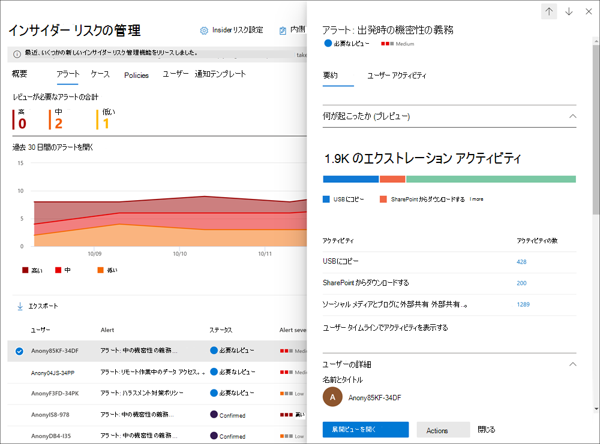

# Microsoft 365 のインサイダー リスク管理について

インサイダー リスク管理は、Microsoft 365 のコンプライアンス ソリューションであり、組織内の悪意のあるアクティビティや不注意なアクティビティを検出、調査、および操作することができるので、内部リスクを最小限に抑えるのに役立ちます。 インサイダー リスク ポリシーを使用すると、ケースへの対応や、必要に応じて Microsoft Advanced eDiscovery へのケースのエスカレートなど、組織で特定および検出するリスクの種類を定義できます。 組織内のリスク アナリストは、ユーザーが組織のコンプライアンス基準に確実に準拠できるよう、迅速に適切なアクションを実行できます。

以下のビデオを見て、インサイダー リスク管理が組織の価値、文化、ユーザー エクスペリエンスの優先順位を付けながら、組織がリスクを防止、検出、および含むのに役立つ方法について説明します。
 
 
>[!VIDEO https://www.microsoft.com/videoplayer/embed/RE4j9CN]

## 最新のリスクの問題点

組織内のリスクを管理して最小化するには、まずモダンワークプレースで見つかったリスクの種類を理解します。 一部のリスクは、直接制御の外部にある外部イベントや要因によって発生します。 その他のリスクは、最小限に抑え、回避できる内部イベントとユーザー アクティビティによって発生します。 たとえば、組織内のユーザーによる、不正、不適切、不正、または不正な行動によるリスクがあります。 これらの動作には、ユーザーからの広範な内部リスクが含まれます。

- 機密データの漏洩とデータ流出
- 機密違反
- 知的所有権侵害
- 詐欺
- インサイダー取引
- 規制遵守違反

最新の職場のユーザーは、幅広いプラットフォームとサービスでデータを作成、管理、共有できます。 ほとんどの場合、組織は、ユーザーのプライバシー基準を満たしながら、組織全体のリスクを特定および軽減するためのリソースとツールが限られています。

インサイダー リスク管理は、サービスとサードパーティのインジケーターを使用して、リスク アクティビティをすばやく特定、トリアージ、および行動するのに役立ちます。 Microsoft 365 と Microsoft Graph のログを使用すると、インサイダー リスク管理を使用して、リスク インジケーターを識別するための特定のポリシーを定義できます。 これらのポリシーを使用すると、リスクの高いアクティビティを特定し、これらのリスクを軽減するために行動することができます。

インサイダー リスク管理は、次の原則を中心に行っています。

- **透明性**: ユーザーのプライバシーと組織のリスクのバランスを、設計によるプライバシー アーキテクチャとバランスを取る。
- **構成** 可能 : 業界、地域、およびビジネス グループに基づいて構成可能なポリシー。
- **統合 :** Microsoft 365 コンプライアンス ソリューション全体にわたる統合ワークフロー。
- **操作可能**: ユーザー通知、データ調査、およびユーザー調査を有効にする分析情報を提供します。

## ワークフロー

インサイダー リスク管理ワークフローは、組織内のリスクに対処するための特定、調査、およびアクションの実行に役立ちます。 集中ポリシー テンプレート、Microsoft 365 サービス全体にわたる包括的なアクティビティ シグナリング、アラートとケース管理ツールを使用すると、アクション可能な分析情報を使用して、リスクの高い動作をすばやく特定して対処できます。

内部リスクアクティビティと Microsoft 365 のインサイダーリスク管理でのコンプライアンスの問題を特定、解決するには、次のワークフローを使用します。

### Policies

[インサイダー リスク管理ポリシー](insider-risk-management-policies.md) は、定義済みのテンプレートとポリシー条件を使用して作成され、組織でどのようなトリガー イベントとリスク インジケーターが検査されるのかを定義します。 これらの条件には、アラートに対するリスク インジケーターの使用方法、ポリシーに含まれるユーザー、優先順位付けされるサービス、および監視期間が含まれます。

次の [ポリシー テンプレート] から選択して、インサイダー リスク管理をすばやく開始できます。

- [部下ユーザーによるデータの盗難](insider-risk-management-policies.md#data-theft-by-departing-users)
- [一般的なデータ リーク](insider-risk-management-policies.md#general-data-leaks)
- [優先度ユーザーによるデータ漏洩 (プレビュー)](insider-risk-management-policies.md#data-leaks-by-priority-users-preview)
- [不満を持つユーザーによるデータ漏洩 (プレビュー)](insider-risk-management-policies.md#data-leaks-by-disgruntled-users-preview)
- [一般的なセキュリティ ポリシー違反 (プレビュー)](insider-risk-management-policies.md#general-security-policy-violations-preview)
- [指定されたユーザーによるセキュリティ ポリシー違反 (プレビュー)](insider-risk-management-policies.md#security-policy-violations-by-departing-users-preview)
- [優先度ユーザーによるセキュリティ ポリシー違反 (プレビュー)](insider-risk-management-policies.md#security-policy-violations-by-priority-users-preview)
- [不満を持つユーザーによるセキュリティ ポリシー違反 (プレビュー)](insider-risk-management-policies.md#security-policy-violations-by-disgruntled-users-preview)

### アラート

アラートは、ポリシーの条件に一致し、アラート ダッシュボードに表示されるリスク インジケーターによって自動的 [に生成されます](insider-risk-management-alerts.md)。 このダッシュボードを使用すると、レビューが必要なすべてのアラートのクイック ビュー、時間の間にアラートを開く、組織のアラート統計を表示できます。 すべてのポリシーアラートは、既存のアラートとアクションが必要な新しいアラートの状態をすばやく特定するのに役立つ次の情報と一緒に表示されます。

- 状態
- 重要度
- 検出された時間
- ケース
- ケースの状態

### トリアージ

調査が必要な新しいユーザー アクティビティによって、"レビューが必要" ステータスが割り当てられた *アラートが自動的に生成* されます。 レビュー担当者は、これらのアラートをすばやく識別、レビュー、評価、トリアージできます。

新しいケースを開いて、既存のケースに警告を割り当てるか、警告を無視すれば警告を解決できます。 アラート フィルターを使用すると、状態、重大度、または検出された時間でアラートをすばやく識別できます。 トリアージ プロセスの一環として、レビュー担当者は、ポリシーによって識別されたアクティビティに関するアラートの詳細の表示、ポリシーの一致に関連付けられたユーザー アクティビティの表示、アラートの重大度の確認、およびユーザー プロファイル情報の確認を行えます。

### 調査

[ポリシーの一](insider-risk-management-cases.md) 致に関するアクティビティの詳細と状況の詳細な確認と調査が必要なアラートのケースが作成されます。 ケース **ダッシュボードでは** 、すべてのアクティブなケース、時間の渡るオープン ケース、および組織のケース統計を表示できます。 レビュー担当者は、状況、ケースを開いた日付、ケースが最後に更新された日付で迅速にケースをフィルター処理できます。

ケース ダッシュボードでケースを選択すると、ケースが調査およびレビュー用に開きます。 この手順は、インサイダー リスク管理ワークフローの中心です。 この領域では、リスク アクティビティ、ポリシー条件、アラートの詳細、およびユーザーの詳細が、レビュー担当者向け統合ビューに統合されます。 この領域の主な調査ツールは次のとおりです。

- **ユーザー アクティビティ**: ユーザー アクティビティは、時間の流れと現在または過去のリスク アクティビティのリスク レベルをプロットする対話型グラフに自動的に表示されます。 レビュー担当者は、ユーザーのリスク履歴全体をすばやくフィルター処理して表示し、詳細を確認するために特定のアクティビティにドリルダウンできます。
- **コンテンツ エクスプローラー**: アラート アクティビティに関連付けられているすべてのデータ ファイルと電子メール メッセージが自動的に取得され、コンテンツ エクスプローラーに表示されます。 レビュー担当者は、データ ソース、ファイルの種類、タグ、会話、その他の多くの属性によって、ファイルやメッセージをフィルター処理して表示できます。
- **ケース ノート**: レビュー担当者は、[ケース ノート] セクションでケースに関するメモを提供できます。 このリストは、すべてのメモを中央ビューに統合し、レビュー者と提出日の情報を含めます。

### 操作

ケースを調査した後、レビュー担当者は迅速に対応してケースを解決したり、組織内の他のリスク利害関係者と共同作業を行います。 ユーザーが誤ってポリシーの条件に違反した場合、組織用にカスタマイズできる通知テンプレートから、簡単な事前通知をユーザーに送信できます。 これらの通知は、単純なリマインダーとして機能する場合や、将来のリスクの高い動作を防ぐためにトレーニングやガイダンスを再表示する場合があります。 詳細については、「インサイダー リスク管理 [に関する通知テンプレート」を参照してください](insider-risk-management-notices.md)。

より深刻な状況では、インサイダー リスク管理ケースの情報を組織内の他のレビュー担当者やサービスと共有する必要がある場合があります。 インサイダー リスク管理は他の Microsoft 365 コンプライアンス ソリューションと緊密に統合され、エンドツーエンドのリスク解決に役立ちます。

- **Advanced eDiscovery**: ケースをエスカレートして調査を行うと、ケースのデータと管理を Microsoft 365 の Advanced eDiscovery に転送できます。 Advanced eDiscovery は、組織の内部および外部の調査に対応するコンテンツを保持、収集、確認、分析、エクスポートするためのエンド ツー エンドのワークフローを提供します。 これにより、法務チームは訴訟ホールド通知ワークフロー全体を管理できます。 Advanced eDiscovery の詳細については、「[Advanced eDiscovery in Microsoft 365の概要](overview-ediscovery-20.md)」を参照してください。
- **ServiceNow (プレビュー)**: ServiceNow は、組織がエンタープライズ運用のデジタル ワークフローを管理するのに役立つ人気のあるクラウド コンピューティング プラットフォームです。 インサイダー リスク管理は、ServiceNow サービスとのケース アラートの共有をサポートし、個々のインサイダー リスク ケースに関連するインシデントや変更要求を作成できます。 ServiceNow でアラート情報を共有する方法の詳細については [、「ServiceNow](insider-risk-management-cases.md#share-the-case)でケースを共有する」を参照してください。
- **Office 365 管理 API** の統合 (プレビュー) : インサイダー リスク管理は、Office 365 管理 API を介してアラート情報をセキュリティ情報およびイベント管理 (SIEM) サービスにエクスポートできます。 プラットフォーム内のアラート情報にアクセスすると、組織のリスク プロセスに最も適した方法で、リスク アクティビティに柔軟に対応できます。 Office 365 Management API を使用したアラート情報のエクスポートの詳細については、「アラートのエクスポート」を [参照してください](insider-risk-management-settings.md#export-alerts-preview)。

>[!NOTE]
>ServiceNow コネクタのプレビュー中に、フィードバックとサポートに感謝します。 ServiceNow コネクタのプレビューを終了し、2020 年 11 月 30 日にインサイダー リスク管理のサポートを中止することを決定しました。 インサイダー リスク管理における ServiceNow 統合を顧客に提供する代替方法を積極的に評価しています。

## シナリオ

インサイダー リスク管理は、いくつかの一般的なシナリオで、組織内の内部リスクを検出、調査、および軽減するためのアクションを実行するのに役立ちます。

### 指定されたユーザーによるデータの盗難

ユーザーが組織を離れる際に、任意に、または退職の結果として、多くの場合、会社、顧客、およびユーザーのデータが危険にさらされている正当な懸念があります。 ユーザーは、プロジェクト データが独自のデータではないと考える場合や、個人の利益を得るために会社のポリシーや法的基準に違反するために会社のデータを取得する必要がある場合があります。 インサイダー リスク管理ポリシーは、規制下のユーザー によるデータ盗難ポリシー テンプレートを使用して、通常、この種の盗難に関連するアクティビティを自動的に検出します。 このポリシーでは、不審なユーザーによるデータ盗難に関連する不審なアクティビティに関するアラートを自動的に受信し、適切な調査アクションを実行できます。 このポリシー テンプレート [では、組織の Microsoft 365 HR](import-hr-data.md) コネクタを構成する必要があります。

### 機密情報または機密情報の意図的または意図しない漏洩

ほとんどの場合、ユーザーは機密情報や機密情報を適切に処理するために最善を試みます。 しかし、ユーザーが誤って間違いを生じ、情報が誤って組織外で共有されたり、情報保護ポリシーに違反したりする場合があります。 その他の状況では、ユーザーは意図的に機密情報を漏洩したり、悪意を持って機密情報を共有したり、個人の利益を得る可能性があります。 次のデータ漏洩ポリシー テンプレートを使用して作成されたインサイダー リスク管理ポリシーは、通常、機密情報または機密情報の共有に関連するアクティビティを自動的に検出します。

- [一般的なデータ リーク](insider-risk-management-policies.md#general-data-leaks)
- [優先度の高いユーザーによるデータ漏洩 (プレビュー)](insider-risk-management-policies.md#data-leaks-by-priority-users-preview)
- [不満を持つユーザーによるデータ漏洩 (プレビュー)](insider-risk-management-policies.md#data-leaks-by-disgruntled-users-preview)

## 意図的または意図しないセキュリティ ポリシー違反 (プレビュー)

ユーザーは、通常、最新の職場でデバイスを管理する際に、大きな制御を持っています。 これには、業務のパフォーマンスに必要なアプリケーションをインストールまたはアンインストールするためのアクセス許可や、デバイスのセキュリティ機能を一時的に無効にする機能が含まれる場合があります。 このアクティビティが不注意、偶発的、または悪意のあるものかどうかに関係ない場合、この行為は組織にリスクを与える可能性があります。また、最小限に抑えるために識別して行動することが重要です。 これらのリスクの高いセキュリティ アクティビティを識別するために、次のインサイダー リスク管理セキュリティ ポリシー違反テンプレートは、セキュリティ リスク インジケーターをスコア付けし、Microsoft Defender for Endpoint の警告を使用して、セキュリティ関連のアクティビティに関する分析情報を提供します。

- [一般的なセキュリティ ポリシー違反 (プレビュー)](insider-risk-management-policies.md#general-security-policy-violations-preview)
- [指定されたユーザーによるセキュリティ ポリシー違反 (プレビュー)](insider-risk-management-policies.md#security-policy-violations-by-departing-users-preview)
- [優先度ユーザーによるセキュリティ ポリシー違反 (プレビュー)](insider-risk-management-policies.md#security-policy-violations-by-priority-users-preview)
- [不満を持つユーザーによるセキュリティ ポリシー違反 (プレビュー)](insider-risk-management-policies.md#security-policy-violations-by-disgruntled-users-preview)

## 位置、アクセス レベル、またはリスク履歴に基づくユーザーのポリシー (プレビュー)

組織内のユーザーは、自分の位置、機密情報へのアクセスレベル、またはリスク履歴に応じて、異なるレベルのリスクを持つ場合があります。 これには、組織のエグゼクティブ リーダー チームのメンバー、広範なデータとネットワーク アクセス特権を持つ IT 管理者、またはリスクの高いアクティビティの過去の履歴を持つユーザーが含まれる場合があります。 このような状況では、調査と迅速な対応のためにアラートを表示するのに役立つ、より詳細な検査とより積極的なリスク スコアリングが重要です。 このような種類のユーザーの危険なアクティビティを特定するには、優先度の高いユーザー グループを作成し、次のポリシー テンプレートからポリシーを作成します。

- [優先度ユーザーによるセキュリティ ポリシー違反 (プレビュー)](insider-risk-management-policies.md#security-policy-violations-by-priority-users-preview)
- [優先度の高いユーザーによるデータ漏洩 (プレビュー)](insider-risk-management-policies.md#data-leaks-by-priority-users-preview)

## 不満を持つユーザーによるアクションと動作 (プレビュー)

雇用ストレス イベントは、インサイダー リスクに関連する複数の方法でユーザーの行動に影響を与える可能性があります。 これらのストレスは、パフォーマンスの低いレビュー、位置の降格、またはユーザーがパフォーマンス レビュー計画に配置されている可能性があります。 ほとんどのユーザーはこれらのイベントに対して悪意を持って応答しない場合でも、通常の状況では考慮できないアクションを実行するユーザーがいます。 これらの種類の危険なアクティビティを識別するために、次のインサイダー リスク管理ポリシー テンプレートは Microsoft 365 HR コネクタを使用し、雇用ストレス イベントの近くで発生する可能性がある行動に関連するリスク インジケーターのスコアリングを開始します。

- [不満を持つユーザーによるデータ漏洩 (プレビュー)](insider-risk-management-policies.md#data-leaks-by-disgruntled-users-preview)
- [不満を持つユーザーによるセキュリティ ポリシー違反 (プレビュー)](insider-risk-management-policies.md#security-policy-violations-by-disgruntled-users-preview)

## 始める準備はいいですか。

- 組織内 [でインサイダー リスク管理ポリシー](insider-risk-management-plan.md) を有効にするために準備する方法については、「インサイダー リスク管理を計画する」を参照してください。
- イン [サイダー リスク ポリシーのグローバル設定を構成するには、「](insider-risk-management-settings.md) インサイダー リスク管理設定の使用を開始する」を参照してください。
- 前提条件 [の構成、](insider-risk-management-configure.md) ポリシーの作成、アラートの受信を開始するには、「インサイダー リスク管理の開始」を参照してください。
