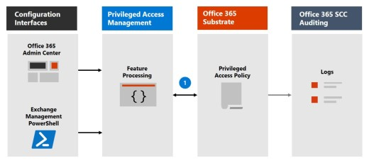

# 特権アクセス管理の詳細

特権アクセスの管理では、Office 365 の特権的管理タスクを細かくアクセス制限できます。 これは、機密データや重要な構成設定への継続的なアクセス権を持つ既存の特権管理アカウントが使用される違反から組織を保護するために役立ちます。 特権アクセス管理では、ユーザーは、高度にスコープが設定され、時間にバインドされた承認ワークフローを通じて昇格されたタスクと特権タスクを完了するために、Just-In-Time アクセスを要求する必要があります。 この構成では、機密性の高いデータや重要な構成の設定を危険にさらすことなくタスクが行えるように、ユーザーに十分なアクセス権が与えられます。 Microsoft 365 で特権アクセス管理を有効にすると、組織は無防備な特権で運用し、管理アクセスの脆弱性に対する防御層を提供できます。

統合カスタマー ロックボックスと特権アクセス管理ワークフローの簡単な概要については、このカスタマー ロックボックスと特権アクセス管理のビデオ [を参照してください](https://go.microsoft.com/fwlink/?linkid=2066800)。

## 保護レイヤー

特権アクセス管理は、Microsoft 365 セキュリティ アーキテクチャ内の他のデータとアクセス機能の保護を補完します。 セキュリティに対する統合されたレイヤー化されたアプローチの一部として特権アクセス管理を含めて、機密情報と Microsoft 365 構成設定の保護を最大化するセキュリティ モデルを提供します。 図に示すように、特権アクセス管理は、Microsoft 365 データのネイティブ暗号化と、Microsoft 365 サービスのロールベースのアクセス制御セキュリティ モデルによって提供される保護に基づいて構築されています。 [Azure AD Privileged Identity Management](/azure/active-directory/active-directory-privileged-identity-management-configure)と一緒に使用する場合、これらの 2 つの機能は、さまざまなスコープで Just-in-Time アクセスを使用してアクセス制御を提供します。

特権アクセス管理はタスク レベルで定義およびスコープ設定され、Azure AD Privileged Identity Management は複数のタスクを実行できる役割レベルで保護を適用します。 Azure AD Privileged Identity Management では、主に AD の役割および役割グループへのアクセスを管理できます。また、Microsoft 365 の特権アクセス管理はタスク レベルにのみ適用されます。

- Azure AD Privileged Identity Management を使用している間に特権 **アクセス管理を有効にする:** 特権アクセス管理を追加すると、Microsoft 365 データへの特権アクセスに対する保護と監査機能の別の詳細なレイヤーが提供されます。

- Azure AD 365 で既に特権アクセス管理を使用している間に **Privileged Identity Management Office有効にする:** Azure AD Privileged Identity Management を特権アクセス管理に追加すると、主にユーザー ロールまたは ID によって定義される Microsoft 365 外のデータへの特権アクセスを拡張できます。  

## 特権アクセス管理アーキテクチャとプロセス フロー

次の各プロセス フローは、特権アクセスのアーキテクチャと、Microsoft 365 の基点、監査、および Exchange 管理の実行空間との対話方法の概要を示しています。

### 手順 1: 特権アクセス ポリシーを構成する

[Microsoft 365](https://admin.microsoft.com)管理センターまたは Exchange Management PowerShell を使用して特権アクセス ポリシーを構成する場合は、Microsoft 365 の管理センターで、ポリシーと特権アクセス機能プロセス、およびポリシー属性を定義します。 アクティビティはセキュリティ コンプライアンス センターに &amp; 記録されます。 ポリシーが有効になり、承認の受信要求を処理する準備が整いました。

### 手順 2: アクセス要求

Microsoft [365](https://admin.microsoft.com) 管理センターまたは Exchange Management PowerShell を使用して、ユーザーは昇格されたタスクまたは特権タスクへのアクセスを要求できます。 特権アクセス機能は、構成された特権アクセス ポリシーに対して処理を行う要求を Microsoft 365 の基点に送信し、セキュリティ コンプライアンス センターのログにアクティビティ &amp; を記録します。

### 手順 3: アクセスの承認

承認要求が生成され、保留中の要求通知が承認者にメールで送信されます。 承認された場合、特権アクセス要求は承認として処理され、タスクを完了する準備が整います。 拒否された場合、タスクはブロックされ、要求者へのアクセスは許可されません。 アクセスの要求者にはメール メッセージで要求の承認または拒否が通知されます。

### 手順 4: アクセスの処理

承認された要求の場合、タスクは Exchange 管理実行空間によって処理されます。 承認は、特権アクセス ポリシーに対してチェックされ、Microsoft 365 サブストレートによって処理されます。 タスクのすべてのアクティビティがセキュリティ コンプライアンス センターに &amp; 記録されます。

## よく寄せられる質問

### Office 365 で特権アクセスを使用できる SKU は何ですか?

特権アクセス管理は、Microsoft 365 および 365 サブスクリプションとアドオンOffice種類のお客様が利用できます。 詳細 [については、「特権アクセス管理の使用を開始する](privileged-access-management-configuration.md) 」を参照してください。

### 特権アクセスが Exchange 以外の 365 Officeをサポートする場合

特権アクセス管理は、他の 365 ワークロードOffice間もなく利用できます。 詳細については [、Microsoft 365 ロードマップ](https://www.microsoft.com/microsoft-365/roadmap) を参照してください。

### 組織には 30 を超える特権アクセス ポリシーが必要ですが、この制限は増えますか?

はい。組織ごとに 30 の特権アクセス ポリシーの現在の制限を引き上げることは、機能ロードマップに含まれています。

### Office 365 で特権アクセスを管理するには、グローバル管理者である必要がありますか?

いいえ。Exchange 365 で特権アクセスを管理するアカウントには、Exchange 役割管理の役割Officeがあります。 役割管理の役割をスタンドアロン アカウントのアクセス許可として構成しない場合、グローバル管理者の役割には既定でこの役割が含まれるので、特権アクセスを管理できます。 承認者のグループに含まれるユーザーは、グローバル管理者である必要や、PowerShell で要求を確認および承認するために役割管理の役割が割り当てられている必要はありません。

### カスタマー ロックボックスに関連する特権アクセス管理の方法

[カスタマー ロックボックスを使用](/office365/admin/manage/customer-lockbox-requests) すると、Microsoft がデータにアクセスするときに、組織に対してレベルのアクセス制御が可能になります。 特権アクセス管理を使用すると、組織内のすべての Microsoft 365 特権タスクに対して詳細なアクセス制御が可能になります。

## 始める準備はいいですか。

特権 [アクセス管理用に組織の構成を開始します](privileged-access-management-configuration.md)。

## 詳細情報

[対話型ガイド: 特権アクセス管理を使用して管理者タスクを監視および制御する](https://content.cloudguides.com/guides/Privileged%20Access%20Management)
