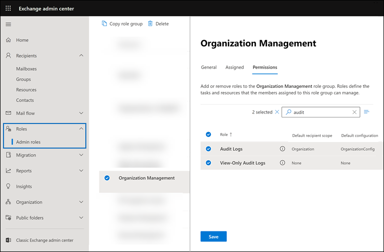

# Microsoft 365で基本監査を設定する

Microsoft 365の基本監査では、ユーザーと管理者がさまざまなMicrosoft 365サービスで実行したアクティビティの監査レコードを検索できます。 基本監査は、ほとんどのMicrosoft 365およびOffice 365組織で既定で有効になっているため、組織内のユーザーが監査ログを検索する前に行う必要のある操作は、いくつかしかありません。

この資料では、基本監査を設定するために必要な次の手順について説明します。

これらの手順には、監査レコードの生成と保存に必要な組織のサブスクリプションとユーザー ライセンスの確保、およびセキュリティ操作、IT、コンプライアンス、法務チームのチーム メンバーにアクセス許可を割り当てて監査ログを検索できるようにすることが含まれます。

詳細については[、「Microsoft 365の基本監査](auditing-solutions-overview.md#basic-audit)」を参照してください。

## 手順 1: 組織のサブスクリプションとユーザー ライセンスを確認する

基本監査のライセンスには、監査ログ検索ツールへのアクセスを提供する適切な組織のサブスクリプションと、監査レコードのログ記録と保持に必要なユーザーごとのライセンスが必要です。

監査されたアクティビティがユーザーや管理者によって実行されると、監査記録が生成され、組織の監査ログに保存されます。 基本監査では、監査レコードは 90 日間監査ログに保存され、検索可能です。

基本監査のサブスクリプションおよびライセンス要件の一覧については、「 [Microsoft 365 のソリューションの監査](auditing-solutions-overview.md#licensing-requirements)」を参照してください。

## 手順 2: 監査ログを検索するアクセス許可を割り当てる

監査ログを検索するには、Exchange Onlineの管理者および調査チームのメンバーにView-Only監査ログまたは監査ログの役割が割り当てられている必要があります。 既定では、これらの役割は Exchange 管理センターの [**アクセス許可**] ページでコンプライアンス管理役割グループまたは組織管理役割グループに割り当てられています。 Office 365およびMicrosoft 365のグローバル管理者は、Exchange Onlineの組織管理役割グループのメンバーとして自動的に追加されます。 最小限の特権レベルで監査ログを検索する権限をユーザーに付与するには、Exchange Online でカスタムの役割グループを作成し、閲覧限定の監査ログまたは監査ログの役割を追加し、この新しい役割グループのメンバーとしてユーザーを追加します。 詳細については、「[Exchange Online で役割グループを管理する](/Exchange/permissions-exo/role-groups)」を参照してください。

次のスクリーンショットは、Exchange管理センターの組織管理役割グループに割り当てられた 2 つの監査関連の役割を示しています。

## 手順 3: 監査ログを検索する

これで、Microsoft 365 コンプライアンス センターで監査ログを検索する準備ができました。

1. <https://compliance.microsoft.com>適切な監査アクセス許可が割り当てられているアカウントを使用して、に移動してサインインします。

2. コンプライアンス センターの左側のナビゲーション ウィンドウ Microsoft 365で、[**すべて表示**] をクリックし、[**監査**] をクリックします。

3. [ **監査** ] ページで、[検索] タブで次の条件を使用して **検索** を構成します。 

   

   1. **日付と時刻の範囲**。 日付と時間の範囲を選択し、その期間内に発生したイベントを表示します。 日付と時刻は、ローカル時刻で表示されます。 デフォルトでは、過去 7 日間が選択されます。
  
   2. **活動**: 検索する活動を選択します。 検索ボックスを使用して、リストに追加する活動を検索します。 監査対象アクティビティの一部については、「 [監査されたアクティビティ](search-the-audit-log-in-security-and-compliance.md#audited-activities)」を参照してください。 このボックスを空白のままにすると、すべての監査対象アクティビティのエントリが返されます。
  
   3. **ユーザー**。  このボックスをクリックして、検索結果を表示するユーザーの名前を入力します。 このボックスで選択したユーザーが実行した、選択したアクティビティの監査ログ エントリが、結果の一覧に表示されます。 組織のすべてのユーザー (およびサービス アカウント) のエントリを返すには、このボックスを空白のままにします。
  
   4. **ファイル、フォルダ、またはサイト** 指定したキーワードを含むフォルダーのファイルに関連するアクティビティーを検索するには、ファイル名またはフォルダー名の一部またはすべてを入力します。 ファイルまたはフォルダーの URL を指定することもできます。 ファイルまたはフォルダの URL を使用する場合は、絶対 URL パスを入力するか、URL の一部を入力する場合は、特殊文字やスペースを含まないようにしてください。 組織内のすべてのファイルおよびフォルダーのエントリを返すには、このボックスを空白のままにします。

4. [ **検索** ] をクリックして検索を実行します。

監査ログ検索が実行されていることを示す新しいページが表示されます。 検索が完了すると、ページに監査レコードが表示されます。 詳細なプロパティを含むフライアウト ページを表示するには、レコードをクリックします。

詳細な手順については、 [コンプライアンス センターで監査ログを検索するを](search-the-audit-log-in-security-and-compliance.md)参照してください。
