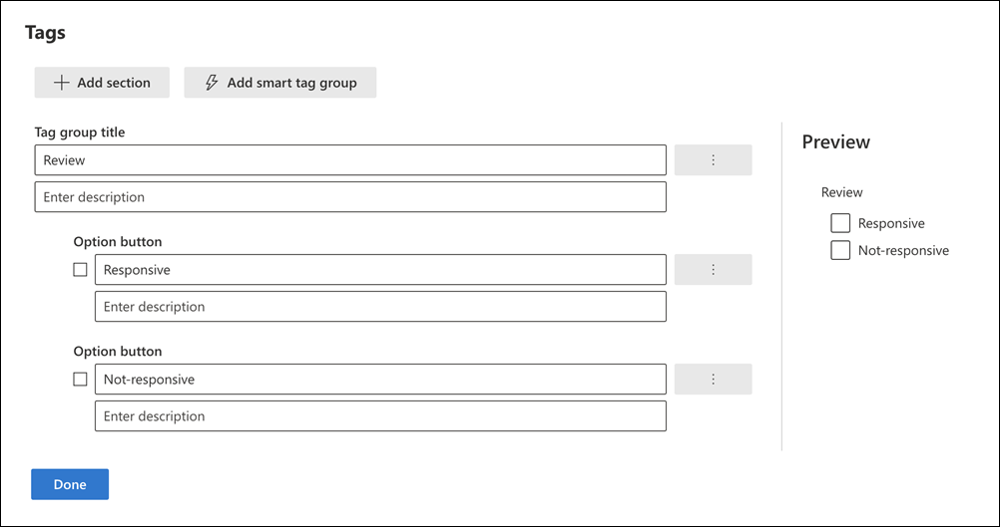
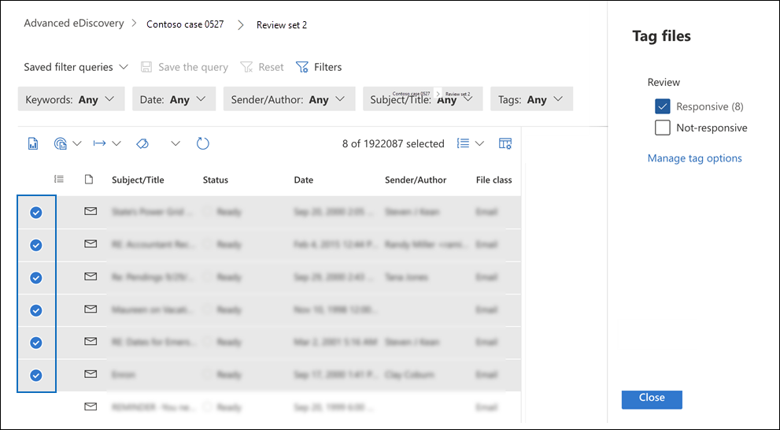

# レビュー セット内のドキュメントにタグを付Advanced eDiscoveryTag documents in a review set in Advanced eDiscovery

電子情報開示プロセスでさまざまなワークフローを完了するには、レビュー セットでコンテンツを整理することが重要です。Organizing content in a review set is important to complete various workflows in the eDiscovery process. これには、次の内容が含まれます。This includes:

- 不要なコンテンツをカリングするCulling unnecessary content

- 関連するコンテンツの識別Identifying relevant content

- 専門家または弁護士が確認する必要のあるコンテンツを識別するIdentifying content that must be reviewed by an expert or attorney

専門家、弁護士、または他のユーザーがレビュー セット内のコンテンツを確認すると、コンテンツに関連する意見をタグを使用してキャプチャできます。When experts, attorneys, or other users review content in a review set, their opinions related to the content can be captured by using tags. たとえば、不要なコンテンツを作成する目的がある場合、ユーザーは"応答しない" などのタグでドキュメントにタグを付けできます。For example, if the intent is to cull unnecessary content, a user can tag documents with a tag such as "non-responsive". コンテンツがレビューおよびタグ付けされた後、レビュー セット検索を作成して、"応答しない" としてタグ付けされたコンテンツを除外できます。After content has been reviewed and tagged, a review set search can be created to exclude any content tagged as "non-responsive". このプロセスでは、電子情報開示ワークフローの次の手順から応答しないコンテンツが削除されます。This process eliminates the non-responsive content from the next steps in the eDiscovery workflow. レビュー セットのタグ付けパネルは、ケースごとにカスタマイズして、タグがケースの意図したレビュー ワークフローをサポートします。The tagging panel in a review set can be customized for every case so that the tags support the intended review workflow for the case.

> [!NOTE]
> タグの範囲は、大文字と小文字Advanced eDiscoveryです。The scope of tags is an Advanced eDiscovery case. つまり、レビュー担当者がレビュー セット ドキュメントにタグを付けできるタグのセットは 1 つのみケースに設定できます。That means a case can only have one set of tags that reviewers can use to tag review set documents. 同じケースで異なるレビュー セットで使用する別のタグセットを設定することはできません。You can't set up a different set of tags for use in different review sets in the same case.

## タグの種類Tag types

Advanced eDiscoveryには、次の 2 種類のタグがあります。Advanced eDiscovery provides two types of tags:

- **単一選択タグ**: グループ内で 1 つのタグを選択するレビュー担当者を制限します。**Single choice tags**: Restricts reviewers to selecting a single tag within a group. このような種類のタグは、レビュー担当者が "レスポンシブ" や "応答しない" などの競合するタグを選択しない場合に役立ちます。These types of tags can be useful to ensure that reviewers don't select conflicting tags such as "responsive" and "non-responsive". 単一選択タグはラジオ ボタンとして表示されます。Single choice tags appear as radio buttons.

- **複数選択タグ**: グループ内で複数のタグを選択するレビューを許可します。**Multiple choice tags**: Allow reviews to select multiple tags within a group. これらの種類のタグは、チェック ボックスとして表示されます。These types of tags appear as checkboxes.

## タグ構造Tag structure

タグの種類に加えて、タグ パネルでのタグの整理方法の構造を使用して、タグ付けドキュメントをより直感的に作成できます。In addition to the tag types, the structure of how tags are organized in the tag panel can be used to make tagging documents more intuitive. タグはセクション別にグループ化されます。Tags are grouped by sections. レビュー セットの検索では、タグとタグセクションで検索する機能がサポートされています。Review set search supports the ability to search by tag and by tag section. つまり、レビュー セット検索を作成して、セクション内の任意のタグでタグ付けされたドキュメントを取得できます。This means you can create a review set search to retrieve documents tagged with any tag in a section.

セクション内にタグを入れ子にすることで、タグをさらに整理できます。You can further organize tags by nesting them within a section. たとえば、特権コンテンツを識別してタグ付けする目的の場合、入れ子を使用して、レビューアーがドキュメントに "Privileged" としてタグ付けし、適切な入れ子になったタグをチェックして特権の種類を選択できます。For example, if the intent is to identify and tag privileged content, nesting can be used to make it clear that a reviewer can tag a document as "Privileged" and select the type of privilege by checking the appropriate nested tag.

## タグの作成Create tags

レビュー セット内のドキュメントにタグを適用する前に、タグ構造を作成する必要があります。Before applying tags to documents in the review set, you need to create a tag structure.

1. レビュー セットを開き、コマンド バーに移動し、[クエリで **タグ付け] を選択します**。Open a review set and navigate to the command bar and select **Tag by query**.

2. タグ付けパネルで、[タグ オプションの **管理] を選択します。**In the tagging panel, select **Manage tag options**

3. [タグ **の追加] セクションを選択します**。Select **Add tag section**.

4. タグ グループのタイトルとオプションの説明を入力し、[保存] を **クリックします**。Type a tag group title and an optional description, and then click **Save**.

5. タグ グループのタイトルの横にある [トリプル ドット] ドロップダウン メニューを選択し、[追加] チェック ボックス **または** [追加] **オプション ボタンをクリックします**。Select the triple dot dropdown menu next to the tag group title and click **Add check box** or **Add option button**.

6. チェック ボックスまたはオプション ボタンの名前と説明を入力します。Type a name and description for the checkbox or option button.

7. この手順を繰り返して、新しいタグ セクション、タグ オプション、およびチェック ボックスを作成します。Repeat this process to create new tag sections, tag options, and checkboxes.

   

## タグの適用Applying tags

タグ構造を設定すると、レビュー担当者はレビュー セット内のドキュメントにタグを適用できます。With the tag structure in place, reviewers can apply tags to documents in a review set. タグを適用するには、次の 2 つの方法があります。There are two different ways to apply tags:

- タグ ファイルTag files

- クエリによるタグ付けTag by query

### タグ ファイルTag files

1 つのアイテムを選択するか、レビュー セット内の複数のアイテムを選択した場合でも、コマンドバーの [タグ ファイル] をクリックして、選択内容にタグを適用できます。Whether you select a single item or several items in a review set, you can apply tags to their selection by clicking **Tag files** in the command bar. タグパネルでタグを選択すると、選択したドキュメントに自動的に適用されます。In the tagging panel, you can select a tag and it is automatically applied to the selected documents.

> [!NOTE]
> タグは、アイテムのリスト内の選択したアイテムにのみ適用されます。Tags will be applied only to selected items in the list of items.

### クエリによるタグ付けTag by query

クエリによるタグ付けでは、現在レビュー セットに適用されているフィルター クエリによって表示されるアイテムにタグを適用できます。Tagging by query lets you apply tags to all items displayed by a filter query that's currently applied in the review set.

1. レビュー セット内のすべてのアイテムの選択を解除し、コマンド バーに移動し、[クエリで **タグ付け] を選択します**。Unselect all items in the review set and go to the command bar and select **Tag by query**.

2. タグ付けパネルで、適用するタグを選択します。In the tagging panel, select the tag that you want to apply.

3. [タグ **の選択] ドロップダウン** の下に、タグを適用するアイテムを指定する 3 つのオプションがあります。Under the **Tag selection** dropdown, there are three options that dictate which items to apply the tag to.

   - **適用されたクエリに一致するアイテム**: フィルター クエリ条件に一致する特定のアイテムにタグを適用します。**Items that match applied query**: Applies tags to specific items that match the filter query conditions.

   - **関連付けられたファミリ アイテム** を含める: フィルター クエリ条件と関連付けられたファミリ アイテムに一致する特定のアイテムにタグを適用します。**Include associated family items**: Applies tags to specific items that match the filter query conditions and their associated family items. *ファミリ アイテムは* 、同じ FamilyId メタデータ値を共有するアイテムです。*Family items* are items that share the same FamilyId metadata value.  

   - **関連付けられた会話アイテムを** 含める: フィルター クエリの条件と関連付けられた会話アイテムに一致するアイテムにタグを適用します。**Include associated conversation items**: Applies tags to items that match the filter query conditions and their associated conversation items. *会話アイテムは* 、同じ ConversationId メタデータ値を共有するアイテムです。*Conversation items* are items that share the same ConversationId metadata values.

   

4. [タグ **付けジョブの開始] をクリック** して、タグ付けジョブをトリガーします。Click **Start tagging job** to trigger the tagging job.

## タグ フィルターTag filter

レビュー セットのタグ フィルターを使用して、アイテムのタグ付け方法に基づいてクエリ結果からアイテムをすばやく検索または除外します。Use the tag filter in review set to quickly find or exclude items from the query results based on how an item is tagged. 

1. [フィルター **] を** 選択してフィルター パネルを展開します。Select **Filters** to expand the filter panel.

2. Item プロパティを **選択して展開します**。Select and expand **Item properties**.

3. 下にスクロールして Tag という名前のフィルター **を見つけ**、チェック ボックスをオンにして、[完了] を **クリックします**。Scroll down to find the filter named **Tag**, select the checkbox, and then click **Done**.

4. 特定のタグを持つアイテムをクエリに含めるか除外するには、次のいずれかを実行します。To include or exclude items with a specific tag from a query, do one of the following:

   - **アイテムを含** める: タグの値を選択し、ドロップダウン メニューで **[任意に** 等しい] を選択します。**Include items**: Select the tag value and select **Equal any of** in the dropdown menu.

      またはOr

   - **アイテムを除外** する: タグの値を選択し、ドロップダウン **メニューで [なし]** を選択します。**Exclude items**: Select the tag value and select **Equals none of** in dropdown menu.

     

> [!NOTE]
> タグ フィルターがタグ構造に対する最新の変更を表示するには、必ずページを更新してください。Be sure to refresh the page to ensure that the tag filter displays the latest changes to the tag structure.
