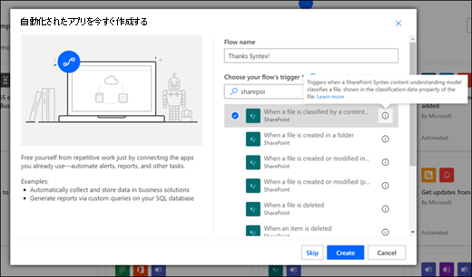

# Microsoft SharePoint Syntexのドキュメント理解モデルを適用するApply a document understanding model in Microsoft SharePoint Syntex

 

> [!VIDEO https://www.microsoft.com/videoplayer/embed/RE4CSoL]

 

ドキュメント理解モデルを公開した後、、Microsoft 365 テナントの1つまたは複数の SharePoint ドキュメントライブラリに適用できます。After publishing your document understanding model, you can apply it to one or more SharePoint document library in your Microsoft 365 tenant.

> [!NOTE]
> ユーザーがアクセスできるドキュメントライブラリにのみモデルを適用できます。You are only able to apply the model to document libraries that you have access to.

## モデルをドキュメントライブラリに適用します。Apply your model to a document library.

モデルをSharePointドキュメントライブラリに適用するには、次の操作を行います。To apply your model to to a SharePoint document library:

1. モデルのホームページの [**ライブラリにモデルを適用する** ]タイルの [**モデルの発行**]を選びます。On model home page, on the **Apply model to libraries** tile, select **Publish model**. または、[**このモデルのあるライブラリ**]セクション の [**+ ライブラリの追加**] を選択します。Or you can select  **+Add Library** in the **Libraries with this model** section.  

     

2. モデルを適用するドキュメントライブラリが含まれている SharePoint サイトを選択できます。You can then select the SharePoint site that contains the document library that you want to apply the model to. リストにサイトが表示されない場合は、検索ボックスを使用して検索します。If the site does not show in the list, use the search box to find it. 

     

    > [!NOTE]
    > モデルを適用しようとしているドキュメントライブラリへの *リスト管理* 許可を持っているかまたは、*編集* 権限を持っていなければなりません。You must have *Manage List* permissions or *Edit* rights to the document library you are applying the model to. 

3. サイトを選択した後、モデルを適用するドキュメントライブラリを選択します。After selecting the site, select the document library to which you want to apply the model. このサンプルでは、*Contoso ケーストラッキング* サイトから *ドキュメント* ドキュメントライブラリ を選びます。In the sample, select the *Documents* document library from the *Contoso Case Tracking* site. 

     

4. モデルは、コンテンツタイプに関連付けられているため、ライブラリに適用すると、コンテンツタイプと、列として表示されている抽出したラベルのビューが追加されます。Since the model is associated to a content type, when you apply it to the library it will add the content type and its view with the labels you extracted showing as columns. このビューは既定ではライブラリの既定のビューですが、必要に応じて、[**詳細 設定**] を選択し、[**既定のビューとして設定**] 選択解除して、既定のビューから外すことができます。This view is the library's default view by default, but you can optionally choose to not have it be the default view by selecting **Advanced settings** and deselecting **Set this new view as default**. 

     

5. モデルをライブラリに適用するには、[ **追加** ] を選択します。Select **Add** to apply the model to the library. 
6. モデルのホームページの [**このモデルのある の ライブラリ**] セクションに、表示されている SharePoint サイトの URL を確認します。On the model home page, in the **Libraries with this model** section, you should see the URL to the SharePoint site listed. 

     

7. ドキュメントライブラリに移動し、モデルのドキュメントライブラリビューに移動していることを確認します。Go to your document library and make sure you are in the model's document library view. ドキュメント ライブラリ名の横にある [情報] ボタンを選択すると、ドキュメント ライブラリにモデルが適用されていることを示すメッセージが表示されます。Notice that if you select the information button next to the document library name, a message notes that the document library has a model applied to it.

      

    [**アクティブなモデルの表示**] を選択すると、ドキュメント ライブラリに適用されているモデルに関する詳細を表示できます。You can the select **View active models** to see details about any models that are applied to the document library.

8. [**アクティブなモデル**] ウィンドウで、ドキュメント ライブラリに適用されているモデルを確認できます。In the **Active models** pane, you can see the models that are applied to the document library. モデルを選択すると、モデルの説明、モデルの発行者、およびモデルが分類するファイルに保持ラベルを適用するかどうかなど、モデルに関する詳細が表示されます。Select a model to see more details about it, such as a description of the model, who published the model, and if the model applies a retention label to the files it classifies.

    ![[アクティブなモデル] ウィンドウ](../media/content-understanding/active-models.png)  

モデルをドキュメントライブラリに適用したら、サイトにドキュメントをアップロードし、結果を確認できます。After applying the model to the document library, you can begin uploading documents to the site and see the results.

モデルは、モデルに関連付けられているすべてのファイルを特定し、ビューに表示します。The model identifies any files with model’s associated content type and lists them in your view. モデルにエクストラクターがある場合は、各ファイルから抽出したデータの列が表示されます。If your model has any extractors, the view displays columns for the data you are extracting from each file.

### ドキュメントライブラリに既に存在するファイルにモデルを適用するApply the model to files already in the document library

適用されたモデルが、ドキュメントライブラリにアップロードされたすべてのファイルを処理している場合は、次の操作を行って、モデルが適用される前に、ドキュメントライブラリ内に既に存在していたファイル上で実行することもできます。While an applied model processes all files uploaded to the document library after it is applied, you can also do the following to run the model on files that already exists in the document library prior to the model being applied:

1. ドキュメントライブラリで、モデルで処理するファイルを選択します。In your document library, select the files that you want to be processed by your model.
2. ファイルを選択すると、 [ドキュメントライブラリ] リボンに **分類および抽出** が表示されます。After selecting your files, **Classify and extract** will appear in the document library ribbon. **分類および抽出** を選択します。Select **Classify and extract**.
3. 選択したファイルが処理されるキューに追加されます。The files you selected will be added to the queue to be processed.

        

> [!NOTE]
> 個々のファイルをライブラリにコピーしてモデルに適用することはできますが、フォルダーに適用することはできません。You can copy individual files to a library and apply them to a model, but not folders.

### [分類日] フィールドThe Classification Date field

SharePoint Syntex 文書理解モデルまたはフォーム処理モデルをドキュメント ライブラリに適用すると、ライブラリ スキーマに <b> 分類日 </b> フィールドが含まれます。When a SharePoint Syntex document understanding or form processing model is applied to a document library, a <b> Classification date </b> field is included in the library schema. 既定では、このフィールドは空ですが、ドキュメントがモデルによって処理され分類されると、完了日時のタイム スタンプでこのフィールドが更新されます。By default this field is empty, but when documents are processed and classified by a model, this field is updated with a date-time stamp of completion. 

   ![[分類日] 列](../media/content-understanding/class-date-column.png)  

[分類日] フィールドは、Syntex のコンテンツの解釈モデルがファイルの処理を完了し、[分類日] フィールドを更新したあとで、[<b>ファイルがコンテンツの解釈モデルで分類されたとき</b>トリガー](/connectors/sharepointonline/#when-a-file-is-classified-by-a-content-understanding-model) が Power Automate フローを実行するのに使用されます。The Classification date field is used by the [<b>When a file is classified by a content understanding model</b> trigger](/connectors/sharepointonline/#when-a-file-is-classified-by-a-content-understanding-model) to run a Power Automate flow after a Syntex content understanding model has finished processing a file and updated the "Classification date" field.

    

<b>ファイルがコンテンツの解釈モデルで分類されたとき</b>トリガーはさらに、ファイルから抽出された情報を使用して、別のワークフローを開始するためにも使用できます。The <b>When a file is classified by a content understanding model</b> trigger can then be used to start another workflow using any  extracted information from the file.

## 関連項目See Also
[分類子を作成するCreate a classifier](create-a-classifier.md)

[抽出子を作成するCreate an extractor](create-an-extractor.md)

[ドキュメント理解の概要Document Understanding overview](document-understanding-overview.md)
