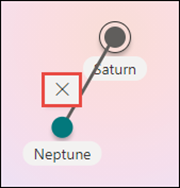

# 新規トピックを作成する 

ビバ トピックでは、インデックス作成によって検出されない場合や、AI テクノロジがトピックとして確立するのに十分な証拠が見つからなかった場合に、新しいトピックを作成できます。

> [!Note] 
> AI によって収集されるトピックの情報はセキュリティでトリミングされますが、手動で作成したトピックのトピックの説明とユーザー情報は、トピックを表示する権限を持つすべてのユーザーに表示されます。 

## Requirements

新しいトピックを作成するには、次の必要があります。
- Viva Topics ライセンスを持っている。
- トピックを作成または編集 [**できるユーザーに対するアクセス許可を持つ**](./topic-experiences-user-permissions.md)。 ナレッジ管理者は、ビバ トピックのアクセス許可設定でユーザーにこのアクセス許可を付与できます。 

> [!Note] 
> トピック センター (ナレッジ マネージャー) でトピックを管理する権限を持つユーザーには、トピックを作成および編集するためのアクセス許可が既に付与されています。

## トピックを作成するには

2 つの場所から新しいトピックを作成できます。

- トピック センターのホーム ページ: トピックを作成または編集できるユーザー (投稿者) を持つライセンスユーザーは、[新しい] メニューを選択<b></b>して [トピック] ページを選択して、トピック センターから新しいトピックを<b>作成できます</b>。  

       

- [トピックの管理] ページ: トピックの管理権限を持つライセンスユーザー (ナレッジ マネージャー) は、[トピック センター] の [トピックの管理] ページで [新しいトピック] ページを選択して、新しいトピックを<b>作成できます</b>。  

       

### 新しいトピックを作成するには、次の方法を使用します。

1. [トピックの管理] ページのリボンから新しいトピック ページを作成するオプションを選択します。

2.   [この **トピックに名前を付け** ] セクションに、新しいトピックの名前を入力します。

       

3. [代替 <b>名] セクション</b> で、トピックが参照される可能性があるその他の名前を入力します。 

       
4. [説明 <b>] セクション</b> で、トピックについて説明する文を 2 つ入力します。 

     

4. [ピン <b>留めされたユーザー</b> ] セクションでは、ユーザーを "ピン留め" して、トピックの件名の専門家として表示できます。 まず、[新しいユーザーの追加] ボックス<b></b>に名前またはメール アドレスを入力し、検索結果から追加するユーザーを選択します。 ユーザー カードの [リストから削除] アイコン<b></b>を選択して、ピン留めを解除することもできます。 ユーザーをドラッグして、ユーザーのリストが表示される順序を変更できます。
 
     

5. [ピン留 <b>めされたファイルとページ</b> ] セクションでは、トピックに関連付けられているファイルまたは SharePoint サイト ページを追加または "ピン留め" できます。

    
 
    新しいファイルを追加するには、[<b></b>追加] を選択し、頻繁またはフォローしているサイトから SharePoint サイトを選択し、サイトのドキュメント ライブラリからファイルを選択します。

    [リンクから] オプション <b>を使用して</b> 、URL を指定してファイルまたはページを追加することもできます。 

    > [!Note] 
    > 追加するファイルとページは、同じ Microsoft 365 テナント内にある必要があります。 トピックの外部リソースへのリンクを追加する場合は、手順 8 のキャンバス アイコンを使用して追加できます。

6.  [ <b>関連サイト]</b> セクションには、トピックに関する情報を持つサイトが表示されます。 

    ![[関連サイト] セクション](../media/knowledge-management/related-sites.png) 

    [追加] を選択してからサイトを<b></b>検索するか、[頻繁なサイト] または [最近使用したサイト] の一覧からサイトを選択して、関連サイトを追加できます。 
    
     

7. [ <b>関連トピック] セクション</b> には、トピック間に存在する接続が表示されます。 別のトピックに接続を追加するには、[関連するトピックに<b></b>接続する] ボタンを選択し、関連するトピックの名前を入力し、検索結果から接続を選択します。 

      

    次に、トピックの関連付け方法について説明し、[更新] を選択 <b>します</b>。 

     

   追加した関連トピックは、接続されているトピックとして表示されます。

     

   関連するトピックを削除するには、削除するトピックを選択し、[トピックの削除] <b>アイコンを選択</b> します。 
 
      

   次に、[削除] <b>を選択します</b>。 

     
     
 

8. また、短い説明の下にあるキャンバス アイコンを選択して、静的なアイテム (テキスト、画像、リンクなど) をページに追加することもできます。 選択すると SharePoint ツールボックスが開き、そこからページに追加するアイテムを選択できます。

     

9. [発行 **] を** 選択して変更を保存します。 

ページを発行すると、トピック名、代替名、説明、ピン留めされたユーザーが、トピックを表示するライセンスを持つすべてのユーザーに表示されます。 特定のファイル、ページ、およびサイトは、ビューアーがアイテムに対して 365 のアクセス許可を持Office場合にのみトピック ページに表示されます。 

## 関連項目

