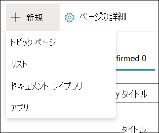

# 新しいトピックを作成する (プレビュー)Create a new topic (Preview)

> [!Note] 
> この記事の内容は、Project の Private Preview 用です。The content in this article is for Project Cortex Private Preview. [Project Cortexについてもっと理解しよう](https://aka.ms/projectcortex)[Find out more about Project Cortex](https://aka.ms/projectcortex).

トピック エクスペリエンスでは、インデックス作成によって検出されていない場合や、AI テクノロジがトピックとして確立するのに十分な証拠を見つけなかった場合に、新しいトピックを作成できます。In Topic Experiences, you can create a new topic if one was not discovered through indexing or if the AI technology did not find enough evidence to establish it as a topic.

## 要件Requirements

新しいトピックを作成するには、次の必要があります。To create a new topic, you need to:
- トピック エクスペリエンス のライセンスを持っている。Have a Topic Experiences license.
- トピックを作成または編集 [**できるユーザーへのアクセス許可を持っている**](https://docs.microsoft.com/microsoft-365/knowledge/topic-experiences-user-permissions)。Have permissions to [**Who can create or edit topics**](https://docs.microsoft.com/microsoft-365/knowledge/topic-experiences-user-permissions). ナレッジ管理者は、サポート技術情報のトピックのアクセス許可の設定で、ユーザーにこのアクセス許可を付与できます。Knowledge admins can give users this permission in the Knowledge Network topic permissions settings. 

> [!Note] 
> トピック センター (ナレッジ マネージャー) でトピックを管理する権限を持つユーザーには、トピックを作成および編集する権限が既に付与されています。Users who have permission to manage topics in the Topic center (knowledge managers) already have permissions to create and edit topics.

## 新しいトピックを作成するには:To create a new topic:

1. [トピック センター] ページで、[新規] を選択 **し**、[トピック ページ] **を選択します**。On the Topic center page, select **New**, then select **Topic Page**. トピック センターで [新規]オプションを表示できない場合は、必要なアクセス許可が付与されていない可能性があります。If you are not able to see the **New** option in the Topic Center, you may not have the required permissions.

    

2. 新しいトピック ページで、新しいトピック テンプレートの情報を入力できます。On the new topic page, you can fill in the information on the new topic template:

    - [この **トピックの名前]** セクションで、新しいトピックの名前を入力します。In the **Name this topic** section, type the name of the new topic.
    
    - [代替 **名] セクション** で、トピックの参照にも使用される名前または頭字語を入力します。In the **Alternate names** section, type names or acronyms that are also used to refer to the topic.
    
    - [簡単 **な説明] セクション** で、トピックの 1 文または 2 文の説明を入力します。In the **Short description** section, type a one or two sentence description of the topic. このテキストは、関連付けられたトピック カードに使用されます。This text will be used for the associated topic card.
    
    - [人 **] セクション** で、トピックの対象分野の専門家の名前を入力します。In the **People** section, type the names of subject matter experts for the topic. トピックに手動で追加したユーザーは、トピック ページにピン留めされたユーザー **として表示されます**。People you manually add to the topic will display in the topic page as **Pinned people**.
    
    - [ファイル **とページ**] セクションで[追加] を選択し、次のページで関連付けられた OneDrive ファイルまたは SharePoint Online ページを選択できます。In the **Files and pages** section, select **Add** and then on the next page you can select associated OneDrive files or SharePoint Online pages.
    
    - [サイト] **セクションで** 、[追加] を **選択します**。In the **Sites** section, select **Add**. 表示される  **[サイト** ] ウィンドウで、トピックに関連付けられているサイトを選択します。In the  **Sites** pane that displays, select the sites that are associated to the topic.

    
    
3. テキスト、画像、Web パーツ、リンクなど、他のコンポーネントをページに追加する必要がある場合は、ページの中央にあるキャンバス アイコンを選択して見つけて追加します。If you need to add other components to the page, such as text, images, web parts, links, etc., select the canvas icon in the middle of the page to locate and add them.

    

4. 完了したら、[発行] を **選択** してトピック ページを発行します。When you are done, select **Publish** to publish the topic page. 発行されたトピック ページが [ページ] タブ **に表示** されます。Published topic pages will display in the **Pages** tab.

記事を発行すると、トピック名、代替名、説明、ピン留めされたユーザーが、記事を表示するライセンスを持つすべてのユーザーに表示されます。After you publish the article, the topic name, alternate name, description, and pinned people will display to all licensed users who view the article. ファイル、ページ、およびサイトは、閲覧者がアイテムに対する 365 Officeを持つ場合にのみ、トピック ページに表示されます。Files, pages, and sites will only appear in the topic page if the viewer has Office 365 permissions to the item. 

新しいトピック ページは、ナレッジ ネットワーク対応の Web パーツ *で構成されています*。The new topic page is made up of web parts that are *knowledge network aware*. つまり、AI がトピックに関するより多くの情報を収集すると、これらの Web パーツ内の情報が更新され、ユーザーにとってページの使い分けをより便利にできます。This means that as AI gathers more information on the topic, the information in these web parts will be updated with suggestions to make the page more useful to users.

## 関連項目See also

  

