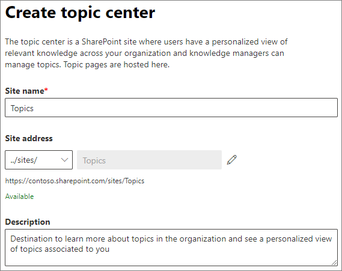

# Microsoft 365 でのトピック エクスペリエンスのセットアップ

 

> [!VIDEO https://www.microsoft.com/videoplayer/embed/RE4LBp7]  

 

Microsoft 365 管理センターを使用して、トピックエクスペリエンスを設定および [構成できます](topic-experiences-overview.md)。 

環境内でトピックをセットアップおよび構成する最善の方法を計画することが重要です。 この記事の手順を開始 [する前に、「](plan-topic-experiences.md) トピックエクスペリエンスを計画する」を必ずお読みください。

Microsoft 365 管理センターにアクセスしてトピックエクスペリエンスを設定するには、全体管理者または SharePoint 管理者である必要があります。

## トピック エクスペリエンスを設定する

Microsoft 365 でトピック エクスペリエンスを設定するには

1. Microsoft [365 管理センターで、セットアップ] **を選択し**、[ファイルとコンテンツ] **セクションを表示** します。
2. [ファイルと **コンテンツ] セクションで** 、[ユーザーをナレッジ **に接続する] をクリックします**。

     

3. [知識 **へのユーザーの** 接続] ページで、[開始 **]** をクリックしてセットアップ プロセスの手順を説明します。

     

4. [ナレッジ **ネットワークでトピックを検索する方法** の選択] ページで、トピックの検出を構成します。 **[SharePoint トピック ソース** の選択] セクションで、検出時にトピックのソースとしてクロールする SharePoint サイトを選択します。 次から選択します。
    - **すべてのサイト**: 組織内のすべての SharePoint サイト。 これには、現在および将来のサイトが含まれます。
    - **選択したサイトを除く** すべてのサイト: 除外するサイトの名前を入力します。  検出からオプトアウトするサイトの一覧をアップロードできます。 将来作成されるサイトは、トピック検出のソースとして含まれます。 
    - **選択したサイト** のみ: 含めるサイトの名前を入力します。 サイトの一覧をアップロードできます。 将来作成されるサイトは、トピック検出のソースとして含まれません。
    - **サイトなし**: SharePoint サイトを含めない。

     
   
5. [名前 **で除外するトピック] セクション** では、トピックの検出から除外するトピックの名前を追加できます。 機密情報がトピックとして含まれるのを防ぐには、この設定を使用します。 以下のオプションがあります:
    - **トピックを除外しない** 
    - **名前でトピックを除外する**

     

    (ナレッジ マネージャーは、検出後にトピック センターのトピックを除外できます)。

    #### トピックを名前で除外する方法    

    トピックを除外する必要がある場合は、[名前でトピックを除外する] を選択した後、.csv テンプレートをダウンロードし、検出結果から除外するトピックの一覧で更新します。

     

    CSV テンプレートで、除外するトピックに関する次の情報を入力します。

    - **[名前**]: 除外するトピックの名前を入力します。 これを行うには 2 つの方法があります。
        - 完全一致: 正確な名前または頭字語 *(Contoso* や ATL など) *を含めできます*。
        - 部分一致: 特定の単語を含むすべてのトピックを除外できます。  たとえば、円弧 *には*、円弧の円、円弧の円弧、トレーニング用の円弧など、単語の円弧を含むすべてのトピック *が除外されます*。 ただし、Architecture など、単語の一部としてテキストが含まれるトピックは除外されない点に *注意してください*。
    - **略式 (省略可能)**: 頭字語を除外する場合は、略語の略語を入力します。
    - **MatchType-Exact/Partial**: 入力した名前が完全一致型か部分一致型 *かを入力します*。

    .csv ファイルを完成して保存したら、[参照] を **選択して** 検索し、選択します。
    
    [**次へ**] を選択します。

6. [トピック **を表示できるユーザーと** トピックを表示できる場所] ページで、トピックの可視性を構成します。 [ナレッジ **ネットワーク** の設定でトピックを表示できるユーザー] で、強調表示されているトピック、トピック カード、検索でのトピック回答、トピック ページなど、トピックの詳細にアクセスできるユーザーを選択します。 次のものが選択できます。
    - **組織内のすべてのユーザー**
    - **選択したユーザーまたはセキュリティ グループのみ**
    - **だれも**

      

 > [!Note] 
 > この設定では組織内の任意のユーザーを選択することができますが、トピック エクスペリエンス のライセンスが割り当てられているユーザーだけがトピックを表示できます。

7. [トピック **管理のアクセス許可]** ページで、トピックを作成、編集、または管理できるユーザーを選択します。 [トピック **を作成および編集できるユーザー** ] セクションで、次の項目を選択できます。
    - **組織内のすべてのユーザー**
    - **選択したユーザーまたはセキュリティ グループのみ**
    - **だれも**

     

8. [トピック **を管理できるユーザー] セクション** で、次の項目を選択できます。
    - **組織内のすべてのユーザー**
    - **選択したユーザーまたはセキュリティ グループのみ**

     

    [**次へ**] を選択します。

9. [ **トピック センターの** 作成] ページでは、トピック ページを表示し、トピックを管理できるトピック センター サイトを作成できます。 [サイト **名] ボックス** に、トピック センターの名前を入力します。 必要に応じて、[説明] ボックスに簡単な説明 **を入力** できます。 

[**次へ**] を選択します。

     

10. [ **確認と完了**] ページで、選択した設定を確認して、変更を行うことができます。 選択内容に問題がない場合は、[**ライセンス認証**]を行います。

11. サポート **技術情報ネットワークがアクティブ** 化されたページが表示され、選択したサイトのトピックの分析とナレッジ センター サイトの作成がシステムによって開始されるのを確認します。 [**完了**] を選択します。

12. [Connect people to knowledge] (知識への接続 **) ページに戻** ります。 このページでは、[ **管理** ] を選択して、構成設定に変更を加えることができます。 

        

## ライセンスを割り当てる

トピック エクスペリエンスを構成したら、トピック エクスペリエンスを使用するユーザーにライセンスを割り当てる必要があります。 ライセンスを持つユーザーだけが、ハイライト、トピック カード、トピック ページ、トピック センターなどのトピックに関する情報を表示できます。 

ライセンスを割り当てる

1. Microsoft 365 管理センターで、**[ユーザー** ]、[**アクティブなユーザー**]の順にクリックします。

2. ライセンスを付与するユーザーを選択し、[ **製品ライセンスの管理**] をクリックします。

3. [**もっと割り当てる**] を選択します。

4. [ライセンス **] で**、[トピックエクスペリエンス] **を選択します**。

5. [ **アプリ]** で、[ **インデックス付き Graph コネクタ検索]** と [トピック エクスペリエンス] の **両方が** 選択されている必要があります。

    > [!div class="mx-imgBorder"]
    > 

6. **[変更の保存]** をクリックします。

## トピック エクスペリエンスを管理する

トピックエクスペリエンスを設定したら [、Microsoft 365](https://admin.microsoft.com/AdminPortal#/featureexplorer/csi/KnowledgeManagement)管理センターでセットアップ中に選択した設定を変更できます。 次のリファレンスを参照してください。

- [Microsoft 365 でトピックの検出を管理する](topic-experiences-discovery.md)
- [Microsoft 365 でトピックの表示を管理する](topic-experiences-knowledge-rules.md)
- [Microsoft 365 でトピックのアクセス許可を管理する](topic-experiences-user-permissions.md)
- [Microsoft 365 のトピック センターの名前を変更する](topic-experiences-administration.md)

## 関連項目

[トピック エクスペリエンスの概要](topic-experiences-overview.md)
