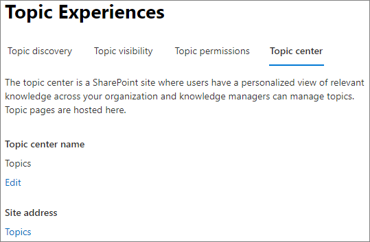

# トピック センターの概要Topic center overview

Microsoft のトピックでは、トピック センターは、組織の知識の中心として機能する最新の SharePoint サイトです。In Microsoft Viva Topics, the topic center is a Modern SharePoint site that serves as a center of knowledge for your organization. これは、Microsoft 365 管理センター [の  多くのトピック] のセットアップ時に作成されます。It's created during [Viva Topics setup](set-up-topic-experiences.md) in the Microsoft 365 admin center.

トピック センターには、ライセンスを取得したユーザー全員が接続先のトピックを表示できる、Topics Web パーツを含む既定のホーム ページがあります。The topic center has a default home page with the Topics web part where all licensed users can see the topics to which they have a connection. 

トピックを表示できるライセンスを持つすべてのユーザーはトピック センターにアクセスできます。一方、ナレッジ マネージャーは [トピックの管理] ページを使用してトピック **を管理** できます。While all licensed users who can view topics will have access to the topic center, knowledge managers can al manage topics through the **Manage topics** page. [トピックの管理] タブは、トピックの管理権限を持つ **ユーザーにのみ** 表示されます。The Manage topics tab will only display to users who have the **Manage topics** permissions. 

## トピック センターの場所Where is my Topic center

トピック センターは、Topics のセットアップ時に作成されます。The topic center is created during Viva Topics setup. セットアップが完了すると、管理者はトピック センターの管理ページで URL [を確認できます](https://docs.microsoft.com/microsoft-365/knowledge/topic-experiences-administration#to-access-topics-management-settings)。After setup completes, an admin can find the URL on the [Topic center management page](https://docs.microsoft.com/microsoft-365/knowledge/topic-experiences-administration#to-access-topics-management-settings).

1. Microsoft 365 管理センターで、[設定] をクリックし、[組織の設定]**をクリックします**。In the Microsoft 365 admin center, click **Settings**, then **Org settings**.
2. [サービス] **タブで** 、[トピックエクスペリエンス] **をクリックします**。On the **Services** tab, click **Topic Experiences**.

      

3. [トピック センター **] タブを選択** します。[ **サイトアドレス]** の下に、トピック センターへのリンクがあります。Select the **Topic center** tab. Under **Site address** is a link to your Topic center.

      

## ホーム ページHome page

 

> [!VIDEO https://www.microsoft.com/videoplayer/embed/RE4LAhZ]  

 

トピック センターのホーム ページでは、接続している組織内のトピックを確認できます。On the topic center home page, you can see the topics in your organization to which you have a connection.

- 推奨される接続 - これらのトピックに記載されている **トピックが表示されます。正しい場合は、**.Suggested connections - You will see topics listed under **We've listed you on these topics. Did we get it right?**. これらのトピックでは、AI を通じてトピックへの接続が提案されています。These are topics in which your connection to the topic has been suggested through AI. たとえば、関連ファイルまたはサイトの作成者である場合があります。For example, you may be an author of a related file or site. トピックの関連する人物としてリストに残す必要がある場合は、確認を求めるメッセージが表示されます。You are asked to confirm that you should stay listed as a related person for the topic.

     
 
- 確認済み接続 - トピック ページにピン留めされているトピック、またはトピックへの推奨接続を確認したトピックです。Confirmed connections - These are topics in which you are pinned on the topic page or you've confirmed a suggested connection to the topic. 推奨される接続を確認すると、トピックは提案されたセクションから確認済みセクションに移動します。Topics will move from the suggested to confirmed section when you confirm a suggested connection.
 
     

ユーザーがトピックへの接続を確認すると、トピック ページを編集して接続を管理できます。Once a user confirms their connection to a topic, the user can make edits to the topic page to curate their connection. たとえば、トピックへの接続に関する詳細な情報を提供できます。For example, they can provide more information about their connection to the topic.

## トピックの管理ページManage topics page

トピック センターの[トピックの管理] セクションで作業するには、ナレッジマネージャーの役割に必要な"トピックの管理" 権限が必要です。To work in the **Manage Topics** section of Topic center, you need to have the required *Manage topics* permissions needed for the knowledge manager role. 管理者は、ナレッジ管理のセットアップ中にこれらのアクセス許可をユーザーに割り当てるか、管理者が後で Microsoft 365 管理センターを使用して新しいユーザーを追加できます。Your admin can assign these permissions to users during [knowledge management setup](set-up-topic-experiences.md), or new users can be [added afterwards](topic-experiences-knowledge-rules.md) by an admin through the Microsoft 365 admin center.

[トピックの管理] ページで、トピック ダッシュボードには、指定したソースの場所から識別された、アクセス権を持つすべてのトピックが表示されます。On the Manage Topics page, the topic dashboard shows all the topics, you have access to, that were identified from your specified source locations. 各トピックには、トピックが検出された日付が表示されます。Each topic will show the date the topic was discovered. トピックの管理権限が **割り** 当てられたユーザーは、未確認のトピックを確認して、次の項目を選択できます。A user who was assigned **Manage topics** permissions can review the unconfirmed topics and choose to:
- トピックの確認: トピックに関連するファイルとページにアクセスできるユーザーに対してトピックを強調表示し、関連するトピック カードとトピック ページを表示できます。Confirm the topic: Highlights the topic to users who have access to the files and pages related to the topic, and lets them see the associated topic card and topic page.
- トピックの公開: 最初に識別されたトピックの品質を向上させるためにトピック情報を編集し、トピックにアクセスできるすべてのユーザーにトピックを強調表示します。Publish the topic: Edit the topic information to improve the quality of the topic that was initially identified, and highlights the topic to all users who have view access to topics. 
- トピックを拒否する: トピックをユーザーが使用できなくします。Reject the topic: Makes the topic not available to users. トピックは [却下済み] タブ **に移動** され、必要に応じて後で確認できます。The topic is moved to the **Rejected** tab and can be confirmed later if needed. 

> [!Note] 
> トピック [の管理ページの](manage-topics.md) トピック管理の詳細については、「トピックの管理」を参照してください。See [Manage topics](manage-topics.md) for more details about topic managing topics in the Manage topics page.

## トピックを作成または編集するCreate or edit a topic

トピックの作成と **編集の権限がある** 場合は、次の方法を実行できます。If you have **Create and edit topics** permissions, you can:

- [既存のトピックを編集](edit-a-topic.md)する : 検出によって作成された既存のトピック ページを変更できます。[Edit existing topics](edit-a-topic.md): You can make changes to existing topic pages that were created through discovery.
- [新しいトピック](create-a-topic.md)を作成する : 検出によって見つからなかったトピックや、AI ツールでトピックを作成するのに十分な証拠が見つからなかった場合に、新しいトピックを作成できます。[Create new topics](create-a-topic.md): You can create new topics for ones that were not found through discovery, or if AI tools did not find enough evidence to create a topic.

## 関連項目See also

  

