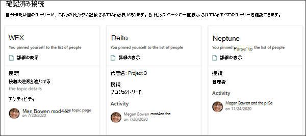

# Microsoft Viva Topics のトピック センターの概要Topic center overview in Microsoft Viva Topics

Microsoft Viva Topics では、トピック センターは、組織SharePoint知識の中心として役立つ最新のサイトです。In Microsoft Viva Topics, the topic center is a modern SharePoint site that serves as a center of knowledge for your organization. これは、管理センター[でビ](set-up-topic-experiences.md)バ トピックのセットアップ中Microsoft 365作成されます。It's created during [Viva Topics setup](set-up-topic-experiences.md) in the Microsoft 365 admin center.

トピック センターには、ライセンスを取得したユーザー全員が、接続先のトピックを表示できる Topics Web パーツを含む既定のホーム ページがあります。The topic center has a default home page with the **Topics** web part where all licensed users can see the topics to which they have a connection. 

トピックを表示できるライセンスを持つすべてのユーザーがトピック センターにアクセスできる一方で、ナレッジ マネージャーは [トピックの管理] ページを使用してトピック **を管理** することもできます。While all licensed users who can view topics will have access to the topic center, knowledge managers can also manage topics through the **Manage topics** page. [ **トピックの管理]** タブは、[トピックの管理] アクセス許可を持つユーザーにのみ表示されます。The **Manage topics** tab will only display to users who have the Manage topics permissions. 

## トピック センターの場所Where is my topic center

トピック センターは、Viva Topics のセットアップ中に作成されます。The topic center is created during Viva Topics setup. セットアップが完了すると、管理者は [トピック センターの管理] ページで URL [を検索できます](./topic-experiences-administration.md#to-access-topics-management-settings)。After setup completes, an admin can find the URL on the [Topic center management page](./topic-experiences-administration.md#to-access-topics-management-settings).

1. 管理センターでMicrosoft 365を選択し、[組織設定]**を選択します**。 In the Microsoft 365 admin center, select **Settings**, and then select **Org settings**.
2. [サービス] **タブで** 、[トピック エクスペリエンス] **を選択します**。On the **Services** tab, select **Topic Experiences**.

      

3. [トピック センター **] タブを選択** します。[ **サイト アドレス]** の下に、トピック センターへのリンクがあります。Select the **Topic center** tab. Under **Site address** is a link to your Topic center.

      

## ホーム ページHome page

 

> [!VIDEO https://www.microsoft.com/videoplayer/embed/RE4LAhZ]  

 

トピック センターのホーム ページでは、接続している組織のトピックを確認できます。On the topic center home page, you can see the topics in your organization to which you have a connection.

- 推奨される接続 - [これらのトピックに関して一覧表示しました] の下に **トピックが表示されます。正しいと思いましたか?**Suggested connections - You will see topics listed under **We've listed you on these topics. Did we get it right?** これらは、トピックへの接続が AI を介して提案されているトピックです。These are topics in which your connection to the topic has been suggested through AI. たとえば、関連するファイルまたはサイトの作成者である可能性があります。For example, you might be an author of a related file or site. トピックの関連人物としてリストを表示する必要がある場合は、確認を求めるメッセージが表示されます。You are asked to confirm that you should stay listed as a related person for the topic.

     
 
- 確認済み接続 - トピック ページにピン留めされているトピック、またはトピックへの推奨される接続を確認したトピックです。Confirmed connections - These are topics in which you are pinned on the topic page or you've confirmed a suggested connection to the topic. 推奨される接続を確認すると、トピックが [推奨] セクションから [確認済み] セクションに移動します。Topics will move from the suggested to confirmed section when you confirm a suggested connection.
 
     

ユーザーがトピックへの接続を確認すると、ユーザーはトピック ページを編集して接続を管理できます。Once a user confirms their connection to a topic, the user can make edits to the topic page to curate their connection. たとえば、トピックへの接続に関する詳細を提供できます。For example, they can provide more information about their connection to the topic.

## [トピックの管理] ページManage topics page

トピック センターの [ **トピックの管理]** セクションで作業するには、ナレッジ マネージャーの役割に必要な [トピックの管理] 権限が必要です。To work in the **Manage Topics** section of topic center, you need to have the required Manage Topic permissions needed for the knowledge manager role. 管理者は、ナレッジ管理のセットアップ中にこれらのアクセス許可をユーザーに割り当て、新しいユーザーを管理者が管理センターから後で追加Microsoft 365できます。Your admin can assign these permissions to users during [knowledge management setup](set-up-topic-experiences.md), or new users can be [added afterwards](topic-experiences-knowledge-rules.md) by an admin through the Microsoft 365 admin center.

[トピックの管理] ページで、トピック ダッシュボードには、指定したソースの場所から識別された、アクセス権を持つすべてのトピックが表示されます。On the Manage Topics page, the topic dashboard shows all the topics, you have access to, that were identified from your specified source locations. 各トピックには、トピックが検出された日付が表示されます。Each topic will show the date the topic was discovered. [トピックの管理] アクセス許可が割り当てられたユーザーは、未確認のトピックを確認し、次の項目を選択できます。A user who was assigned Manage topics permissions can review the unconfirmed topics and choose to:
- トピックを確認する: AI が推奨するトピックが人間のキュレーターによって検証されたことをユーザーに示します。Confirm the topic: Indicates to users that an AI-suggested topic has been validated by a human curator. 
- トピックを発行する: トピック情報を編集して、最初に特定されたトピックの品質を向上し、トピックへのビュー アクセス権を持つすべてのユーザーにトピックを強調表示します。Publish the topic: Edit the topic information to improve the quality of the topic that was initially identified, and highlights the topic to all users who have view access to topics. 
- トピックを削除する: トピックをエンド ユーザーに検出不可にする。Remove the topic: Makes the topic undiscoverable to end users. トピックは [削除済み] **タブに移動** され、必要に応じて後で確認できます。The topic is moved to the **Removed** tab and can be confirmed later if needed. 

> [!Note] 
> 「 [トピックの管理」ページ](manage-topics.md) のトピック管理トピックの詳細については、「トピックの管理」を参照してください。See [Manage topics](manage-topics.md) for more details about topic managing topics in the Manage topics page.

## トピックを作成または編集するCreate or edit a topic

[トピックの作成と編集] 権限がある場合は、次の方法を実行できます。If you have Create and edit topics permissions, you can:

- [既存のトピックを編集](edit-a-topic.md)する : 検出によって作成された既存のトピック ページを変更できます。[Edit existing topics](edit-a-topic.md): You can make changes to existing topic pages that were created through discovery.
- [新しいトピックを作成](create-a-topic.md)する: 検出によって見つからなかったトピック、または AI ツールがトピックを作成するのに十分な証拠を見つけなかった場合に、新しいトピックを作成できます。[Create new topics](create-a-topic.md): You can create new topics for ones that were not found through discovery, or if AI tools did not find enough evidence to create a topic.

## 関連項目See also

[トピック センターでトピックを管理するManage topics in the topic center](manage-topics.md)

