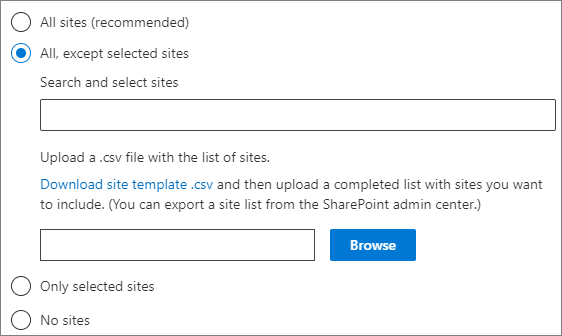

# <a name="manage-topic-discovery-in-microsoft-viva-topics"></a><span data-ttu-id="be41d-103">Microsoft Viva Topics でトピックの検出を管理する</span><span class="sxs-lookup"><span data-stu-id="be41d-103">Manage topic discovery in Microsoft Viva Topics</span></span>

<span data-ttu-id="be41d-104">トピックの検出設定は、管理センターでMicrosoft 365[管理できます](https://admin.microsoft.com)。</span><span class="sxs-lookup"><span data-stu-id="be41d-104">You can manage topic discovery settings in the [Microsoft 365 admin center](https://admin.microsoft.com).</span></span> <span data-ttu-id="be41d-105">これらのタスクを実行するには、グローバル管理者SharePoint管理者である必要があります。</span><span class="sxs-lookup"><span data-stu-id="be41d-105">You must be a global administrator or SharePoint administrator to perform these tasks.</span></span>

## <a name="to-access-topics-management-settings"></a><span data-ttu-id="be41d-106">トピックの管理設定にアクセスするには、次の方法を実行します。</span><span class="sxs-lookup"><span data-stu-id="be41d-106">To access topics management settings:</span></span>

1. <span data-ttu-id="be41d-107">管理センターでMicrosoft 365をクリックし、[組織 **設定]\*\*\*\*をクリックします**。</span><span class="sxs-lookup"><span data-stu-id="be41d-107">In the Microsoft 365 admin center, click **Settings**, then **Org settings**.</span></span>
2. <span data-ttu-id="be41d-108">[サービス] **タブで** 、[トピック エクスペリエンス] **をクリックします**。</span><span class="sxs-lookup"><span data-stu-id="be41d-108">On the **Services** tab, click **Topic experiences**.</span></span>

     

3. <span data-ttu-id="be41d-110">[トピックの **検出] タブを** 選択します。各設定の詳細については、以下のセクションを参照してください。</span><span class="sxs-lookup"><span data-stu-id="be41d-110">Select the **Topic discovery** tab. See the following sections for information about each setting.</span></span>

     

## <a name="select-sharepoint-topic-sources"></a><span data-ttu-id="be41d-112">トピックSharePointを選択する</span><span class="sxs-lookup"><span data-stu-id="be41d-112">Select SharePoint topic sources</span></span>

<span data-ttu-id="be41d-113">トピックのクロールSharePoint組織のサイトを変更できます。</span><span class="sxs-lookup"><span data-stu-id="be41d-113">You can change the SharePoint sites in your organization that will be crawled for topics.</span></span>

<span data-ttu-id="be41d-114">サイトの特定のリストを含めるか除外する場合は、次のテンプレートを使用.csvできます。</span><span class="sxs-lookup"><span data-stu-id="be41d-114">If you want to include or exclude a specific list of sites, you can use the following .csv template:</span></span>

``` csv
Site name,URL
```

<span data-ttu-id="be41d-115">サイト ピッカーを使用してサイトを追加すると、サイトの既存のリストに追加され、含めるまたは除外することができます。</span><span class="sxs-lookup"><span data-stu-id="be41d-115">If you add sites using the site picker, they are added to the existing list of sites to include or exclude.</span></span> <span data-ttu-id="be41d-116">.csv ファイルをアップロードすると、既存のリストが上書きされます。</span><span class="sxs-lookup"><span data-stu-id="be41d-116">If you upload a .csv file, it overwrites any existing list.</span></span> <span data-ttu-id="be41d-117">特定のサイトを以前に含めるか除外した場合は、リストを .csv ファイルとしてダウンロードし、変更を加え、新しいリストをアップロードします。</span><span class="sxs-lookup"><span data-stu-id="be41d-117">If you have previously included or excluded specific sites, you and download the list as a .csv file, make changes, and upload the new list.</span></span>

<span data-ttu-id="be41d-118">トピック検出用のサイトを選択するには</span><span class="sxs-lookup"><span data-stu-id="be41d-118">To choose sites for topic discovery</span></span>

1. <span data-ttu-id="be41d-119">**[トピック検出]** タブの **[SharePoint トピック ソースの選択]** で、**[編集]** を選択します。</span><span class="sxs-lookup"><span data-stu-id="be41d-119">On the **Topic discovery** tab, under **Select SharePoint topic sources**, select **Edit**.</span></span>
2. <span data-ttu-id="be41d-120">[トピック **ソースSharePoint選択**] ページで、検出中にトピックSharePointとしてクロールするサイトを選択します。</span><span class="sxs-lookup"><span data-stu-id="be41d-120">On the **Select SharePoint topic sources** page, select which SharePoint sites will be crawled as sources for your topics during discovery.</span></span> <span data-ttu-id="be41d-121">これには、次の内容が含まれます。</span><span class="sxs-lookup"><span data-stu-id="be41d-121">This includes:</span></span>
    - <span data-ttu-id="be41d-122">**すべてのサイト**: テナントSharePointサイトのすべてのサイト。</span><span class="sxs-lookup"><span data-stu-id="be41d-122">**All sites**: All SharePoint sites in your tenant.</span></span> <span data-ttu-id="be41d-123">これにより、現在および将来のサイトがキャプチャされます。</span><span class="sxs-lookup"><span data-stu-id="be41d-123">This captures current and future sites.</span></span>
    - <span data-ttu-id="be41d-124">**[すべて] (選択したサイトを** 除く): 除外するサイトの名前を入力します。</span><span class="sxs-lookup"><span data-stu-id="be41d-124">**All, except selected sites**: Type the names of the sites you want to exclude.</span></span>  <span data-ttu-id="be41d-125">検出からオプトアウトするサイトの一覧をアップロードできます。</span><span class="sxs-lookup"><span data-stu-id="be41d-125">You can also upload a list of sites you want to opt out from discovery.</span></span> <span data-ttu-id="be41d-126">今後作成されるサイトは、トピック検出のソースとして含められます。</span><span class="sxs-lookup"><span data-stu-id="be41d-126">Sites created in the future will be included as sources for topic discovery.</span></span> 
    - <span data-ttu-id="be41d-127">**選択したサイトのみ**: 含めるサイトの名前を入力します。</span><span class="sxs-lookup"><span data-stu-id="be41d-127">**Only selected sites**: Type the names of the sites you want to include.</span></span> <span data-ttu-id="be41d-128">サイトのリストをアップロードできます。</span><span class="sxs-lookup"><span data-stu-id="be41d-128">You can also upload a list of sites.</span></span> <span data-ttu-id="be41d-129">今後作成されるサイトは、トピック検出のソースとして含められません。</span><span class="sxs-lookup"><span data-stu-id="be41d-129">Sites created in the future will not be included as sources for topic discovery.</span></span>
    - <span data-ttu-id="be41d-130">**サイトなし**: トピックは自動的に生成または更新され、コンテンツSharePointされません。</span><span class="sxs-lookup"><span data-stu-id="be41d-130">**No sites**: Topics won't be automatically generated or updated with SharePoint content.</span></span> <span data-ttu-id="be41d-131">既存のトピックはトピック センターに残ります。</span><span class="sxs-lookup"><span data-stu-id="be41d-131">Existing topics remain in the topic center.</span></span>

    
   
3. <span data-ttu-id="be41d-133">**[保存]** をクリックします。</span><span class="sxs-lookup"><span data-stu-id="be41d-133">Click **Save**.</span></span>

## <a name="exclude-topics-by-name"></a><span data-ttu-id="be41d-134">トピックを名前で除外する</span><span class="sxs-lookup"><span data-stu-id="be41d-134">Exclude topics by name</span></span>

<span data-ttu-id="be41d-135">.csv ファイルのリストをアップロードすることで、検出からトピックを除外することができます。</span><span class="sxs-lookup"><span data-stu-id="be41d-135">You can exclude topics from discovery by uploading a list using a .csv file.</span></span> <span data-ttu-id="be41d-136">トピックを以前に除外した場合は、.csv をダウンロードし、変更を加え、もう一度アップロードできます。</span><span class="sxs-lookup"><span data-stu-id="be41d-136">If you've previously excluded topics, you can download the .csv, make changes, and upload it again.</span></span>

1. <span data-ttu-id="be41d-137">**[トピックの検出]** タブの **[トピックの除外]** で、**[編集]** を選択します。</span><span class="sxs-lookup"><span data-stu-id="be41d-137">On the **Topic discovery** tab, under **Exclude topics**, select **Edit**.</span></span>
2. <span data-ttu-id="be41d-138">[名前 **でトピックを除外する] をクリックします**。</span><span class="sxs-lookup"><span data-stu-id="be41d-138">Click **Exclude topics by name**.</span></span>
3. <span data-ttu-id="be41d-139">リストを作成する必要がある場合は、.csvテンプレートをダウンロードし、除外するトピックを追加します (以下の「.csv *を使用する」を参照* してください)。</span><span class="sxs-lookup"><span data-stu-id="be41d-139">If you need to create a list, download the .csv template and add the topics that you want to exclude (see *Working with the .csv template* below).</span></span> <span data-ttu-id="be41d-140">ファイルの準備ができたら、[参照] を **クリックして** ファイルをアップロードします。</span><span class="sxs-lookup"><span data-stu-id="be41d-140">When the file is ready, click **Browse** and upload the file.</span></span> <span data-ttu-id="be41d-141">既存のリストがある場合は、リストを含む.csvダウンロードできます。</span><span class="sxs-lookup"><span data-stu-id="be41d-141">If there's an existing list, you can download the .csv containing the list.</span></span>
4. <span data-ttu-id="be41d-142">**[保存]** をクリックします。</span><span class="sxs-lookup"><span data-stu-id="be41d-142">Click **Save**.</span></span>

    

### <a name="working-with-the-csv-template"></a><span data-ttu-id="be41d-144">テンプレートの操作.csvする</span><span class="sxs-lookup"><span data-stu-id="be41d-144">Working with the .csv template</span></span>

<span data-ttu-id="be41d-145">csv テンプレートは、以下にコピーできます。</span><span class="sxs-lookup"><span data-stu-id="be41d-145">You can copy the csv template below:</span></span>

``` csv
Name (required),Expansion,MatchType- Exact/Partial (required)
```

<span data-ttu-id="be41d-146">CSV テンプレートで、除外するトピックに関する次の情報を入力します。</span><span class="sxs-lookup"><span data-stu-id="be41d-146">In the CSV template, enter the following information about the topics you want to exclude:</span></span>

- <span data-ttu-id="be41d-147">**Name**: 除外するトピックの名前を入力します。</span><span class="sxs-lookup"><span data-stu-id="be41d-147">**Name**: Type the name of the topic you want to exclude.</span></span> <span data-ttu-id="be41d-148">これを行うには次に示す 2 つの方法があります。</span><span class="sxs-lookup"><span data-stu-id="be41d-148">There are two ways to do this:</span></span>
    - <span data-ttu-id="be41d-149">完全一致: 厳密な名前または頭字語 *(Contoso* や ATL など) を *除外できます*。</span><span class="sxs-lookup"><span data-stu-id="be41d-149">Exact match: You can exclude the exact name or acronym (for example, *Contoso* or *ATL*).</span></span>
    - <span data-ttu-id="be41d-150">部分一致: 特定の単語が含まれていますすべてのトピックを除外できます。</span><span class="sxs-lookup"><span data-stu-id="be41d-150">Partial match: You can exclude all topics that have a specific word in it.</span></span>  <span data-ttu-id="be41d-151">たとえば、*円弧は、* アーク円、プラズマアーク溶接、トレーニングアークなど、アークという単語を含むすべてのトピック *を除外します*。テキストが単語の一部として含まれているトピック (Architecture など) は除外されない点に *注意してください*。</span><span class="sxs-lookup"><span data-stu-id="be41d-151">For example, *arc* will exclude all topics with the word *arc* in it, such as *Arc circle*, *Plasma arc welding*, or *Training arc*. Note that it will not exclude topics in which the text is included as part of a word, such as *Architecture*.</span></span>
- <span data-ttu-id="be41d-152">**略語 (省略可能)**: 頭字語を除外する場合は、頭字語の略語を入力します。</span><span class="sxs-lookup"><span data-stu-id="be41d-152">**Stands for (optional)**: If you want to exclude an acronym, type the words the acronym stands for.</span></span>
- <span data-ttu-id="be41d-153">**MatchType-Exact/Partial**: 入力した名前が完全一致型か部分一致型 *かを入力します*。</span><span class="sxs-lookup"><span data-stu-id="be41d-153">**MatchType-Exact/Partial**: Type whether the name you entered was an *exact* or *partial* match type.</span></span>

     

## <a name="see-also"></a><span data-ttu-id="be41d-155">関連項目</span><span class="sxs-lookup"><span data-stu-id="be41d-155">See also</span></span>

[<span data-ttu-id="be41d-156">トピックの表示を管理Microsoft 365</span><span class="sxs-lookup"><span data-stu-id="be41d-156">Manage topic visibility in Microsoft 365</span></span>](topic-experiences-knowledge-rules.md)

[<span data-ttu-id="be41d-157">トピックのアクセス許可を管理Microsoft 365</span><span class="sxs-lookup"><span data-stu-id="be41d-157">Manage topic permissions in Microsoft 365</span></span>](topic-experiences-user-permissions.md)

[<span data-ttu-id="be41d-158">トピック センターの名前を変更Microsoft 365</span><span class="sxs-lookup"><span data-stu-id="be41d-158">Change the name of the topic center in Microsoft 365</span></span>](topic-experiences-administration.md)
