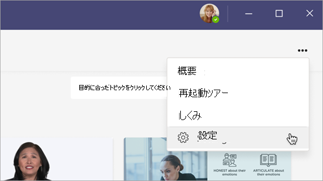

# 近日公開予定: Microsoft Viva Learning SharePointコンテンツ ソースとしてコンテンツ を構成する (プレビュー)

> [!NOTE]
> この記事の情報は、商用リリース前に大幅に変更される可能性があるプレビュー製品に関連しています。 

組織独自のコンテンツSharePointビバ ラーニング (プレビュー) で使用できるよう、ラーニング コンテンツ ソースとして構成できます。

## 概要

ナレッジ管理者 (またはグローバル管理者) は、ラーニング サービスが構造化された SharePoint リストの形式で空の一元化された場所 (ラーニング アプリ コンテンツ リポジトリ) を作成できるサイト URL を提供します。 このリストは、組織が、学習コンテンツを含むクロスSharePointフォルダーへのリンクを格納するために使用できます。 管理者は、フォルダーの URL の一覧を収集およびキュレーションする責任があります。 これらのフォルダーには、ビバ ラーニング (プレビュー) で使用できるコンテンツのみを含める必要があります。

Viva Learning (プレビュー) では、次のドキュメントの種類がサポートされています。

- Word、PowerPoint、Excel、PDF
- オーディオ (.m4a)
- ビデオ (.mov、.mp4、.avi)

詳細については、「制限値[SharePoint参照してください](/office365/servicedescriptions/sharepoint-online-service-description/sharepoint-online-limits?redirectSourcePath=%252farticle%252fSharePoint-Online-limits-8f34ff47-b749-408b-abc0-b605e1f6d498)。 

## アクセス許可

ドキュメント ライブラリ フォルダー URL は、組織内の任意のSharePointから収集できます。 Viva Learning (プレビュー) は、既存のすべてのコンテンツアクセス許可に従います。 したがって、ユーザーがアクセス許可を持つコンテンツだけが検索可能で、ビバ ラーニング (プレビュー) 内で表示されます。 これらのフォルダー内のコンテンツは検索可能ですが、個々の従業員がアクセス許可を持つコンテンツのみを使用できます。

組織のリポジトリからのコンテンツの削除は現在サポートされていません。

意図せずに表示されたコンテンツを削除するには、次の手順を実行します。

1.  ドキュメント ライブラリへのアクセスを制限するには、[アクションの表示] オプション **を選択し** 、[アクセスの管理] **を選択します**。
     
     ![[アクセスの管理] highligted SharePoint [アクションの表示] オプションを表示するドキュメント ライブラリ ページ。](../media/learning/learning-sharepoint-permissions2.png)

2.  ドキュメント ライブラリ内の元のドキュメントを削除します。

詳細については、「最新のエクスペリエンス[での共有とアクセス許可SharePointを参照してください](/sharepoint/modern-experience-sharing-permissions)。 

## ラーニング サービス

ラーニング サービスは、指定されたフォルダー URL を使用して、それらのフォルダーに格納されているすべてのコンテンツからメタデータを取得します。 一元化されたリポジトリにフォルダー URL を指定して 24 時間以内に、従業員はビバ ラーニング (プレビュー) 内で組織のコンテンツを検索して使用できます。 更新されたメタデータやアクセス許可を含むコンテンツに対する変更はすべて、24 時間以内にラーニング サービスにも適用されます。

## ソースSharePoint構成する

これらのタスクを実行するにはMicrosoft 365管理者、SharePoint管理者である必要があります。

ビバ SharePoint (プレビュー) のラーニング コンテンツ ソースとして構成するには、次の手順を実行します。

1.  管理センターの左側のナビゲーションMicrosoft 365、[組織の設定]**設定**  >  **移動します**。
 
2.  [組織の **設定] ページ** の [サービス] **タブで** 、[ビバ ラーニング **(プレビュー) ] を選択します**。

     

3.  [**ビバ ラーニング (プレビュー)]** パネルの SharePoint で、サイト URL を SharePoint サイトに提供します。このサイトでは、ビバ ラーニング (プレビュー) で一元的なリポジトリを作成します。

     ![[管理センター] の [Microsoft 365] パネルに、選択SharePoint表示されます。](../media/learning/learning-sharepoint-configure2.png)

4.  指定SharePointリストは、指定されたサイト内にSharePointされます。

     

     サイトの左側のナビゲーションで、[サイト コンテンツSharePoint  >  **アプリ コンテンツ リポジトリ] を選択します**。 

     ![SharePointコンテンツ ナビゲーションと [学習アプリ コンテンツ リポジトリ] セクションを示すリストを表示します。](../media/learning/learning-sharepoint-configure4.png) 

5. [アプリ **コンテンツ リポジトリの学習**] ページで、SharePointに URL を設定します。

   1. [新規 **] を** 選択して、[新しいアイテム] **パネルを表示** します。 

       ![[新しい] オプションをSharePointの [コンテンツ リポジトリの学習] ページ。](../media/learning/learning-sharepoint-configure5.png)
 
   2. [新しい **アイテム]** パネルの [ **タイトル** ] フィールドに、選択したディレクトリ名を追加します。 [フォルダー **URL]** フィールドで、URL を学習コンテンツ フォルダーに追加します。 [**保存**] を選択します。

       ![[タイトル] フィールドと [SharePoint URL] フィールドが表示される新しいアイテム パネル。](../media/learning/learning-sharepoint-configure6.png)

   3. [ **アプリコンテンツ リポジトリの学習]** ページが新しい学習コンテンツで更新されます。

       ![[コンテンツ リポジトリの学習] ページSharePoint情報を表示します。](../media/learning/learning-sharepoint-configure7.png)

> [!NOTE]
> Learning App Content Repository へのより広範なアクセスを可能にするために、リストへのリンクは、ユーザーがアクセスを要求し、最終的にリストを設定するのに役立つ、ビバ ラーニング (プレビュー) インターフェイスですぐに利用できます。 サイト所有者とグローバル管理者は、リストへのアクセスを許可する必要があります。 アクセスはリストにのみ固有であり、リストが保存されているサイトには適用されません。 詳細については、この記事の [後半の「自分の組織のコンテンツを提供](#provide-your-own-organizations-content) する」を参照してください。

### フォルダー URL ドキュメント ライブラリのキュレーション

既定のメタデータ (変更日、作成日、ドキュメント名、コンテンツ タイプ、組織名など) は、Microsoft Graph API によって自動的にビバ ラーニング (プレビュー) に引き込まれます。
 
コンテンツの全体的な検出と検索の関連性を向上させるために、[説明] 列を追加することをお **勧** めします。

ドキュメント ライブラリ ページに **[説明]** 列を追加するには、次の手順を実行します。

1.  [ドキュメント] **ページで、[** 列の追加] **を選択します**。

2. [アクションの **表示] オプションを** 選択し、[単一 **行のテキスト] を選択します**。

     ![[ドキュメント] ページSharePoint[アクションの表示] オプションが表示され、1 行のテキストが強調表示されます。](../media/learning/learning-sharepoint-curation1.png)

3. [列 **の作成] パネル** の [ **名前** ] フィールドに、列のわかりやすい名前を追加します。 [**保存**] を選択します。

     ![[名前] などのフィールドをSharePoint列パネルを作成します。](../media/learning/learning-sharepoint-curation2.png)
 
4. [ドキュメント **] ページの** [説明] **列** で、アイテムごとにカスタム説明を追加します。 説明が指定されていない場合、Viva Learning (Preview) は既定のメッセージを提供し、コンテンツが独自のライブラリSharePointします。 

     ![[説明] 列SharePoint説明を表示するドキュメント ページ。](../media/learning/learning-sharepoint-curation3.png)
 
### 独自の組織のコンテンツを提供する

ナレッジ管理者は、組織のラーニング アプリ コンテンツ リポジトリに SharePoint でアクセスし、組織間のドキュメント ライブラリへの参照を提供できます。 これらのライブラリ内のコンテンツは、ビバ ラーニング (プレビュー) で学習コンテンツとして表示されます。

1. [ビバ ラーニング (プレビュー)] で、[その他の **オプション**] (**..) を** 選択し、[オプション]**を** 設定。

     
     
2. [アクセス **設定]** で、[アクセス許可]**を選択します**。

     ![設定アクセス許可とアクセスSharePointを表示するページの [オプション] ページを開きます。](../media/learning/learning-sharepoint-library-2.png)

3. [ **アクセスの確認]** を選択して、組織の一元化されたライブラリに接続します。
     
