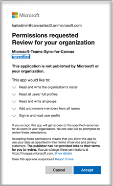

# Canvas でMicrosoft Teamsクラスを使用するUse Microsoft Teams classes with Canvas

Microsoft Teamsクラスは、ラーニング ツール相互運用性 (LTI) アプリで、教育者と学生が ラーニング 管理システム (LMS) と Teams の間を簡単に移動するのに役立ちます。Microsoft Teams classes is a Learning Tools Interoperability (LTI) app that helps educators and students easily navigate between their Learning Management System (LMS) and Teams. ユーザーは、自分のコースに関連付けられているクラス チームに、自分の LMS 内から直接アクセスできます。Users can access their class teams associated with their course directly from within their LMS.

## 展開前の前提条件Prerequisites Before Deployment

> [!NOTE]
> LTI の現在Teamsクラスは、キャンバス ユーザーと制限されたスコープ内Microsoft Azure Active Directory (AAD) の同期のみをサポートします。The current Class Teams LTI only supports syncing Canvas users with Microsoft Azure Active Directory (AAD) in a limited scope. 
> - テナントは、Microsoft AAD のキャンバス フィールド (電子メール、ユーザー ID、または SIS ID) と UPN の間で完全に一致している必要があります。Your tenant must have an exact match between a Canvas field (email, user ID, or SIS ID) and the UPN in Microsoft AAD. 同期機能に柔軟に対応するために取り組み中ですが、その間、Canvas のユーザーが AAD の UPN と一致しない場合、Canvas と同期された Teams クラスには追加されません。We are working to expand flexibility to the syncing functionality, but in the meantime, any users in Canvas not matched to a UPN in AAD will not be added to the Teams class synced with Canvas. 
> - Canvas と Microsoft の間でユーザーをマッピングするには、1 つの Microsoft テナントのみを使用できます。Only a single Microsoft tenant can be used for mapping users between Canvas and Microsoft.
> - グループの重複を回避するには、LTI クラスを使用する前Teams SDS をオフにする必要があります。You will have to turn off SDS before using the Class Teams LTI in order to avoid duplication of groups.

## Microsoft Office 365管理者Microsoft Office 365 Admin

Instructure Canvas 内の Microsoft Teams 統合を管理する前に、Canvas の管理セットアップを完了する前に、キャンバスの **microsoft-Teams-Sync-for-Canvas** Azure アプリを Microsoft Azure テナントの教育機関の Microsoft Office 365 管理者によって承認することが重要です。Before managing the Microsoft Teams integration within Instructure Canvas, it is important to have Canvas’s **Microsoft-Teams-Sync-for-Canvas** Azure app approved by your institution’s Microsoft Office 365 admin in your Microsoft Azure tenant before completing the Canvas admin setup.

1. Canvas にサインインします。Sign in to Canvas.

2. グローバル ナビゲーション **で [管理者** ] リンクを選択し、アカウントを選択します。Select the **Admin** link in the global navigation, and then select your account.

3. 管理ナビゲーションで、[リンク]**リンクを** 設定、[統合]**タブを選択** します。In the admin navigation, select the **Settings** link, and then the **Integrations** tab.

4. トグルMicrosoft Teamsして同期を有効にします。Enable Microsoft Teams Sync by turning the toggle on.

   

5. Microsoft テナント名とログイン属性を入力します。Enter your Microsoft tenant name and login attribute.

   login 属性は、Canvas ユーザーをユーザーに関連付Azure Active Directoryされます。The login attribute will be used for associating the Canvas user with an Azure Active Directory user.

6. [完了 **したら設定** 更新] を選択します。Select **Update Settings** once done.

7. Canvas の **Microsoft-Teams-Sync-for-Canvas** Azure アプリへのアクセスを承認するには、[テナント アクセスを **許可する] リンクを選択** します。To approve access for Canvas’s **Microsoft-Teams-Sync-for-Canvas** Azure app, select the **Grant tenant access** link. Microsoft Identity Platform Admin Consent Endpoint にリダイレクトされます。You'll be redirected to the Microsoft Identity Platform Admin Consent Endpoint.

   

8. **[同意する]** を選択します。Select **Accept**.

## Canvas AdminCanvas Admin

LTI 1.3 Microsoft Teamsをセットアップします。Set up the Microsoft Teams LTI 1.3 Integration.

Canvas 管理者として、環境内に LTI Microsoft Teamsクラスを追加する必要があります。As a Canvas Admin, you'll need to add the Microsoft Teams classes LTI app within your environment. アプリの LTI クライアント ID をメモします。Make a note of the LTI Client ID for the app.

 - Microsoft Teamsクラス - 17000000000000570Microsoft Teams classes - 170000000000570

1. Access **Admin settings**  >  **Apps**.Access **Admin settings** > **Apps**.

2. [+**アプリ] を** 選択して、LTI Teamsを追加します。Select **+ App** to add the Teams LTI apps.

   

3. 構成 **の種類として [クライアント ID 別** ] を選択します。Select **By Client ID** for configuration type.

   

4. 指定されたクライアント ID を入力し、[送信] を **選択します**。Enter the Client ID provided, and then select **Submit**.

   確認のためにクライアント ID Microsoft Teamsクラス LTI アプリ名が表示されます。You'll notice the Microsoft Teams classes LTI app name for the Client ID for confirmation.

5. **[インストール]** を選択します。Select **Install**.

   LTI Microsoft Teamsクラスは、外部アプリの一覧に追加されます。The Microsoft Teams classes LTI app will be added to the list of external apps.
   
## キャンバス コースの LTI アプリを有効にするEnabling the LTI app for Canvas courses

コース内で LTI アプリを使用するには、Canvas コースの講師が統合同期を有効にする必要があります。各コースは、対応するチームを作成するために講師が有効にする必要があります。チームを作成するためのグローバルメカニズムはありません。To use the LTI app within a course, an instructor of the Canvas course must enable integrations sync. Each course must be enabled by an instructor for a corresponding team to be created; there is no global mechanism for teams creation. これは、望ましくないチームが作成されるのを防ぐための予防措置として設計されています。This is designed as a precautionary measure to prevent unwanted teams from being created.

各コースで LTI アプリを [有効](https://support.microsoft.com/topic/use-microsoft-teams-classes-in-your-lms-preview-ac6a1e34-32f7-45e6-b83e-094185a1e78a#ID0EBD=Instructure_Canvas) にし、統合セットアップを完了するには、教員のドキュメントを参照してください。Refer your instructors to the [educator documentation](https://support.microsoft.com/topic/use-microsoft-teams-classes-in-your-lms-preview-ac6a1e34-32f7-45e6-b83e-094185a1e78a#ID0EBD=Instructure_Canvas) for enabling the LTI app for each course and completing the integration setup.
