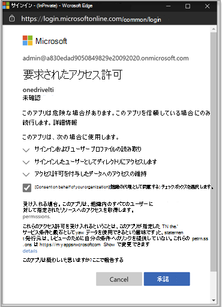
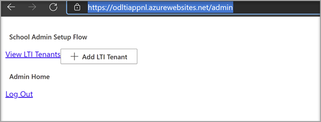

# キャンバスMicrosoft OneDrive LTI を使用するUse Microsoft OneDrive LTI with Canvas

> [!IMPORTANT]
> 一部の情報は、市販される前に大幅に変更される可能性があるプレリリース製品に関するものです。Some information relates to prereleased product which may be substantially modified before it's commercially released. Microsoft は、ここに記載された情報に関して、明示または黙示を問わず、いかなる保証も行いません。Microsoft makes no warranties, express or implied, with respect to the information provided here.

## Canvas との統合Integrate with Canvas

この統合を実行するユーザーは、Canvas の管理者であり、テナントの管理者Microsoft 365があります。The person who performs this integration should be an admin of Canvas and an admin of the Microsoft 365 tenant.

1. テナント管理者アカウントを使用Microsoft Azureポータルにサインインします。Sign in to the Microsoft Azure portal with the tenant admin account. Azure テナント管理者には、グループ管理者の役割も必要です。The Azure tenant administrator should also have the Group administrator role.

    

2. LTI ポータルで Microsoft [OneDriveサインインします](https://odltiappnl.azurewebsites.net/admin)。Sign in to the Microsoft [OneDrive LTI portal](https://odltiappnl.azurewebsites.net/admin).

3. サインインを完了するためのアクセス許可を受け入れる。Accept the permissions to complete the sign-in.

    

4. **[LTI テナントの追加] を選択します**。Select **Add LTI Tenant**.

     

5. ドロップダウン **から [キャンバスとして LTI コンシューマー** **プラットフォーム** ] を選択します。Select **LTI Consumer Platform** as **Canvas** from the dropdown.

6. [ **キャンバスベース URL] を選択し** 、[次へ] を **選択します**。Select **Canvas Base URL** and then select **Next**.

    ![[キャンバス] を選択し、ベース URL を追加する](../media/lti-media/lti-canvas-base-url.png)

   次の画面には、機密であるフィールドが表示されます。The next screen shows fields that are confidential to you.

7. ? **から [次へ** ] を選択します。Select **Next** from ?? 」ページが表示されます。page. レビュー担当者はここで空白を入力できますか?CAN REVIEWERS FILL IN THE BLANK HERE?

8. [ **次へ** ] を選択すると、機密の情報が表示されます。Select **Next** in the screen that shows information that's confidential to you.

   Azure portal の最後の画面には、Canvas インスタンスを追加するための次の手順が表示されます。The final screen of the Azure portal shows the next steps for adding your Canvas instance.

9. この画面から開発者キーをコピーします。Copy the Developer Keys from this screen. Canvas インスタンスを作成するときに使用します。You'll use when you create the Canvas instance.

## Canvas インスタンスの追加Add the Canvas instance

1. Canvas インスタンスで、[管理者開発者キー **] の選択**  >  **を解除します**。In your Canvas instance, deselect **Admin** > **Developer Keys**.

2. [開発者 **キー] のドロップダウンで [LTI** キー **] を選択します**。Choose **LTI Key** in the dropdown on **Developer Key**.

   

3. 開発者キーをここに貼り付けます。Paste the developer keys here.

     

   キーが OFF モードで **作成** されるThe key gets created in **OFF** mode

   

4. 強調表示されたテキストをコピーします。Copy the highlighted text.
    これは、LTI ポータルのクライアント ID Microsoft OneDrive機能します。This serves as Client ID in Microsoft OneDrive LTI portal.

5. LTI ポータルの **[クライアント ID]** フィールドにテキストMicrosoft OneDrive貼り付け、[次へ] を **選択します**。Paste the text into the **Client ID** field in Microsoft OneDrive LTI portal, and then select **Next**.

6. **[保存]** を選択します。Select **Save**.

7. [LTI テナントの表示] **を選択して設定を表示します**。View the settings by selecting **View LTI Tenants**.
