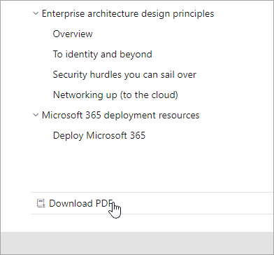

# Microsoft 365 ドキュメント ナビゲーション ガイド

このトピックでは、Microsoft 365 技術ドキュメント領域内を移動するためのヒントとコツを示します。  

## ハブ ページ

Microsoft 365 ハブ ページは、関連する Microsoft 365 コンテンツを見つけ出すエントリ [https://aka.ms/microsoft365docs](https://aka.ms/microsoft365docs) ポイントです。

Microsoft 365 テクニカル ドキュメント セット内のすべてのページの上部にあるヘッダーから **Microsoft 365** を選択すると、いつでもこのページに戻ります。

## オフライン ドキュメント

オフライン システムで Microsoft 365 のドキュメントを表示する場合は、Microsoft 365 の技術ドキュメントを参照している場所に PDF を作成できます。

PDF を作成する場合は、すべての目次の下部にある **[PDF** のダウンロード] リンクを選択します。

## TOC 検索 
On docs.microsoft.com, you can search the content in the table of contents by using the filter search box at the top:

## バージョン フィルター
Microsoft 365 技術ドキュメントには、21 Vianet (中国) が運用している Office 365 Germany や Office 365 など、追加の製品のコンテンツが提供されています。 機能はバージョンによって異なる場合があります。そのため、コンテンツ自体が異なる場合があります。

バージョン フィルターを使用すると、Microsoft 365 の適切なバージョンのコンテンツが表示されます。

## 階層リンク

階層リンクは、ヘッダーの下と目次の上に表示され、現在の記事が目次のどこにあるか示します。  これは、読み取るコンテンツの種類にコンテキストを設定するのに役立つだけでなく、目次ツリーを戻す操作も可能になります。

## 記事セクションのナビゲーション

右側のナビゲーション ウィンドウでは、記事内のセクションにすばやく移動し、記事内の場所を特定できます。  

## ドキュメントのフィードバックを送信する

記事内で問題が見つけた場合は、ページの下部までスクロールして [コンテンツのフィードバック] を選択することで、その記事の SQL コンテンツ チームにフィードバック **を送信できます**。

## Microsoft 365 ドキュメントに投稿する

自分でコンテンツを編集できるとdocs.microsoft.comしましたか? その場合、ドキュメントが改善されるだけでなく、ページの投稿者としてクレジットされます。 開始するには、次のトピックを参照してください。

- [Microsoft Docs 共同作成者ガイド](https://docs.microsoft.com/contribute/)

## 次のステップ

- [Microsoft 365 の技術ドキュメントの使用を開始します](index.yml)。
