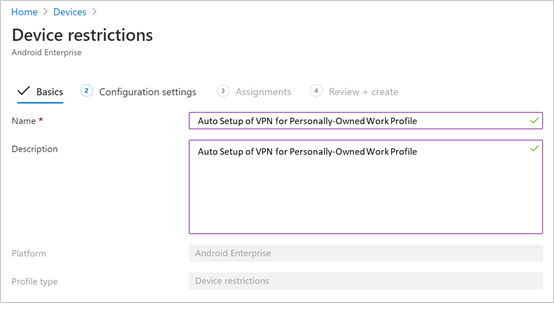

# Microsoft Intune を使用して Microsoft Defender for Endpoint for Android を展開する 

[!INCLUDE [Microsoft 365 Defender rebranding](../../includes/microsoft-defender.md)]

**適用対象:**
- [Microsoft Defender for Endpoint](https://go.microsoft.com/fwlink/p/?linkid=2154037)
- [Microsoft 365 Defender](https://go.microsoft.com/fwlink/?linkid=2118804)

> Microsoft Defender for Endpoint を体験してみませんか? [無料試用版にサインアップします。](https://www.microsoft.com/microsoft-365/windows/microsoft-defender-atp?ocid=docs-wdatp-exposedapis-abovefoldlink) 

Intune ポータル サイトに登録されているデバイスに Defender for Endpoint for Android を展開する方法について説明します。 Intune デバイスの登録の詳細については、「デバイスの登録  [」を参照してください](https://docs.microsoft.com/mem/intune/user-help/enroll-device-android-company-portal)。

> [!NOTE]
> **Android 用エンドポイントの Defender が Google Play で [利用できる](https://play.google.com/store/apps/details?id=com.microsoft.scmx)**  
> Intune から Google Play に接続して、デバイス管理者モードと Android Enterprise entrollment モード全体に Defender for Endpoint アプリを展開できます。
アプリの更新は、Google Play 経由で自動的に行います。

## デバイス管理者が登録したデバイスに展開する

**Intune ポータル サイトで Android 用 Defender for Endpoint を展開する - デバイス管理者が登録したデバイス**

Intune Company Portal - デバイス管理者が登録したデバイスに Defender for Endpoint for Android を展開する方法について説明します。 

### Android ストア アプリとして追加する

1. [Microsoft Endpoint Manager 管理センターで、アプリ] [Android アプリ] [Android ストア アプリの追加] に移動し、[ \>  \> **\>** 選択] を **選択します**。

   

2. [アプリの **追加] ページで** 、[アプリ情報] *セクションに次の情報* を入力します。 

   - **名前** 
   - **説明**
   - **Publisher** as Microsoft.
   - **アプリ ストア URL as** https://play.google.com/store/apps/details?id=com.microsoft.scmx (Defender for Endpoint app Google Play ストア URL) 

   その他のフィールドはオプションです。 **[次へ]** を選択します。

   

3. [割り *当て] セクション* で、[必須] セクションに移動 **し** 、[グループの追加] **を選択します。** その後、Defender for Endpoint for Android アプリをターゲットとするユーザー グループを選択できます。 [選択 **] と [** 次へ] の順 **に選択します**。

    >[!NOTE]
    >選択したユーザー グループは、Intune に登録されたユーザーで構成する必要があります。

    > [!div class="mx-imgBorder"]

    > 

4. [レビュー **+ 作成] セクション** で、入力した情報が正しいか確認し、[作成] を **選択します**。

    しばらくすると、Defender for Endpoint アプリが正常に作成され、ページの右上隅に通知が表示されます。

    

5. 表示されるアプリ情報ページの [モニター]セクションで、[デバイスのインストール状態] を選択して、デバイスのインストールが正常に完了したと確認します。

    > [!div class="mx-imgBorder"]
    > 

### オンボーディングとチェックの状態を完了する

1. Defender for Endpoint for Android がデバイスにインストールされた後、アプリ アイコンが表示されます。

    

2. Microsoft Defender ATP アプリ アイコンをタップし、画面の指示に従ってアプリのオンボーディングを完了します。 詳細には、Defender for Endpoint for Android に必要な Android アクセス許可のエンド ユーザーによる承諾が含まれます。

3. オンボードが成功すると、デバイスは Microsoft Defender セキュリティ センターの [デバイス] リストに表示されます。

    

## Android Enterprise 登録済みデバイスに展開する

Defender for Endpoint for Android では、Android Enterprise 登録済みデバイスがサポートされています。

Intune でサポートされる登録オプションの詳細については、「登録オプション」 [を参照してください](https://docs.microsoft.com/mem/intune/enrollment/android-enroll)。

**現在、仕事用プロファイルと企業所有の完全に管理されたユーザー デバイス登録を持つ個人所有のデバイスは、展開のためにサポートされています。**

## Microsoft Defender for Endpoint for Android を Managed Google Play アプリとして追加する

管理された Google Play に Microsoft Defender for Endpoint アプリを追加するには、以下の手順に従います。

1. [Microsoft Endpoint Manager 管理センターで、アプリの Android アプリの追加] に移動 \>  \> **し、[****管理された Google Play アプリ] を選択します**。

    > [!div class="mx-imgBorder"]
    > 

2. その後読み込まれる管理された Google Play ページで、検索ボックスに移動し **、Microsoft Defender を参照します。** 検索では、Managed Google Play に Microsoft Defender for Endpoint アプリが表示されます。 アプリの検索結果から Microsoft Defender for Endpoint アプリをクリックします。

    

3. 次に表示される [アプリの説明] ページで、Defender for Endpoint でアプリの詳細を確認できる必要があります。 ページの情報を確認し、[承認] を **選択します**。

    > [!div class="mx-imgBorder"]
    > 

4. Defender for Endpoint が動作するために取得するアクセス許可が表示されます。 それらを確認し、[承認] を **選択します**。

    

5. [承認の設定] ページが表示されます。 このページでは、Defender for Endpoint for Android が求める可能性がある新しいアプリのアクセス許可を処理するための基本設定が確認されます。 選択肢を確認し、希望するオプションを選択します。 [**完了**] を選択します。

    既定では、[アプリが新しいアクセス許可を要求するときに承認済みの状態を維持する] を *選択します。*

    > [!div class="mx-imgBorder"]
    > ![[通知のイメージ] タブ](images/ffecfdda1c4df14148f1526c22cc0236.png)

6. アクセス許可処理の選択が行われたら、[同期] を **選択して** Microsoft Defender for Endpoint をアプリの一覧に同期します。

    > [!div class="mx-imgBorder"]
    > 

7. 同期は数分で完了します。

    

8. [Android アプリ **] 画面で** [更新] ボタンを選択すると、Microsoft Defender ATP がアプリの一覧に表示されます。

    > [!div class="mx-imgBorder"]
    > 

9. Defender for Endpoint は、Intune 経由で管理対象デバイスのアプリ構成ポリシーをサポートします。 この機能は、該当する Android アクセス許可を自動付与するために利用できます。そのため、エンド ユーザーは、これらのアクセス許可を受け入れる必要がなされません。

    1. [アプリ **] ページで** 、[アプリ構成ポリシー>に移動し、[> **デバイス>追加する] に移動します**。

       

    1. [アプリ構成 **ポリシーの作成] ページ** で、次の詳細を入力します。
    
        - 名前: Microsoft Defender ATP。
        - [ **プラットフォームとして Android Enterprise]** を選択します。
        - [プロファイル **の種類] として [作業プロファイル** のみ] を選択します。
        - [アプリ **の選択] を** クリックし **、[Microsoft Defender ATP] を選択** し **、[OK] を選択し、[次** へ] を **選択します**。
    
        > [!div class="mx-imgBorder"]
        > 

    1. [設定 **] ページで** 、[アクセス許可] セクションの [追加] をクリックして、サポートされているアクセス許可の一覧を表示します。 [アクセス許可の追加] セクションで、次のアクセス許可を選択します。

       - 外部ストレージ (読み取り)
       - 外部ストレージ (書き込み)

       次に **[OK]** を選択します。

       > [!div class="mx-imgBorder"]
      > 

    1. これで、両方のアクセス許可が一覧表示され、[アクセス許可の状態] ドロップダウンで [自動入力] を選択し、[次へ] を選択して、両方を自動入力 **できます**。

       > [!div class="mx-imgBorder"]
       > 

    1. [割 **り当て]** ページで、このアプリ構成ポリシーを割り当てるユーザー グループを選択します。 [グループ **の選択] をクリック** して、該当するグループを含め、選択し、[次へ] を **選択します**。  ここで選択したグループは、通常、エンドポイント Android アプリ用 Microsoft Defender を割り当てるのと同じグループです。 

       > [!div class="mx-imgBorder"]
       > 
    

     1. 次に **表示される [確認と作成** ] ページで、すべての情報を確認し、[作成] を **選択します**。  
    
        ストレージアクセス許可を自動指定する Defender for Endpoint のアプリ構成ポリシーが、選択したユーザー グループに割り当てられます。

        > [!div class="mx-imgBorder"]
        > 

10. [**プロパティの割り当ての** 編集] の一覧で [Microsoft Defender ATP \>  \> **アプリ] を** \> **選択します**。

    

11. アプリを必須アプリとして *ユーザー* グループに割り当てる。 これは、ポータル サイトアプリ経由でデバイスを次回同期する際に、作業プロファイルに自動的にインストールされます。 この割り当ては、[必須]セクション [グループの追加] に移動し、ユーザー グループを選択して [選択 \> ] をクリックすることで **実行できます**。

    > [!div class="mx-imgBorder"]
    > 

12. [アプリケーション **の編集] ページ** で、上記で入力した情報を確認します。 次に、[ **確認] + [保存] の** 順に選択し **、[保存] を** 再度選択して割り当てを開始します。

### Always-on VPN の自動セットアップ 
Defender for Endpoint は、Intune 経由で管理対象デバイスのデバイス構成ポリシーをサポートします。 この機能は、Android Enterprise 登録済みデバイスでの **Always-on VPN** の自動セットアップに利用できます。そのため、エンド ユーザーはオンボーディング中に VPN サービスをセットアップする必要がなされません。
1.  [**デバイス]** で、[**構成プロファイル] [** プロファイル プラットフォームの  >    >    >  **作成] [Android Enterprise Select** Device **Restrictions]** を選択します。デバイス登録の種類に基づいて、次のいずれかの下に設定します。 
- **完全管理、専用、および作業Corporate-Ownedプロファイル**
- **個人所有の作業プロファイル**

**[作成]** を選択します。
 
   > 
    
2. **構成設定** 構成プロファイル **を一** 意 **に識別するための名前** と説明を指定します。 

   > 
   
 3. [接続 **] を選択し** 、VPN を構成します。
- 作業 **プロファイルで Always-on VPN** Setup a VPN クライアントを有効にして、可能な限り VPN に自動的に接続して再接続します。 特定のデバイス上の常時接続 VPN 用に構成できる VPN クライアントは 1 つのみです。そのため、1 つのデバイスに展開する常時接続 VPN ポリシーは 1 つ以下にしてください。 
- [VPN **クライアント** のカスタム] ドロップダウン リスト [カスタム VPN] を選択します。この場合、Web 保護機能を提供するために使用される Defender for Endpoint VPN です。 
    > [!NOTE]
    > この VPN の自動セットアップを機能するには、Microsoft Defender ATP アプリをユーザーのデバイスにインストールする必要があります。

- Google Play **ストアで** Microsoft Defender ATP アプリのパッケージ ID を入力します。 Defender アプリの URL https://play.google.com/store/apps/details?id=com.microsoft.scmx の場合、パッケージ ID は **com.microsoft.scmx です**。  
- **ロックダウン モード** 構成されていません (既定) 

     
   
4. **割り当て**[割  **り当て]** ページで、このアプリ構成ポリシーを割り当てる   ユーザー グループを選択します。 [グループ **の選択]** をクリックして、該当するグループを含め、選択し、[次へ] を **クリックします**。 ここで選択したグループは、通常、エンドポイント Android アプリ用 Microsoft Defender を割り当てるのと同じグループです。 

     

5. 次に **表示される [確認と作成** ] ページで、すべての情報を確認し、[作成] を **選択します**。 これで、デバイス構成プロファイルが選択したユーザー グループに割り当てられます。    

    

## オンボーディングとチェックの状態を完了する

1. [デバイスのインストール状態] をクリックして、Microsoft Defender for Endpoint for Android のインストール状態 **を確認します**。 デバイスがここに表示されるのを確認します。

    > [!div class="mx-imgBorder"]
    > 

2. デバイスで、作業プロファイルにアクセスしてオンボーディングの状態を **検証できます**。 Defender for Endpoint が使用可能で、個人用所有のデバイスに仕事用プロファイルが登録 **されているのを確認します**。  企業所有の完全に管理されたユーザー デバイスに登録されている場合は、デバイス上に 1 つのプロファイルが作成され、Defender for Endpoint が使用可能なと確認できます。

    

3. アプリがインストールされると、アプリを開いてアクセス許可を受け入れ、オンボーディングが成功する必要があります。

    

4. この段階では、デバイスは Android 用 Defender for Endpoint に正常にオンボードされます。 これを確認するには [、Microsoft Defender セキュリティ センターの](https://securitycenter.microsoft.com) [デバイス] ページに **移動** します。

    

## 関連項目
- [Android 用エンドポイント向け Microsoft Defender の概要](microsoft-defender-endpoint-android.md)
- [Android の機能用に Microsoft Defender for Endpoint を構成する](android-configure.md)
