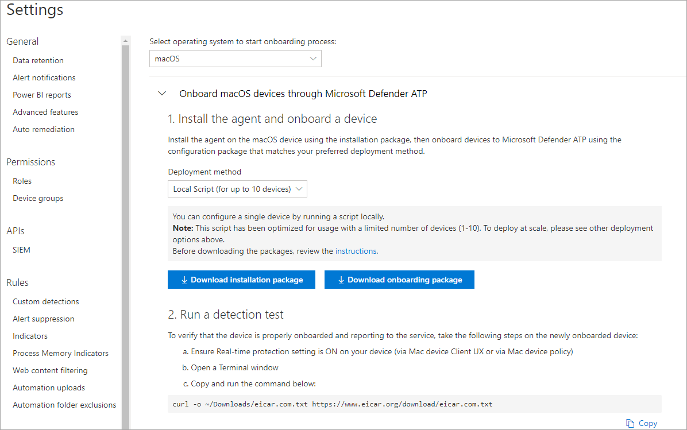
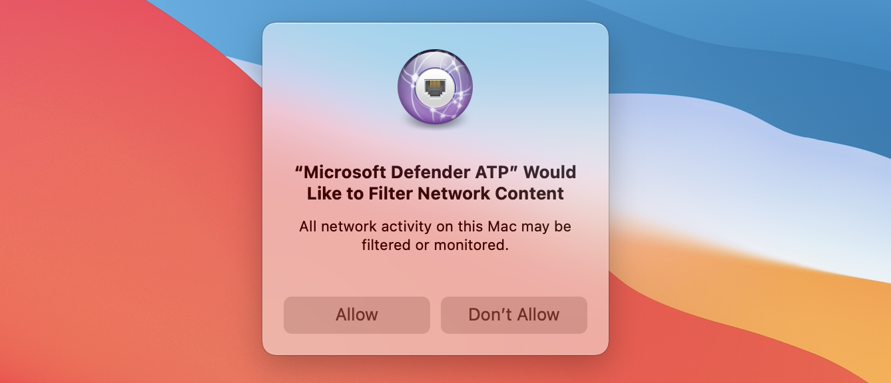

# <a name="manual-deployment-for-microsoft-defender-for-endpoint-on-macos"></a>macOS での Microsoft Defender for Endpoint の手動展開

[!INCLUDE [Microsoft 365 Defender rebranding](../../includes/microsoft-defender.md)]

**適用対象:**
- [Microsoft Defender for Endpoint](https://go.microsoft.com/fwlink/p/?linkid=2154037)
- [Microsoft 365 Defender](https://go.microsoft.com/fwlink/?linkid=2118804)

> Defender for Endpoint を体験してみませんか? [無料試用版にサインアップしてください。](https://www.microsoft.com/microsoft-365/windows/microsoft-defender-atp?ocid=docs-wdatp-investigateip-abovefoldlink)

このトピックでは、Microsoft Defender for Endpoint を macOS に手動で展開する方法について説明します。 展開が成功するには、次のすべての手順を完了する必要があります。
- [インストール パッケージとオンボーディング パッケージのダウンロード](#download-installation-and-onboarding-packages)
- [アプリケーションのインストール (macOS 10.15 以前のバージョン)](#application-installation-macos-1015-and-older-versions)
- [アプリケーションのインストール (macOS 11 以降のバージョン)](#application-installation-macos-11-and-newer-versions)
- [クライアント構成](#client-configuration)

## <a name="prerequisites-and-system-requirements"></a>前提条件とシステム要件

開始する前に、現在のソフトウェア バージョンの前提条件とシステム要件の説明については、メインの [Microsoft Defender for Endpoint on macOS](microsoft-defender-endpoint-mac.md) ページを参照してください。

## <a name="download-installation-and-onboarding-packages"></a>インストール パッケージとオンボーディング パッケージのダウンロード

インストールパッケージとオンボーディング パッケージを次の手順でダウンロードMicrosoft Defender セキュリティ センター。

1. [Microsoft Defender セキュリティ センター] で、[デバイス管理 **設定 >オンボーディング>に移動します**。
2. ページのセクション 1 で、オペレーティング システムを **macOS** に設定し、Deployment メソッドをローカル スクリプト **に設定します**。
3. ページのセクション 2 で、[インストール パッケージのダウンロード **] を選択します**。 wdav.pkg としてローカル ディレクトリに保存します。
4. ページのセクション 2 で、[オンボーディング パッケージの **ダウンロード] を選択します**。 同じディレクトリWindowsDefenderATPOnboardingPackage.zipとして保存します。

    

5. コマンド プロンプトから、2 つのファイルが存在するように確認します。
    
## <a name="application-installation-macos-1015-and-older-versions"></a>アプリケーションのインストール (macOS 10.15 以前のバージョン)

このプロセスを完了するには、デバイスに対する管理者権限が必要です。

1. Finder でダウンロードした wdav.pkg に移動し、開きます。

    

2. [ **続行] を** 選択し、ライセンス条項に同意し、メッセージが表示されたらパスワードを入力します。

    

   > [!IMPORTANT]
   > Microsoft のドライバーのインストールを許可するように求めるメッセージが表示されます ("System Extension Blocked" または "Installation is on hold" のいずれかまたは両方)。 ドライバーのインストールを許可する必要があります。

   

3. [ **セキュリティの基本設定を開く]** または [システム環境設定を開く **] >[セキュリティ] &選択します**。 [許可 **] を選択します**。

    

   インストールが続行されます。

   > [!CAUTION]
   > [許可] を選択しない **場合**、インストールは 5 分後に続行されます。 Microsoft Defender for Endpoint が読み込まれますが、リアルタイム保護などの一部の機能は無効になります。 これを解決 [する方法については、「カーネル拡張機能の問題](mac-support-kext.md) のトラブルシューティング」を参照してください。

> [!NOTE]
> macOS は、Microsoft Defender for Endpoint の最初のインストール時にデバイスの再起動を要求する場合があります。 デバイスが再起動されるまで、リアルタイム保護は利用できません。

## <a name="application-installation-macos-11-and-newer-versions"></a>アプリケーションのインストール (macOS 11 以降のバージョン)

このプロセスを完了するには、デバイスに対する管理者権限が必要です。

1. Finder でダウンロードした wdav.pkg に移動し、開きます。

    

2. [ **続行] を** 選択し、ライセンス条項に同意し、メッセージが表示されたらパスワードを入力します。

3. インストール プロセスの最後に、製品で使用されるシステム拡張機能を承認するように昇格されます。 [Open **Security Preferences] を選択します**。

    

4. [セキュリティ] **ウィンドウの [&] ウィンドウで** 、[許可] を **選択します**。

    

5. Microsoft Defender for Endpoint on Mac で配布&すべてのシステム拡張機能について、手順 3 から 4 を繰り返します。

6. エンドポイント検出と応答機能の一環として、Microsoft Defender for Endpoint on Mac はソケット トラフィックを検査し、この情報をポータルにMicrosoft Defender セキュリティ センターします。 ネットワーク トラフィックをフィルター処理するための Microsoft Defender for Endpoint アクセス許可の付与を求めるメッセージが表示されたら、[許可] を **選択します**。

    

7. [System **Preferences** Security & プライバシー] を開き、[プライバシー] タブに移動します。[エンドポイント セキュリティ拡張機能] および [エンドポイント セキュリティ拡張機能] に対するフル  >  **Microsoft Defender ATP** アクセスMicrosoft Defender ATP **を付与します**。  

    

## <a name="client-configuration"></a>クライアント構成

1. wdav.pkg と MicrosoftDefenderATPOnboardingMacOs.py を macOS に Microsoft Defender for Endpoint を展開するデバイスにコピーします。

    クライアント デバイスがクライアント デバイスに関連付org_id。 org_id *属性は* 空白です。

    ```bash
    mdatp health --field org_id
    ```

2. Python スクリプトを実行して構成ファイルをインストールします。

    ```bash
    /usr/bin/python MicrosoftDefenderATPOnboardingMacOs.py
    ```

3. デバイスが組織に関連付けられたので、有効な組織 ID を報告します。

    ```bash
    mdatp health --field org_id
    ```

    インストール後、右上隅の macOS ステータス バーに Microsoft Defender アイコンが表示されます。
    
    > [!div class="mx-imgBorder"]
    > 


## <a name="how-to-allow-full-disk-access"></a>フル ディスク アクセスを許可する方法

> [!CAUTION]
> macOS 10.15 (Catalina) には、新しいセキュリティとプライバシーの強化が含まれている。 このバージョンでは、既定では、アプリケーションは明示的な同意なしにディスク上の特定の場所 (ドキュメント、ダウンロード、デスクトップなど) にアクセスできません。 この同意がない場合、Microsoft Defender for Endpoint はデバイスを完全に保護できません。

1. 同意を許可するには **、[System Preferences**  >  **Security &プライバシー**  >  **のフル** ディスク アクセス  >  **] を開きます**。 ロック アイコンをクリックして変更します (ダイアログ ボックスの下部)。 [エンドポイント用 Microsoft Defender] を選択します。

2. AV 検出テストを実行して、デバイスが適切にオンボードされ、サービスに報告されていることを確認します。 新しくオンボードされたデバイスで次の手順を実行します。

    1. リアルタイム保護が有効であることを確認します (次のコマンドを実行した結果 1 で示されます)。

        ```bash
        mdatp health --field real_time_protection_enabled
        ```

    1. ターミナル ウィンドウを開きます。 次のコマンドをコピーして実行します。

        ```bash
        curl -o ~/Downloads/eicar.com.txt https://www.eicar.org/download/eicar.com.txt
        ```

    1. このファイルは、Defender for Endpoint on Mac で検疫されている必要があります。 次のコマンドを使用して、検出された脅威の一覧を表示します。

        ```bash
        mdatp threat list
        ```

3. デバイスが適切EDRオンボーディングされ、サービスに報告されていることを確認するには、デバイス検出テストを実行します。 新しくオンボードされたデバイスで次の手順を実行します。

   1. Mac や Safari のMicrosoft Edgeブラウザーで使用します。

   1. MacOS MDATPをダウンロードDIY.zip抽出 https://aka.ms/mdatpmacosdiy します。

      次のメッセージが表示される場合があります。

      > "mdatpclientanalyzer.blob.core.windows.net" でダウンロードを許可しますか?<br/>
      > [Web サイトの基本設定] でファイルをダウンロードできる Web サイトを変更できます。

4. **[許可]** をクリックします。

5. [ **ダウンロード] を開きます**。

6. MacOS **DIY のMDATPが表示されます**。

   > [!TIP]
   > ダブルクリックすると、次のメッセージが表示されます。
   > 
   > > **"MDATP MacOS DIY" は、開発者が検証者になれませんので開くことができません。**<br/>
   > > macOS は、このアプリがマルウェアから解放されているのを確認できません。<br/>
   > > **\[ ごみ箱の \] 取り消しに****\[ 移動する \]** 
  
7. [ **キャンセル**] をクリックします。

8. **MacOS DIY を右MDATPクリックし**、[開く] を **クリックします**。 

    システムは、次のメッセージを表示する必要があります。

    > **macOS では、MacOS DIY の **開発者MDATP確認できません**。本当に開く必要がありますか?**<br/>
    > このアプリを開いて、コンピューターと個人情報を Mac に害を与えるマルウェアやプライバシーを侵害する可能性のあるシステム セキュリティを上書きします。

10. [ **開く**] をクリックします。

    システムは、次のメッセージを表示する必要があります。

    > Microsoft Defender for Endpoint - macOS EDR DIY テスト ファイル<br/>
    > 対応するアラートは、ポータルでMDATPされます。

11. [ **開く**] をクリックします。

    数分後に、"macOS EDRテスト アラート" という名前のアラートが発生する必要があります。

12. [次のMicrosoft Defender セキュリティ センター ] に移動 https://SecurityCenter.microsoft.com) します。

13. [アラート キュー] に移動します。

    :::image type="content" source="images/b8db76c2-c368-49ad-970f-dcb87534d9be.png" alt-text="重大度、カテゴリ、検出EDRアクションの折りたたみメニューを示す macOS テスト アラートの例。":::
    
    アラートの詳細とデバイスのタイムラインを確認し、通常の調査手順を実行します。

## <a name="logging-installation-issues"></a>インストールの問題をログに記録する

エラー [が発生した場合に](mac-resources.md#logging-installation-issues) インストーラーによって作成される自動的に生成されたログを検索する方法の詳細については、「インストールの問題のログ記録」を参照してください。

## <a name="uninstallation"></a>アンインストール

クライアント デバイス [から](mac-resources.md#uninstalling) macOS 上の Microsoft Defender for Endpoint を削除する方法の詳細については、「アンインストール」を参照してください。
