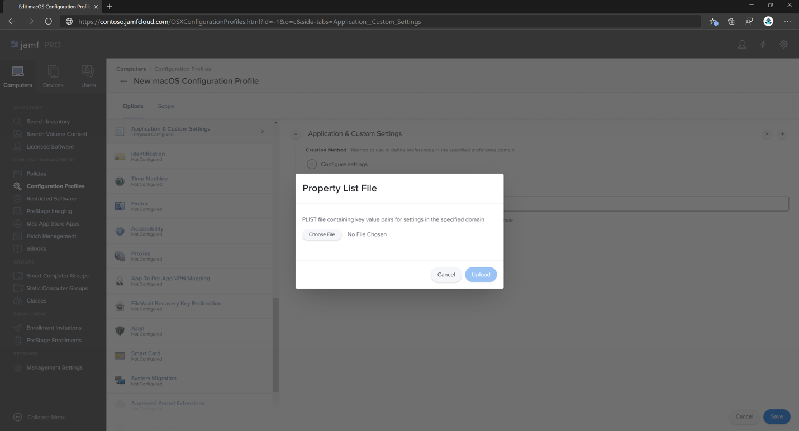
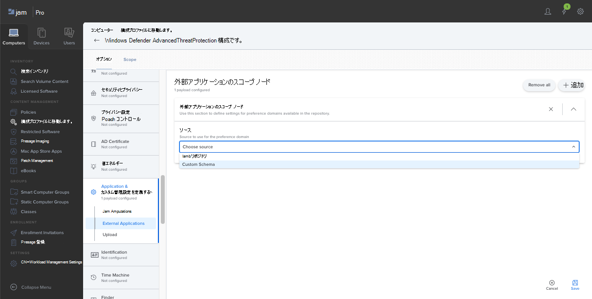
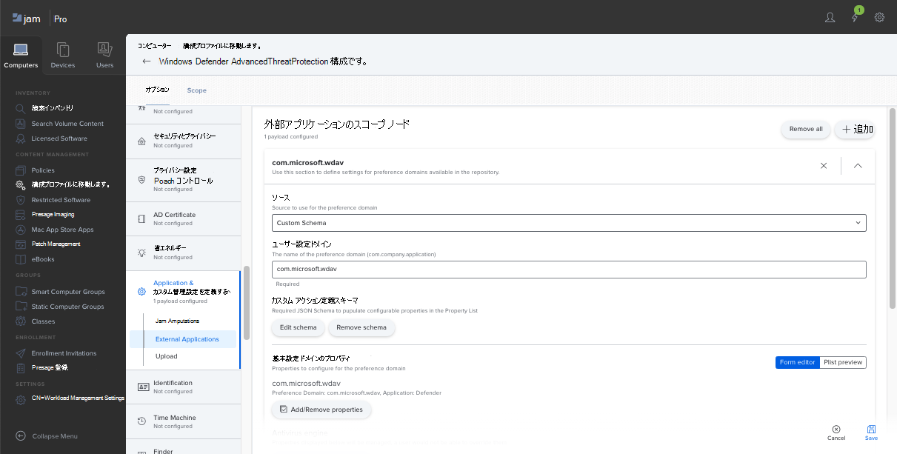
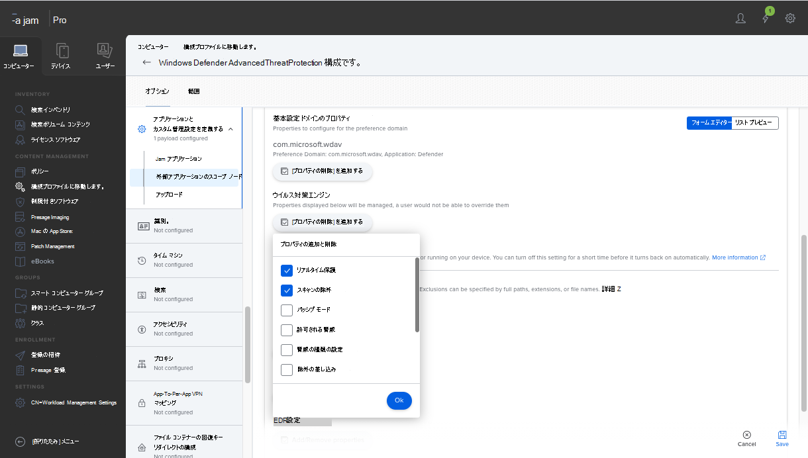

# <a name="set-up-the-microsoft-defender-for-endpoint-on-macos-policies-in-jamf-pro"></a><span data-ttu-id="5ed13-104">Jamf の macOS ポリシーで Microsoft Defender for Endpoint をセットアップPro</span><span class="sxs-lookup"><span data-stu-id="5ed13-104">Set up the Microsoft Defender for Endpoint on macOS policies in Jamf Pro</span></span>

[!INCLUDE [Microsoft 365 Defender rebranding](../../includes/microsoft-defender.md)]


<span data-ttu-id="5ed13-105">**適用対象:**</span><span class="sxs-lookup"><span data-stu-id="5ed13-105">**Applies to:**</span></span>

- [<span data-ttu-id="5ed13-106">Defender for Endpoint on Mac</span><span class="sxs-lookup"><span data-stu-id="5ed13-106">Defender for Endpoint on Mac</span></span>](microsoft-defender-endpoint-mac.md)

<span data-ttu-id="5ed13-107">このページでは、Jamf ポリシーで macOS ポリシーをセットアップするために必要な手順をPro。</span><span class="sxs-lookup"><span data-stu-id="5ed13-107">This page will guide you through the steps you need to take to set up macOS policies in Jamf Pro.</span></span>

<span data-ttu-id="5ed13-108">次の手順を実行する必要があります。</span><span class="sxs-lookup"><span data-stu-id="5ed13-108">You'll need to take the following steps:</span></span>

1. [<span data-ttu-id="5ed13-109">Microsoft Defender for Endpoint オンボーディング パッケージの取得</span><span class="sxs-lookup"><span data-stu-id="5ed13-109">Get the Microsoft Defender for Endpoint onboarding package</span></span>](#step-1-get-the-microsoft-defender-for-endpoint-onboarding-package)

2. [<span data-ttu-id="5ed13-110">オンボード パッケージを使用して Jamf Pro構成プロファイルを作成する</span><span class="sxs-lookup"><span data-stu-id="5ed13-110">Create a configuration profile in Jamf Pro using the onboarding package</span></span>](#step-2-create-a-configuration-profile-in-jamf-pro-using-the-onboarding-package)

3. [<span data-ttu-id="5ed13-111">エンドポイントの Microsoft Defender の設定を構成する</span><span class="sxs-lookup"><span data-stu-id="5ed13-111">Configure Microsoft Defender for Endpoint settings</span></span>](#step-3-configure-microsoft-defender-for-endpoint-settings)

4. [<span data-ttu-id="5ed13-112">Microsoft Defender for Endpoint 通知の設定を構成する</span><span class="sxs-lookup"><span data-stu-id="5ed13-112">Configure Microsoft Defender for Endpoint notification settings</span></span>](#step-4-configure-notifications-settings)

5. [<span data-ttu-id="5ed13-113">Microsoft AutoUpdate (MAU) の構成</span><span class="sxs-lookup"><span data-stu-id="5ed13-113">Configure Microsoft AutoUpdate (MAU)</span></span>](#step-5-configure-microsoft-autoupdate-mau)

6. [<span data-ttu-id="5ed13-114">Microsoft Defender for Endpoint へのフル ディスク アクセスを許可する</span><span class="sxs-lookup"><span data-stu-id="5ed13-114">Grant full disk access to Microsoft Defender for Endpoint</span></span>](#step-6-grant-full-disk-access-to-microsoft-defender-for-endpoint)

7. [<span data-ttu-id="5ed13-115">Microsoft Defender for Endpoint のカーネル拡張機能を承認する</span><span class="sxs-lookup"><span data-stu-id="5ed13-115">Approve Kernel extension for Microsoft Defender for Endpoint</span></span>](#step-7-approve-kernel-extension-for-microsoft-defender-for-endpoint)

8. [<span data-ttu-id="5ed13-116">エンドポイント用 Microsoft Defender のシステム拡張機能を承認する</span><span class="sxs-lookup"><span data-stu-id="5ed13-116">Approve System extensions for Microsoft Defender for Endpoint</span></span>](#step-8-approve-system-extensions-for-microsoft-defender-for-endpoint)

9. [<span data-ttu-id="5ed13-117">ネットワーク拡張機能の構成</span><span class="sxs-lookup"><span data-stu-id="5ed13-117">Configure Network Extension</span></span>](#step-9-configure-network-extension)

10. [<span data-ttu-id="5ed13-118">macOS で Microsoft Defender for Endpoint でスキャンをスケジュールする</span><span class="sxs-lookup"><span data-stu-id="5ed13-118">Schedule scans with Microsoft Defender for Endpoint on macOS</span></span>](/windows/security/threat-protection/microsoft-defender-atp/mac-schedule-scan-atp)

11. [<span data-ttu-id="5ed13-119">macOS での Microsoft Defender for Endpoint の展開</span><span class="sxs-lookup"><span data-stu-id="5ed13-119">Deploy Microsoft Defender for Endpoint on macOS</span></span>](#step-11-deploy-microsoft-defender-for-endpoint-on-macos)


## <a name="step-1-get-the-microsoft-defender-for-endpoint-onboarding-package"></a><span data-ttu-id="5ed13-120">手順 1: Microsoft Defender for Endpoint オンボーディング パッケージを取得する</span><span class="sxs-lookup"><span data-stu-id="5ed13-120">Step 1: Get the Microsoft Defender for Endpoint onboarding package</span></span>

1. <span data-ttu-id="5ed13-121">[[Microsoft Defender セキュリティ センター]](https://securitycenter.microsoft.com)で、[オンボーディング]**設定 >移動します**。</span><span class="sxs-lookup"><span data-stu-id="5ed13-121">In [Microsoft Defender Security Center](https://securitycenter.microsoft.com), navigate to **Settings > Onboarding**.</span></span>

2. <span data-ttu-id="5ed13-122">オペレーティング システムとして macOS を、展開方法として [モバイル デバイスMicrosoft Intuneを選択します。</span><span class="sxs-lookup"><span data-stu-id="5ed13-122">Select macOS as the operating system and Mobile Device Management / Microsoft Intune as the deployment method.</span></span>

    

3. <span data-ttu-id="5ed13-124">[ **オンボード パッケージのダウンロード] (WindowsDefenderATPOnboardingPackage.zip)** を選択します。</span><span class="sxs-lookup"><span data-stu-id="5ed13-124">Select **Download onboarding package** (WindowsDefenderATPOnboardingPackage.zip).</span></span>

4. <span data-ttu-id="5ed13-125">抽出 `WindowsDefenderATPOnboardingPackage.zip` .</span><span class="sxs-lookup"><span data-stu-id="5ed13-125">Extract `WindowsDefenderATPOnboardingPackage.zip`.</span></span>

5. <span data-ttu-id="5ed13-126">ファイルを好みの場所にコピーします。</span><span class="sxs-lookup"><span data-stu-id="5ed13-126">Copy the file to your preferred location.</span></span> <span data-ttu-id="5ed13-127">例: `C:\Users\JaneDoe_or_JohnDoe.contoso\Downloads\WindowsDefenderATPOnboardingPackage_macOS_MDM_contoso\jamf\WindowsDefenderATPOnboarding.plist`。</span><span class="sxs-lookup"><span data-stu-id="5ed13-127">For example,  `C:\Users\JaneDoe_or_JohnDoe.contoso\Downloads\WindowsDefenderATPOnboardingPackage_macOS_MDM_contoso\jamf\WindowsDefenderATPOnboarding.plist`.</span></span>


## <a name="step-2-create-a-configuration-profile-in-jamf-pro-using-the-onboarding-package"></a><span data-ttu-id="5ed13-128">手順 2: オンボード パッケージを使用して Jamf Pro構成プロファイルを作成する</span><span class="sxs-lookup"><span data-stu-id="5ed13-128">Step 2: Create a configuration profile in Jamf Pro using the onboarding package</span></span>

1. <span data-ttu-id="5ed13-129">前のセクション `WindowsDefenderATPOnboarding.plist` からファイルを探します。</span><span class="sxs-lookup"><span data-stu-id="5ed13-129">Locate the file `WindowsDefenderATPOnboarding.plist` from the previous section.</span></span>

   


2. <span data-ttu-id="5ed13-131">Jamf Proで、[新規] を **選択します**。</span><span class="sxs-lookup"><span data-stu-id="5ed13-131">In the Jamf Pro dashboard, select **New**.</span></span>

    

3. <span data-ttu-id="5ed13-133">次の詳細を入力します。</span><span class="sxs-lookup"><span data-stu-id="5ed13-133">Enter the following details:</span></span>

   <span data-ttu-id="5ed13-134">**全般**</span><span class="sxs-lookup"><span data-stu-id="5ed13-134">**General**</span></span>
   - <span data-ttu-id="5ed13-135">名前: macOS の MDATP オンボーディング</span><span class="sxs-lookup"><span data-stu-id="5ed13-135">Name: MDATP onboarding for macOS</span></span>
   - <span data-ttu-id="5ed13-136">説明: mDATP EDR macOS のオンボーディング</span><span class="sxs-lookup"><span data-stu-id="5ed13-136">Description: MDATP EDR onboarding for macOS</span></span>
   - <span data-ttu-id="5ed13-137">カテゴリ: なし</span><span class="sxs-lookup"><span data-stu-id="5ed13-137">Category: None</span></span>
   - <span data-ttu-id="5ed13-138">配布方法: 自動的にインストールする</span><span class="sxs-lookup"><span data-stu-id="5ed13-138">Distribution Method: Install Automatically</span></span>
   - <span data-ttu-id="5ed13-139">レベル: コンピューター レベル</span><span class="sxs-lookup"><span data-stu-id="5ed13-139">Level: Computer Level</span></span>

4. <span data-ttu-id="5ed13-140">[**アプリケーション の設定&カスタム 設定** 構成] を **選択します**。</span><span class="sxs-lookup"><span data-stu-id="5ed13-140">In **Application & Custom Settings** select **Configure**.</span></span>

    

5. <span data-ttu-id="5ed13-142">**[アップロードファイル (PLIST ファイル) を選択し、[基本設定ドメイン]** **に次を** 入力します `com.microsoft.wdav.atp` 。</span><span class="sxs-lookup"><span data-stu-id="5ed13-142">Select **Upload File (PLIST file)** then in **Preference Domain** enter: `com.microsoft.wdav.atp`.</span></span>

    

    

6. <span data-ttu-id="5ed13-145">[開 **く] を** 選択し、オンボーディング ファイルを選択します。</span><span class="sxs-lookup"><span data-stu-id="5ed13-145">Select **Open** and select the onboarding file.</span></span>

    

7. <span data-ttu-id="5ed13-147">[アップロード]**を選択します**。</span><span class="sxs-lookup"><span data-stu-id="5ed13-147">Select **Upload**.</span></span>

    

8. <span data-ttu-id="5ed13-149">[スコープ] **タブを選択** します。</span><span class="sxs-lookup"><span data-stu-id="5ed13-149">Select the **Scope** tab.</span></span>

    ![[スコープのイメージ] タブ](images/jamfpro-scope-tab.png)

9. <span data-ttu-id="5ed13-151">ターゲット コンピューターを選択します。</span><span class="sxs-lookup"><span data-stu-id="5ed13-151">Select the target computers.</span></span>

    

    

10. <span data-ttu-id="5ed13-154">**[保存]** を選択します。</span><span class="sxs-lookup"><span data-stu-id="5ed13-154">Select **Save**.</span></span>

    

    

11. <span data-ttu-id="5ed13-157">**[完了]** を選択します。</span><span class="sxs-lookup"><span data-stu-id="5ed13-157">Select **Done**.</span></span>

    

    

## <a name="step-3-configure-microsoft-defender-for-endpoint-settings"></a><span data-ttu-id="5ed13-160">手順 3: エンドポイントの Microsoft Defender の設定を構成する</span><span class="sxs-lookup"><span data-stu-id="5ed13-160">Step 3: Configure Microsoft Defender for Endpoint settings</span></span>

<span data-ttu-id="5ed13-161">JAMF Pro GUI を使用して Microsoft Defender 構成の個々の設定を編集するか、テキスト エディターで構成 Plist を作成して JAMF Pro にアップロードすることで従来のメソッドを使用できます。</span><span class="sxs-lookup"><span data-stu-id="5ed13-161">You can either use JAMF Pro GUI to edit individual settings of the Microsoft Defender configuration, or use the legacy method by creating a configuration Plist in a text editor, and uploading it to JAMF Pro.</span></span>

<span data-ttu-id="5ed13-162">ユーザー設定ドメインとして正確に使用する必要があります。Microsoft Defender では、この名前のみを使用し、管理設定 `com.microsoft.wdav`  `com.microsoft.wdav.ext` を読み込む必要があります。</span><span class="sxs-lookup"><span data-stu-id="5ed13-162">Note that you must use exact `com.microsoft.wdav` as the **Preference Domain**, Microsoft Defender uses only this name and `com.microsoft.wdav.ext` to load its managed settings!</span></span>

<span data-ttu-id="5ed13-163">(GUI メソッドを使用する場合はまれにバージョンを使用できますが、スキーマにまだ追加されていない設定を構成する `com.microsoft.wdav.ext` 必要があります)。</span><span class="sxs-lookup"><span data-stu-id="5ed13-163">(The `com.microsoft.wdav.ext` version may be used in rare cases when you prefer to use GUI method, but also need to configure a setting that has not been added to the schema yet.)</span></span>

### <a name="gui-method"></a><span data-ttu-id="5ed13-164">GUI メソッド</span><span class="sxs-lookup"><span data-stu-id="5ed13-164">GUI method</span></span>

1. <span data-ttu-id="5ed13-165">Defender schema.jsリポジトリからファイルにGitHub[し](https://github.com/microsoft/mdatp-xplat/tree/master/macos/schema)、ローカル ファイルに保存します。</span><span class="sxs-lookup"><span data-stu-id="5ed13-165">Download schema.json file from [Defender's GitHub repository](https://github.com/microsoft/mdatp-xplat/tree/master/macos/schema) and save it to a local file:</span></span>

    ```bash
    curl -o ~/Documents/schema.json https://raw.githubusercontent.com/microsoft/mdatp-xplat/master/macos/schema/schema.json
    ```

2. <span data-ttu-id="5ed13-166">[コンピューター- >構成プロファイル] の下に新しい構成プロファイルを作成し、[全般] タブに次の詳細を **入力** します。</span><span class="sxs-lookup"><span data-stu-id="5ed13-166">Create a new Configuration Profile under Computers -> Configuration Profiles, enter the following details on the **General** tab:</span></span>

    

    - <span data-ttu-id="5ed13-168">名前: MDATP MDAV 構成設定</span><span class="sxs-lookup"><span data-stu-id="5ed13-168">Name: MDATP MDAV configuration settings</span></span>
    - <span data-ttu-id="5ed13-169">説明:\<blank\></span><span class="sxs-lookup"><span data-stu-id="5ed13-169">Description:\<blank\></span></span>
    - <span data-ttu-id="5ed13-170">カテゴリ: なし (既定)</span><span class="sxs-lookup"><span data-stu-id="5ed13-170">Category: None (default)</span></span>
    - <span data-ttu-id="5ed13-171">レベル: コンピューター レベル (既定)</span><span class="sxs-lookup"><span data-stu-id="5ed13-171">Level: Computer Level (default)</span></span>
    - <span data-ttu-id="5ed13-172">配布方法: 自動インストール (既定)</span><span class="sxs-lookup"><span data-stu-id="5ed13-172">Distribution Method: Install Automatically (default)</span></span>

3. <span data-ttu-id="5ed13-173">下にスクロールして 、[アプリケーション &**カスタム** 設定] タブをクリックし、[外部アプリケーション] を選択し、[追加] をクリックして、カスタム スキーマをソースとして使用して、基本設定ドメインに使用します。 </span><span class="sxs-lookup"><span data-stu-id="5ed13-173">Scroll down to the **Application & Custom Settings** tab, select **External Applications**, click **Add** and use **Custom Schema** as Source to use for the preference domain.</span></span>

    

4. <span data-ttu-id="5ed13-175">[ `com.microsoft.wdav` 基本設定ドメイン] として入力し、[スキーマの追加] をクリックし **アップロード** 手順 1 でschema.jsを選択します。</span><span class="sxs-lookup"><span data-stu-id="5ed13-175">Enter `com.microsoft.wdav` as the Preference Domain, click on **Add Schema** and **Upload** the schema.json file downloaded on Step 1.</span></span> <span data-ttu-id="5ed13-176">**[保存]** をクリックします。</span><span class="sxs-lookup"><span data-stu-id="5ed13-176">Click **Save**.</span></span>

    

5. <span data-ttu-id="5ed13-178">サポートされている Microsoft Defender 構成設定はすべて、以下の [基本設定ドメインのプロパティ] **の下に表示されます**。</span><span class="sxs-lookup"><span data-stu-id="5ed13-178">You can see all supported Microsoft Defender configuration settings below, under **Preference Domain Properties**.</span></span> <span data-ttu-id="5ed13-179">[ **プロパティの追加と削除]** をクリックして、管理する設定を選択し **、[OK]** をクリックして変更を保存します。</span><span class="sxs-lookup"><span data-stu-id="5ed13-179">Click **Add/Remove properties** to select the settings that you want to be managed, and click **Ok** to save your changes.</span></span> <span data-ttu-id="5ed13-180">(設定選択されていない場合、エンド ユーザーはそれらの設定を自分のコンピューターで構成できます。</span><span class="sxs-lookup"><span data-stu-id="5ed13-180">(Settings left unselected will not be included into the managed configuration, an end user will be able to configure those settings on their machines.)</span></span>

    

6. <span data-ttu-id="5ed13-182">設定の値を目的の値に変更します。</span><span class="sxs-lookup"><span data-stu-id="5ed13-182">Change values of the settings to desired values.</span></span> <span data-ttu-id="5ed13-183">[詳細] **をクリックすると、** 特定の設定のドキュメントを取得できます。</span><span class="sxs-lookup"><span data-stu-id="5ed13-183">You can click **More information** to get documentation for a particular setting.</span></span> <span data-ttu-id="5ed13-184">**([Plist プレビュー] をクリックして**、構成 plist の外観を確認できます。</span><span class="sxs-lookup"><span data-stu-id="5ed13-184">(You may click **Plist preview** to inspect what the configuration plist will look like.</span></span> <span data-ttu-id="5ed13-185">[ **フォーム エディター] を** クリックしてビジュアル エディターに戻る)。</span><span class="sxs-lookup"><span data-stu-id="5ed13-185">Click **Form editor** to return to the visual editor.)</span></span>

    

7. <span data-ttu-id="5ed13-187">[スコープ] **タブを選択** します。</span><span class="sxs-lookup"><span data-stu-id="5ed13-187">Select the **Scope** tab.</span></span>

    

8. <span data-ttu-id="5ed13-189">**[Contoso's Machine Group] を選択します**。</span><span class="sxs-lookup"><span data-stu-id="5ed13-189">Select **Contoso's Machine Group**.</span></span>

9. <span data-ttu-id="5ed13-190">[追加 **] を** 選択し、[保存] **を選択します**。</span><span class="sxs-lookup"><span data-stu-id="5ed13-190">Select **Add**, then select **Save**.</span></span>

    

    

10. <span data-ttu-id="5ed13-193">**[完了]** を選択します。</span><span class="sxs-lookup"><span data-stu-id="5ed13-193">Select **Done**.</span></span> <span data-ttu-id="5ed13-194">新しい構成プロファイルが **表示されます**。</span><span class="sxs-lookup"><span data-stu-id="5ed13-194">You'll see the new **Configuration profile**.</span></span>

    

<span data-ttu-id="5ed13-196">Microsoft Defender は、時間の間に新しい設定を追加します。</span><span class="sxs-lookup"><span data-stu-id="5ed13-196">Microsoft Defender adds new settings over time.</span></span> <span data-ttu-id="5ed13-197">これらの新しい設定がスキーマに追加され、新しいバージョンが Github に発行されます。</span><span class="sxs-lookup"><span data-stu-id="5ed13-197">These new settings will be added to the schema, and a new version will be published to Github.</span></span>
<span data-ttu-id="5ed13-198">更新を行う必要があるのは、更新されたスキーマのダウンロード、既存の構成プロファイルの編集、およびスキーマの編集を[アプリケーションの設定] タブで行&**する** 設定です。</span><span class="sxs-lookup"><span data-stu-id="5ed13-198">All you need to do to have updates is to download an updated schema, edit existing configuration profile, and **Edit schema** at the **Application & Custom Settings** tab.</span></span>

### <a name="legacy-method"></a><span data-ttu-id="5ed13-199">従来のメソッド</span><span class="sxs-lookup"><span data-stu-id="5ed13-199">Legacy method</span></span>

1. <span data-ttu-id="5ed13-200">次の Microsoft Defender for Endpoint 構成設定を使用します。</span><span class="sxs-lookup"><span data-stu-id="5ed13-200">Use the following Microsoft Defender for Endpoint configuration settings:</span></span>

    - <span data-ttu-id="5ed13-201">enableRealTimeProtection</span><span class="sxs-lookup"><span data-stu-id="5ed13-201">enableRealTimeProtection</span></span>
    - <span data-ttu-id="5ed13-202">passiveMode</span><span class="sxs-lookup"><span data-stu-id="5ed13-202">passiveMode</span></span>

    >[!NOTE]
    ><span data-ttu-id="5ed13-203">既定ではオンにされません。macOS 用にサードパーティの AV を実行する予定の場合は、 に設定します `true` 。</span><span class="sxs-lookup"><span data-stu-id="5ed13-203">Not turned on by default, if you are planning to run a third-party AV for macOS, set it to `true`.</span></span>

    - <span data-ttu-id="5ed13-204">除外</span><span class="sxs-lookup"><span data-stu-id="5ed13-204">exclusions</span></span>
    - <span data-ttu-id="5ed13-205">excludedPath</span><span class="sxs-lookup"><span data-stu-id="5ed13-205">excludedPath</span></span>
    - <span data-ttu-id="5ed13-206">excludedFileExtension</span><span class="sxs-lookup"><span data-stu-id="5ed13-206">excludedFileExtension</span></span>
    - <span data-ttu-id="5ed13-207">excludedFileName</span><span class="sxs-lookup"><span data-stu-id="5ed13-207">excludedFileName</span></span>
    - <span data-ttu-id="5ed13-208">exclusionsMergePolicy</span><span class="sxs-lookup"><span data-stu-id="5ed13-208">exclusionsMergePolicy</span></span>
    - <span data-ttu-id="5ed13-209">allowedThreats</span><span class="sxs-lookup"><span data-stu-id="5ed13-209">allowedThreats</span></span>

    >[!NOTE]
    ><span data-ttu-id="5ed13-210">EICAR はサンプルに含め、概念実証を行う場合は、EICAR をテストする場合は特に削除してください。</span><span class="sxs-lookup"><span data-stu-id="5ed13-210">EICAR is on the sample, if you are going through a proof-of-concept, remove it especially if you are testing EICAR.</span></span>

    - <span data-ttu-id="5ed13-211">disallowedThreatActions</span><span class="sxs-lookup"><span data-stu-id="5ed13-211">disallowedThreatActions</span></span>
    - <span data-ttu-id="5ed13-212">potentially_unwanted_application</span><span class="sxs-lookup"><span data-stu-id="5ed13-212">potentially_unwanted_application</span></span>
    - <span data-ttu-id="5ed13-213">archive_bomb</span><span class="sxs-lookup"><span data-stu-id="5ed13-213">archive_bomb</span></span>
    - <span data-ttu-id="5ed13-214">cloudService</span><span class="sxs-lookup"><span data-stu-id="5ed13-214">cloudService</span></span>
    - <span data-ttu-id="5ed13-215">automaticSampleSubmission</span><span class="sxs-lookup"><span data-stu-id="5ed13-215">automaticSampleSubmission</span></span>
    - <span data-ttu-id="5ed13-216">tags</span><span class="sxs-lookup"><span data-stu-id="5ed13-216">tags</span></span>
    - <span data-ttu-id="5ed13-217">hideStatusMenuIcon</span><span class="sxs-lookup"><span data-stu-id="5ed13-217">hideStatusMenuIcon</span></span>

     <span data-ttu-id="5ed13-218">詳細については [、「Jamf 構成プロファイルのプロパティ 一覧」を参照してください](mac-preferences.md#property-list-for-jamf-configuration-profile)。</span><span class="sxs-lookup"><span data-stu-id="5ed13-218">For information, see [Property list for Jamf configuration profile](mac-preferences.md#property-list-for-jamf-configuration-profile).</span></span>

     ```XML
     <?xml version="1.0" encoding="UTF-8"?>
     <!DOCTYPE plist PUBLIC "-//Apple//DTD PLIST 1.0//EN" "http://www.apple.com/DTDs/PropertyList-1.0.dtd">
     <plist version="1.0">
     <dict>
         <key>antivirusEngine</key>
         <dict>
             <key>enableRealTimeProtection</key>
             <true/>
             <key>passiveMode</key>
             <false/>
             <key>exclusions</key>
             <array>
                 <dict>
                     <key>$type</key>
                     <string>excludedPath</string>
                     <key>isDirectory</key>
                     <false/>
                     <key>path</key>
                     <string>/var/log/system.log</string>
                 </dict>
                 <dict>
                     <key>$type</key>
                     <string>excludedPath</string>
                     <key>isDirectory</key>
                     <true/>
                     <key>path</key>
                     <string>/home</string>
                 </dict>
                 <dict>
                     <key>$type</key>
                     <string>excludedFileExtension</string>
                     <key>extension</key>
                     <string>pdf</string>
                 </dict>
                 <dict>
                     <key>$type</key>
                     <string>excludedFileName</string>
                     <key>name</key>
                     <string>cat</string>
                 </dict>
             </array>
             <key>exclusionsMergePolicy</key>
             <string>merge</string>
             <key>allowedThreats</key>
             <array>
                 <string>EICAR-Test-File (not a virus)</string>
             </array>
             <key>disallowedThreatActions</key>
             <array>
                 <string>allow</string>
                 <string>restore</string>
             </array>
             <key>threatTypeSettings</key>
             <array>
                 <dict>
                     <key>key</key>
                     <string>potentially_unwanted_application</string>
                     <key>value</key>
                     <string>block</string>
                 </dict>
                 <dict>
                     <key>key</key>
                     <string>archive_bomb</string>
                     <key>value</key>
                     <string>audit</string>
                 </dict>
             </array>
             <key>threatTypeSettingsMergePolicy</key>
             <string>merge</string>
         </dict>
         <key>cloudService</key>
         <dict>
             <key>enabled</key>
             <true/>
             <key>diagnosticLevel</key>
             <string>optional</string>
             <key>automaticSampleSubmission</key>
             <true/>
         </dict>
         <key>edr</key>
         <dict>
             <key>tags</key>
             <array>
                 <dict>
                     <key>key</key>
                     <string>GROUP</string>
                     <key>value</key>
                     <string>ExampleTag</string>
                 </dict>
             </array>
         </dict>
         <key>userInterface</key>
         <dict>
             <key>hideStatusMenuIcon</key>
             <false/>
         </dict>
     </dict>
     </plist>
     ```

2. <span data-ttu-id="5ed13-219">ファイルをとして保存します `MDATP_MDAV_configuration_settings.plist` 。</span><span class="sxs-lookup"><span data-stu-id="5ed13-219">Save the file as `MDATP_MDAV_configuration_settings.plist`.</span></span>

3. <span data-ttu-id="5ed13-220">Jamf Proで、[コンピューター] を **開** き、[**構成プロファイル] を開きます**。</span><span class="sxs-lookup"><span data-stu-id="5ed13-220">In the Jamf Pro dashboard, open **Computers**, and there **Configuration Profiles**.</span></span> <span data-ttu-id="5ed13-221">[\**New] をクリックし* 、[全般] タブ **に切り替** えます。</span><span class="sxs-lookup"><span data-stu-id="5ed13-221">Click \**New(* and switch to the **General** tab.</span></span>

    

4. <span data-ttu-id="5ed13-223">次の詳細を入力します。</span><span class="sxs-lookup"><span data-stu-id="5ed13-223">Enter the following details:</span></span>

    <span data-ttu-id="5ed13-224">**全般**</span><span class="sxs-lookup"><span data-stu-id="5ed13-224">**General**</span></span>

    - <span data-ttu-id="5ed13-225">名前: MDATP MDAV 構成設定</span><span class="sxs-lookup"><span data-stu-id="5ed13-225">Name: MDATP MDAV configuration settings</span></span>
    - <span data-ttu-id="5ed13-226">説明:\<blank\></span><span class="sxs-lookup"><span data-stu-id="5ed13-226">Description:\<blank\></span></span>
    - <span data-ttu-id="5ed13-227">カテゴリ: なし (既定)</span><span class="sxs-lookup"><span data-stu-id="5ed13-227">Category: None (default)</span></span>
    - <span data-ttu-id="5ed13-228">配布方法: 自動インストール(既定)</span><span class="sxs-lookup"><span data-stu-id="5ed13-228">Distribution Method: Install Automatically(default)</span></span>
    - <span data-ttu-id="5ed13-229">Level: Computer Level(default)</span><span class="sxs-lookup"><span data-stu-id="5ed13-229">Level: Computer Level(default)</span></span>

    

5. <span data-ttu-id="5ed13-231">[**アプリケーション の設定&カスタム 設定** 構成] を **選択します**。</span><span class="sxs-lookup"><span data-stu-id="5ed13-231">In **Application & Custom Settings** select **Configure**.</span></span>

    

6. <span data-ttu-id="5ed13-233">[**ファイルアップロード (PLIST ファイル) を選択します**。</span><span class="sxs-lookup"><span data-stu-id="5ed13-233">Select **Upload File (PLIST file)**.</span></span>

    

7. <span data-ttu-id="5ed13-235">[**基本設定ドメイン] で** `com.microsoft.wdav` 、「PLIST ファイル」と入力アップロード **選択します**。</span><span class="sxs-lookup"><span data-stu-id="5ed13-235">In **Preferences Domain**, enter `com.microsoft.wdav`, then select  **Upload PLIST File**.</span></span>

    

8. <span data-ttu-id="5ed13-237">[ファイル **の選択] を選択します**。</span><span class="sxs-lookup"><span data-stu-id="5ed13-237">Select **Choose File**.</span></span>

    

9. <span data-ttu-id="5ed13-239">**[MDATP_MDAV_configuration_settings.plist] を選択し、[** 開く] を **選択します**。</span><span class="sxs-lookup"><span data-stu-id="5ed13-239">Select the **MDATP_MDAV_configuration_settings.plist**, then select **Open**.</span></span>

    

10. <span data-ttu-id="5ed13-241">[アップロード]**を選択します**。</span><span class="sxs-lookup"><span data-stu-id="5ed13-241">Select **Upload**.</span></span>

    

    

    >[!NOTE]
    ><span data-ttu-id="5ed13-244">Intune ファイルをアップロードすると、次のようなエラー メッセージが表示されます。</span><span class="sxs-lookup"><span data-stu-id="5ed13-244">If you happen to upload the Intune file, you'll get the following error:</span></span><br>
    ><span data-ttu-id="5ed13-245"></span><span class="sxs-lookup"><span data-stu-id="5ed13-245"></span></span>


11. <span data-ttu-id="5ed13-246">**[保存]** を選択します。</span><span class="sxs-lookup"><span data-stu-id="5ed13-246">Select **Save**.</span></span>

    

12. <span data-ttu-id="5ed13-248">ファイルがアップロードされます。</span><span class="sxs-lookup"><span data-stu-id="5ed13-248">The file is uploaded.</span></span>

    

    

13. <span data-ttu-id="5ed13-251">[スコープ] **タブを選択** します。</span><span class="sxs-lookup"><span data-stu-id="5ed13-251">Select the **Scope** tab.</span></span>

    

14. <span data-ttu-id="5ed13-253">**[Contoso's Machine Group] を選択します**。</span><span class="sxs-lookup"><span data-stu-id="5ed13-253">Select **Contoso's Machine Group**.</span></span>

15. <span data-ttu-id="5ed13-254">[追加 **] を** 選択し、[保存] **を選択します**。</span><span class="sxs-lookup"><span data-stu-id="5ed13-254">Select **Add**, then select **Save**.</span></span>

    

    

16. <span data-ttu-id="5ed13-257">**[完了]** を選択します。</span><span class="sxs-lookup"><span data-stu-id="5ed13-257">Select **Done**.</span></span> <span data-ttu-id="5ed13-258">新しい構成プロファイルが **表示されます**。</span><span class="sxs-lookup"><span data-stu-id="5ed13-258">You'll see the new **Configuration profile**.</span></span>

    

## <a name="step-4-configure-notifications-settings"></a><span data-ttu-id="5ed13-260">手順 4: 通知の設定を構成する</span><span class="sxs-lookup"><span data-stu-id="5ed13-260">Step 4: Configure notifications settings</span></span>

<span data-ttu-id="5ed13-261">これらの手順は、macOS 10.15 (Catalina) 以降に適用できます。</span><span class="sxs-lookup"><span data-stu-id="5ed13-261">These steps are applicable of macOS 10.15 (Catalina) or newer.</span></span>

1. <span data-ttu-id="5ed13-262">Jamf Proで、[コンピューター] 、[**構成** プロファイル]**の順に選択します**。</span><span class="sxs-lookup"><span data-stu-id="5ed13-262">In the Jamf Pro dashboard, select **Computers**, then **Configuration Profiles**.</span></span>

2. <span data-ttu-id="5ed13-263">[ **新規] を** クリックし、[オプション] に次の詳細を **入力します**。</span><span class="sxs-lookup"><span data-stu-id="5ed13-263">Click **New**, and enter the following details for **Options**:</span></span>

    - <span data-ttu-id="5ed13-264">タブ **全般**:</span><span class="sxs-lookup"><span data-stu-id="5ed13-264">Tab **General**:</span></span>
        - <span data-ttu-id="5ed13-265">**名前**: MDATP MDAV 通知の設定</span><span class="sxs-lookup"><span data-stu-id="5ed13-265">**Name**: MDATP MDAV Notification settings</span></span>
        - <span data-ttu-id="5ed13-266">**説明**: macOS 10.15 (Catalina) 以降</span><span class="sxs-lookup"><span data-stu-id="5ed13-266">**Description**: macOS 10.15 (Catalina) or newer</span></span>
        - <span data-ttu-id="5ed13-267">**カテゴリ**: なし *(既定)*</span><span class="sxs-lookup"><span data-stu-id="5ed13-267">**Category**: None *(default)*</span></span>
        - <span data-ttu-id="5ed13-268">**配布方法**: 自動的にインストール *する (既定)*</span><span class="sxs-lookup"><span data-stu-id="5ed13-268">**Distribution Method**: Install Automatically *(default)*</span></span>
        - <span data-ttu-id="5ed13-269">**レベル**: コンピューター レベル *(既定)*</span><span class="sxs-lookup"><span data-stu-id="5ed13-269">**Level**: Computer Level *(default)*</span></span>

        

    - <span data-ttu-id="5ed13-271">[タブ **通知]** をクリック **し、[追加**] をクリックし、次の値を入力します。</span><span class="sxs-lookup"><span data-stu-id="5ed13-271">Tab **Notifications**, click **Add**, and enter the following values:</span></span>
        - <span data-ttu-id="5ed13-272">**バンドル ID**: `com.microsoft.wdav.tray`</span><span class="sxs-lookup"><span data-stu-id="5ed13-272">**Bundle ID**: `com.microsoft.wdav.tray`</span></span>
        - <span data-ttu-id="5ed13-273">**重大な通知**: [無効にする] **をクリックします。**</span><span class="sxs-lookup"><span data-stu-id="5ed13-273">**Critical Alerts**: Click **Disable**</span></span>
        - <span data-ttu-id="5ed13-274">**通知**: [有効にする **] をクリックします。**</span><span class="sxs-lookup"><span data-stu-id="5ed13-274">**Notifications**: Click **Enable**</span></span>
        - <span data-ttu-id="5ed13-275">**バナー通知の種類**: [含める]**と [一時**]  *(既定) を選択します。*</span><span class="sxs-lookup"><span data-stu-id="5ed13-275">**Banner alert type**: Select **Include** and **Temporary** *(default)*</span></span>
        - <span data-ttu-id="5ed13-276">**ロック画面の通知**: [非表示] **をクリックします。**</span><span class="sxs-lookup"><span data-stu-id="5ed13-276">**Notifications on lock screen**: Click **Hide**</span></span>
        - <span data-ttu-id="5ed13-277">**通知センターの通知**: [表示] を **クリックします。**</span><span class="sxs-lookup"><span data-stu-id="5ed13-277">**Notifications in Notification Center**: Click **Display**</span></span>
        - <span data-ttu-id="5ed13-278">**バッジ アプリのアイコン**: [表示] **をクリックします。**</span><span class="sxs-lookup"><span data-stu-id="5ed13-278">**Badge app icon**: Click **Display**</span></span>

        

    - <span data-ttu-id="5ed13-280">Tab **Notifications**, Click **Add more time,** scroll down to **new Notifications** 設定</span><span class="sxs-lookup"><span data-stu-id="5ed13-280">Tab **Notifications**, click **Add** one more time, scroll down to **New Notifications Settings**</span></span>
        - <span data-ttu-id="5ed13-281">**バンドル ID**: `com.microsoft.autoupdate2`</span><span class="sxs-lookup"><span data-stu-id="5ed13-281">**Bundle ID**: `com.microsoft.autoupdate2`</span></span>
        - <span data-ttu-id="5ed13-282">残りの設定を上記と同じ値に構成する</span><span class="sxs-lookup"><span data-stu-id="5ed13-282">Configure the rest of the settings to the same values as above</span></span>

        

        <span data-ttu-id="5ed13-284">通知構成が 2 つの 「テーブル」 に追加され、もう 1 つはバンドル ID : **com.microsoft.wdav.tray、** もう 1 つはバンドル **ID: com.microsoft.autoupdate2** です。</span><span class="sxs-lookup"><span data-stu-id="5ed13-284">Note that now you have two 'tables' with notification configurations, one for **Bundle ID: com.microsoft.wdav.tray**, and another for **Bundle ID: com.microsoft.autoupdate2**.</span></span> <span data-ttu-id="5ed13-285">要件ごとにアラート設定を構成することもできますが、バンドル ID は前の説明とまったく同じにする必要があります。Include **スイッチは** 通知に対して **[オン] にする** 必要 **があります**。</span><span class="sxs-lookup"><span data-stu-id="5ed13-285">While you can configure alert settings per your requirements, Bundle IDs must be exactly the same as described before, and **Include** switch must be **On** for **Notifications**.</span></span>

3. <span data-ttu-id="5ed13-286">[スコープ] **タブを選択** し、[追加] を **選択します**。</span><span class="sxs-lookup"><span data-stu-id="5ed13-286">Select the **Scope** tab, then select **Add**.</span></span>

    

4. <span data-ttu-id="5ed13-288">**[Contoso's Machine Group] を選択します**。</span><span class="sxs-lookup"><span data-stu-id="5ed13-288">Select **Contoso's Machine Group**.</span></span>

5. <span data-ttu-id="5ed13-289">[追加 **] を** 選択し、[保存] **を選択します**。</span><span class="sxs-lookup"><span data-stu-id="5ed13-289">Select **Add**, then select **Save**.</span></span>

    

    

6. <span data-ttu-id="5ed13-292">**[完了]** を選択します。</span><span class="sxs-lookup"><span data-stu-id="5ed13-292">Select **Done**.</span></span> <span data-ttu-id="5ed13-293">新しい構成プロファイルが **表示されます**。</span><span class="sxs-lookup"><span data-stu-id="5ed13-293">You'll see the new **Configuration profile**.</span></span>
    <span data-ttu-id="5ed13-294"></span><span class="sxs-lookup"><span data-stu-id="5ed13-294"></span></span>

## <a name="step-5-configure-microsoft-autoupdate-mau"></a><span data-ttu-id="5ed13-295">手順 5: Microsoft AutoUpdate (MAU) を構成する</span><span class="sxs-lookup"><span data-stu-id="5ed13-295">Step 5: Configure Microsoft AutoUpdate (MAU)</span></span>

1. <span data-ttu-id="5ed13-296">次の Microsoft Defender for Endpoint 構成設定を使用します。</span><span class="sxs-lookup"><span data-stu-id="5ed13-296">Use the following Microsoft Defender for Endpoint configuration settings:</span></span>

      ```XML
   <?xml version="1.0" encoding="UTF-8"?>
   <!DOCTYPE plist PUBLIC "-//Apple//DTD PLIST 1.0//EN" "http://www.apple.com/DTDs/PropertyList-1.0.dtd">
   <plist version="1.0">
   <dict>
    <key>ChannelName</key>
    <string>Current</string>
    <key>HowToCheck</key>
    <string>AutomaticDownload</string>
    <key>EnableCheckForUpdatesButton</key>
    <true/>
    <key>DisableInsiderCheckbox</key>
    <false/>
    <key>SendAllTelemetryEnabled</key>
    <true/>
   </dict>
   </plist>
   ```

2. <span data-ttu-id="5ed13-297">として保存します `MDATP_MDAV_MAU_settings.plist` 。</span><span class="sxs-lookup"><span data-stu-id="5ed13-297">Save it as `MDATP_MDAV_MAU_settings.plist`.</span></span>

3. <span data-ttu-id="5ed13-298">Jamf のダッシュボードでPro [全般] を **選択します**。</span><span class="sxs-lookup"><span data-stu-id="5ed13-298">In the Jamf Pro dashboard, select **General**.</span></span>

    

4. <span data-ttu-id="5ed13-300">次の詳細を入力します。</span><span class="sxs-lookup"><span data-stu-id="5ed13-300">Enter the following details:</span></span>

    <span data-ttu-id="5ed13-301">**全般**</span><span class="sxs-lookup"><span data-stu-id="5ed13-301">**General**</span></span>

    - <span data-ttu-id="5ed13-302">名前: MDATP MDAV MAU の設定</span><span class="sxs-lookup"><span data-stu-id="5ed13-302">Name: MDATP MDAV MAU settings</span></span>
    - <span data-ttu-id="5ed13-303">説明: MacOS 用 MDATP の Microsoft AutoUpdate 設定</span><span class="sxs-lookup"><span data-stu-id="5ed13-303">Description: Microsoft AutoUpdate settings for MDATP for macOS</span></span>
    - <span data-ttu-id="5ed13-304">カテゴリ: なし (既定)</span><span class="sxs-lookup"><span data-stu-id="5ed13-304">Category: None (default)</span></span>
    - <span data-ttu-id="5ed13-305">配布方法: 自動インストール(既定)</span><span class="sxs-lookup"><span data-stu-id="5ed13-305">Distribution Method: Install Automatically(default)</span></span>
    - <span data-ttu-id="5ed13-306">Level: Computer Level(default)</span><span class="sxs-lookup"><span data-stu-id="5ed13-306">Level: Computer Level(default)</span></span>

5. <span data-ttu-id="5ed13-307">[**アプリケーション の設定&カスタム 設定** 構成] を **選択します**。</span><span class="sxs-lookup"><span data-stu-id="5ed13-307">In **Application & Custom Settings** select **Configure**.</span></span>

    

6. <span data-ttu-id="5ed13-309">[**ファイルアップロード (PLIST ファイル) を選択します**。</span><span class="sxs-lookup"><span data-stu-id="5ed13-309">Select **Upload File (PLIST file)**.</span></span>

    

7. <span data-ttu-id="5ed13-311">[**基本設定ドメイン]** に次 `com.microsoft.autoupdate2` を入力し、[PLIST **ファイルアップロードを選択します**。</span><span class="sxs-lookup"><span data-stu-id="5ed13-311">In **Preference Domain** enter: `com.microsoft.autoupdate2`, then select **Upload PLIST File**.</span></span>

    

8. <span data-ttu-id="5ed13-313">[ファイル **の選択] を選択します**。</span><span class="sxs-lookup"><span data-stu-id="5ed13-313">Select **Choose File**.</span></span>

    

9. <span data-ttu-id="5ed13-315">**[MDATP_MDAV_MAU_settings.plist] を選択します**。</span><span class="sxs-lookup"><span data-stu-id="5ed13-315">Select **MDATP_MDAV_MAU_settings.plist**.</span></span>

    

10. <span data-ttu-id="5ed13-317">[アップロード]**を選択します**。</span><span class="sxs-lookup"><span data-stu-id="5ed13-317">Select **Upload**.</span></span>
    <span data-ttu-id="5ed13-318"></span><span class="sxs-lookup"><span data-stu-id="5ed13-318"></span></span>

    

11. <span data-ttu-id="5ed13-320">**[保存]** を選択します。</span><span class="sxs-lookup"><span data-stu-id="5ed13-320">Select **Save**.</span></span>

    

12. <span data-ttu-id="5ed13-322">[スコープ] **タブを選択** します。</span><span class="sxs-lookup"><span data-stu-id="5ed13-322">Select the **Scope** tab.</span></span>

     

13. <span data-ttu-id="5ed13-324">**[追加]** を選択します。</span><span class="sxs-lookup"><span data-stu-id="5ed13-324">Select **Add**.</span></span>

    

    

    

14. <span data-ttu-id="5ed13-328">**[完了]** を選択します。</span><span class="sxs-lookup"><span data-stu-id="5ed13-328">Select **Done**.</span></span>

    

## <a name="step-6-grant-full-disk-access-to-microsoft-defender-for-endpoint"></a><span data-ttu-id="5ed13-330">手順 6: エンドポイント用 Microsoft Defender へのフル ディスク アクセスを許可する</span><span class="sxs-lookup"><span data-stu-id="5ed13-330">Step 6: Grant full disk access to Microsoft Defender for Endpoint</span></span>

1. <span data-ttu-id="5ed13-331">Jamf Proダッシュボードで、[**構成プロファイル] を選択します**。</span><span class="sxs-lookup"><span data-stu-id="5ed13-331">In the Jamf Pro dashboard, select **Configuration Profiles**.</span></span>

    

2. <span data-ttu-id="5ed13-333">[+ **新規] を選択します**。</span><span class="sxs-lookup"><span data-stu-id="5ed13-333">Select **+ New**.</span></span>

3. <span data-ttu-id="5ed13-334">次の詳細を入力します。</span><span class="sxs-lookup"><span data-stu-id="5ed13-334">Enter the following details:</span></span>

    <span data-ttu-id="5ed13-335">**全般**</span><span class="sxs-lookup"><span data-stu-id="5ed13-335">**General**</span></span>
    - <span data-ttu-id="5ed13-336">名前: MDATP MDAV - ディスクおよび AV へのフル ディスク アクセスEDR付与する</span><span class="sxs-lookup"><span data-stu-id="5ed13-336">Name: MDATP MDAV - grant Full Disk Access to EDR and AV</span></span>
    - <span data-ttu-id="5ed13-337">説明: macOS Catalina 以降では、新しいプライバシー設定ポリシーコントロール</span><span class="sxs-lookup"><span data-stu-id="5ed13-337">Description: On macOS Catalina or newer, the new Privacy Preferences Policy Control</span></span>
    - <span data-ttu-id="5ed13-338">カテゴリ: なし</span><span class="sxs-lookup"><span data-stu-id="5ed13-338">Category: None</span></span>
    - <span data-ttu-id="5ed13-339">配布方法: 自動的にインストールする</span><span class="sxs-lookup"><span data-stu-id="5ed13-339">Distribution method: Install Automatically</span></span>
    - <span data-ttu-id="5ed13-340">レベル: コンピューター レベル</span><span class="sxs-lookup"><span data-stu-id="5ed13-340">Level: Computer level</span></span>


    

4. <span data-ttu-id="5ed13-342">[ **プライバシー設定の構成] ポリシーコントロールで、[構成** ] を **選択します**。</span><span class="sxs-lookup"><span data-stu-id="5ed13-342">In **Configure Privacy Preferences Policy Control** select **Configure**.</span></span>

    

5. <span data-ttu-id="5ed13-344">[ **プライバシー設定ポリシー制御] で、** 次の詳細を入力します。</span><span class="sxs-lookup"><span data-stu-id="5ed13-344">In **Privacy Preferences Policy Control**, enter the following details:</span></span>

    - <span data-ttu-id="5ed13-345">識別子: `com.microsoft.wdav`</span><span class="sxs-lookup"><span data-stu-id="5ed13-345">Identifier: `com.microsoft.wdav`</span></span>
    - <span data-ttu-id="5ed13-346">識別子の種類: バンドル ID</span><span class="sxs-lookup"><span data-stu-id="5ed13-346">Identifier Type: Bundle ID</span></span>
    - <span data-ttu-id="5ed13-347">コード要件: `identifier "com.microsoft.wdav" and anchor apple generic and certificate 1[field.1.2.840.113635.100.6.2.6] /* exists */ and certificate leaf[field.1.2.840.113635.100.6.1.13] /* exists */ and certificate leaf[subject.OU] = UBF8T346G9`</span><span class="sxs-lookup"><span data-stu-id="5ed13-347">Code Requirement: `identifier "com.microsoft.wdav" and anchor apple generic and certificate 1[field.1.2.840.113635.100.6.2.6] /* exists */ and certificate leaf[field.1.2.840.113635.100.6.1.13] /* exists */ and certificate leaf[subject.OU] = UBF8T346G9`</span></span>


    

6. <span data-ttu-id="5ed13-349">**[+ 追加]** を選択します。</span><span class="sxs-lookup"><span data-stu-id="5ed13-349">Select **+ Add**.</span></span>

    

    - <span data-ttu-id="5ed13-351">[アプリまたはサービス] で **、SystemPolicyAllFiles に設定する**</span><span class="sxs-lookup"><span data-stu-id="5ed13-351">Under App or service: Set to **SystemPolicyAllFiles**</span></span>

    - <span data-ttu-id="5ed13-352">[アクセス] の下: [許可] に **設定します。**</span><span class="sxs-lookup"><span data-stu-id="5ed13-352">Under "access": Set to **Allow**</span></span>

7. <span data-ttu-id="5ed13-353">[ **保存]** を選択します (右下の保存は選択しない)。</span><span class="sxs-lookup"><span data-stu-id="5ed13-353">Select **Save** (not the one at the bottom right).</span></span>

    

8. <span data-ttu-id="5ed13-355">[アプリ アクセス `+` ] の横にある **記号をクリックして** 、新しいエントリを追加します。</span><span class="sxs-lookup"><span data-stu-id="5ed13-355">Click the `+` sign next to **App Access** to add a new entry.</span></span>

    

9. <span data-ttu-id="5ed13-357">次の詳細を入力します。</span><span class="sxs-lookup"><span data-stu-id="5ed13-357">Enter the following details:</span></span>

    - <span data-ttu-id="5ed13-358">識別子: `com.microsoft.wdav.epsext`</span><span class="sxs-lookup"><span data-stu-id="5ed13-358">Identifier: `com.microsoft.wdav.epsext`</span></span>
    - <span data-ttu-id="5ed13-359">識別子の種類: バンドル ID</span><span class="sxs-lookup"><span data-stu-id="5ed13-359">Identifier Type: Bundle ID</span></span>
    - <span data-ttu-id="5ed13-360">コード要件: `identifier "com.microsoft.wdav.epsext" and anchor apple generic and certificate 1[field.1.2.840.113635.100.6.2.6] /* exists */ and certificate leaf[field.1.2.840.113635.100.6.1.13] /* exists */ and certificate leaf[subject.OU] = UBF8T346G9`</span><span class="sxs-lookup"><span data-stu-id="5ed13-360">Code Requirement: `identifier "com.microsoft.wdav.epsext" and anchor apple generic and certificate 1[field.1.2.840.113635.100.6.2.6] /* exists */ and certificate leaf[field.1.2.840.113635.100.6.1.13] /* exists */ and certificate leaf[subject.OU] = UBF8T346G9`</span></span>

10. <span data-ttu-id="5ed13-361">**[+ 追加]** を選択します。</span><span class="sxs-lookup"><span data-stu-id="5ed13-361">Select **+ Add**.</span></span>

    

    - <span data-ttu-id="5ed13-363">[アプリまたはサービス] で **、SystemPolicyAllFiles に設定する**</span><span class="sxs-lookup"><span data-stu-id="5ed13-363">Under App or service: Set to **SystemPolicyAllFiles**</span></span>

    - <span data-ttu-id="5ed13-364">[アクセス] の下: [許可] に **設定します。**</span><span class="sxs-lookup"><span data-stu-id="5ed13-364">Under "access": Set to **Allow**</span></span>

11. <span data-ttu-id="5ed13-365">[ **保存]** を選択します (右下の保存は選択しない)。</span><span class="sxs-lookup"><span data-stu-id="5ed13-365">Select **Save** (not the one at the bottom right).</span></span>

    

12. <span data-ttu-id="5ed13-367">[スコープ] **タブを選択** します。</span><span class="sxs-lookup"><span data-stu-id="5ed13-367">Select the **Scope** tab.</span></span>

    

13. <span data-ttu-id="5ed13-369">**[+ 追加]** を選択します。</span><span class="sxs-lookup"><span data-stu-id="5ed13-369">Select **+ Add**.</span></span>

    

14. <span data-ttu-id="5ed13-371">[ **グループ名]** > [コンピューター グループ] **を** 選択> **Contoso の MachineGroup を選択します**。</span><span class="sxs-lookup"><span data-stu-id="5ed13-371">Select **Computer Groups** > under **Group Name** > select **Contoso's MachineGroup**.</span></span>

    

15. <span data-ttu-id="5ed13-373">**[追加]** を選択します。</span><span class="sxs-lookup"><span data-stu-id="5ed13-373">Select **Add**.</span></span>

16. <span data-ttu-id="5ed13-374">**[保存]** を選択します。</span><span class="sxs-lookup"><span data-stu-id="5ed13-374">Select **Save**.</span></span>

17. <span data-ttu-id="5ed13-375">**[完了]** を選択します。</span><span class="sxs-lookup"><span data-stu-id="5ed13-375">Select **Done**.</span></span>

    

    

<span data-ttu-id="5ed13-378">または、「Jamf を使用したカスタム構成プロファイルの展開」の説明に従って[、fulldisk.mobileconfig](https://github.com/microsoft/mdatp-xplat/blob/master/macos/mobileconfig/profiles/fulldisk.mobileconfig)をダウンロードして JAMF 構成プロファイル[にアップロードPro|方法 2: アップロードプロファイルを Jamf ファイルにPro。](https://www.jamf.com/jamf-nation/articles/648/deploying-custom-configuration-profiles-using-jamf-pro)</span><span class="sxs-lookup"><span data-stu-id="5ed13-378">Alternatively, you can download [fulldisk.mobileconfig](https://github.com/microsoft/mdatp-xplat/blob/master/macos/mobileconfig/profiles/fulldisk.mobileconfig) and upload it to JAMF Configuration Profiles as described in [Deploying Custom Configuration Profiles using Jamf Pro|Method 2: Upload a Configuration Profile to Jamf Pro](https://www.jamf.com/jamf-nation/articles/648/deploying-custom-configuration-profiles-using-jamf-pro).</span></span>

## <a name="step-7-approve-kernel-extension-for-microsoft-defender-for-endpoint"></a><span data-ttu-id="5ed13-379">手順 7: Microsoft Defender for Endpoint のカーネル拡張機能を承認する</span><span class="sxs-lookup"><span data-stu-id="5ed13-379">Step 7: Approve Kernel extension for Microsoft Defender for Endpoint</span></span>

> [!CAUTION]
> <span data-ttu-id="5ed13-380">Apple Silicon (M1) デバイスは KEXT をサポートしていない。</span><span class="sxs-lookup"><span data-stu-id="5ed13-380">Apple Silicon (M1) devices do not support KEXT.</span></span> <span data-ttu-id="5ed13-381">KEXT ポリシーからなる構成プロファイルのインストールは、これらのデバイスで失敗します。</span><span class="sxs-lookup"><span data-stu-id="5ed13-381">Installation of a configuration profile consisting KEXT policies will fail on these devices.</span></span>

1. <span data-ttu-id="5ed13-382">[構成プロファイル **] で、[+** 新規 **] を選択します**。</span><span class="sxs-lookup"><span data-stu-id="5ed13-382">In the **Configuration Profiles**, select **+ New**.</span></span>

    

2. <span data-ttu-id="5ed13-384">次の詳細を入力します。</span><span class="sxs-lookup"><span data-stu-id="5ed13-384">Enter the following details:</span></span>

    <span data-ttu-id="5ed13-385">**全般**</span><span class="sxs-lookup"><span data-stu-id="5ed13-385">**General**</span></span>

    - <span data-ttu-id="5ed13-386">名前: MDATP MDAV カーネル拡張機能</span><span class="sxs-lookup"><span data-stu-id="5ed13-386">Name: MDATP MDAV Kernel Extension</span></span>
    - <span data-ttu-id="5ed13-387">説明: MDATP カーネル拡張機能 (kext)</span><span class="sxs-lookup"><span data-stu-id="5ed13-387">Description: MDATP kernel extension (kext)</span></span>
    - <span data-ttu-id="5ed13-388">カテゴリ: なし</span><span class="sxs-lookup"><span data-stu-id="5ed13-388">Category: None</span></span>
    - <span data-ttu-id="5ed13-389">配布方法: 自動的にインストールする</span><span class="sxs-lookup"><span data-stu-id="5ed13-389">Distribution Method: Install Automatically</span></span>
    - <span data-ttu-id="5ed13-390">レベル: コンピューター レベル</span><span class="sxs-lookup"><span data-stu-id="5ed13-390">Level: Computer Level</span></span>

    

3. <span data-ttu-id="5ed13-392">[承認済 **みカーネル拡張機能の構成] で、[構成** ] を **選択します**。</span><span class="sxs-lookup"><span data-stu-id="5ed13-392">In **Configure Approved Kernel Extensions** select **Configure**.</span></span>

    


4. <span data-ttu-id="5ed13-394">[ **承認済みカーネル拡張機能]** で、次の詳細を入力します。</span><span class="sxs-lookup"><span data-stu-id="5ed13-394">In **Approved Kernel Extensions** Enter the following details:</span></span>

    - <span data-ttu-id="5ed13-395">表示名: Microsoft Corp.</span><span class="sxs-lookup"><span data-stu-id="5ed13-395">Display Name: Microsoft Corp.</span></span>
    - <span data-ttu-id="5ed13-396">チーム ID: UBF8T346G9</span><span class="sxs-lookup"><span data-stu-id="5ed13-396">Team ID: UBF8T346G9</span></span>

    

5. <span data-ttu-id="5ed13-398">[スコープ] **タブを選択** します。</span><span class="sxs-lookup"><span data-stu-id="5ed13-398">Select the **Scope** tab.</span></span>

    

6. <span data-ttu-id="5ed13-400">**[+ 追加]** を選択します。</span><span class="sxs-lookup"><span data-stu-id="5ed13-400">Select **+ Add**.</span></span>

7. <span data-ttu-id="5ed13-401">[ **グループ名]** > [コンピューター グループ] **を>** Contoso の [コンピューター グループ] **を選択します**。</span><span class="sxs-lookup"><span data-stu-id="5ed13-401">Select **Computer Groups** > under **Group Name** > select **Contoso's Machine Group**.</span></span>

8. <span data-ttu-id="5ed13-402">**[+ 追加]** を選択します。</span><span class="sxs-lookup"><span data-stu-id="5ed13-402">Select **+ Add**.</span></span>

    

9. <span data-ttu-id="5ed13-404">**[保存]** を選択します。</span><span class="sxs-lookup"><span data-stu-id="5ed13-404">Select **Save**.</span></span>

    

10. <span data-ttu-id="5ed13-406">**[完了]** を選択します。</span><span class="sxs-lookup"><span data-stu-id="5ed13-406">Select **Done**.</span></span>

    

<span data-ttu-id="5ed13-408">または、「Jamf を使用したカスタム構成プロファイルの展開」の説明に従って[、kext.mobileconfig](https://github.com/microsoft/mdatp-xplat/blob/master/macos/mobileconfig/profiles/kext.mobileconfig)をダウンロードして JAMF 構成プロファイルに[アップロードPro|方法 2: アップロードプロファイルを Jamf ファイルにPro。](https://www.jamf.com/jamf-nation/articles/648/deploying-custom-configuration-profiles-using-jamf-pro)</span><span class="sxs-lookup"><span data-stu-id="5ed13-408">Alternatively, you can download [kext.mobileconfig](https://github.com/microsoft/mdatp-xplat/blob/master/macos/mobileconfig/profiles/kext.mobileconfig) and upload it to JAMF Configuration Profiles as described in [Deploying Custom Configuration Profiles using Jamf Pro|Method 2: Upload a Configuration Profile to Jamf Pro](https://www.jamf.com/jamf-nation/articles/648/deploying-custom-configuration-profiles-using-jamf-pro).</span></span>

## <a name="step-8-approve-system-extensions-for-microsoft-defender-for-endpoint"></a><span data-ttu-id="5ed13-409">手順 8: エンドポイント用 Microsoft Defender のシステム拡張機能を承認する</span><span class="sxs-lookup"><span data-stu-id="5ed13-409">Step 8: Approve System extensions for Microsoft Defender for Endpoint</span></span>

1. <span data-ttu-id="5ed13-410">[構成プロファイル **] で、[+** 新規 **] を選択します**。</span><span class="sxs-lookup"><span data-stu-id="5ed13-410">In the **Configuration Profiles**, select **+ New**.</span></span>

    

2. <span data-ttu-id="5ed13-412">次の詳細を入力します。</span><span class="sxs-lookup"><span data-stu-id="5ed13-412">Enter the following details:</span></span>

    <span data-ttu-id="5ed13-413">**全般**</span><span class="sxs-lookup"><span data-stu-id="5ed13-413">**General**</span></span>

    - <span data-ttu-id="5ed13-414">名前: MDATP MDAV システム拡張機能</span><span class="sxs-lookup"><span data-stu-id="5ed13-414">Name: MDATP MDAV System Extensions</span></span>
    - <span data-ttu-id="5ed13-415">説明: MDATP システム拡張機能</span><span class="sxs-lookup"><span data-stu-id="5ed13-415">Description: MDATP system extensions</span></span>
    - <span data-ttu-id="5ed13-416">カテゴリ: なし</span><span class="sxs-lookup"><span data-stu-id="5ed13-416">Category: None</span></span>
    - <span data-ttu-id="5ed13-417">配布方法: 自動的にインストールする</span><span class="sxs-lookup"><span data-stu-id="5ed13-417">Distribution Method: Install Automatically</span></span>
    - <span data-ttu-id="5ed13-418">レベル: コンピューター レベル</span><span class="sxs-lookup"><span data-stu-id="5ed13-418">Level: Computer Level</span></span>

    

3. <span data-ttu-id="5ed13-420">[ **システム拡張機能] で、[構成** ] を **選択します**。</span><span class="sxs-lookup"><span data-stu-id="5ed13-420">In **System Extensions** select **Configure**.</span></span>

   

4. <span data-ttu-id="5ed13-422">[System **Extensions] に次** の詳細を入力します。</span><span class="sxs-lookup"><span data-stu-id="5ed13-422">In **System Extensions** enter the following details:</span></span>

   - <span data-ttu-id="5ed13-423">表示名: Microsoft Corp. System Extensions</span><span class="sxs-lookup"><span data-stu-id="5ed13-423">Display Name: Microsoft Corp. System Extensions</span></span>
   - <span data-ttu-id="5ed13-424">システム拡張の種類: 許可されているシステム拡張機能</span><span class="sxs-lookup"><span data-stu-id="5ed13-424">System Extension Types: Allowed System Extensions</span></span>
   - <span data-ttu-id="5ed13-425">チーム識別子: UBF8T346G9</span><span class="sxs-lookup"><span data-stu-id="5ed13-425">Team Identifier: UBF8T346G9</span></span>
   - <span data-ttu-id="5ed13-426">許可されるシステム拡張機能:</span><span class="sxs-lookup"><span data-stu-id="5ed13-426">Allowed System Extensions:</span></span>
     - <span data-ttu-id="5ed13-427">**com.microsoft.wdav.epsext**</span><span class="sxs-lookup"><span data-stu-id="5ed13-427">**com.microsoft.wdav.epsext**</span></span>
     - <span data-ttu-id="5ed13-428">**com.microsoft.wdav.netext**</span><span class="sxs-lookup"><span data-stu-id="5ed13-428">**com.microsoft.wdav.netext**</span></span>

    

5. <span data-ttu-id="5ed13-430">[スコープ] **タブを選択** します。</span><span class="sxs-lookup"><span data-stu-id="5ed13-430">Select the **Scope** tab.</span></span>

    

6. <span data-ttu-id="5ed13-432">**[+ 追加]** を選択します。</span><span class="sxs-lookup"><span data-stu-id="5ed13-432">Select **+ Add**.</span></span>

7. <span data-ttu-id="5ed13-433">[ **グループ名]** > [コンピューター グループ] **を>** Contoso の [コンピューター グループ] **を選択します**。</span><span class="sxs-lookup"><span data-stu-id="5ed13-433">Select **Computer Groups** > under **Group Name** > select **Contoso's Machine Group**.</span></span>

8. <span data-ttu-id="5ed13-434">**[+ 追加]** を選択します。</span><span class="sxs-lookup"><span data-stu-id="5ed13-434">Select **+ Add**.</span></span>

   

9. <span data-ttu-id="5ed13-436">**[保存]** を選択します。</span><span class="sxs-lookup"><span data-stu-id="5ed13-436">Select **Save**.</span></span>

   

10. <span data-ttu-id="5ed13-438">**[完了]** を選択します。</span><span class="sxs-lookup"><span data-stu-id="5ed13-438">Select **Done**.</span></span>

    

## <a name="step-9-configure-network-extension"></a><span data-ttu-id="5ed13-440">手順 9: ネットワーク拡張機能を構成する</span><span class="sxs-lookup"><span data-stu-id="5ed13-440">Step 9: Configure Network Extension</span></span>

<span data-ttu-id="5ed13-441">エンドポイント検出および応答機能の一環として、macOS 上の Microsoft Defender for Endpoint はソケット トラフィックを検査し、この情報をポータルMicrosoft Defender セキュリティ センターします。</span><span class="sxs-lookup"><span data-stu-id="5ed13-441">As part of the Endpoint Detection and Response capabilities, Microsoft Defender for Endpoint on macOS inspects socket traffic and reports this information to the Microsoft Defender Security Center portal.</span></span> <span data-ttu-id="5ed13-442">次のポリシーでは、ネットワーク拡張機能でこの機能を実行できます。</span><span class="sxs-lookup"><span data-stu-id="5ed13-442">The following policy allows the network extension to perform this functionality.</span></span>

<span data-ttu-id="5ed13-443">これらの手順は、macOS 10.15 (Catalina) 以降に適用できます。</span><span class="sxs-lookup"><span data-stu-id="5ed13-443">These steps are applicable of macOS 10.15 (Catalina) or newer.</span></span>

1. <span data-ttu-id="5ed13-444">Jamf Proで、[コンピューター] 、[**構成** プロファイル]**の順に選択します**。</span><span class="sxs-lookup"><span data-stu-id="5ed13-444">In the Jamf Pro dashboard, select **Computers**, then **Configuration Profiles**.</span></span>

2. <span data-ttu-id="5ed13-445">[ **新規] を** クリックし、[オプション] に次の詳細を **入力します**。</span><span class="sxs-lookup"><span data-stu-id="5ed13-445">Click **New**, and enter the following details for **Options**:</span></span>

    - <span data-ttu-id="5ed13-446">タブ **全般**:</span><span class="sxs-lookup"><span data-stu-id="5ed13-446">Tab **General**:</span></span>
        - <span data-ttu-id="5ed13-447">**名前**: Microsoft Defender ATP ネットワーク拡張機能</span><span class="sxs-lookup"><span data-stu-id="5ed13-447">**Name**: Microsoft Defender ATP Network Extension</span></span>
        - <span data-ttu-id="5ed13-448">**説明**: macOS 10.15 (Catalina) 以降</span><span class="sxs-lookup"><span data-stu-id="5ed13-448">**Description**: macOS 10.15 (Catalina) or newer</span></span>
        - <span data-ttu-id="5ed13-449">**カテゴリ**: なし *(既定)*</span><span class="sxs-lookup"><span data-stu-id="5ed13-449">**Category**: None *(default)*</span></span>
        - <span data-ttu-id="5ed13-450">**配布方法**: 自動的にインストール *する (既定)*</span><span class="sxs-lookup"><span data-stu-id="5ed13-450">**Distribution Method**: Install Automatically *(default)*</span></span>
        - <span data-ttu-id="5ed13-451">**レベル**: コンピューター レベル *(既定)*</span><span class="sxs-lookup"><span data-stu-id="5ed13-451">**Level**: Computer Level *(default)*</span></span>

    - <span data-ttu-id="5ed13-452">タブ **コンテンツ フィルター**:</span><span class="sxs-lookup"><span data-stu-id="5ed13-452">Tab **Content Filter**:</span></span>
        - <span data-ttu-id="5ed13-453">**フィルター名**: Microsoft Defender ATP コンテンツ フィルター</span><span class="sxs-lookup"><span data-stu-id="5ed13-453">**Filter Name**: Microsoft Defender ATP Content Filter</span></span>
        - <span data-ttu-id="5ed13-454">**識別子**: `com.microsoft.wdav`</span><span class="sxs-lookup"><span data-stu-id="5ed13-454">**Identifier**: `com.microsoft.wdav`</span></span>
        - <span data-ttu-id="5ed13-455">サービス **アドレス 、\*\*\*\*組織、\*\*\*\*ユーザー名、** パスワード、**証明書** を空白のままにする **(Include** *は* 選択されません) </span><span class="sxs-lookup"><span data-stu-id="5ed13-455">Leave **Service Address**, **Organization**, **User Name**, **Password**, **Certificate** blank (**Include** is *not* selected)</span></span>
        - <span data-ttu-id="5ed13-456">**フィルターの順序**: Inspector</span><span class="sxs-lookup"><span data-stu-id="5ed13-456">**Filter Order**: Inspector</span></span>
        - <span data-ttu-id="5ed13-457">**ソケット フィルター**: `com.microsoft.wdav.netext`</span><span class="sxs-lookup"><span data-stu-id="5ed13-457">**Socket Filter**: `com.microsoft.wdav.netext`</span></span>
        - <span data-ttu-id="5ed13-458">**ソケット フィルターの指定要件**: `identifier "com.microsoft.wdav.netext" and anchor apple generic and certificate 1[field.1.2.840.113635.100.6.2.6] /* exists */ and certificate leaf[field.1.2.840.113635.100.6.1.13] /* exists */ and certificate leaf[subject.OU] = UBF8T346G9`</span><span class="sxs-lookup"><span data-stu-id="5ed13-458">**Socket Filter Designated Requirement**: `identifier "com.microsoft.wdav.netext" and anchor apple generic and certificate 1[field.1.2.840.113635.100.6.2.6] /* exists */ and certificate leaf[field.1.2.840.113635.100.6.1.13] /* exists */ and certificate leaf[subject.OU] = UBF8T346G9`</span></span>
        - <span data-ttu-id="5ed13-459">[ **ネットワーク フィルター] フィールド** を空白のままにします **([含** める *] は* 選択されません)</span><span class="sxs-lookup"><span data-stu-id="5ed13-459">Leave **Network Filter** fields blank (**Include** is *not* selected)</span></span>

        <span data-ttu-id="5ed13-460">識別子、 **ソケット フィルター** **、ソケット フィルター** の指定 **された** 要件の正確な値は、上記で指定したとおりです。</span><span class="sxs-lookup"><span data-stu-id="5ed13-460">Note that **Identifier**, **Socket Filter** and **Socket Filter Designated Requirement** exact values as specified above.</span></span>

        

3. <span data-ttu-id="5ed13-462">[スコープ] **タブを選択** します。</span><span class="sxs-lookup"><span data-stu-id="5ed13-462">Select the **Scope** tab.</span></span>

   ![[構成設定] [sco] タブのイメージ](images/0df36fc308ba569db204ee32db3fb40a.png)

4. <span data-ttu-id="5ed13-464">**[+ 追加]** を選択します。</span><span class="sxs-lookup"><span data-stu-id="5ed13-464">Select **+ Add**.</span></span>

5. <span data-ttu-id="5ed13-465">[ **グループ名]** > [コンピューター グループ] **を>** Contoso の [コンピューター グループ] **を選択します**。</span><span class="sxs-lookup"><span data-stu-id="5ed13-465">Select **Computer Groups** > under **Group Name** > select **Contoso's Machine Group**.</span></span>

6. <span data-ttu-id="5ed13-466">**[+ 追加]** を選択します。</span><span class="sxs-lookup"><span data-stu-id="5ed13-466">Select **+ Add**.</span></span>

    

7. <span data-ttu-id="5ed13-468">**[保存]** を選択します。</span><span class="sxs-lookup"><span data-stu-id="5ed13-468">Select **Save**.</span></span>

    

8. <span data-ttu-id="5ed13-470">**[完了]** を選択します。</span><span class="sxs-lookup"><span data-stu-id="5ed13-470">Select **Done**.</span></span>

    

<span data-ttu-id="5ed13-472">または、「Jamf を使用したカスタム構成プロファイルの展開」の説明に従って[、netfilter.mobileconfig](https://github.com/microsoft/mdatp-xplat/blob/master/macos/mobileconfig/profiles/netfilter.mobileconfig)をダウンロードして JAMF 構成プロファイル[にアップロードPro|方法 2: アップロードプロファイルを Jamf ファイルにPro。](https://www.jamf.com/jamf-nation/articles/648/deploying-custom-configuration-profiles-using-jamf-pro)</span><span class="sxs-lookup"><span data-stu-id="5ed13-472">Alternatively, you can download [netfilter.mobileconfig](https://github.com/microsoft/mdatp-xplat/blob/master/macos/mobileconfig/profiles/netfilter.mobileconfig) and upload it to JAMF Configuration Profiles as described in [Deploying Custom Configuration Profiles using Jamf Pro|Method 2: Upload a Configuration Profile to Jamf Pro](https://www.jamf.com/jamf-nation/articles/648/deploying-custom-configuration-profiles-using-jamf-pro).</span></span>


## <a name="step-10-schedule-scans-with-microsoft-defender-for-endpoint-on-macos"></a><span data-ttu-id="5ed13-473">手順 10: macOS で Microsoft Defender for Endpoint でスキャンをスケジュールする</span><span class="sxs-lookup"><span data-stu-id="5ed13-473">Step 10: Schedule scans with Microsoft Defender for Endpoint on macOS</span></span>
<span data-ttu-id="5ed13-474">macOS の Microsoft Defender for Endpoint でスキャンをスケジュール [するの手順に従います](/windows/security/threat-protection/microsoft-defender-atp/mac-schedule-scan-atp)。</span><span class="sxs-lookup"><span data-stu-id="5ed13-474">Follow the instructions on [Schedule scans with Microsoft Defender for Endpoint on macOS](/windows/security/threat-protection/microsoft-defender-atp/mac-schedule-scan-atp).</span></span>


## <a name="step-11-deploy-microsoft-defender-for-endpoint-on-macos"></a><span data-ttu-id="5ed13-475">手順 11: macOS に Microsoft Defender for Endpoint を展開する</span><span class="sxs-lookup"><span data-stu-id="5ed13-475">Step 11: Deploy Microsoft Defender for Endpoint on macOS</span></span>

1. <span data-ttu-id="5ed13-476">保存した場所に移動します `wdav.pkg` 。</span><span class="sxs-lookup"><span data-stu-id="5ed13-476">Navigate to where you saved `wdav.pkg`.</span></span>

    

2. <span data-ttu-id="5ed13-478">に名前を変更します `wdav_MDM_Contoso_200329.pkg` 。</span><span class="sxs-lookup"><span data-stu-id="5ed13-478">Rename it to `wdav_MDM_Contoso_200329.pkg`.</span></span>

    

3. <span data-ttu-id="5ed13-480">Jamf ダッシュボードをProします。</span><span class="sxs-lookup"><span data-stu-id="5ed13-480">Open the Jamf Pro dashboard.</span></span>

    

4. <span data-ttu-id="5ed13-482">コンピューターを選択し、上部の歯車アイコンをクリックし、[コンピューターの管理] **を選択します**。</span><span class="sxs-lookup"><span data-stu-id="5ed13-482">Select your computer and click the gear icon at the top, then select **Computer Management**.</span></span>

    

5. <span data-ttu-id="5ed13-484">[パッケージ **] で**、[+ **新規] を選択します**。</span><span class="sxs-lookup"><span data-stu-id="5ed13-484">In **Packages**, select **+ New**.</span></span>
    <span data-ttu-id="5ed13-485"></span><span class="sxs-lookup"><span data-stu-id="5ed13-485"></span></span>

6. <span data-ttu-id="5ed13-486">[ **新しいパッケージ]** で、次の詳細を入力します。</span><span class="sxs-lookup"><span data-stu-id="5ed13-486">In **New Package** Enter the following details:</span></span>

    <span data-ttu-id="5ed13-487">**[全般] タブ**</span><span class="sxs-lookup"><span data-stu-id="5ed13-487">**General tab**</span></span>
    - <span data-ttu-id="5ed13-488">表示名: 空白のままにしておきます。</span><span class="sxs-lookup"><span data-stu-id="5ed13-488">Display Name: Leave it blank for now.</span></span> <span data-ttu-id="5ed13-489">pkg を選択するとリセットされます。</span><span class="sxs-lookup"><span data-stu-id="5ed13-489">Because it will be reset when you choose your pkg.</span></span>
    - <span data-ttu-id="5ed13-490">カテゴリ: なし (既定)</span><span class="sxs-lookup"><span data-stu-id="5ed13-490">Category: None (default)</span></span>
    - <span data-ttu-id="5ed13-491">ファイル名: [ファイル] を選択します。</span><span class="sxs-lookup"><span data-stu-id="5ed13-491">Filename: Choose File</span></span>

    ![[構成設定のイメージ] [全般] タブ](images/21de3658bf58b1b767a17358a3f06341.png)

    <span data-ttu-id="5ed13-493">ファイルを開き、またはをポイント `wdav.pkg` します `wdav_MDM_Contoso_200329.pkg` 。</span><span class="sxs-lookup"><span data-stu-id="5ed13-493">Open the file and point it to `wdav.pkg` or `wdav_MDM_Contoso_200329.pkg`.</span></span>

    

7. <span data-ttu-id="5ed13-495">[**開く**]を選択します。</span><span class="sxs-lookup"><span data-stu-id="5ed13-495">Select **Open**.</span></span> <span data-ttu-id="5ed13-496">[表示名 **] を**[Microsoft Defender Advanced Threat Protection] に設定 **し、Microsoft Defender ウイルス対策。**</span><span class="sxs-lookup"><span data-stu-id="5ed13-496">Set the **Display Name** to **Microsoft Defender Advanced Threat Protection and Microsoft Defender Antivirus**.</span></span>

    <span data-ttu-id="5ed13-497">**マニフェスト ファイル** は必須ではありません。</span><span class="sxs-lookup"><span data-stu-id="5ed13-497">**Manifest File** is not required.</span></span> <span data-ttu-id="5ed13-498">Microsoft Defender for Endpoint はマニフェスト ファイルなしで動作します。</span><span class="sxs-lookup"><span data-stu-id="5ed13-498">Microsoft Defender for Endpoint works without Manifest File.</span></span>

    <span data-ttu-id="5ed13-499">**オプション タブ**</span><span class="sxs-lookup"><span data-stu-id="5ed13-499">**Options tab**</span></span><br> <span data-ttu-id="5ed13-500">既定値を保持します。</span><span class="sxs-lookup"><span data-stu-id="5ed13-500">Keep default values.</span></span>

    <span data-ttu-id="5ed13-501">**[制限] タブ**</span><span class="sxs-lookup"><span data-stu-id="5ed13-501">**Limitations tab**</span></span><br> <span data-ttu-id="5ed13-502">既定値を保持します。</span><span class="sxs-lookup"><span data-stu-id="5ed13-502">Keep default values.</span></span>

     ![[構成設定の制限] タブのイメージ](images/56dac54634d13b2d3948ab50e8d3ef21.png)

8. <span data-ttu-id="5ed13-504">**[保存]** を選択します。</span><span class="sxs-lookup"><span data-stu-id="5ed13-504">Select **Save**.</span></span> <span data-ttu-id="5ed13-505">パッケージは Jamf ファイルにアップロードPro。</span><span class="sxs-lookup"><span data-stu-id="5ed13-505">The package is uploaded to Jamf Pro.</span></span>

   

   <span data-ttu-id="5ed13-507">パッケージを展開に使用するには数分かかる場合があります。</span><span class="sxs-lookup"><span data-stu-id="5ed13-507">It can take a few minutes for the package to be available for deployment.</span></span>

   

9. <span data-ttu-id="5ed13-509">[ポリシー] **ページに移動** します。</span><span class="sxs-lookup"><span data-stu-id="5ed13-509">Navigate to the **Policies** page.</span></span>

    

10. <span data-ttu-id="5ed13-511">[+ **新規] を** 選択して新しいポリシーを作成します。</span><span class="sxs-lookup"><span data-stu-id="5ed13-511">Select **+ New** to create a new policy.</span></span>

    


11. <span data-ttu-id="5ed13-513">[ **全般]** 次の詳細を入力します。</span><span class="sxs-lookup"><span data-stu-id="5ed13-513">In **General** Enter the following details:</span></span>

    - <span data-ttu-id="5ed13-514">表示名: MDATP Onboarding Contoso 200329 v100.86.92 以降</span><span class="sxs-lookup"><span data-stu-id="5ed13-514">Display name: MDATP Onboarding Contoso 200329 v100.86.92 or later</span></span>

    

12. <span data-ttu-id="5ed13-516">[ **定期的なチェックイン] を選択します**。</span><span class="sxs-lookup"><span data-stu-id="5ed13-516">Select **Recurring Check-in**.</span></span>

    


13. <span data-ttu-id="5ed13-518">**[保存]** を選択します。</span><span class="sxs-lookup"><span data-stu-id="5ed13-518">Select **Save**.</span></span>

14. <span data-ttu-id="5ed13-519">[パッケージ **] を選択>構成します**。</span><span class="sxs-lookup"><span data-stu-id="5ed13-519">Select **Packages > Configure**.</span></span>

    

15. <span data-ttu-id="5ed13-521">[Microsoft **Defender Advanced Threat** Protection] の横にある [追加] ボタンを **選択し、Microsoft Defender ウイルス対策。**</span><span class="sxs-lookup"><span data-stu-id="5ed13-521">Select the **Add** button next to **Microsoft Defender Advanced Threat Protection and Microsoft Defender Antivirus**.</span></span>

    

16. <span data-ttu-id="5ed13-523">**[保存]** を選択します。</span><span class="sxs-lookup"><span data-stu-id="5ed13-523">Select **Save**.</span></span>

    

17. <span data-ttu-id="5ed13-525">[スコープ] **タブを選択** します。</span><span class="sxs-lookup"><span data-stu-id="5ed13-525">Select the **Scope** tab.</span></span>

    

18. <span data-ttu-id="5ed13-527">ターゲット コンピューターを選択します。</span><span class="sxs-lookup"><span data-stu-id="5ed13-527">Select the target computers.</span></span>

    

    <span data-ttu-id="5ed13-529">**Scope**</span><span class="sxs-lookup"><span data-stu-id="5ed13-529">**Scope**</span></span>

    <span data-ttu-id="5ed13-530">**[追加]** を選択します。</span><span class="sxs-lookup"><span data-stu-id="5ed13-530">Select **Add**.</span></span>

    

    

    <span data-ttu-id="5ed13-533">**セルフサービス**</span><span class="sxs-lookup"><span data-stu-id="5ed13-533">**Self-Service**</span></span>

    

19. <span data-ttu-id="5ed13-535">**[完了]** を選択します。</span><span class="sxs-lookup"><span data-stu-id="5ed13-535">Select **Done**.</span></span>

    

    


