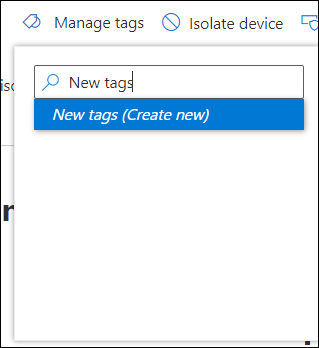
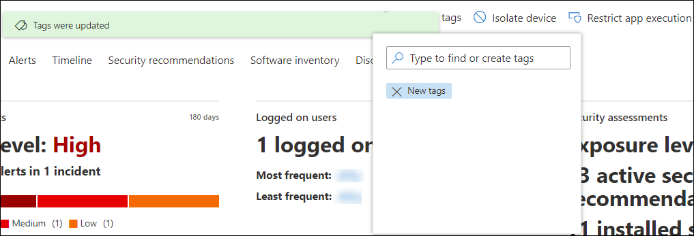

# デバイス タグの作成と管理Create and manage device tags

[!INCLUDE [Microsoft 365 Defender rebranding](../../includes/microsoft-defender.md)]

**適用対象:****Applies to:**
- [Microsoft Defender for EndpointMicrosoft Defender for Endpoint](https://go.microsoft.com/fwlink/p/?linkid=2154037)
- [Microsoft 365 DefenderMicrosoft 365 Defender](https://go.microsoft.com/fwlink/?linkid=2118804)

> Microsoft Defender for Endpoint を体験してみませんか?Want to experience Microsoft Defender for Endpoint? [無料試用版にサインアップします。Sign up for a free trial.](https://www.microsoft.com/microsoft-365/windows/microsoft-defender-atp?ocid=docs-wdatp-exposedapis-abovefoldlink)

デバイスにタグを追加して、論理グループ所属を作成します。Add tags on devices to create a logical group affiliation. デバイス タグは、ネットワークの適切なマッピングをサポートし、さまざまなタグを添付してコンテキストをキャプチャし、インシデントの一部として動的なリスト作成を有効にできます。Device tags support proper mapping of the network, enabling you to attach different tags to capture context and to enable dynamic list creation as part of an incident. タグは、[デバイス] リスト ビューの **フィルターとして、** またはデバイスをグループ化するために使用できます。Tags can be used as a filter in **Devices list** view, or to group devices. デバイス グループ化の詳細については、「デバイス グループの作成 [と管理」を参照してください](machine-groups.md)。For more information on device grouping, see [Create and manage device groups](machine-groups.md).

デバイスにタグを追加するには、次の方法を使用します。You can add tags on devices using the following ways:

- ポータルの使用Using the portal
- レジストリ キー値の設定Setting a registry key value

> [!NOTE]
> タグがデバイスに追加される時間と、デバイスリストとデバイス ページの可用性の間に、いくつかの待機時間が生じ得る場合があります。There may be some latency between the time a tag is added to a device and its availability in the devices list and device page.  

API を使用してデバイス タグを追加するには、「デバイス タグ API を [追加または削除する」を参照してください](add-or-remove-machine-tags.md)。To add device tags using API, see [Add or remove device tags API](add-or-remove-machine-tags.md).

## ポータルを使用してデバイス タグを追加および管理するAdd and manage device tags using the portal

1. タグを管理するデバイスを選択します。Select the device that you want to manage tags on. 次のビューからデバイスを選択または検索できます。You can select or search for a device from any of the following views:

   - **セキュリティ操作ダッシュボード** - [アクティブな通知を含むトップ デバイス] セクションからデバイス名を選択します。**Security operations dashboard** - Select the device name from the Top devices with active alerts section.
   - **アラート キュー** - 通知キューからデバイス アイコンの横にあるデバイス名を選択します。**Alerts queue** - Select the device name beside the device icon from the alerts queue.
   - **[デバイスの** 一覧] - デバイスの一覧からデバイス名を選択します。**Devices list** - Select the device name from the list of devices.
   - **[検索]** ボックス - ドロップダウン メニューから [デバイス] を選択し、デバイス名を入力します。**Search box** - Select Device from the drop-down menu and enter the device name.

     ファイルビューと IP ビューからアラート ページにアクセスすることもできます。You can also get to the alert page through the file and IP views.

2. 応答 **アクションの行から** [タグの管理] を選択します。Select **Manage Tags** from the row of Response actions.

    ![[タグの管理] ボタンのイメージ](images/manage-tags.png)

3. タグを検索または作成する入力Type to find or create tags

    

タグはデバイス ビューに追加され、[デバイス] リスト ビュー **にも反映** されます。Tags are added to the device view and will also be reflected on the **Devices list** view. 次に、[タグ] フィルター **を使用** して、関連するデバイスの一覧を表示できます。You can then use the **Tags** filter to see the relevant list of devices.

>[!NOTE]
> かっこを含むタグ名では、フィルター処理が機能しない場合があります。Filtering might not work on tag names that contain parenthesis. 
> 新しいタグを作成すると、既存のタグの一覧が表示されます。When you create a new tag, a list of existing tags are displayed. 一覧には、ポータルを通じて作成されたタグだけが表示されます。The list only shows tags created through the portal. クライアント デバイスから作成された既存のタグは表示されません。Existing tags created from client devices will not be displayed.

このビューからタグを削除することもできます。You can also delete tags from this view.

## レジストリ キーの値を設定してデバイス タグを追加するAdd device tags by setting a registry key value

>[!NOTE]
> 次のデバイスにのみ適用されます。Applicable only on the following devices:
>- Windows 10 バージョン 1709 以降Windows 10, version 1709 or later
>- Windows Server バージョン 1803 以降Windows Server, version 1803 or later
>- Windows Server 2016Windows Server 2016
>- Windows Server 2012 R2Windows Server 2012 R2
>- Windows Server 2008 R2 SP1Windows Server 2008 R2 SP1
>- Windows 8.1Windows 8.1
>- Windows 7 SP1Windows 7 SP1

> [!NOTE] 
> タグに設定できる最大文字数は 200 文字です。The maximum number of characters that can be set in a tag is 200.

類似のタグを持つデバイスは、デバイスの特定のリストにコンテキスト アクションを適用する必要がある場合に便利です。Devices with similar tags can be handy when you need to apply contextual action on a specific list of devices.

デバイスにタグを追加するには、次のレジストリ キー エントリを使用します。Use the following registry key entry to add a tag on a device:

- レジストリ キー: `HKEY_LOCAL_MACHINE\SOFTWARE\Policies\Microsoft\Windows Advanced Threat Protection\DeviceTagging\`Registry key: `HKEY_LOCAL_MACHINE\SOFTWARE\Policies\Microsoft\Windows Advanced Threat Protection\DeviceTagging\`
- レジストリ キーの値 (REG_SZ): `Group`Registry key value (REG_SZ): `Group`
- レジストリ キー のデータ: `Name of the tag you want to set`Registry key data: `Name of the tag you want to set`

>[!NOTE]
>デバイス タグは、1 日に 1 回生成されるデバイス情報レポートの一部です。The device tag is part of the device information report that's generated once a day. 代わりに、新しいデバイス情報レポートを転送するエンドポイントを再起動することもできます。As an alternative, you may choose to restart the endpoint that would transfer a new device information report.
> 
> 上記のレジストリ キーを使用して追加されたタグを削除する必要がある場合は、'Group' キーを削除する代わりにレジストリ キー データの内容をクリアします。If you need to remove a tag that was added using the above Registry key, clear the contents of the Registry key data instead of removing the 'Group' key.
