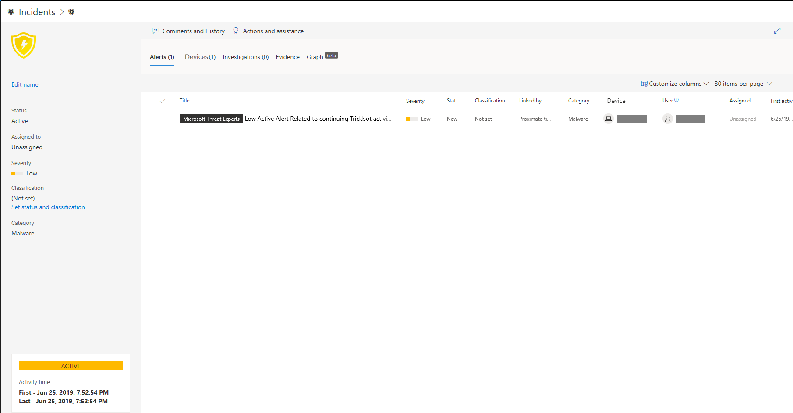

# エンドポイント インシデントの Microsoft Defender の管理Manage Microsoft Defender for Endpoint incidents

[!INCLUDE [Microsoft 365 Defender rebranding](../../includes/microsoft-defender.md)]

**適用対象:****Applies to:**
- [Microsoft Defender for EndpointMicrosoft Defender for Endpoint](https://go.microsoft.com/fwlink/p/?linkid=2146631)
- [Microsoft 365 DefenderMicrosoft 365 Defender](https://go.microsoft.com/fwlink/?linkid=2118804)

> Microsoft Defender for Endpoint を体験してみませんか?Want to experience Microsoft Defender for Endpoint? [無料試用版にサインアップします。Sign up for a free trial.](https://www.microsoft.com/microsoft-365/windows/microsoft-defender-atp?ocid=docs-wdatp-exposedapis-abovefoldlink)

インシデントの管理は、すべてのサイバーセキュリティ操作の重要な部分です。Managing incidents is an important part of every cybersecurity operation. インシデントを管理するには、[インシデント] キューまたは [インシデント管理] ウィンドウからインシデント **を選択します**。You can manage incidents by selecting an incident from the **Incidents queue** or the **Incidents management pane**. 

インシデント キューからインシデントを選択すると、[インシデント管理]ウィンドウが表示されます。インシデントの詳細については、インシデント ページを開きます。Selecting an incident from the **Incidents queue** brings up the **Incident management pane** where you can open the incident page for details.

インシデントを自分に割り当て、ステータスと分類を変更したり、名前を変更したり、コメントを付け、進捗状況を追跡することができます。You can assign incidents to yourself, change the status and classification, rename, or comment on them to keep track of their progress.

> [!TIP]
> 一目で見たインシデント名は、影響を受けるエンドポイントの数、影響を受けるユーザー、検出元、カテゴリなどのアラート属性に基づいて自動的に生成されます。For additional visibility at a glance, incident names are automatically generated based on alert attributes such as the number of endpoints affected, users affected, detection sources or categories. これにより、インシデントの範囲をすばやく理解できます。This allows you to quickly understand the scope of the incident.
>
> たとえば、複数 *のソースによって報告された複数のエンドポイントに対するマルチステージ インシデント。*For example: *Multi-stage incident on multiple endpoints reported by multiple sources.*
>
> 自動インシデント名前付けのロールアウトの前に存在していたインシデントは、その名前を保持します。Incidents that existed prior the rollout of automatic incident naming will retain their names.
>

## インシデントを割り当てるAssign incidents
インシデントがまだ割り当てられていない場合は、[自分に割り当てる] を選択して、インシデントを自分に割り当てることができます。If an incident has not been assigned yet, you can select **Assign to me** to assign the incident to yourself. これにより、インシデントの所有権だけでなくそのインシデントと関連するすべての警告の所有権が自分に割り当てられます。Doing so assumes ownership of not just the incident, but also all the alerts associated with it.

## 状態と分類を設定するSet status and classification
### インシデントの状態Incident status
インシデントは、調査の進捗に合わせて状態を変更することにより、**Active (アクティブ)** または **Resolved (解決済み)** に分類できます。You can categorize incidents (as **Active**, or **Resolved**) by changing their status as your investigation progresses. こうすることで、チームでのインシデントへの対応方法を整理して管理できます。This helps you organize and manage how your team can respond to incidents.

たとえば、SoC アナリストは、その日の緊急 **の** アクティブ インシデントを確認し、調査のために自分に割り当てました。For example, your SoC analyst can review the urgent **Active** incidents for the day, and decide to assign them to himself for investigation.

または、インシデントが修復された場合、SoC アナリストがインシデントを **解決** 済みとして設定する場合もあります。Alternatively, your SoC analyst might set the incident as **Resolved** if the incident has been remediated. 

### 分類Classification
分類を設定しないことも、インシデントが真または偽であると指定することもできます。You can choose not to set a classification, or decide to specify whether an incident is true or false. こうすることで、チームにはインシデントの傾向が示され、チームの学習につながります。Doing so helps the team see patterns and learn from them.

### コメントを追加するAdd comments
警告にはコメントを追加することができ、インシデントに関する過去のイベントを表示して、以前に行われた変更を確認できます。You can add comments and view historical events about an incident to see previous changes made to it.

警告に変更またはコメントが加えられるたびに、[Comments and history (コメントと履歴)] セクションに記録されます。Whenever a change or comment is made to an alert, it is recorded in the Comments and history section.

追加されたコメントは直ちにウィンドウに表示されます。Added comments instantly appear on the pane.

## 関連項目Related topics
- [インシデント キューIncidents queue](https://docs.microsoft.com/microsoft-365/security/defender-endpoint/view-incidents-queue)
- [インシデント キューの表示と整理View and organize the Incidents queue](view-incidents-queue.md)
- [インシデントの調査Investigate incidents](investigate-incidents.md)
