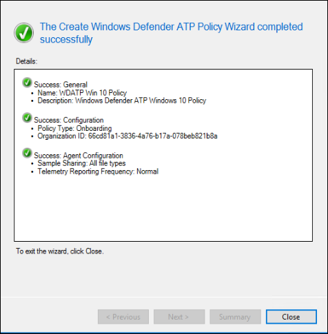
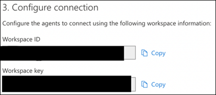
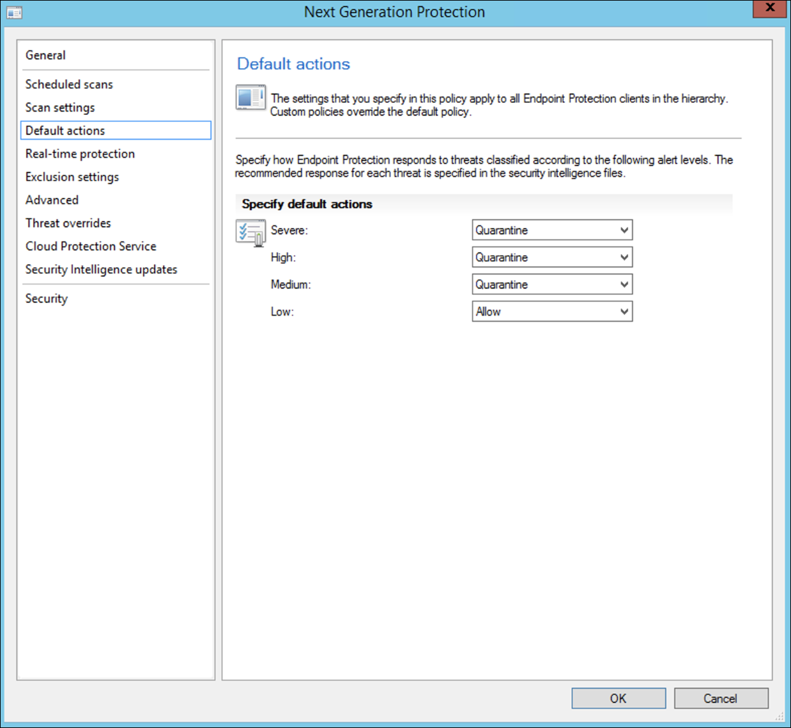

# Microsoft Endpoint Configuration Manager を使用したオンボーディング

[!INCLUDE [Microsoft 365 Defender rebranding](../../includes/microsoft-defender.md)]

**適用対象:**
- [Microsoft Defender for Endpoint](https://go.microsoft.com/fwlink/p/?linkid=2146631)
- [Microsoft 365 Defender](https://go.microsoft.com/fwlink/?linkid=2118804)

> Microsoft Defender for Endpoint を体験してみませんか? [無料試用版にサインアップします。](https://www.microsoft.com/microsoft-365/windows/microsoft-defender-atp?ocid=docs-wdatp-exposedapis-abovefoldlink)

この記事は展開ガイドの一部であり、オンボーディング方法の例として機能します。 

「計画 [」トピック](deployment-strategy.md) では、デバイスをサービスにオンボードする方法がいくつか用意されています。 このトピックでは、共同管理アーキテクチャについて説明します。 

 *環境アーキテクチャの図*

Defender for Endpoint はさまざまなエンドポイントとツールのオンボーディングをサポートしますが、この記事ではそれらをカバーしません。 サポートされている他の展開ツールと方法を使用した一般的なオンボーディングの詳細については、「オンボードの概要 [」を参照してください](onboarding.md)。

このトピックでは、次のユーザーをガイドします。
- 手順 1: Windows デバイスをサービスにオンボーディングする 
- 手順 2: Defender for Endpoint の機能を構成する

このオンボーディング ガイダンスでは、Microsoft Endpoint Configuration Manager を使用する場合に実行する必要がある次の基本的な手順について説明します。
- **Microsoft Endpoint Configuration Manager でのコレクションの作成**
- **Microsoft Endpoint Configuration Manager を使用した Microsoft Defender for Endpoint の機能の構成**

>[!NOTE]
>この展開例では、Windows デバイスのみについて説明します。 

## 手順 1: Microsoft Endpoint Configuration Manager を使用して Windows デバイスをオンボードする

### コレクションの作成
Microsoft Endpoint Configuration Manager を使用して Windows 10 デバイスをオンボードするには、展開で既存のコレクションをターゲットにするか、テスト用に新しいコレクションを作成できます。 

グループ ポリシーや手動メソッドなどのツールを使用したオンボーディングでは、システムにエージェントはインストールされない。 

Microsoft Endpoint Configuration Manager コンソール内では、オンボーディング プロセスがコンソール内のコンプライアンス設定の一部として構成されます。

この必要な構成を受け取るシステムは、Configuration Manager クライアントが管理ポイントからこのポリシーを受け取り続ける限り、その構成を維持します。 

Microsoft Endpoint Configuration Manager を使用してエンドポイントをオンボードするには、以下の手順に従います。

1. Microsoft Endpoint Configuration Manager コンソールで、[アセット] と [コンプライアンス **の概要] \> デバイス コレクション \> に移動します**。            

    

2. [デバイス コレクション] **を右クリックし** 、[デバイス コレクション **の作成] を選択します**。

    

3. [名前]**と [制限****コレクション] を指定し、[** 次へ] を **選択します**。

    

4. [ルール **の追加] を選択** し、[ **クエリ ルール] を選択します**。

    

5.  [直接 **メンバーシップ ウィザード** ] で **[次へ] をクリックし** 、[クエリ ステートメントの **編集] をクリックします**。

     

6. [ **条件] を** 選択し、星のアイコンを選択します。

     

7. 条件の種類を **単純な** 値として保持し、オペレーティング システム **-** ビルド番号 、演算子の値が **14393** 以上の場合は、OK をクリックする場所を選択 **します**。

    

8. [次 **へ] と [** 閉じる] **を選択します**。

    

9. **[次へ]** を選択します。

    

このタスクを完了すると、環境内のすべての Windows 10 エンドポイントを持つデバイス コレクションが作成されます。 

## 手順 2: Microsoft Defender for Endpoint の機能を構成する 
このセクションでは、Windows デバイスで Microsoft Endpoint Configuration Manager を使用して次の機能を構成する方法について説明します。

- [**エンドポイントの検出および応答**](#endpoint-detection-and-response)
- [**次世代の保護**](#next-generation-protection)
- [**攻撃面の縮小**](#attack-surface-reduction)

### エンドポイントの検出および応答
#### Windows 10
Microsoft Defender セキュリティ センター内から、System Center Configuration Manager でポリシーを作成し、そのポリシーを Windows 10 デバイスに展開するために使用できる '.onboarding' ポリシーをダウンロードできます。

1. Microsoft Defender セキュリティ センター ポータルで、[設定] を選択 [し、[オンボーディング] を選択します](https://securitycenter.windows.com/preferences2/onboarding)。

2. [展開方法] で、サポートされている **バージョンの Microsoft Endpoint Configuration Manager を選択します**。

    

3. [パッケージ **のダウンロード] を選択します**。

    

4. パッケージをアクセス可能な場所に保存します。
5. Microsoft Endpoint Configuration Manager で、[アセットとコンプライアンス] に移動し、[>の概要> Microsoft Defender ATP ポリシー> **に移動します**。

6. [Microsoft **Defender ATP ポリシー] を右クリックし、[Microsoft** Defender ATP ポリシー **の作成] を選択します**。

    

7. 名前と説明を入力し、[ **オン** ボーディング] が選択されている場合は、[次へ] を選択 **します**。

    

8. [ **参照**] をクリックします。

9. 上記の手順 4 からダウンロードしたファイルの場所に移動します。

10. **[次へ]** をクリックします。
11. 適切なサンプル (None または All ファイルの種類)**を使用****してエージェントを構成します**。

    

12. 適切な利用統計情報 (標準または **迅速) を****選択し**、[次へ] を **クリックします**。

    

14. 構成を確認し、[次へ] を **クリックします**。

     

15. ウィザードが **完了したら** 、[閉じる] をクリックします。

16.  Microsoft Endpoint Configuration Manager コンソールで、作成した Defender for Endpoint ポリシーを右クリックし、[展開] を **選択します**。

     

17. 右側のパネルで、前に作成したコレクションを選択し **、[OK] をクリックします**。

    

#### 以前のバージョンの Windows クライアント (Windows 7 および Windows 8.1)
以前のバージョンの Windows のオンボーディングに必要な Defender for Endpoint Workspace ID と Workspace Key を識別するには、以下の手順に従います。

1. Microsoft Defender セキュリティ センター ポータルで、[オンボーディング **の設定] >選択します**。

2. [オペレーティング システム] で、[Windows 7 SP1 **8.1] を選択します**。

3. ワークスペース **ID とワークスペース キー****をコピーして** 保存します。 これらは、プロセスの後半で使用されます。

    

4. Microsoft 監視エージェント (MMA) をインストールします。  
    MMA は現在 (2019 年 1 月現在) 次の Windows オペレーティング システムでサポートされています。

    -   サーバー SKU: Windows Server 2008 SP1 以降

    -   クライアント SKU: Windows 7 SP1以降

    MMA エージェントを Windows デバイスにインストールする必要があります。 エージェントをインストールするには、MMA を使用してデータを収集するために、一部のシステムでカスタマー エクスペリエンスと診断テレメトリの更新プログラムをダウンロードする必要があります。 これらのシステム バージョンには、次のものが含まれますが、これらに限定されない場合があります。

    -   Windows 8.1

    -   Windows 7

    -   Windows Server 2016

    -   Windows Server 2012 R2

    -   Windows Server 2008 R2

    具体的には、次Windows 7 SP1パッチをインストールする必要があります。

    -   [KB4074598 のインストール](https://support.microsoft.com/help/4074598/windows-7-update-kb4074598)

    -   [4.5 .NET Framework以降](https://www.microsoft.com/download/details.aspx?id=30653)**)** または 
         [KB3154518 のいずれかをインストールします](https://support.microsoft.com/help/3154518/support-for-tls-system-default-versions-included-in-the-net-framework)。
        両方を同じシステムにインストールしない。

5. プロキシを使用してインターネットに接続する場合は、「プロキシ設定の構成」セクションを参照してください。

完了すると、1 時間以内にポータルにオンボード エンドポイントが表示されます。

### 次世代の保護 
Windows Defender ウイルス対策は、デスクトップ、ポータブル コンピューター、サーバーを対象に次世代の保護機能を提供する、組み込みのマルウェア対策ソリューションです。

1. Microsoft Endpoint Configuration Manager コンソールで、[アセットとコンプライアンスの概要 エンドポイント保護マルウェア対策ポリシー] に移動し、[マルウェア対策ポリシーの作成]**を選択します**。 **\> \> \>**

    

2. [**スケジュールされたスキャン****]、[** スキャン設定]、[既定のアクション]、[リアルタイム保護]、[除外設定]、[詳細設定]、[脅威の上書き]、**クラウド保護サービス** とセキュリティ インテリジェンスの更新を選択し **、[OK] を選択します**。   

    

    特定の業界または一部の企業のお客様は、ウイルス対策の構成方法に関する特定のニーズを持っている場合があります。

  
    [クイック スキャンとフル スキャン、およびカスタム スキャン](https://docs.microsoft.com/windows/security/threat-protection/microsoft-defender-antivirus/scheduled-catch-up-scans-microsoft-defender-antivirus#quick-scan-versus-full-scan-and-custom-scan)

    詳細については [、「Windows Security 構成フレームワーク」を参照してください。](https://docs.microsoft.com/windows/security/threat-protection/windows-security-configuration-framework/windows-security-configuration-framework)
  
    

    

    

    

    

    

    

    

3. 新しく作成したマルウェア対策ポリシーを右クリックし、[展開] を **選択します**。

    

4. 新しいマルウェア対策ポリシーを Windows 10 コレクションにターゲットに設定し **、[OK] をクリックします**。

     

このタスクを完了すると、ウイルス対策プログラムの構成Windows Defender完了しました。

### 攻撃面の縮小
Defender for Endpoint の攻撃表面の縮小の柱には、Exploit Guard で使用できる機能セットが含まれています。 攻撃表面の縮小 (ASR) ルール、フォルダー アクセスの制御、ネットワーク保護、エクスプロイト保護。 

これらの機能はすべて監査モードとブロック モードを提供します。 監査モードでは、エンド ユーザーに影響はありません。 これは、追加のテレメトリを収集し、Microsoft Defender セキュリティ センターで利用できる方法です。 展開の目的は、セキュリティ コントロールをブロック モードにステップ バイ ステップで移動する方法です。

監査モードで ASR ルールを設定するには、次の方法を実行します。

1. Microsoft Endpoint Configuration Manager コンソールで、[Assets and Compliance Overview Endpoint Protection] に移動し **\> \> \> 、[Exploit Guard** Windows Defender作成] を **選択します**。

   

2.  [攻撃 **表面の縮小] を選択します**。
   

3. ルールを [監査] に **設定し、[** 次へ] を **クリックします**。

    

4. [次へ] をクリックして、新しい Exploit Guard ポリシーを **確認します**。

    

    
5. ポリシーが作成されると、[閉じる] を **クリックします**。

    

    
   

6.  新しく作成したポリシーを右クリックし、[展開] を **選択します**。
    
    

7. ポリシーを新しく作成した Windows 10 コレクションにターゲット設定し **、[OK] をクリックします**。

    

このタスクを完了すると、監査モードで ASR ルールが正常に構成されました。  
  
ASR ルールがエンドポイントに正しく適用されているかどうかを確認する追加の手順を次に示します。 (これには数分かかる場合があります)

1. Web ブラウザーからに移動します <https://securitycenter.windows.com> 。

2.  左側 **のメニューから [構成** の管理] を選択します。

3. [攻撃 **表面管理] パネルの [攻撃表面の** 管理に移動] をクリックします。 
    
    

4. 攻撃表面 **縮小ルール** レポートの [構成] タブをクリックします。 各デバイスの ASR ルール構成の概要と ASR ルールの状態が表示されます。

    

5. 各デバイスをクリックすると、ASR ルールの構成の詳細が表示されます。

    

詳細 [については、「オプティマイズ ASR ルールの展開と検出」](https://docs.microsoft.com/microsoft-365/security/defender-endpoint/configure-machines-asr)   を参照してください。  

#### 監査モードでネットワーク保護ルールを設定します。
1. Microsoft Endpoint Configuration Manager コンソールで、[Assets and Compliance Overview Endpoint Protection] に移動し **\> \> \> 、[Exploit Guard** Windows Defender作成] を **選択します**。

    

2. [ネットワーク **保護] を選択します**。

3. 設定を [監査] に **設定し、[次** へ] を **クリックします**。 

    

4. [次へ] をクリックして、新しい Exploit Guard ポリシーを **確認します**。
    
    

5. ポリシーが作成されると、[閉じる] を **クリックします**。

    

6. 新しく作成したポリシーを右クリックし、[展開] を **選択します**。

    

7. 新しく作成した Windows 10 コレクションのポリシーを選択し **、[OK] を選択します**。

    

このタスクを完了すると、監査モードでネットワーク保護が正常に構成されました。

#### 監査モードでフォルダー アクセスの制御ルールを設定するには、次の操作を行います。

1. Microsoft Endpoint Configuration Manager コンソールで、[Assets and Compliance Overview Endpoint Protection] に移動し **\> \> \> 、[Exploit Guard** Windows Defender作成] を **選択します**。

    

2. [フォルダー **アクセスの制御] を選択します**。
    
3. 構成を [監査] に **設定し、[次** へ] を **クリックします**。

        
    
4. [次へ] をクリックして、新しい Exploit Guard ポリシーを **確認します**。

    

5. ポリシーが作成されると、[閉じる] を **クリックします**。

    

6. 新しく作成したポリシーを右クリックし、[展開] を **選択します**。

    

7.  ポリシーを新しく作成した Windows 10 コレクションにターゲット設定し **、[OK] をクリックします**。

    

監査モードでフォルダー アクセスの制御が正常に構成されました。

## 関連トピック
- [Microsoft Endpoint Manager を使用したオンボーディング](onboarding-endpoint-manager.md)
