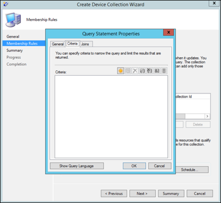
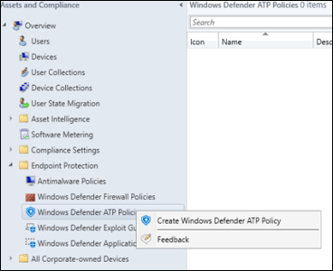
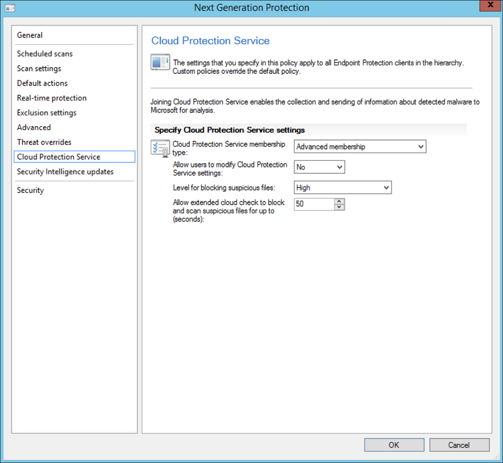

# Microsoft Endpoint Configuration Manager を使用したオンボーディングOnboarding using Microsoft Endpoint Configuration Manager

[!INCLUDE [Microsoft 365 Defender rebranding](../../includes/microsoft-defender.md)]

**適用対象:****Applies to:**
- [Microsoft Defender for EndpointMicrosoft Defender for Endpoint](https://go.microsoft.com/fwlink/p/?linkid=2154037)
- [Microsoft 365 DefenderMicrosoft 365 Defender](https://go.microsoft.com/fwlink/?linkid=2118804)

> Microsoft Defender ATP を試してみたいですか?Want to experience Microsoft Defender for Endpoint? [無料試用版にサインアップしてください。Sign up for a free trial.](https://www.microsoft.com/microsoft-365/windows/microsoft-defender-atp?ocid=docs-wdatp-exposedapis-abovefoldlink)

この記事は展開ガイドの一部であり、オンボーディング方法の例として機能します。This article is part of the Deployment guide and acts as an example onboarding method. 

「計画 [」トピック](deployment-strategy.md) では、デバイスをサービスにオンボードする方法がいくつか用意されています。In the [Planning](deployment-strategy.md) topic, there were several methods provided to onboard devices to the service. このトピックでは、共同管理アーキテクチャについて説明します。This topic covers the co-management architecture. 

 *環境アーキテクチャの図*
*Diagram of environment architectures*

Defender for Endpoint はさまざまなエンドポイントとツールのオンボーディングをサポートしますが、この記事ではそれらをカバーしません。While Defender for Endpoint supports onboarding of various endpoints and tools, this article does not cover them. サポートされている他の展開ツールと方法を使用した一般的なオンボーディングの詳細については、「オンボードの概要 [」を参照してください](onboarding.md)。For information on general onboarding using other supported deployment tools and methods, see [Onboarding overview](onboarding.md).

このトピックでは、次のユーザーをガイドします。This topic guides users in:
- 手順 1: サービスWindowsデバイスをオンボーディングするStep 1: Onboarding Windows devices to the service 
- 手順 2: Defender for Endpoint の機能を構成するStep 2: Configuring Defender for Endpoint capabilities

このオンボーディング ガイダンスでは、次の基本的な手順について説明します。このガイドでは、ユーザーの使用に必要なMicrosoft Endpoint Configuration Manager。This onboarding guidance will walk you through the following basic steps that you need to take when using Microsoft Endpoint Configuration Manager:
- **コレクションの作成Microsoft Endpoint Configuration Manager****Creating a collection in Microsoft Endpoint Configuration Manager**
- **Microsoft Defender for Endpoint の機能を構成するには、Microsoft Endpoint Configuration Manager****Configuring Microsoft Defender for Endpoint capabilities using Microsoft Endpoint Configuration Manager**

>[!NOTE]
>この展開Windowsでは、このデバイスのみを対象とします。Only Windows devices are covered in this example deployment. 

## 手順 1: デバイスを使用WindowsデバイスをオンボードMicrosoft Endpoint Configuration ManagerStep 1: Onboard Windows devices using Microsoft Endpoint Configuration Manager

### コレクションの作成Collection creation
既存のWindows 10デバイスMicrosoft Endpoint Configuration Managerオンボーディングするには、展開で既存のコレクションをターゲットにするか、テスト用に新しいコレクションを作成できます。To onboard Windows 10 devices with Microsoft Endpoint Configuration Manager, the deployment can target an existing collection or a new collection can be created for testing. 

グループ ポリシーや手動メソッドなどのツールを使用したオンボーディングでは、システムにエージェントはインストールされない。Onboarding using tools such as Group policy or manual method does not install any agent on the system. 

コンソール内Microsoft Endpoint Configuration Managerオンボーディング プロセスは、コンソール内のコンプライアンス設定の一部として構成されます。Within the Microsoft Endpoint Configuration Manager console the onboarding process will be configured as part of the compliance settings within the console.

この必要な構成を受け取るシステムは、Configuration Manager クライアントが管理ポイントからこのポリシーを受け取り続ける限り、その構成を維持します。Any system that receives this required configuration will maintain that configuration for as long as the Configuration Manager client continues to receive this policy from the management point. 

以下の手順に従って、デバイスを使用してエンドポイントをオンボードMicrosoft Endpoint Configuration Manager。Follow the steps below to onboard endpoints using Microsoft Endpoint Configuration Manager.

1. コンソールMicrosoft Endpoint Configuration Manager、[アセット] と [**コンプライアンスの概要] \> デバイス コレクション \> に移動します**。In Microsoft Endpoint Configuration Manager console, navigate to **Assets and Compliance \> Overview \> Device Collections**.            

    

2. [デバイス コレクション] **を右クリックし** 、[デバイス コレクション **の作成] を選択します**。Right Click **Device Collection** and select **Create Device Collection**.

    

3. [名前]**と [制限\*\*\*\*コレクション] を指定し、[** 次へ] を **選択します**。Provide a **Name** and **Limiting Collection**, then select **Next**.

    

4. [ルール **の追加] を選択** し、[ **クエリ ルール] を選択します**。Select **Add Rule** and choose **Query Rule**.

    

5.  [直接 **メンバーシップ ウィザード** ] で **[次へ] をクリックし** 、[クエリ ステートメントの **編集] をクリックします**。Click **Next** on the **Direct Membership Wizard** and click on **Edit Query Statement**.

     

6. [ **条件] を** 選択し、星のアイコンを選択します。Select **Criteria** and then choose the star icon.

     

7. 条件の種類を **単純な** 値として保持し、オペレーティング システム **-** ビルド番号 、演算子の値が **14393** 以上の場合は、OK をクリックする場所を選択 **します**。Keep criterion type as **simple value**, choose where as **Operating System - build number**, operator as **is greater than or equal to** and value **14393** and click on **OK**.

    

8. [次 **へ] と [** 閉じる] **を選択します**。Select **Next** and **Close**.

    

9. [**次へ**] を選択します。Select **Next**.

    

このタスクを完了すると、環境内のすべてのエンドポイントWindows 10デバイス コレクションが作成されます。After completing this task, you now have a device collection with all the Windows 10 endpoints in the environment. 

## 手順 2: Microsoft Defender for Endpoint の機能を構成するStep 2: Configure Microsoft Defender for Endpoint capabilities 
このセクションでは、デバイス上のデバイスを使用して次の機能Microsoft Endpoint Configuration Manager構成Windowsします。This section guides you in configuring the following capabilities using Microsoft Endpoint Configuration Manager on Windows devices:

- [**エンドポイントでの検出と対応****Endpoint detection and response**](#endpoint-detection-and-response)
- [**次世代の保護****Next-generation protection**](#next-generation-protection)
- [**攻撃面の減少****Attack surface reduction**](#attack-surface-reduction)

### エンドポイントの検出および応答Endpoint detection and response
#### Windows 10Windows 10
Microsoft Defender セキュリティ センター内から、System Center Configuration Manager でポリシーを作成し、そのポリシーを Windows 10 デバイスに展開するために使用できる '.onboarding' ポリシーをダウンロードできます。From within the Microsoft Defender Security Center it is possible to download the '.onboarding' policy that can be used to create the policy in System Center Configuration Manager and deploy that policy to Windows 10 devices.

1. [ポータル] Microsoft Defender セキュリティ センター、[オンボーディング][設定を選択します](https://securitycenter.windows.com/preferences2/onboarding)。From a Microsoft Defender Security Center Portal, select [Settings and then Onboarding](https://securitycenter.windows.com/preferences2/onboarding).

2. [展開方法] で、サポートされているバージョンのファイルを **Microsoft Endpoint Configuration Manager。**Under Deployment method select the supported version of **Microsoft Endpoint Configuration Manager**.

    

3. [パッケージ **のダウンロード] を選択します**。Select **Download package**.

    

4. パッケージをアクセス可能な場所に保存します。Save the package to an accessible location.
5. [Microsoft Endpoint Configuration Manager] で、[アセットとコンプライアンス] の [概要] >**ポリシー> Endpoint Protection > Microsoft Defender ATP移動します**。In  Microsoft Endpoint Configuration Manager, navigate to: **Assets and Compliance > Overview > Endpoint Protection > Microsoft Defender ATP Policies**.

6. [ポリシー] を **右Microsoft Defender ATPし、[** ポリシーの **作成] Microsoft Defender ATPします**。Right-click **Microsoft Defender ATP Policies** and select **Create Microsoft Defender ATP Policy**.

    

7. 名前と説明を入力し、[ **オン** ボーディング] が選択されている場合は、[次へ] を選択 **します**。Enter the name and description, verify **Onboarding** is selected, then select **Next**.

    

8. [ **参照**] をクリックします。Click **Browse**.

9. 上記の手順 4 からダウンロードしたファイルの場所に移動します。Navigate to the location of the downloaded file from step 4 above.

10. **[次へ]** をクリックします。Click **Next**.
11. 適切なサンプル (None または All ファイルの種類)**を使用\*\*\*\*してエージェントを構成します**。Configure the Agent with the appropriate samples (**None** or **All file types**).

    

12. 適切な利用統計情報 (標準または **迅速) を\*\*\*\*選択し**、[次へ] を **クリックします**。Select the appropriate telemetry (**Normal** or **Expedited**) then click **Next**.

    

14. 構成を確認し、[次へ] を **クリックします**。Verify the configuration, then click **Next**.

     

15. ウィザードが **完了したら** 、[閉じる] をクリックします。Click **Close** when the Wizard completes.

16.  コンソールでMicrosoft Endpoint Configuration Manager作成した Defender for Endpoint ポリシーを右クリックし、[展開] を **選択します**。In the Microsoft Endpoint Configuration Manager console, right-click the Defender for Endpoint policy you just created and select **Deploy**.

     

17. 右側のパネルで、前に作成したコレクションを選択し **、[OK] をクリックします**。On the right panel, select the previously created collection and click **OK**.

    

#### 以前のバージョンの Windows クライアント (Windows 7 および Windows 8.1)Previous versions of Windows Client (Windows 7 and Windows 8.1)
以下の手順に従って、以前のバージョンのデバイスのオンボーディングに必要な Defender for Endpoint Workspace ID と Workspace Key を特定Windows。Follow the steps below to identify the Defender for Endpoint Workspace ID and Workspace Key, that will be required for the onboarding of previous versions of Windows.

1. [新しいポータルMicrosoft Defender セキュリティ センターオンボーディング] を設定 >**します**。From a Microsoft Defender Security Center Portal, select **Settings > Onboarding**.

2. [オペレーティング システム] で **、[Windows 7 SP1 と 8.1] を選択します**。Under operating system choose **Windows 7 SP1 and 8.1**.

3. ワークスペース **ID とワークスペース キー\*\*\*\*をコピーして** 保存します。Copy the **Workspace ID** and **Workspace Key** and save them. これらは、プロセスの後半で使用されます。They will be used later in the process.

    

4. [インストール] Microsoft Monitoring Agent (MMA) をインストールします。Install the Microsoft Monitoring Agent (MMA).  
    MMA は現在 (2019 年 1 月現在) 次のオペレーティング システムWindowsサポートされています。MMA is currently (as of January 2019) supported on the following Windows Operating Systems:

    -   サーバー SKU: Windows Server 2008 SP1 以降Server SKUs: Windows Server 2008 SP1 or Newer

    -   クライアント SKU: Windows 7 SP1 以降Client SKUs: Windows 7 SP1 and later

    MMA エージェントをデバイスにインストールするWindowsがあります。The MMA agent will need to be installed on Windows devices. エージェントをインストールするには、MMA を使用してデータを収集するために、一部のシステムでカスタマー エクスペリエンスと診断テレメトリの更新プログラムをダウンロードする必要があります。To install the agent, some systems will need to download the [Update for customer experience and diagnostic telemetry](https://support.microsoft.com/help/3080149/update-for-customer-experience-and-diagnostic-telemetry) in order to collect the data with MMA. これらのシステム バージョンには、次のものが含まれますが、これらに限定されない場合があります。These system versions include but may not be limited to:

    -   Windows 8.1Windows 8.1

    -   Windows 7Windows 7

    -   Windows Server 2016Windows Server 2016

    -   Windows Server 2012 R2Windows Server 2012 R2

    -   Windows Server 2008 R2Windows Server 2008 R2

    具体的には、Windows 7 SP1 の場合は、次のパッチをインストールする必要があります。Specifically, for Windows 7 SP1, the following patches must be installed:

    -   [KB4074598 のインストール](https://support.microsoft.com/help/4074598/windows-7-update-kb4074598)Install [KB4074598](https://support.microsoft.com/help/4074598/windows-7-update-kb4074598)

    -   [4.5 .NET Framework以降](https://www.microsoft.com/download/details.aspx?id=30653)**)** または 
         [KB3154518 のいずれかをインストールします](https://support.microsoft.com/help/3154518/support-for-tls-system-default-versions-included-in-the-net-framework)。Install either [.NET Framework 4.5](https://www.microsoft.com/download/details.aspx?id=30653) (or later) **or**
        [KB3154518](https://support.microsoft.com/help/3154518/support-for-tls-system-default-versions-included-in-the-net-framework).
        両方を同じシステムにインストールしない。Do not install both on the same system.

5. プロキシを使用してインターネットに接続する場合は、「プロキシ設定の構成」セクションを参照してください。If you're using a proxy to connect to the Internet see the Configure proxy settings section.

完了すると、1 時間以内にポータルにオンボード エンドポイントが表示されます。Once completed, you should see onboarded endpoints in the portal within an hour.

### 次世代の保護Next generation protection 
Windows Defender ウイルス対策は、デスクトップ、ポータブル コンピューター、サーバーを対象に次世代の保護機能を提供する、組み込みのマルウェア対策ソリューションです。Microsoft Defender Antivirus is a built-in antimalware solution that provides next generation protection for desktops, portable computers, and servers.

1. このコンソールMicrosoft Endpoint Configuration Manager、マルウェア対策ポリシーの [アセットと **\> \> コンプライアンスEndpoint Protection] \>** に移動し、[マルウェア対策ポリシーの作成]**を選択します**。In the Microsoft Endpoint Configuration Manager console, navigate to **Assets and Compliance \> Overview \> Endpoint Protection \> Antimalware Polices** and choose **Create Antimalware Policy**.

    

2. [**スケジュールされたスキャン\*\*\*\*]、[** スキャン設定]、[既定のアクション]、[リアルタイム保護]、[除外設定]、[詳細設定]、[脅威の上書き]、**クラウド保護サービス** とセキュリティ インテリジェンスの更新を選択し **、[OK] を選択します**。   Select **Scheduled scans**, **Scan settings**, **Default actions**, **Real-time protection**, **Exclusion settings**, **Advanced**, **Threat overrides**, **Cloud Protection Service** and **Security intelligence   updates** and choose **OK**.

    

    特定の業界または一部の企業のお客様は、ウイルス対策の構成方法に関する特定のニーズを持っている場合があります。In certain industries or some select enterprise customers might have specific needs on how Antivirus is configured.

  
    [クイック スキャンとフル スキャン、およびカスタム スキャンQuick scan versus full scan and custom scan](/windows/security/threat-protection/microsoft-defender-antivirus/scheduled-catch-up-scans-microsoft-defender-antivirus#quick-scan-versus-full-scan-and-custom-scan)

    詳細については、「Windows セキュリティ[構成フレームワーク」を参照してください。](/windows/security/threat-protection/windows-security-configuration-framework/windows-security-configuration-framework)For more details, see [Windows Security configuration framework](/windows/security/threat-protection/windows-security-configuration-framework/windows-security-configuration-framework)
  
    

    

    

    

    

    

    

    

3. 新しく作成したマルウェア対策ポリシーを右クリックし、[展開] を **選択します**。Right-click on the newly created antimalware policy and select **Deploy**.

    

4. 新しいマルウェア対策ポリシーをユーザーコレクションにWindows 10し **、[OK] をクリックします**。Target the new antimalware policy to your Windows 10 collection and click **OK**.

     

このタスクを完了すると、このタスクが正常に構成Windows Defender ウイルス対策。After completing this task, you now have successfully configured Windows Defender Antivirus.

### 攻撃面の縮小Attack surface reduction
Defender for Endpoint の攻撃表面の縮小の柱には、Exploit Guard で使用できる機能セットが含まれています。The attack surface reduction pillar of Defender for Endpoint includes the feature set that is available under Exploit Guard. 攻撃表面の縮小 (ASR) ルール、フォルダー アクセスの制御、ネットワーク保護、エクスプロイト保護。Attack surface reduction (ASR) rules, Controlled Folder Access, Network Protection and Exploit Protection. 

これらの機能はすべて監査モードとブロック モードを提供します。All these features provide an audit mode and a block mode. 監査モードでは、エンド ユーザーに影響はありません。In audit mode there is no end-user impact. これは、追加のテレメトリを収集し、その他のアプリケーションで使用Microsoft Defender セキュリティ センター。All it does is collect additional telemetry and make it available in the Microsoft Defender Security Center. 展開の目的は、セキュリティ コントロールをブロック モードにステップ バイ ステップで移動する方法です。The goal with a deployment is to step-by-step move security controls into block mode.

監査モードで ASR ルールを設定するには、次の方法を実行します。To set ASR rules in Audit mode:

1. [セキュリティ コンソールMicrosoft Endpoint Configuration Manager、Exploit Guard の [アセットとコンプライアンスの概要] Endpoint Protection Windows Defender **\> \> \> し、[Exploit Guard** ポリシーの作成]**を選択します**。In the Microsoft Endpoint Configuration Manager console, navigate to **Assets and Compliance \> Overview \> Endpoint Protection \> Windows Defender Exploit Guard** and choose **Create Exploit Guard Policy**.

   

2.  [攻撃 **表面の縮小] を選択します**。Select **Attack Surface Reduction**.
   

3. ルールを [監査] に **設定し、[** 次へ] を **クリックします**。Set rules to **Audit** and click **Next**.

    

4. [次へ] をクリックして、新しい Exploit Guard ポリシーを **確認します**。Confirm the new Exploit Guard policy by clicking on **Next**.

    

    
5. ポリシーが作成されると、[閉じる] を **クリックします**。Once the policy is created click **Close**.

    

    
   

6.  新しく作成したポリシーを右クリックし、[展開] を **選択します**。Right-click on the newly created policy and choose **Deploy**.
    
    

7. ポリシーを新しく作成したコレクションにWindows 10し **、[OK] をクリックします**。Target the policy to the newly created Windows 10 collection and click **OK**.

    

このタスクを完了すると、監査モードで ASR ルールが正常に構成されました。After completing this task, you now have successfully configured ASR rules in audit mode.  
  
ASR ルールがエンドポイントに正しく適用されているかどうかを確認する追加の手順を次に示します。Below are additional steps to verify whether ASR rules are correctly applied to endpoints. (これには数分かかる場合があります)(This may take few minutes)

1. Web ブラウザーからに移動します <https://securitycenter.windows.com> 。From a web browser, navigate to <https://securitycenter.windows.com>.

2.  左側 **のメニューから [構成** の管理] を選択します。Select **Configuration management** from left side menu.

3. [攻撃 **表面管理] パネルの [攻撃表面の** 管理に移動] をクリックします。Click **Go to attack surface management** in the Attack surface management panel. 
    
    

4. 攻撃表面 **縮小ルール** レポートの [構成] タブをクリックします。Click **Configuration** tab in Attack surface reduction rules reports. 各デバイスの ASR ルール構成の概要と ASR ルールの状態が表示されます。It shows ASR rules configuration overview and ASR rules status on each devices.

    

5. 各デバイスをクリックすると、ASR ルールの構成の詳細が表示されます。Click each device shows configuration details of ASR rules.

    

詳細 [については、「オプティマイズ ASR ルールの展開と検出」](/microsoft-365/security/defender-endpoint/configure-machines-asr)   を参照してください。See [Optimize ASR rule deployment and detections](/microsoft-365/security/defender-endpoint/configure-machines-asr)   for more details.  

#### 監査モードでネットワーク保護ルールを設定します。Set Network Protection rules in Audit mode:
1. [セキュリティ コンソールMicrosoft Endpoint Configuration Manager、Exploit Guard の [アセットとコンプライアンスの概要] Endpoint Protection Windows Defender **\> \> \> し、[Exploit Guard** ポリシーの作成]**を選択します**。In the Microsoft Endpoint Configuration Manager console, navigate to **Assets and  Compliance \> Overview \> Endpoint Protection \> Windows Defender Exploit Guard** and choose **Create Exploit Guard Policy**.

    

2. [ネットワーク **保護] を選択します**。Select **Network protection**.

3. 設定を [監査] に **設定し、[次** へ] を **クリックします**。Set the setting to **Audit** and click **Next**. 

    

4. [次へ] をクリックして、新しい Exploit Guard ポリシーを **確認します**。Confirm the new Exploit Guard Policy by clicking **Next**.
    
    

5. ポリシーが作成されると、[閉じる] を **クリックします**。Once the policy is created click on **Close**.

    

6. 新しく作成したポリシーを右クリックし、[展開] を **選択します**。Right-click on the newly created policy and choose **Deploy**.

    

7. 新しく作成したコレクションのポリシーを選択しWindows 10 OK を選択 **します**。Select the policy to the newly created Windows 10 collection and choose **OK**.

    

このタスクを完了すると、監査モードでネットワーク保護が正常に構成されました。After completing this task, you now have successfully configured Network Protection in audit mode.

#### 監査モードでフォルダー アクセスの制御ルールを設定するには、次の操作を行います。To set Controlled Folder Access rules in Audit mode:

1. [セキュリティ コンソールMicrosoft Endpoint Configuration Manager、Exploit Guard の [アセットとコンプライアンスの概要] Endpoint Protection Windows Defender **\> \> \> し、[Exploit Guard** ポリシーの作成]**を選択します**。In the Microsoft Endpoint Configuration Manager console, navigate to **Assets and Compliance \> Overview \> Endpoint Protection \> Windows Defender Exploit Guard** and choose **Create Exploit Guard Policy**.

    

2. [フォルダー **アクセスの制御] を選択します**。Select **Controlled folder access**.
    
3. 構成を [監査] に **設定し、[次** へ] を **クリックします**。Set the configuration to **Audit** and click **Next**.

        
    
4. [次へ] をクリックして、新しい Exploit Guard ポリシーを **確認します**。Confirm the new Exploit Guard Policy by clicking on **Next**.

    

5. ポリシーが作成されると、[閉じる] を **クリックします**。Once the policy is created click on **Close**.

    

6. 新しく作成したポリシーを右クリックし、[展開] を **選択します**。Right-click on the newly created policy and choose **Deploy**.

    

7.  ポリシーを新しく作成したコレクションにWindows 10し **、[OK] をクリックします**。Target the policy to the newly created Windows 10 collection and click **OK**.

    

監査モードでフォルダー アクセスの制御が正常に構成されました。You have now successfully configured Controlled folder access in audit mode.

## 関連トピックRelated topic
- [Microsoft エンドポイント マネージャーを使用したオンボーディングOnboarding using Microsoft Endpoint Manager](onboarding-endpoint-manager.md)
