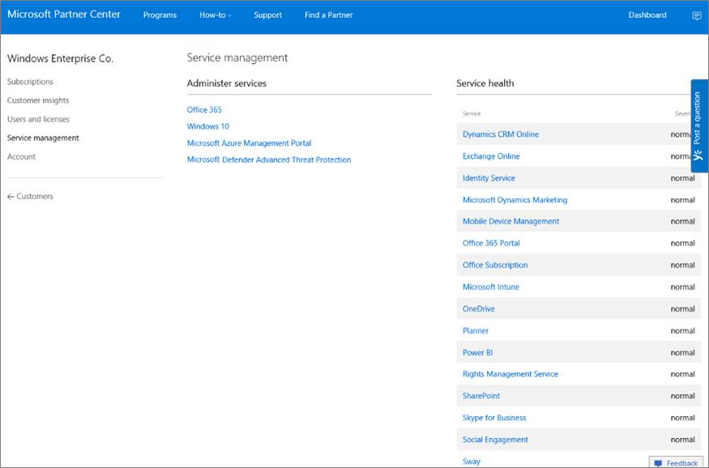
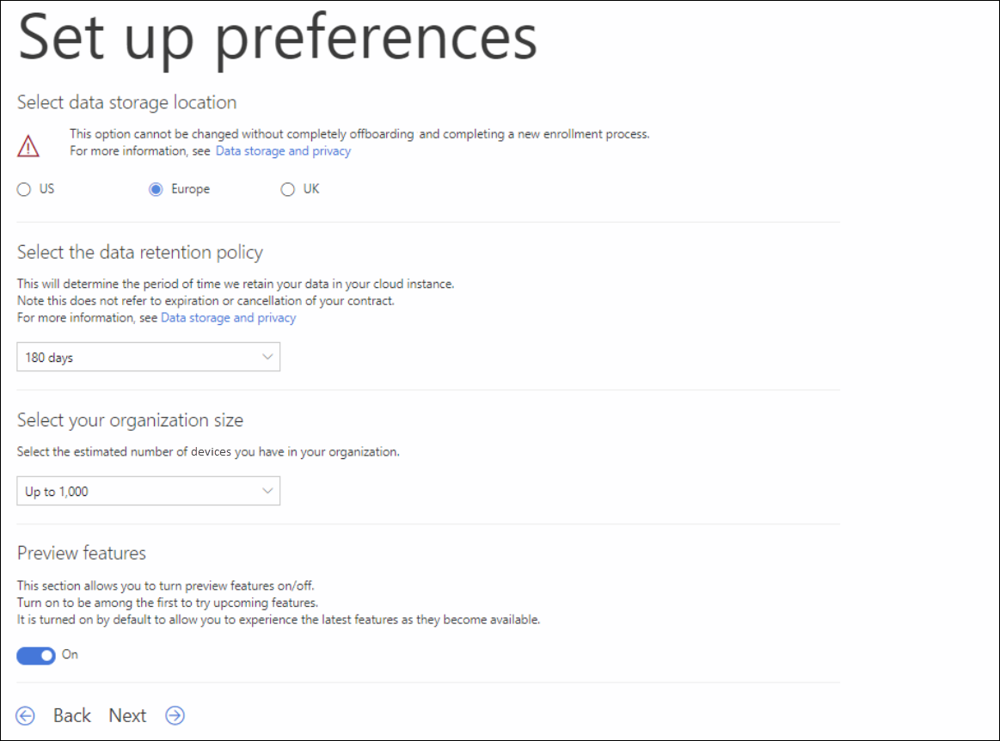

# <a name="set-up-microsoft-defender-for-endpoint-deployment"></a>Microsoft Defender for Endpoint の展開をセットアップする

[!INCLUDE [Microsoft 365 Defender rebranding](../../includes/microsoft-defender.md)]


**適用対象:**
- [Microsoft Defender for Endpoint](https://go.microsoft.com/fwlink/p/?linkid=2154037)
- [Microsoft 365 Defender](https://go.microsoft.com/fwlink/?linkid=2118804)

> Microsoft Defender for Endpoint を体験してみませんか? [無料試用版にサインアップします。](https://www.microsoft.com/microsoft-365/windows/microsoft-defender-atp?ocid=docs-wdatp-exposedapis-abovefoldlink)

Defender for Endpoint の展開は、次の 3 フェーズプロセスです。

| [](prepare-deployment.md)<br>[フェーズ 1: 準備](prepare-deployment.md) | <br>フェーズ 2: セットアップ | [](onboarding.md)<br>[フェーズ 3: オンボード](onboarding.md) |
| ----- | ----- | ----- |
| | *お前はここにいる!*||

現在、セットアップ フェーズに入っている。

この展開シナリオでは、次の手順について説明します。
- ライセンスの検証
- テナント構成
- ネットワーク構成


>[!NOTE]
>一般的な展開を案内する目的で、このシナリオでは Microsoft Endpoint Configuration Manager の使用のみを説明します。 Defender for Endpoint は、他のオンボーディング ツールの使用をサポートしていますが、展開ガイドではこれらのシナリオについては説明しません。 詳細については、「デバイスを [Microsoft Defender for Endpoint にオンボードする」を参照してください](onboard-configure.md)。

## <a name="check-license-state"></a>ライセンスの状態を確認する

ライセンスの状態を確認し、適切にプロビジョニングされたかどうかを確認するには、管理センターまたは **Microsoft Azure portal を使用します**。

1. ライセンスを表示するには **、Microsoft Azure ポータル** に移動し、[Microsoft Azure portal ライセンス] セクション [に移動します](https://portal.azure.com/#blade/Microsoft_AAD_IAM/LicensesMenuBlade/Products)。

   ![[Azure ライセンス] ページのイメージ](images/atp-licensing-azure-portal.png)

1. または、管理センターで [課金サブスクリプション]   >  **に移動します**。

    画面に、すべてのプロビジョニング済みライセンスと現在の状態が表示 **されます**。

    


## <a name="cloud-service-provider-validation"></a>クラウド サービス プロバイダーの検証

会社にプロビジョニングされるライセンスにアクセスし、ライセンスの状態を確認するには、管理センターに移動します。

1. パートナー ポータル **で、[サービス** の管理 **] を選択> Office 365.**

2. [パートナー ポータル]**リンクをクリック** すると、[代理として管理者] オプションが開き、顧客管理センターにアクセスできます。

   


## <a name="tenant-configuration"></a>テナント構成

Microsoft Defender Security Center に初めてアクセスする場合は、最初の手順を説明するウィザードを使用します。 セットアップ ウィザードの最後に、Defender for Endpoint の専用クラウド インスタンスが作成されます。 最も簡単な方法は、Windows 10 クライアント デバイスからこれらの手順を実行することです。

1. Web ブラウザーからに移動します <https://securitycenter.windows.com> 。

    

2. 試用版ライセンスを使用する場合は、リンク ( ) に移動 <https://signup.microsoft.com/Signup?OfferId=6033e4b5-c320-4008-a936-909c2825d83c&dl=WIN_DEF_ATP&pc=xxxxxxx-xxxxxx-xxx-x> します。

    承認手順が完了すると、[ようこそ] **画面** が表示されます。
3. 認証手順を実行します。

    

4. 基本設定を設定します。

   **データストレージの場所** - これを正しく設定することが重要です。 顧客が主にホストする場所 (米国、EU、英国) を決定します。 この設定後に場所を変更することはできません。また、Microsoft は指定した位置情報からデータを転送できません。 

    **データ保持** - 既定値は 6 か月です。

    **プレビュー機能を有効** にする - 既定値はオンで、後で変更できます。

    

5. **[次へ]** を選択します。

     

6. [続行 **] を選択します**。


## <a name="network-configuration"></a>ネットワーク構成
組織がプロキシを使用してインターネットにアクセスするためにエンドポイントを必要としない場合は、このセクションをスキップします。

Microsoft Defender ATP センサーでは、センサー データをレポートし、Microsoft Defender for Endpoint service サービスと通信するために、Microsoft Windows HTTP (WinHTTP) が必要になります。 埋め込まれた Microsoft Defender for Endpoint センサーは、LocalSystem アカウントを使用してシステム コンテキストで実行されます。 センサーは Microsoft Windows HTTP サービス (WinHTTP) を使用して、Microsoft Defender for Endpoint クラウド サービスとの通信を有効にします。 WinHTTP 構成設定は、Windows インターネット (WinINet) インターネットブラウズ プロキシ設定とは独立しています。次の検出方法を使用してのみプロキシ サーバーを検出できます。

**自動検出メソッド:**

-   透過プロキシ

-   Web プロキシ自動検出プロトコル (WPAD)

透過プロキシまたは WPAD がネットワーク トポロジに実装されている場合、特別な構成設定は不要です。 プロキシ内の Microsoft Defender for Endpoint URL 除外の詳細については、このドキュメントの「URL 許可リストまたは Microsoft Docs の付録」セクションを [参照してください](https://docs.microsoft.com/windows/security/threat-protection/windows-defender-atp/configure-proxy-internet-windows-defender-advanced-threat-protection#enable-access-to-windows-defender-atp-service-urls-in-the-proxy-server)。

> [!NOTE]
> 許可する必要がある URL の詳細な一覧については、この記事を [参照してください](https://docs.microsoft.com/windows/security/threat-protection/microsoft-defender-antivirus/configure-network-connections-microsoft-defender-antivirus)。

**手動の静的プロキシの構成:**

-   レジストリ ベースの構成

-   netsh コマンドを使用して構成された WinHTTP <br> 安定したトポロジのデスクトップにのみ適しています (たとえば、同じプロキシの背後にある企業ネットワーク内のデスクトップ)

### <a name="configure-the-proxy-server-manually-using-a-registry-based-static-proxy"></a>レジストリ ベースの静的プロキシを使用して、プロキシ サーバーを手動で構成します。

コンピューターがインターネットへの接続を許可されていない場合、Microsoft Defender for Endpoint センサーだけが診断データを報告し、Microsoft Defender for Endpoint サービスと通信できるレジストリ ベースの静的プロキシを構成します。 静的プロキシは、グループ ポリシー (GP) を使用して構成できます。 グループ ポリシーは次の場所にあります。

 - 管理用テンプレート Windows コンポーネント のデータ収集とプレビュー ビルド 接続されたユーザー エクスペリエンスとテレメトリ サービスの認証プロキシの使用 \> \> \> を構成する
     - [有効] に **設定し、[** 認証された **プロキシの使用を無効にする] を選択します。**

1. グループ ポリシー管理コンソールを開きます。
2. 組織のプラクティスに基づいてポリシーを作成するか、既存のポリシーを編集します。
3. グループ ポリシーを編集し、[管理用テンプレート] [Windows コンポーネント データコレクション] および [プレビュー ビルド] [接続されたユーザー エクスペリエンスとテレメトリ サービスの認証プロキシの使用を構成する] **\> \> \> に移動します**。 
    

4. **[有効]** を選択します。
5. [認証 **されたプロキシの使用を無効にする] を選択します**。
   
6. [管理用テンプレート] [Windows コンポーネント データコレクション] および [プレビュー ビルド] [接続されたユーザー エクスペリエンスと利用統計情報を **\> 構成する] \> \> に移動します**。
    
7. **[有効]** を選択します。
8. プロキシ サーバー **名を入力します**。

このポリシーは、レジストリ キー `HKLM\Software\Policies\Microsoft\Windows\DataCollection` の下に 2 つのレジストリ値 `TelemetryProxyServer` を REG_SZ として、`DisableEnterpriseAuthProxy` を REG_DWORD として設定します。

レジストリ値は、 `TelemetryProxyServer` 次の文字列形式を取ります。

```text
<server name or ip>:<port>
```

例: 10.0.0.6:8080

レジストリ値 `DisableEnterpriseAuthProxy` を 1に設定する必要があります。

###  <a name="configure-the-proxy-server-manually-using-netsh-command"></a>netsh コマンドを使用してプロキシ サーバーを手動で構成する

netsh を使用して、システム全体の静的プロキシを構成します。

> [!NOTE]
> - これは、既定のプロキシで WinHTTP を使用する Windows サービスを含むすべてのアプリケーションに影響します。</br>
> - トポロジを変更しているラップトップ (たとえば、オフィスから自宅) は netsh に誤動作します。 レジストリ ベースの静的プロキシの構成を使用します。

1. 管理者特権のコマンド ラインを開きます。

    1. **[スタート]** をクリックし、「**cmd**」と入力します。

    1. **[コマンド プロンプト]** を右クリックして **[管理者として実行]** を選択します。

2. 次のコマンドを入力して、**Enter** キーを押します。

   ```PowerShell
   netsh winhttp set proxy <proxy>:<port>
   ```

   例: netsh winhttp set proxy 10.0.0.6:8080


###  <a name="proxy-configuration-for-down-level-devices"></a>ダウンレベル デバイスのプロキシ構成

Down-Levelには、Windows 7 SP1 および Windows 8.1 ワークステーション、Windows Server 2008 R2、Windows Server 2012、Windows Server 2012 R2、Windows Server CB 1803 より前の Windows Server 2016 のバージョンが含まれます。 これらのオペレーティング システムでは、エンドポイントから Azure への通信を処理するために、Microsoft 管理エージェントの一部としてプロキシが構成されます。 これらのデバイスでのプロキシの構成方法については、「Microsoft Management Agent Fast Deployment Guide」を参照してください。

### <a name="proxy-service-urls"></a>プロキシ サービスの URL
v20 を含む URL は、Windows 10 バージョン 1803 以降のデバイスがある場合にのみ必要です。 たとえば、 ```us-v20.events.data.microsoft.com``` デバイスが Windows 10 バージョン 1803 以降の場合にのみ必要です。
 

プロキシまたはファイアウォールが匿名トラフィックをブロックしている場合、Microsoft Defender for Endpoint センサーがシステム コンテキストから接続している場合は、一覧の URL で匿名トラフィックが許可されている必要があります。

次のダウンロード可能なスプレッドシートには、ネットワークが接続できる必要があるサービスと関連付けられている URL が一覧表示されます。 これらの URL へのアクセスを拒否するファイアウォールまたはネットワーク フィルター ルールが存在しないか、許可ルールを作成する必要がある場合があります。

|**ドメインリストのスプレッドシート**|**説明**|
|:-----|:-----|
|<br/>  | サービスの場所、地理的な場所、および OS の特定の DNS レコードのスプレッドシート。 <br><br>[ここにスプレッドシートをダウンロードします。](https://download.microsoft.com/download/8/a/5/8a51eee5-cd02-431c-9d78-a58b7f77c070/mde-urls.xlsx) 


###  <a name="microsoft-defender-for-endpoint-service-backend-ip-range"></a>Microsoft Defender for Endpoint Service バックエンド IP 範囲

ネットワーク デバイスが前のセクションに記載されている URL をサポートしない場合は、次の情報を使用できます。

Defender for Endpoint は Azure クラウド上に構築され、次の地域に展開されます。

- \+\<Region Name="uswestcentral">
- \+\<Region Name="useast2">
- \+\<Region Name="useast">
- \+\<Region Name="europenorth">
- \+\<Region Name="europewest">
- \+\<Region Name="uksouth">
- \+\<Region Name="ukwest">

Azure IP 範囲は、Microsoft [Azure データセンター IP 範囲で確認できます](https://www.microsoft.com/en-us/download/details.aspx?id=41653)。

> [!NOTE]
> クラウドベースのソリューションとして、IP アドレス範囲が変更される可能性があります。 DNS 解決設定に移動する必要があります。

## <a name="next-step"></a>次の手順

 <br>[フェーズ 3: オンボード](onboarding.md): Microsoft Defender for Endpoint サービスがセンサー データを取得できるよう、デバイスをサービスにオンボードします。 
