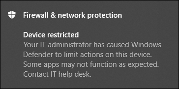

# デバイスで応答アクションを実行する

[!INCLUDE [Microsoft 365 Defender rebranding](../../includes/microsoft-defender.md)]

**適用対象:**
- [Microsoft Defender for Endpoint](https://go.microsoft.com/fwlink/?linkid=2154037)

>Defender for Endpoint を体験してみませんか? [無料試用版にサインアップします。](https://www.microsoft.com/microsoft-365/windows/microsoft-defender-atp?ocid=docs-wdatp-respondmachine-abovefoldlink) 

デバイスを分離するか、調査パッケージを収集することで、検出された攻撃に迅速に対応します。 デバイスでアクションを実行した後、アクション センターでアクティビティの詳細を確認できます。

応答アクションは、特定のデバイス ページの上部に沿って実行され、次のものが含まれます。

- タグの管理
- 自動調査の開始
- ライブ応答セッションの開始
- 調査パッケージの収集
- ウイルス対策スキャンの実行
- アプリの実行を制限する
- デバイスの分離
- 脅威の専門家に相談する
- アクション センター

 デバイス ページは、次のビューから検索できます。

- **セキュリティ操作ダッシュボード** - リスク カードのデバイスからデバイス名を選択します。
- **アラート キュー** - 通知キューからデバイス アイコンの横にあるデバイス名を選択します。
- **[デバイス一** 覧] - デバイスリストからデバイス名の見出しを選択します。
- **[検索]** ボックス - ドロップダウン メニューから [デバイス] を選択し、デバイス名を入力します。

>[!IMPORTANT]
> - これらの応答アクションは、Windows 10 バージョン 1703 以降のデバイスでのみ使用できます。 
> - Windows 以外のプラットフォームでは、応答機能 (デバイスの分離など) はサード パーティの機能に依存します。

## タグの管理

タグを追加または管理して、論理グループ所属を作成します。 デバイス タグは、ネットワークの適切なマッピングをサポートし、さまざまなタグを添付してコンテキストをキャプチャし、インシデントの一部として動的なリスト作成を有効にできます。

デバイスタグ付けの詳細については、「デバイス タグの作成と [管理」を参照してください](machine-tags.md)。

## 自動調査の開始

必要に応じて、デバイスで新しい汎用自動調査を開始できます。 調査の実行中、デバイスから生成された他のアラートは、その調査が完了するまで、継続的な自動調査に追加されます。 さらに、他のデバイスで同じ脅威が見られる場合は、それらのデバイスが調査に追加されます。

自動調査の詳細については、「自動調査の [概要」を参照してください](automated-investigations.md)。

## ライブ応答セッションの開始

ライブ応答は、リモート シェル接続を使用してデバイスに瞬時にアクセスできる機能です。 これにより、詳細な調査作業を行い、迅速に特定された脅威 (リアルタイム) を含む即時対応アクションを実行できます。

ライブ応答は、法医学データの収集、スクリプトの実行、分析のための疑わしいエンティティの送信、脅威の修復、および新たな脅威の予防的な捜しを可能にすることで、調査を強化するように設計されています。

ライブ応答の詳細については、「ライブ応答を使用 [してデバイス上のエンティティを調査する」を参照してください](live-response.md)。

## デバイスから調査パッケージを収集する

調査または対応プロセスの一環として、デバイスから調査パッケージを収集できます。 調査パッケージを収集することで、デバイスの現在の状態を特定し、攻撃者が使用するツールと手法をさらに理解できます。

パッケージ (Zip ファイル) をダウンロードし、デバイスで発生したイベントを調査するには

1. デバイス **ページの上部にある** 応答アクションの行から [調査パッケージの収集] を選択します。
2. このアクションを実行する理由をテキスト ボックスに指定します。 **[確認]** を選択します。
3. zip ファイルがダウンロードされます

別の方法:

1. デバイス **ページの [** 応答アクション] セクションから [アクション センター] を選択します。

    

3. アクション センターのフライアウトで、[ **パッケージ コレクション** パッケージを選択して zip ファイルをダウンロードできます。
  
    ![[パッケージのダウンロード] ボタンのイメージ](images/collect-package.png)

パッケージには、次のフォルダーが含まれています。

| フォルダー | 説明 |
|:---|:---------|
|自動実行 | デバイス上での攻撃者の永続性を識別するために、既知の自動開始エントリ ポイント (ASEP) のレジストリの内容を表す一連のファイルが格納されています。    
<b>注:</b> レジストリ キーが見つからない場合、ファイルには次のメッセージが含まれます。"ERROR: システムは、指定されたレジストリ キーまたは値を見つかりませんでした。
                                                                                                                                |
|インストールされているプログラム | これ。CSV ファイルには、デバイスに現在インストールされているプログラムを識別するのに役立つインストール済みプログラムの一覧が含まれている。 詳細については、「Win32_Product [クラス」を参照してください](https://go.microsoft.com/fwlink/?linkid=841509)。                                                                                  |
|ネットワーク接続 | このフォルダーには、疑わしい URL への接続、攻撃者のコマンドと制御 (C&C) インフラストラクチャ、横方向の移動、またはリモート接続の識別に役立つ接続情報に関連する一連のデータ ポイントが格納されています。   - ActiveNetConnections.txt – プロトコル統計と現在の TCP/IP ネットワーク接続を表示します。 プロセスによって行われた疑わしい接続を探す機能を提供します。    - Arp.txt – すべてのインターフェイスの現在のアドレス解決プロトコル (ARP) キャッシュ テーブルを表示します。    ARP キャッシュは、ネットワーク上で侵害された、または内部攻撃を実行するために使用された可能性がある疑わしいシステムがネットワーク上の追加のホストを表示する可能性があります。   - DnsCache.txt - ローカル ホスト ファイルから事前に読み込まれるエントリと、コンピューターによって解決された名前クエリの最近取得したリソース レコードの両方を含む、DNS クライアント リゾルバー キャッシュの内容を表示します。 これは、疑わしい接続を識別するのに役立ちます。    - IpConfig.txt – すべてのアダプターの TCP/IP 構成全体を表示します。 アダプターは、インストールされているネットワーク アダプターなどの物理インターフェイス、またはダイヤルアップ接続などの論理インターフェイスを表します。    - FirewallExecutionLog.txt pfirewall.log                                                                                  |
| プリフェッチ ファイル| Windows Prefetch ファイルは、アプリケーションの起動プロセスを高速化するように設計されています。 システムで最近使用されたファイルを追跡し、削除された可能性があるがプリフェッチ ファイルの一覧に残っている可能性があるアプリケーションのトレースを検索するために使用できます。    - Prefetch フォルダー – からプリフェッチ ファイルのコピーが含まれる `%SystemRoot%\Prefetch` 。 注: プリフェッチ ファイルを表示するには、プリフェッチ ファイル ビューアーをダウンロードしてください。    - PrefetchFilesList.txt – プリフェッチ フォルダーにコピーエラーが発生した場合に追跡するために使用できる、コピーされたファイルの一覧が含まれる。                                                                                                      |
| プロセス| を含む.実行中のプロセスを示す CSV ファイルで、デバイスで実行中の現在のプロセスを識別できます。 これは、疑わしいプロセスとその状態を識別する場合に役立ちます。                                                                                                                                                                                                       |
| スケジュールされたタスク| を含む.選択したデバイスで自動的に実行されるルーチンを識別するために使用できる、スケジュールされたタスクを示す CSV ファイルで、自動的に実行される疑わしいコードを探します。                                                                                                                                                                                                      |
| セキュリティ イベント ログ| ログインまたはログアウトアクティビティのレコード、またはシステムの監査ポリシーで指定された他のセキュリティ関連イベントを含むセキュリティ イベント ログが含まれます。   
<b>注:</b> イベント ビューアーを使用してイベント ログ ファイルを開きます。
                                                                                    |
| サービス| を含む.サービスとその状態を一覧表示する CSV ファイル。                                                                                      |
| Windows Server メッセージ ブロック (SMB) セッション | ファイル、プリンター、シリアル ポートへの共有アクセスと、ネットワーク上のノード間のその他の通信を一覧表示します。 これは、データの外ろ過や横方向の動きを特定するのに役立ちます。    SMBInboundSessions および SMBOutboundSession 用のファイルが含まれる。    
<b>注:</b> セッション (受信または送信) がない場合は、SMB セッションが見つからないことを示すテキスト ファイルが表示されます。
                                                                                                                          |
| システム情報| OS のバージョンSystemInformation.txtネットワーク カードなどのシステム情報を一覧表示するファイルを格納します。                                                                                     |
| 一時ディレクトリ| システム内のすべてのユーザーの %Temp% にあるファイルを一覧表示する一連のテキスト ファイルが含まれる。    これにより、攻撃者がシステムにドロップした疑わしいファイルを追跡するのに役立ちます。    
<b>注:</b> ファイルに次のメッセージが含まれている場合は、"システムが指定したパスを見つけ"、このユーザーの一時ディレクトリが存在しないという意味であり、ユーザーがシステムにログインしなかったためである可能性があります。
                                                                                                                                         |
| ユーザーとグループ| グループとそのメンバーを表すファイルの一覧を提供します。                                                                                                                   |
|WdSupportLogs| データとMpCmdRunLog.txtを提供MPSupportFiles.cab     
<b>注:</b> このフォルダーは、Windows 10 バージョン 1709 以降でのみ作成され、2020 年 2 月の更新プログラムのロールアップ以上がインストールされます。  Win10 1709 (RS3) ビルド 16299.1717 : [KB4537816](https://support.microsoft.com/en-us/help/4537816/windows-10-update-kb4537816)   Win10 1803 (RS4) ビルド 17134.1345 : [KB4537795](https://support.microsoft.com/en-us/help/4537795/windows-10-update-kb4537795)   Win10 1809 (RS5) ビルド 17763.1075 : [KB4537818](https://support.microsoft.com/en-us/help/4537818/windows-10-update-kb4537818)   Win10 1903/1909 (19h1/19h2) ビルド 18362.693 および 18363.693 : [KB4535996](https://support.microsoft.com/en-us/help/4535996/windows-10-update-kb4535996) 
                                                                                                                    |
| CollectionSummaryReport.xls| このファイルは、調査パッケージ コレクションの概要であり、データ ポイントの一覧、データの抽出に使用されるコマンド、実行状態、エラー が発生した場合のエラー コードが含まれます。 このレポートを使用して、パッケージに予期されるデータが含まれるか追跡し、エラーが発生した場合を特定できます。 |

## デバイスで Microsoft Defender ウイルス対策スキャンを実行する

調査または対応プロセスの一環として、リモートからウイルス対策スキャンを開始して、侵害されたデバイスに存在する可能性のあるマルウェアを特定して修復できます。

>[!IMPORTANT]
>- このアクションは、Windows 10 バージョン 1709 以降のデバイスで使用できます。
>- Microsoft Defender ウイルス対策 (Microsoft Defender AV) スキャンは、Microsoft Defender AV がアクティブなウイルス対策ソリューションか否かに関して、他のウイルス対策ソリューションと共に実行できます。 Microsoft Defender AV はパッシブ モードにできます。 詳細については [、「Microsoft Defender ウイルス対策の互換性」を参照してください](https://docs.microsoft.com/windows/security/threat-protection/microsoft-defender-antivirus/microsoft-defender-antivirus-compatibility.md)。

[ウイルス対策スキャンの **実行**] を選択した 1 つは、実行するスキャンの種類 (クイックまたはフル) を選択し、コメントを追加してからスキャンを確認します。

アクション センターにスキャン情報が表示され、デバイスのタイムラインに新しいイベントが含まれます。スキャン アクションがデバイスに送信されたのを反映します。 Microsoft Defender AV アラートは、スキャン中に表示された検出を反映します。

>[!NOTE]
>Defender for Endpoint 応答アクションを使用してスキャンをトリガーする場合、Microsoft Defender ウイルス対策 'ScanAvgCPULoadFactor' の値は引き続き適用され、スキャンの CPU への影響が制限されます。  ScanAvgCPULoadFactor が構成されていない場合、既定値はスキャン中の最大 CPU 負荷の 50% の制限です。 
>詳細については [、「configure-advanced-scan-types-microsoft-defender-antivirus」を参照してください](https://docs.microsoft.com/windows/security/threat-protection/microsoft-defender-antivirus/configure-advanced-scan-types-microsoft-defender-antivirus)。

## アプリの実行を制限する

悪意のあるプロセスを停止して攻撃を含めるだけでなく、デバイスをロックダウンして、悪意のある可能性のあるプログラムの後続の試みを実行することもできます。

>[!IMPORTANT]
> - このアクションは、Windows 10 バージョン 1709 以降のデバイスで使用できます。
> - この機能は、組織で Microsoft Defender ウイルス対策を使用している場合に使用できます。
> - このアクションは、アプリケーションコントロールのコード整合性Windows Defenderの形式と署名要件を満たす必要があります。 詳細については、「コード整合性 [ポリシーの形式と署名」を参照してください](https://docs.microsoft.com/windows/device-security/device-guard/requirements-and-deployment-planning-guidelines-for-device-guard#code-integrity-policy-formats-and-signing)。

アプリケーションの実行を制限するために、Microsoft 発行の証明書によって署名されている場合にのみファイルを実行できるコード整合性ポリシーが適用されます。 この制限方法は、攻撃者が侵害されたデバイスを制御し、さらに悪意のあるアクティビティを実行するのを防ぐのに役立ちます。

>[!NOTE]
>アプリケーションの制限をいつでも実行から取り消す事が可能です。 デバイス ページのボタンが [アプリの制限の削除] に変わります。その後、アプリの実行を制限する手順と同じ手順を実行します。

デバイス ページで [ **アプリの実行** を制限する] を選択したら、コメントを入力し、[確認] を **選択します**。 アクション センターにスキャン情報が表示され、デバイスのタイムラインに新しいイベントが含まれます。

**デバイス ユーザーの通知**: 
アプリが制限されている場合は、アプリの実行が制限されているユーザーに通知する次の通知が表示されます。

## ネットワークからデバイスを分離する

攻撃の重大度とデバイスの感度に応じて、ネットワークからデバイスを分離できます。 このアクションは、攻撃者が侵害されたデバイスを制御し、データの漏洩や横方向の移動などの追加のアクティビティを実行するのを防ぐのに役立ちます。

>[!IMPORTANT]
>- 完全な分離は、Windows 10 バージョン 1703 のデバイスで使用できます。
>- 選択的分離は、Windows 10 バージョン 1709 以降のデバイスで使用できます。

このデバイス分離機能は、デバイスを監視し続ける Defender for Endpoint サービスへの接続を維持しながら、侵害されたデバイスをネットワークから切断します。

Windows 10 バージョン 1709 以降では、ネットワーク分離レベルを制御できます。 Outlook、Microsoft Teams、Skype for Business 接続 ("選択的分離") を有効にできます。

>[!NOTE]
>いつでもデバイスをネットワークに再接続できます。 デバイス ページのボタンが [分離から解放] と表示され、デバイスを分離するのと同じ手順を実行します。

デバイス ページで [ **デバイスの分離** ] を選択したら、コメントを入力し、[確認] を **選択します**。 アクション センターにスキャン情報が表示され、デバイスのタイムラインに新しいイベントが含まれます。

>[!NOTE]
>デバイスは、ネットワークから分離されている場合でも、Defender for Endpoint サービスに接続されたままです。 Outlook と Skype for Business の通信を有効にした場合は、デバイスが分離されている間にユーザーと通信できます。

**デバイス ユーザーの通知**: 
デバイスが分離されている場合、次の通知が表示され、デバイスがネットワークから分離されているという通知がユーザーに通知されます。

## 脅威の専門家に相談する

Microsoft の脅威の専門家に相談して、潜在的に侵害されたデバイスや既に侵害されたデバイスに関する詳細な分析情報を確認できます。 Microsoft Threat Experts は、Microsoft Defender セキュリティ センター内から直接関与して、迅速かつ正確な対応を行います。 専門家は、潜在的に侵害されたデバイスに関するだけでなく、複雑な脅威、取得した標的型攻撃通知、またはアラートに関する詳細が必要な場合、またはポータル ダッシュボードに表示される脅威インテリジェンス コンテキストを理解するためにも洞察を提供します。

詳細 [については、「Microsoft Threat Expert」を](https://docs.microsoft.com/microsoft-365/security/defender-endpoint/configure-microsoft-threat-experts#consult-a-microsoft-threat-expert-about-suspicious-cybersecurity-activities-in-your-organization) 参照してください。

## アクション センターでアクティビティの詳細を確認する

アクション **センターは、** デバイスまたはファイルで実行されたアクションに関する情報を提供します。 次の詳細を表示できます。

- 調査パッケージ コレクション
- ウイルス対策スキャン
- アプリの制限
- デバイスの分離

その他のすべての関連する詳細も表示されます 。たとえば、申請の日時、ユーザーの送信、アクションの成功または失敗の場合などです。

## 関連トピック
- [ファイルに対して応答アクションを実行する](respond-file-alerts.md)
- [レポートの不正確さ](https://docs.microsoft.com/microsoft-365/security/defender-endpoint/tvm-security-recommendation#report-inaccuracy)
