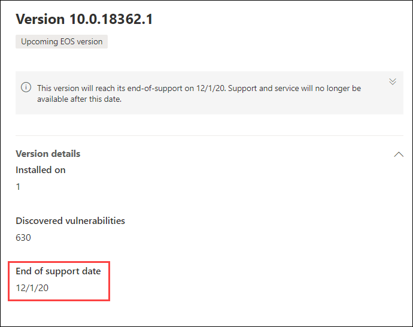

# 脅威と脆弱性の管理を使用して、サポート終了のソフトウェアとソフトウェアのバージョンを計画するPlan for end-of-support software and software versions with threat and vulnerability management

[!INCLUDE [Microsoft 365 Defender rebranding](../../includes/microsoft-defender.md)]

**適用対象:****Applies to:**

- [Microsoft Defender for EndpointMicrosoft Defender for Endpoint](https://go.microsoft.com/fwlink/?linkid=2154037)
- [脅威と脆弱性の管理Threat and vulnerability management](next-gen-threat-and-vuln-mgt.md)
- [Microsoft 365 DefenderMicrosoft 365 Defender](https://go.microsoft.com/fwlink/?linkid=2118804)

>Microsoft Defender for Endpoint を体験してみませんか?Want to experience Microsoft Defender for Endpoint? [無料試用版にサインアップします。Sign up for a free trial.](https://www.microsoft.com/microsoft-365/windows/microsoft-defender-atp?ocid=docs-wdatp-portaloverview-abovefoldlink)

ソフトウェアバージョンまたはソフトウェア バージョンのサポート終了 (EOL) は、サポートまたはサービスが終了し、セキュリティ更新プログラムを受け取らなくなるという意味です。End-of-support (EOS), otherwise known as end-of-life (EOL), for software or software versions means that they will no longer be supported or serviced, and will not receive security updates. サポートが終了したソフトウェアまたはソフトウェア バージョンを使用する場合は、セキュリティの脆弱性、法的リスク、財務上のリスクに組織を公開します。When you use software or software versions with ended support, you're exposing your organization to security vulnerabilities, legal, and financial risks.

セキュリティと IT 管理者が一緒に作業し、最適な結果、コンプライアンス、および健全なネットワーク エコシステムのために組織のソフトウェア インベントリが構成されていることを確認することが重要です。It's crucial for Security and IT Administrators to work together and ensure that the organization's software inventory is configured for optimal results, compliance, and a healthy network ecosystem. サポートが終了し、サポートされなくなったバージョンを更新したアプリを削除または置き換えるオプションを確認する必要があります。They should examine the options to remove or replace apps that have reached end-of-support and update versions that are no longer supported. サポート終了日前に計画を作成して実装するのが最善です。It's best to create and implement a plan **before** the end of support dates.

## サポートされなくなったソフトウェアまたはソフトウェアのバージョンを検索するFind software or software versions that are no longer supported

1. [脅威と脆弱性の管理] メニューから、[セキュリティの推奨事項 [**] に移動します**](tvm-security-recommendation.md)。From the threat and vulnerability management menu, navigate to [**Security recommendations**](tvm-security-recommendation.md).
2. [フィルター] **パネルに移動** し、[タグ] セクションを探します。Go to the **Filters** panel and look for the tags section. 1 つ以上の EOS タグ オプションを選択します。Select one or more of the EOS tag options. 次に **、適用します**。Then **Apply**.

    

3. サポートが終了しているソフトウェア、サポート終了のソフトウェア バージョン、またはサポートが終了するバージョンに関連する推奨事項の一覧が表示されます。You'll see a list of recommendations related to software with ended support, software versions that are end of support, or versions with upcoming end of support. これらのタグは、ソフトウェア インベントリ ページ [にも表示](tvm-software-inventory.md) されます。These tags are also visible in the [software inventory](tvm-software-inventory.md) page.

    

## バージョンと日付の一覧List of versions and dates

サポートが終了したバージョンの一覧を表示するには、またはサポートを終了またはすぐにサポートし、それらの日付を表示するには、次の手順を実行します。To view a list of versions that have reached end of support, or end or support soon, and those dates, follow the below steps:

1. サポートが終了したバージョンまたはサポートが近日終了するソフトウェアのセキュリティ推奨事項のフライアウトにメッセージが表示されます。A message will appear in the security recommendation flyout for software with versions that have reached end of support, or will reach end of support soon.

    

2. バージョン配布 **リンクを選択** して、ソフトウェアのドリルダウン ページに移動します。Select the **version distribution** link to go to the software drill-down page. そこでは、タグがサポートの終了またはサポートの今後の終了として識別される、フィルター処理されたバージョンの一覧を表示できます。There, you can see a filtered list of versions with tags identifying them as end of support, or upcoming end of support.

    

3. 開くテーブルのバージョンのいずれかを選択します。Select one of the versions in the table to open. たとえば、バージョン 10.0.18362.1。For example, version 10.0.18362.1. サポート終了日のフライアウトが表示されます。A flyout will appear with the end of support date.

    

サポート終了の状態により脆弱なソフトウェアとソフトウェアのバージョンを特定したら、それらを更新するか、組織から削除するか決定する必要があります。Once you identify which software and software versions are vulnerable due to their end-of-support status, you must decide whether to update or remove them from your organization. これにより、組織は脆弱性や高度な永続的な脅威にさらされるリスクを軽減します。Doing so will lower your organizations exposure to vulnerabilities and advanced persistent threats.

## 関連項目Related topics

- [脅威と脆弱性の管理の概要Threat and vulnerability management overview](next-gen-threat-and-vuln-mgt.md)
- [セキュリティ上の推奨事項Security recommendations](tvm-security-recommendation.md)
- [ソフトウェア インベントリSoftware inventory](tvm-software-inventory.md)
