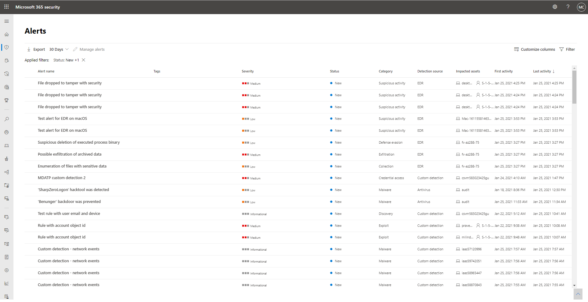

# Microsoft 365 Defender でアラートを調査する

[!INCLUDE [Microsoft 365 Defender rebranding](../includes/microsoft-defender.md)]

**適用対象:**
- Microsoft 365 Defender

[!INCLUDE [Prerelease](../includes/prerelease.md)]

アラートは、すべてのインシデントの基礎であり、環境内で悪意のあるイベントや不審なイベントが発生したかどうかを示します。 アラートは通常、より広範な攻撃の一部であり、インシデントに関する手がかりを提供します。

Microsoft 365 Defender では、関連するアラートがまとめて集計され、インシデントが発生します。 インシデントは常に攻撃の広範なコンテキストを提供しますが、アラートの調査は、より深い分析が必要な場合に有用です。 

## 調査でのアラート ページの使用

インシデント ページの [アラート] タブで、アラートを選択すると、個々のアラート ページに移動します。 アラート ページは、影響を受けるアセット、アラート ストーリー、詳細ウィンドウの 3 つのセクションで構成されます。

アラート ページ全体で、任意のエンティティの横にある 3 ドット アイコン (**...**) を選択すると、特定のアセット ページを開く、または特定の修復手順を実行するなど、使用可能なアクションを確認できます。

### 影響を受けるアセットを分析する
[影響を受ける資産] セクションには、このアラートの影響を受けるメールボックス、デバイス、およびユーザーが一覧表示されます。 任意のアセット カードを選択すると、詳細サイド ウィンドウに、アセットに関連して発生したその他のアラートを含む情報が入力されます (それがある場合)。

### アラート ストーリー内のアラートの役割を追跡する
アラート ストーリーは、プロセス ツリー ビューでアラートに関連付けのすべてのアセットまたはエンティティを表示します。 タイトル内のアラートは、選択したアラートのページに最初に着陸した場合にフォーカスを置くアラートです。 アラート ストーリー内のアセットは展開可能でクリック可能です。 アラート ページのコンテキストでアクションを実行できるようにして、追加情報を提供し、応答を迅速化します。 

> [!NOTE]
> [アラート ストーリー] セクションには複数のアラートが含まれている場合があります。選択したアラートの前または後に、同じ実行ツリーに関連する追加のアラートが表示されます。

### 詳細ウィンドウでアラートの詳細情報を表示する

詳細ウィンドウには、最初に選択したアラートの詳細が表示され、詳細とアクションが関連付けされます。 アラート ストーリーで影響を受けるアセットまたはエンティティを選択すると、詳細ウィンドウが変更され、選択したオブジェクトのコンテキスト情報とアクションが提供されます。

目的のエンティティを選択すると、詳細ウィンドウが変更され、選択したエンティティの種類に関する情報、利用可能な場合の歴史的な情報、アラート ページから直接このエンティティに対してアクションを実行するオプションが表示されます。

### アラートの管理

アラートの調査が完了したら、開始したアラートに戻り、アラートの状態を [解決済み] としてマークし、False アラートまたは True アラートとして分類できます。 アラートを分類すると、製品を調整して、より真のアラートと誤ったアラートを減らします。

> [!NOTE]
> タグを使用してアラートを管理する方法の 1 つ。 段階的に展開され、現在プレビュー中Office 365 の Microsoft Defender のタグ付け機能。  
> 現在、変更されたタグ名は、更新後に作成された *アラートにのみ* 適用されます。 変更前に生成されたアラートには、更新されたタグ名は反映されません。 

## 統合アラート キューの管理

Microsoft 365 セキュリティ センター ナビゲーション ウィンドウ& [インシデントと警告] の下で [通知] を選択すると、統合アラート キューに移動します。 このセクションには、Microsoft Defender for Endpoint、Microsoft Defender for Office 365、Microsoft 365 Defender など、さまざまな Microsoft セキュリティ ソリューションからの通知が表示されます。 

アラート キューには、ネットワークでフラグが設定されたアラートの一覧が表示されます。 既定では、キューには過去 30 日間に表示されたアラートが表示されます。 リストの上部に最新のアラートが表示され、最初に最新のアラートが表示されます。

> [!NOTE]
> 起動時に、統合アラート キューには、利用可能な 365 件のアラートに対Office 7 日分しか含められません。 キューは、時間の長い間、ビルドを続行します。 統合アラート キューを起動する前にアラートをトリアージする必要がある場合は、セキュリティとコンプライアンス センターのアラート キュー [を使用します](https://protection.office.com/viewalerts)。

上部のナビゲーションでは、次の操作を実行できます。

- フィルターの適用
- 列をカスタマイズして列を追加または削除する
- データのエクスポート

また、さまざまな条件に従ってアラートをフィルター処理することもできます。

- 重要度
- 状態
- カテゴリ
- 検出ソース
- ポリシー
- 影響を受け取ったアセット
- 最初のアクティビティ
- [最後のアクティビティ]

インシデントの調査を開始するには[、「Microsoft 365 Defender](investigate-incidents.md)でインシデントを調査する」を参照してください。
## 関連項目

- [インシデントの概要](incidents-overview.md)
- [インシデントの調査](investigate-incidents.md)
- [インシデントの管理](manage-incidents.md)
