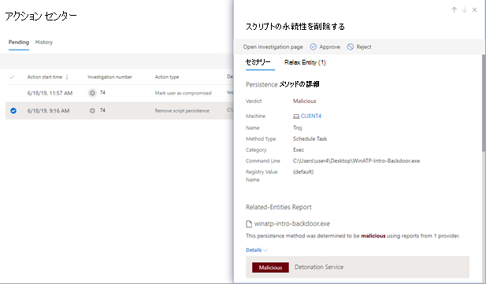
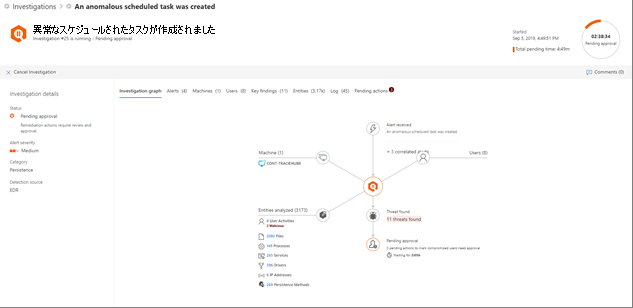

# 自動調査後に保留中のアクションを承認または拒否する

[!INCLUDE [Microsoft 365 Defender rebranding](../includes/microsoft-defender.md)]

**適用対象:**
- Microsoft 365 Defender

自動調査が実行されたときに、調査を続行するには承認を必要とする 1 つまたは複数の[修復](https://docs.microsoft.com/microsoft-365/security/mtp/mtp-remediation-actions)アクションが発生する場合があります。 たとえば、一連のメール メッセージを削除する必要がある場合や、検疫されたファイルを削除する必要がある場合があります。 自動調査を続行し適時完了できるよう、保留中のアクションはできるだけ早く承認 (または拒否) することが重要です。 

> [!TIP]
> Microsoft 365 Defender の自動調査および対応機能によって何かが見逃された、または誤って検出されたと思う場合は、お知らせします。 [Microsoft 365 Defender](mtp-autoir-report-false-positives-negatives.md)の自動調査および対応 (AIR) 機能で誤検知/陰性を報告する方法をご覧ください。

保留中のアクションは、アクション センターまたは調査の詳細ビューを使用して確認[および承認できます](#review-a-pending-action-in-the-investigation-details-view)。

> [!NOTE]
> 修復アクションを承認または拒否するには、[適切なアクセス許可](mtp-action-center.md#required-permissions-for-action-center-tasks)が必要です。 詳しくは、Microsoft 365 Defender での自動調査と対応の [前提条件に関するページをご覧ください](mtp-configure-auto-investigation-response.md#prerequisites-for-automated-investigation-and-response-in-microsoft-365-defender)。

## 保留中のアクションをアクション センターで確認する

1. [https://security.microsoft.com](https://security.microsoft.com) にアクセスし、サインインします。 

2. ナビゲーション ウィンドウで、[**アクション センター**] を選択します。 

3. アクション センターの [**Pending (保留中)**] タブで、リスト内のアイテムを選択します。 

    - [**Investigation number (調査番号)**] 列でアイテムを選択すると、[Investigation details (調査の詳細)] ページが開きます。 このページでは、調査の結果を表示し、推奨されるアクションを承認または拒否できます。
 
    - リスト内の行を選択すると、ポップアップが開き、そのアイテムに関する情報が表示されます。   リンクを使用して関連付けられている警告または調査を表示し、アクションを承認または拒否します。

## 保留中のアクションを調査の詳細ビューで確認する

1. [[Investigation details (調査の詳細)](mtp-autoir-results.md)] ページで、[**Pending actions (保留中のアクション)**] (または [**Actions (アクション)**]) タブを選択します。承認待ちのアイテムがそこに表示されます。

2. リスト内のアイテムを選択し、[**Approve (承認)**] または [**Reject (拒否)**] を選択します。

## 完了した操作を元に戻す

デバイスまたはファイルが脅威ではないと判断した場合は、実行された修復アクションを、それらのアクションが自動的に実行されたのか手動で実行されたのかに関わり合って元に戻すことができます。 アクション センターの [履歴] **タブでは、** 次の操作を元に戻すことができます。  

| アクション ソース | サポートされるアクション |
|:---|:---|
| - 自動調査  - Microsoft Defender ウイルス対策  - 手動対応アクション | - デバイスを分離する  - コードの実行を制限する  - ファイルを検疫する  - レジストリ キーを削除する  - サービスを停止する  - ドライバーを無効にする  - スケジュールされたタスクを削除する |

### 修復アクションを元に戻すには

1. アクション センター ( ) に移動 [https://security.microsoft.com/action-center](https://security.microsoft.com/action-center) し、サインインします。

2. [履歴 **]** タブで、元に戻す操作を選択します。

3. 画面の右側のウィンドウで、[元に戻す] を **選択します**。

### 複数のデバイスにわたる検疫からファイルを削除するには 

1. アクション センター ( ) に移動 [https://security.microsoft.com/action-center](https://security.microsoft.com/action-center) し、サインインします。

2. [履歴 **] タブ** で、操作の種類が検疫ファイルであるファイルを **選択します**。

3. 画面の右側のウィンドウで、[このファイルのインスタンスを **X** に適用する] を選択し、[元に戻す] を選択 **します**。

## 次の手順

- [自動調査の詳細と結果を表示する](mtp-autoir-results.md)
- [自動調査および対応機能で誤検知/陰性を処理する](mtp-autoir-report-false-positives-negatives.md)
