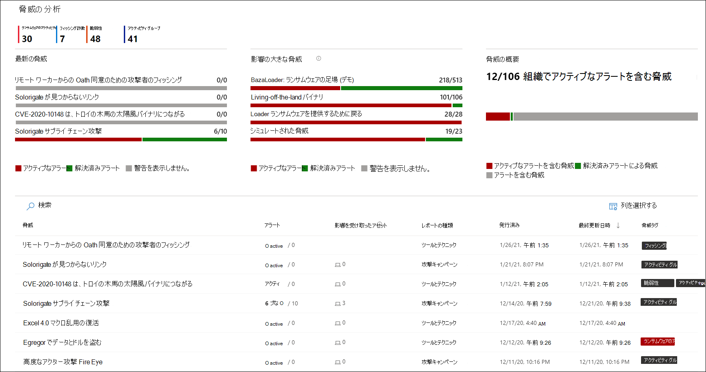

# 脅威の分析を使用して、新たな脅威を追跡し対応する 

[!INCLUDE [Microsoft 365 Defender rebranding](../includes/microsoft-defender.md)]

**適用対象:**
- Microsoft 365 Defender

> Microsoft 365 Defender を体験してみませんか? [ラボ環境で評価する](./mtp-evaluation.md?ocid=cx-docs-MTPtriallab)ことも、[実稼働環境でパイロット プロジェクトを実行する](./mtp-pilot.md?ocid=cx-evalpilot)こともできます。
>

[!INCLUDE [Prerelease](../includes/prerelease.md)]

脅威分析は、Microsoft のセキュリティ研究者による製品内脅威インテリジェンス ソリューションで、セキュリティ チームが次の新たな脅威に直面しながら、可能な限り効率的に対応するように設計されています。

- アクティブな脅威アクターとそのキャンペーン
- 人気のある新しい攻撃手法
- 重大な脆弱性
- 一般的な攻撃の表面
- 一般的なマルウェア

この短いビデオでは、脅威分析が最新の脅威の追跡と停止に役立つ方法について説明します。

>[!VIDEO https://www.microsoft.com/en-us/videoplayer/embed/RWwJfU]

脅威分析には、Microsoft 365 セキュリティ ポータルのナビゲーション バーの左上から、または組織の上位の脅威を示す専用のダッシュボード カードからアクセスできます。アクティブなキャンペーンや進行中のキャンペーンを可視化し、脅威分析を通じて何を行うのかを知ることにより、セキュリティ運用チームに情報に基づいた意思決定を行う際に役立ちます。 

_脅威分析にアクセスする場所_

より高度な敵対者と新しい脅威が頻繁かつ一般に出現する中で、以下を迅速に実行できる必要があります。

- 新たな脅威を特定して対応する 
- 現在攻撃を受け取っている場合の詳細
- 資産に対する脅威の影響を評価する
- 脅威に対する回復力または暴露を確認する
- 脅威を停止または格納するために実行できる軽減、回復、または防止のアクションを特定する

各レポートは、追跡された脅威の分析と、その脅威から防御する方法に関する広範なガイダンスを提供します。 また、ネットワークからのデータも組み込まれており、脅威がアクティブかどうか、適切な保護が適用されているかどうかを示します。

## 脅威分析ダッシュボードの表示

脅威分析ダッシュボード[(security.microsoft.com/threatanalytics3)](https://security.microsoft.com/threatanalytics3)は、組織に最も関連性の高いレポートを強調表示します。 次のセクションの脅威の概要を示します。

- **最新の脅威**— 最新の公開または更新された脅威レポートと、アクティブなアラートと解決されたアラートの数が一覧表示されます。
- **影響の大きな脅威**:組織に最も大きな影響を与える脅威を一覧表示します。 このセクションでは、最初にアクティブなアラートと解決済みアラートの数が最も多い脅威の一覧を示します。
- **脅威の概要**— アクティブなアラートと解決済みアラートを使用して脅威の数を表示することで、すべての追跡された脅威の全体的な影響を提供します。

ダッシュボードから脅威を選択して、その脅威のレポートを表示します。

_脅威分析ダッシュボード。検索アイコンをクリックして、読み取る脅威分析レポートに関連するキーワードをキー設定することもできます。_ 

## 脅威分析レポートの表示

各脅威分析レポートには、次のいくつかのセクションの情報が表示されます。 

- [**概要**](#overview-quickly-understand-the-threat-assess-its-impact-and-review-defenses) 
- [**アナリスト レポート**](#analyst-report-get-expert-insight-from-microsoft-security-researchers)
- [**関連するインシデント**](#related-incidents-view-and-manage-related-incidents)
- [**影響を受け取ったアセット**](#impacted-assets-get-list-of-impacted-devices-and-mailboxes)
- [**メールの試行の防止**](#prevented-email-attempts-view-blocked-or-junked-threat-emails)
- [**軽減策**](#mitigations-review-list-of-mitigations-and-the-status-of-your-devices)

### 概要: 脅威をすばやく理解し、影響を評価し、防御を確認する

[ **概要]** セクションには、詳細なアナリスト レポートのプレビューが表示されます。 また、組織に対する脅威の影響と、構成が正しく設定されていないデバイスや未パッチのデバイスによる露出を強調するグラフも提供されます。

_脅威分析レポートの概要セクション_

#### 組織への影響を評価する
各レポートには、脅威の組織への影響に関する情報を提供するように設計されたグラフが含まれています。
- **関連するインシデント**— 追跡された脅威が組織に与える影響の概要と、次のデータを提供します。
  - アクティブなアラートの数と、関連付けられているアクティブ なインシデントの数
  - アクティブ なインシデントの重大度
- **時間の間のアラート**— 関連するアクティブアラートと解決済みアラート **の時間** の数を示します。 解決済みアラートの数は、組織が脅威に関連付けられたアラートに応答する時間を示します。 理想的には、グラフは数日以内に解決されたアラートを表示する必要があります。
- **影響を受け取** ったアセット : 現在、追跡される脅威に関連付けられているアクティブなアラートが 1 つ以上ある個別のデバイスと電子メール アカウント (メールボックス) の数を示します。 アラートは、脅威メールを受信したメールボックスに対してトリガーされます。 組織レベルとユーザー レベルの両方のポリシーで、脅威メールの配信を引き起こす上書きを確認します。
- **[メールの試行を** 防止する] — 配信前にブロックされた過去 7 日間のメールの数、または迷惑メール フォルダーへの配信の回数を示します。

#### セキュリティの回復力と姿勢を確認する
各レポートには、組織が特定の脅威に対する回復力の概要を示すグラフが含まれています。
- **セキュリティで保護された構成** 状態 —構成が誤ったセキュリティ設定を持つデバイスの数を示します。 脅威を軽減するために推奨されるセキュリティ設定を適用します。 デバイスがすべての追跡 **設定を** 適用している _場合、_ デバイスは Secure と見なされます。
- **脆弱性の修正プログラムの状態**:脆弱なデバイスの数を示します。 脅威によって悪用される脆弱性に対処するために、セキュリティ更新プログラムまたはパッチを適用します。

### アナリスト レポート: Microsoft セキュリティ研究者から専門家の分析情報を取得する
[ **アナリスト レポート] セクション** で、詳細なエキスパートの書き込みについて説明します。 ほとんどのレポートには、MITRE ATT&CK フレームワークにマップされた戦術や手法、推奨事項の網羅的なリスト、強力な脅威検出ガイダンスなど、攻撃チェーンの詳細な説明が記載されています。

[アナリスト レポートの詳細](threat-analytics-analyst-reports.md)

### 関連インシデント: 関連するインシデントの表示と管理
[ **関連インシデント] タブ** には、追跡された脅威に関連するすべてのインシデントの一覧が表示されます。 インシデントを割り当てるか、各インシデントにリンクされたアラートを管理できます。 

_脅威分析レポートの関連インシデント セクション_

### 影響を受け取ったアセット: 影響を受け取ったデバイスとメールボックスの一覧を取得する
アセットは、アクティブで未解決のアラートの影響を受けた場合に影響を受けたと見なされます。 [ **影響を受け取ったアセット]** タブには、影響を受け取るアセットの次の種類が一覧表示されます。
- **影響を受け**、Microsoft Defender for Endpoint アラートが未解決のエンドポイント。 これらのアラートは、通常、既知の脅威インジケーターとアクティビティの目撃情報に対して発生します。
- **影響を受けたメールボックス**—Microsoft Defender が 365 件の通知を受け取Officeメールボックス。 通常、アラートをトリガーするほとんどのメッセージはブロックされますが、ユーザーレベルまたは組織レベルのポリシーはフィルターを上書きできます。

_脅威分析レポートの影響を受け取ったアセット セクション_

### 電子メールの試行を防止する: ブロックまたは迷惑メールの脅威メールを表示する
Microsoft Defender for Office 365 は、通常、悪意のあるリンクや添付ファイルを含む既知の脅威インジケーターを含む電子メールをブロックします。 場合によっては、疑わしいコンテンツをチェックするプロアクティブ フィルターメカニズムによって、脅威メールが迷惑メール フォルダーに送信される場合があります。 いずれの場合も、デバイス上で脅威がマルウェア コードを起動する可能性が低くなります。

[ **メールの試行の** 防止] タブには、配信前にブロックされたメール、または Microsoft Defender が 365 の迷惑メール フォルダーに送信したメールOffice表示されます。 

![脅威分析レポートの [電子メール試行の防止] セクションのイメージ](../../media/threat-analytics/ta_prevented_email_attempts_mtp.png)

_脅威分析レポートの [メールの試行の防止] セクション_

### 軽減策: 軽減策の一覧とデバイスの状態を確認する
[軽減 **策] セクション** で、脅威に対する組織の回復力を高めるのに役立つ具体的なアクション可能な推奨事項の一覧を確認します。 追跡される軽減策の一覧には、次の項目が含まれます。

- **セキュリティ更新** プログラム —オンボード デバイスで見つかった脆弱性に対するサポートされているソフトウェア セキュリティ更新プログラムの展開
- **サポートされているセキュリティ構成**
  - クラウドによる保護  
  - 望ましくない可能性のあるアプリケーション (PUA) 保護
  - リアルタイム保護
 
このセクションの軽減情報には、脅威と脆弱性管理のデータが組み込まれており、レポート内のさまざまなリンクからの詳細なドリルダウン情報も提供します。

 

_脅威分析レポートの [軽減策] セクション_

## その他のレポートの詳細と制限事項
>[!NOTE]
>統合セキュリティ エクスペリエンスの一環として、Microsoft Defender for Endpoint だけでなく、E5 ライセンス所有者向け Microsoft Defender でも脅威分析Office利用できます。
>Microsoft 365 セキュリティ ポータル (Microsoft 365 Defender) を使用していない場合は、Microsoft Defender セキュリティ センター ポータル (Microsoft Defender for Endpoint) のレポートの詳細 (microsoft Defender for Office データなし) も確認できます。 

脅威分析レポートにアクセスするには、特定の役割とアクセス許可が必要です。 詳細 [については、「Microsoft 365 Defender](custom-roles.md) の役割ベースのアクセス制御におけるカスタム ロール」を参照してください。
  - アラート、インシデント、または影響を受けたアセット データを表示するには、Office または Microsoft Defender for Endpoint アラート データ、または両方に対する Microsoft Defender へのアクセス許可が必要です。
  - 電子メールの試行が防止されたのを表示するには、Microsoft Defender に対するアクセス許可を持っている必要があります。Office必要があります。 
  - 軽減策を表示するには、Microsoft Defender for Endpoint の脅威および脆弱性管理データに対するアクセス許可が必要です。

脅威分析データを見る場合は、次の要素を覚えておいてください。
- グラフには、追跡される軽減策だけが反映されます。 グラフに表示されない追加の軽減策については、レポートの概要を確認してください。
- 軽減策は、完全な復元を保証するものではありません。 提供される軽減策は、回復性を向上させるために必要な最善のアクションを反映しています。
- デバイスは、サービスにデータを送信していない場合は、"使用不可" としてカウントされます。
- ウイルス対策関連の統計情報は、Microsoft Defender ウイルス対策の設定に基づいて行います。 サードパーティのウイルス対策ソリューションを使用するデバイスは、"公開" として表示されます。

## 関連項目
- [高度な検索で脅威を事前に検出する](advanced-hunting-overview.md) 
- [[アナリスト レポート] セクションについて](threat-analytics-analyst-reports.md)
- [セキュリティの弱点と露出を評価して解決する](/windows/security/threat-protection/microsoft-defender-atp/next-gen-threat-and-vuln-mgt)