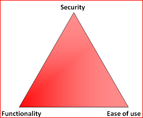

# ID とデバイスのアクセス構成

**適用対象**
- [Exchange Online Protection](https://go.microsoft.com/fwlink/?linkid=2148611)
- [Microsoft Defender for Office 365 プラン 1 およびプラン 2](https://go.microsoft.com/fwlink/?linkid=2148715)

組織の最新のセキュリティ境界は、ネットワークを超えて拡張されたので、さまざまなデバイスを使用して、任意の場所からクラウドベースのアプリにアクセスするユーザーが含まれます。 セキュリティ インフラストラクチャは、特定のアクセス要求を許可するかどうか、およびどのような条件で許可する必要かを判断する必要があります。

この決定は、サインインのユーザー アカウント、使用されているデバイス、ユーザーがアクセスに使用しているアプリ、アクセス要求の実行場所、および要求のリスクの評価に基づいて行う必要があります。 この機能により、承認されたユーザーとデバイスのみが重要なリソースにアクセスできるようになります。

この一連の記事では、ID およびデバイス アクセスの前提条件の構成と、Azure Active Directory (Azure AD) の条件付きアクセス、Microsoft Intune、およびエンタープライズ クラウド アプリとサービス、その他の SaaS サービス、Azure AD アプリケーション プロキシで公開されているオンプレミス アプリケーションに対する Microsoft 365 へのアクセスをセキュリティで保護するためのその他のポリシーについて説明します。

ID とデバイスのアクセス設定とポリシーは、ベースライン保護、機密保護、厳しく規制されたデータまたは分類されたデータを持つ環境の保護の 3 つの層で推奨されます。 これらの層とそれに対応する構成は、データ、ID、およびデバイス全体で一貫したレベルの保護を提供します。

これらの機能とその推奨事項:

- Microsoft 365 E3 および Microsoft 365 E5 でサポートされています。
- [Microsoft](https://docs.microsoft.com/azure/active-directory/fundamentals/identity-secure-score)セキュア スコアと[Azure AD](https://docs.microsoft.com/microsoft-365/security/mtp/microsoft-secure-score)の ID スコアに合わせて調整され、組織のこれらのスコアが向上します。
- ID インフラストラクチャをセキュリティで [保護するために、これら 5 つの手順を実装するのに役立ちます](https://docs.microsoft.com/azure/security/azure-ad-secure-steps)。

組織に固有の環境要件や複雑さがある場合は、これらの推奨事項を開始点として使用します。 ただし、ほとんどの組織では、規定に従ってこれらの推奨事項を実装できます。

このビデオでは、Microsoft 365 for enterprise の ID およびデバイス アクセス構成の概要について説明します。
 
 
> [!VIDEO https://www.microsoft.com/videoplayer/embed/RWxEDQ]

> [!NOTE]
> Microsoft は、365 サブスクリプションの Enterprise Mobility + Security (EMS) ライセンスOffice販売しています。 EMS E3 および EMS E5 の機能は、Microsoft 365 E3 および Microsoft 365 E5 の機能と同等です。 詳 [しくは、EMS プラン](https://www.microsoft.com/microsoft-365/enterprise-mobility-security/compare-plans-and-pricing) をご覧ください。

## 対象ユーザー

これらの推奨事項は、Azure AD (ID)、Microsoft Intune (デバイス管理)、Azure Information Protection (データ保護) を含む Microsoft 365 クラウドの生産性とセキュリティ サービスに精通しているエンタープライズ アーキテクトおよび IT 担当者を対象としています。

### お客様の環境

推奨されるポリシーは、Microsoft クラウド内で完全に運用されているエンタープライズ組織と、Azure AD テナントと同期されるオンプレミスの Active Directory ドメイン サービス (AD DS) フォレストであるハイブリッド ID インフラストラクチャを持つお客様の両方に適用されます。

提供されている推奨事項の多くは、Microsoft 365 E5、Id が & Threat Protection アドオン、EMS E5、または Azure Premium P2 ライセンスを持つ Microsoft 365 E3 でのみ利用可能なサービスに依存しています。

これらのライセンスをお持ちではない組織の場合は、少なくとも、すべてのMicrosoft 365 プランに含まれているセキュリティの既定値を実装してください。

### 注意点

組織は、これらの推奨構成とは異なるポリシーを適用する必要がある特定の推奨事項を含め、規制または他のコンプライアンス要件の対象となる場合があります。 これらの構成では、これまで利用できない使用制御をお勧めします。 これらのコントロールは、セキュリティと生産性のバランスを表すコントロールと考えられます。

組織のさまざまな保護要件を考慮して最善を行いましたが、すべての可能な要件や組織の固有の側面を考慮することはできません。

## 3 層の保護

ほとんどの組織は、セキュリティとデータ保護に関して固有の要件を用意しています。 そのような要件は業種によって、また、組織内の職務によって変わります。 たとえば、法務部門と管理者は、他の部署では必要ない電子メール通信に関して、追加のセキュリティと情報保護の制御を必要とする場合があります。

また、あらゆる業種が独自の特別な規制を用意しています。 考えられるすべてのセキュリティ オプションの一覧や、業界セグメントまたはジョブの機能ごとの推奨事項の一覧を提供するのではなく、ニーズの粒度に基づいて適用できる 3 つの異なる層のセキュリティと保護に関する推奨事項が提供されています。

- **ベースライン保護**: データを保護するための最小基準と、データにアクセスする ID とデバイスを確立することをお勧めします。 これらのベースラインの推奨事項に従って、多くの組織のニーズを満たす強力な既定の保護を提供できます。
- **機密性の** 高い保護 : 一部の顧客は、より高いレベルで保護する必要があるデータのサブセットを持っている場合や、すべてのデータを高いレベルで保護する必要がある場合があります。 Microsoft 365 環境内のすべてまたは特定のデータ セットに対して高い保護を適用できます。 機密データにアクセスする ID とデバイスはそれに相応しいレベルのセキュリティで保護することを推奨します。
- **厳しく規制**: 一部の組織では、高度に分類されるデータ、営業秘密を構成するデータ、または規制データを持つデータが少ない場合があります。 Microsoft は、ID とデバイスの保護を追加するなど、組織がそのような要件を満たすための機能を提供しています。

このガイダンスでは、これらの保護の各層に対して ID とデバイスの保護を実装する方法を示します。 このガイダンスを組織の開始点として使用し、組織の特定の要件に合わせてポリシーを調整します。

データ、ID、デバイス全体で一貫したレベルの保護を使用することが重要です。 たとえば、このガイダンスを実装する場合は、必ず同等のレベルでデータを保護してください。

**Microsoft 365** アーキテクチャ モデルの ID とデバイス保護は、同等の機能を示します。

   [PDF 形式で表示](../../downloads/MSFT_cloud_architecture_identity&device_protection.pdf) \|[PDF としてダウンロードする](https://github.com/MicrosoftDocs/microsoft-365-docs/raw/public/microsoft-365/downloads/MSFT_cloud_architecture_identity&device_protection.pdf) \|[Visio としてダウンロードする](https://github.com/MicrosoftDocs/microsoft-365-docs/raw/public/microsoft-365/downloads/MSFT_cloud_architecture_identity&device_protection.vsdx)  

また、Microsoft 365 に保存されている情報を保護するには、「データ プライバシー規制の情報保護を展開する」を参照してください。 

## セキュリティと生産性の折り合い

セキュリティ戦略を実装するには、セキュリティと生産性の間のトレードオフが必要です。 各決定がセキュリティ、機能、使いやすさのバランスにどのように影響するかを評価すると役立ちます。

提供される推奨事項は、次の原則に基づいて行います。

- ユーザーを知り、セキュリティと機能の要件に柔軟に対応します。
- セキュリティ ポリシーを時間内に適用し、意味を持つものにしてください。

## ID およびデバイス アクセス保護のサービスと概念

Microsoft 365 for enterprise は、すべてのユーザーがクリエイティブで安全に連携するように、大規模な組織向けに設計されています。

このセクションでは、ID とデバイスアクセスに重要な Microsoft 365 のサービスと機能の概要について説明します。

### Azure AD

Azure ADは、ID 管理機能の完全なスイートを提供します。 これらの機能を使用して、アクセスをセキュリティで保護することをお勧めします。

|機能|説明|ライセンス|
|---|---|---|
|[多要素認証 (MFA)](/azure/active-directory/authentication/concept-mfa-howitworks)|MFA を使用するには、ユーザーパスワードと、Microsoft Authenticator アプリまたは電話からの通知など、2 つの形式の検証をユーザーに提供する必要があります。 MFA を使用すると、盗まれた資格情報を使用して環境にアクセスするリスクが大幅に軽減されます。 Microsoft 365 は、MFA ADサインインに Azure AD Multi-Factor Authentication サービスを使用します。|Microsoft 365 E3 または E5|
|[条件付きアクセス](/azure/active-directory/conditional-access/overview)|Azure AD、ユーザー サインインの条件を評価し、条件付きアクセス ポリシーを使用して許可されたアクセスを決定します。 たとえば、このガイダンスでは、機密データへのアクセスにデバイスの準拠を要求する条件付きアクセス ポリシーを作成する方法について説明します。 これにより、自分のデバイスと盗まれた資格情報を持つハッカーが機密データにアクセスするリスクが大幅に軽減されます。 また、デバイスは正常性とセキュリティに関する特定の要件を満たす必要があるため、デバイス上の機密データも保護します。|Microsoft 365 E3 または E5|
|[Azure AD グループ](/azure/active-directory/fundamentals/active-directory-manage-groups)|条件付きアクセス ポリシー、Intune を使用したデバイス管理、組織内のファイルやサイトへのアクセス許可は、ユーザー アカウントまたは Azure AD グループへの割り当てに依存します。 実装する保護のADに対応する Azure グループを作成することをお勧めします。 たとえば、エグゼクティブ スタッフはハッカーの目標値が高い可能性が高くなります。 したがって、これらの従業員のユーザー アカウントを Azure AD グループに追加し、このグループを、より高いレベルのアクセス保護を適用する条件付きアクセス ポリシーや他のポリシーに割り当てるのが理にかなっています。|Microsoft 365 E3 または E5|
|[デバイスの登録](/azure/active-directory/devices/overview)|デバイスを Azure ADに登録して、デバイスの ID を作成します。 この ID は、ユーザーがサインインするときにデバイスを認証し、ドメインに参加している PC または準拠した PC を必要とする条件付きアクセス ポリシーを適用するために使用されます。 このガイダンスでは、デバイスの登録を使用して、ドメインに参加している Windows コンピューターを自動的に登録します。 デバイスの登録は、Intune でデバイスを管理するための前提条件です。|Microsoft 365 E3 または E5|
|[Azure AD Identity Protection](/azure/active-directory/identity-protection/overview)|組織の ID に影響を与える可能性のある脆弱性を検出し、自動修復ポリシーを低、中、および高のサインイン リスクとユーザー リスクに構成できます。 このガイダンスでは、多要素認証に条件付きアクセス ポリシーを適用するために、このリスク評価に依存します。 このガイダンスには、アカウントで危険度の高いアクティビティが検出された場合にユーザーがパスワードを変更する必要がある条件付きアクセス ポリシーも含まれています。|Microsoft 365 E5、Id が & Threat Protection アドオン、EMS E5、または Azure Premium P2 ライセンスを持つ Microsoft 365 E3|
|[セルフサービスによるパスワードのリセット (SSPR)](/azure/active-directory/authentication/concept-sspr-howitworks)|管理者が制御できる複数の認証方法の検証を提供することで、ユーザーがヘルプ デスクの介入なしにパスワードを安全にリセットできます。|Microsoft 365 E3 または E5|
|[Azure AD パスワード保護](https://docs.microsoft.com/azure/active-directory/authentication/concept-password-ban-bad)|既知の脆弱なパスワードとそのバリアント、および組織に固有の他の脆弱な用語を検出してブロックします。 既定のグローバル禁止パスワード リストは、Azure AD テナントのすべてのユーザーに自動的に適用されます。 カスタムの禁止パスワード リストに追加のエントリを定義できます。 ユーザーがパスワードを変更またはリセットすると、これらの禁止パスワード リストがチェックされ、強力なパスワードの使用が強制されます。|Microsoft 365 E3 または E5|
|

次に、Intune や Azure などの ID とデバイスのアクセスのコンポーネントを示します。AD設定、サブサービスなどです。

### Microsoft Intune

[Intune](https://docs.microsoft.com/intune/introduction-intune) は、Microsoft のクラウドベースのモバイル デバイス管理サービスです。 このガイダンスでは、Intune を使用した Windows PC のデバイス管理を推奨し、デバイス コンプライアンス ポリシーの構成をお勧めします。 Intune は、デバイスが準拠しているかどうかを判断し、条件付きアクセス ポリシーを適用するときに使用する azure ADにこのデータを送信します。

#### Intune アプリ保護

[Intune アプリ保護](https://docs.microsoft.com/intune/app-protection-policy) ポリシーを使用すると、デバイスを管理に登録する場合と登録せずに、モバイル アプリ内の組織のデータを保護できます。 Intune は、情報を保護し、従業員が生産性を維持し、データ損失を防ぐのに役立ちます。 アプリ レベルのポリシーを実装することで、会社のリソースへのアクセスを制限し、IT 部門の管理下にデータを保持できます。

このガイダンスでは、承認されたアプリの使用を強制し、ビジネス データでこれらのアプリを使用する方法を決定する推奨ポリシーを作成する方法について説明します。

### Microsoft 365

このガイダンスでは、Microsoft Teams、Exchange Online、SharePoint Online、OneDrive for Business など、Microsoft 365 クラウド サービスへのアクセスを保護する一連のポリシーを実装する方法について説明します。 これらのポリシーの実装に加えて、次のリソースを使用してテナントの保護レベルを上げる方法をお勧めします。

- [セキュリティ強化のためにテナントを構成する](tenant-wide-setup-for-increased-security.md)

  テナントのベースライン セキュリティに適用される推奨事項。

- [セキュリティ ロードマップ: 最初の 30 日間、90 日間、およびそれ以降の最優先事項](security-roadmap.md)

  ログ記録、データ ガバナンス、管理者アクセス、脅威保護を含む推奨事項。

### Windows 10 および Microsoft 365 Apps for enterprise

Windows 10 と Microsoft 365 Apps for enterprise は、PC の推奨クライアント環境です。 Windows 10 をお勧めします。Azure は、オンプレミスと Azure の両方で可能な限りスムーズなエクスペリエンスを提供するように設計AD。 Windows 10 には、Intune を通じて管理できる高度なセキュリティ機能も含まれています。 Microsoft 365 Apps for enterprise には、最新バージョンの Officeが含まれています。 これらは、より安全で条件付きアクセスの要件である、最新の認証を使用します。 これらのアプリには、セキュリティとコンプライアンスの強化ツールも含まれています。

## これらの機能を 3 層の保護に適用する

次の表に、これらの機能を保護の 3 つの層にわたって使用する場合の推奨事項を示します。

|保護メカニズム|基準|機密|厳しく規制|
|---|---|---|---|
|**MFA の強制**|中程度以上のサインイン リスクで|低以上のサインイン リスクで|すべての新しいセッションで|
|**パスワード変更を強制する**|リスクの高いユーザーの場合|リスクの高いユーザーの場合|リスクの高いユーザーの場合|
|**Intune アプリケーション保護の適用**|はい|はい|はい|
|**組織所有のデバイスに Intune 登録を適用する**|準拠またはドメインに参加している PC が必要ですが、BYOD (Bring-Your Own Devices) の電話とタブレットを許可する|準拠デバイスまたはドメインに参加しているデバイスが必要|準拠デバイスまたはドメインに参加しているデバイスが必要|
|

## デバイスの所有権

上記の表は、組織が所有するデバイスと個人または BYOD を組み合わせ、従業員全体のモバイル生産性を実現する多くの組織の傾向を反映しています。 Intune アプリ保護ポリシーにより、組織が所有するデバイスと BYOD の両方で、Outlook モバイル アプリや他の Office モバイル アプリから電子メールが抜け出されるのを防きます。

組織が所有するデバイスを Intune で管理するか、ドメインに参加して追加の保護と制御を適用することをお勧めします。 データの感度によっては、組織は特定のユーザー群または特定のアプリに対して BYOD を許可しない場合があります。

## 展開とアプリ

Azure AD 統合アプリの ID およびデバイス アクセス構成を構成および展開する前に、次の手順を実行する必要があります。

- 組織で使用するアプリを決定します。
- このアプリの一覧を分析して、適切なレベルの保護を提供するポリシーのセットを決定します。

  アプリの管理が面倒になるため、アプリごとに個別のポリシー セットを作成する必要はありません。 Microsoft では、同じユーザーに対して同じ保護要件を持つアプリをグループ化をお勧めします。

  たとえば、ベースライン保護のためにすべてのユーザーに対してすべての Microsoft 365 アプリを含む 1 つのポリシーセットと、人事部門や財務部門で使用されるアプリなど、すべての機密アプリに対するポリシーの 2 つ目のセットを含め、それらのグループに適用することができます。

セキュリティ保護するアプリのポリシーセットを決定したら、段階的にユーザーにポリシーをロールアウトし、その方法で問題に対処します。

たとえば、Exchange Online 専用のすべての Microsoft 365 アプリに使用するポリシーを、Exchange の追加の変更と一緒に構成します。 これらのポリシーをユーザーにロールアウトし、問題を解決します。 次に、Teams に追加の変更を加え、ユーザーにロールアウトします。 次に、追加の変更を加えた SharePoint を追加します。 すべての Microsoft 365 アプリを含むベースライン ポリシーを自信を持って構成できるまで、残りのアプリの追加を続行します。

同様に、機密性の高いアプリの場合は、一連のポリシーを作成し、一度に 1 つのアプリを追加し、すべての問題が機密アプリ ポリシー セットに含まれるまで問題を解決します。

すべてのアプリに適用されるポリシー セットは、意図しない構成になる可能性があります。 たとえば、すべてのアプリをブロックするポリシーによって管理者が Azure ポータルからロックされ、Microsoft Graph などの重要なエンドポイントに対して除外を構成することはできません。

## ID とデバイス アクセスを構成するプロセスの手順

1. 前提条件となる ID 機能とその設定を構成します。
2. 共通 ID を構成し、条件付きアクセス ポリシーにアクセスします。
3. ゲスト ユーザーと外部ユーザーの条件付きアクセス ポリシーを構成します。
4. Microsoft Teams、Exchange Online、SharePoint などの Microsoft 365 クラウド アプリの条件付きアクセス ポリシーを構成します。

ID とデバイスへのアクセスを構成した後、 [考慮](https://docs.microsoft.com/azure/active-directory/fundamentals/active-directory-deployment-checklist-p2) する追加機能の段階的なチェックリストについては Azure AD 機能の展開ガイドを参照し、アクセスの保護、監視、監査を行う [Azure AD](https://docs.microsoft.com/azure/active-directory/governance/) Identity Governance を参照してください。

## 次の手順

[ID およびデバイス アクセス ポリシーを実装するための前提条件となる作業](identity-access-prerequisites.md)
