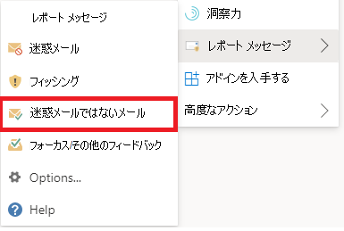

# Outlook の誤検出と検出漏れを報告する

[!INCLUDE [Microsoft 365 Defender rebranding](../includes/microsoft-defender-for-office.md)]

**適用対象**
- [Exchange Online Protection](exchange-online-protection-overview.md)
- [Microsoft Defender for Office 365 プラン 1 およびプラン 2](defender-for-office-365.md)
- [Microsoft 365 Defender](../defender/microsoft-365-defender.md)

> [!NOTE]
> Exchange Online メールボックスを持つ Microsoft 365 組織の管理者である場合は、セキュリティ & コンプライアンス センターで申請ポータルを使用することをお勧めします。 詳細については、「管理申請を [使用して疑わしいスパム、フィッシング、URL、](admin-submission.md)ファイルを Microsoft に提出する」を参照してください。

ハイブリッドモダン認証を使用して Exchange Online Microsoft 365 またはオンプレミスのメールボックスにメールボックスを持つ Microsoft 365 組織では、誤検知 (ブロックまたは迷惑メール フォルダーに送信された良いメール) と誤検知 (受信トレイに配信された不要な電子メールまたはフィッシング) を Exchange Online Protection (EOP) に送信できます。

## はじめに把握しておくべき情報

- 最適なユーザー申請エクスペリエンスを得る場合は、レポート メッセージ アドインまたはレポート フィッシング アドインを使用します。

  > [!IMPORTANT]
  > ユーザー申請ポリシーを使用Outlook迷惑メールやフィッシングを報告する組み込[みのエクスペリエンス](./user-submission.md)です。 代わりに、レポート メッセージ アドインまたはレポート フィッシング アドインを使用することをお勧めします。

- レポート メッセージ アドインとレポート フィッシング アドインは、Outlook のすべてのプラットフォーム (Outlook on the web、iOS、Android、デスクトップ) で機能します。

- ユーザーがメールボックスを使用している組織の管理者Exchange Online、セキュリティ コンプライアンス センターの Submissions ポータル&使用します。 詳細については、「管理申請を [使用して疑わしいスパム、フィッシング、URL、](admin-submission.md)ファイルを Microsoft に提出する」を参照してください。

- Microsoft、指定したメールボックス、または両方にメッセージを直接送信する構成が可能です。 詳細については、「ユーザー申請 [ポリシー」を参照してください](user-submission.md)。

- レポート メッセージまたはレポート フィッシング アドインを取得して有効にする方法の詳細については、「レポート メッセージを有効にする」または「レポート フィッシング アドイン」を [参照してください](enable-the-report-message-add-in.md)。

- Microsoft へのメッセージの報告の詳細については、「メッセージとファイルを Microsoft に報告 [する」を参照してください](report-junk-email-messages-to-microsoft.md)。

## レポート メッセージ機能を使用する

### 迷惑メールとフィッシング メッセージを報告する

迷惑メール以外の受信トレイまたは他のメール フォルダー内のメッセージの場合は、次の方法を使用してスパムメッセージとフィッシング メッセージを報告します。

1. 選択した **メッセージの右上隅** にある [その他の操作] 楕円を選択し、ドロップダウン メニューから [メッセージの報告] を選択し、[迷惑メール] または [フィッシング]**を選択します**。

   
   
   

2. 選択したメッセージは、分析のために Microsoft に送信されます。
   - 迷惑メールとして報告された場合は、迷惑メール フォルダーに移動しました。
   - フィッシングとして報告された場合に削除されます。

### 迷惑メールではないメッセージを報告する

1. 選択した **メッセージの右上隅** にある [その他のアクションの省略記号] を選択し、ドロップダウン メニューから [メッセージの報告] を選択し、[迷惑メールではない] を **選択します**。

   
   
   

2. 選択したメッセージは分析のために Microsoft に送信され、受信トレイまたは指定したその他のフォルダーに移動されます。

## 報告されたメッセージの表示と確認

ユーザーが Microsoft に報告するメッセージを確認するには、次のオプションがあります。

- 管理者申請ポータルを使用します。 詳細については [、「Microsoft へのユーザー申請の表示」を参照してください](admin-submission.md#view-user-submissions-to-microsoft)。
- 報告されたメッセージのコピーを送信するメール フロー ルール (トランスポート ルールとも呼ばれる) を作成します。 手順については、「メール フロー ルールを使用して、ユーザーが Microsoft に報告している [情報を確認する」を参照してください](/exchange/security-and-compliance/mail-flow-rules/use-rules-to-see-what-users-are-reporting-to-microsoft)。
