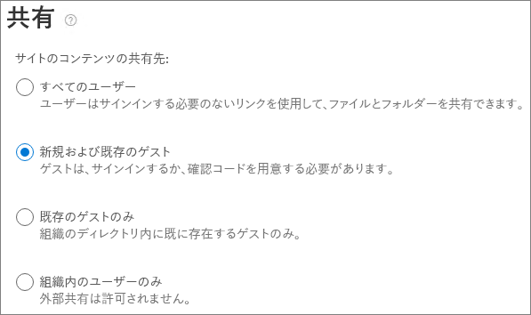

# サイトでゲストと共同で作業する

ドキュメント、データ、リスト間でゲストと共同作業する必要がある場合は、SharePoint サイトを使用できます。 最新の SharePoint サイトは Microsoft 365 グループに接続され、サイト メンバーシップを管理し、共有メールボックスや予定表などの追加のコラボレーション ツールを提供できます。

この記事では、ゲストとのコラボレーションのために SharePoint サイトをセットアップするために必要な Microsoft 365 構成手順について説明します。

## ビデオ デモンストレーション

このビデオは、このドキュメントで説明されている構成手順を示しています。 

> [!VIDEO https://www.microsoft.com/videoplayer/embed/RE44Llg?autoplay=false]

## Azure の外部コラボレーション設定

Microsoft 365 での共有は、[Azure Active Directory における B2B 外部コラボレーションの設定](/azure/active-directory/external-identities/delegate-invitations) によって最高レベルで管理されます。 Azure AD でゲストの共有が無効になっているか、制限されている場合、この設定により、Microsoft 365 で構成した共有設定が上書きされます。

B2B 外部コラボレーション設定を確認して、ゲストとの共有がブロックされないか確認します。

![[Azure Active Directory 外部コラボレーション設定] ページのスクリーンショット](../media/azure-ad-organizational-relationships-settings.png)

外部コラボレーションを設定するには

1. [https://aad.portal.azure.com](https://aad.portal.azure.com) で Azure Active Directory にログインします。
2. 左側のナビゲーション ウィンドウで **[Azure Active Directory]** をクリックします。
3. **[外部 ID]** をクリックします。
4. **[開始]** 画面で、左側のナビゲーション ウィンドウで **[外部コラボレーション設定]** をクリックします。
5. **[管理者とゲスト招待者の役割のユーザーが招待できる]** と **[メンバーが招待できる]** を両方とも **[はい]** に設定していることを確認します。
6. 変更を加えた場合は、**[保存]** をクリックします。

**[共同作業の制限]** セクションの設定に注意してください。 共同作業するゲストのドメインがブロックされていないことを確認します。

複数の組織のゲストと連携する場合は、ディレクトリ データにアクセスするゲストの機能を制限することをお勧めします。 これにより、他に誰がディレクトリ内のゲストであるかを確認できなくなります。 これを行うには、**[ゲスト ユーザーのアクセス制限]** で、**[ゲスト ユーザーはディレクトリ オブジェクト設定のプロパティとメンバーシップに制限付きアクセス権が付与されている]** または **[ゲスト ユーザーのアクセスは自分のディレクトリ オブジェクトのプロパティとメンバーシップに制限されている]** を選択します。

## Microsoft 365 グループのゲスト設定

最新の SharePoint サイトでは、Microsoft 365 グループを使用してサイト アクセスを制御します。 SharePoint サイトのゲスト アクセスを機能するには、Microsoft 365 グループのゲスト設定を有効にする必要があります。

Microsoft 365 グループのゲスト設定を行うには

1. Microsoft 365 管理センターの左側のナビゲーション ウィンドウで、**[設定]** を展開します。
2. **[組織の設定]** をクリックします。
3. 一覧で、**[Microsoft 365 グループ]** をクリックします。
4. **[組織外のグループ所有者に Microsoft 365 グループへのアクセスを許可する]** と **[グループ メンバーにグループ コンテンツへのアクセスを許可する]** チェック ボックスが両方ともオンになっていることを確認します。
5. 変更を加えた場合は、**[変更の保存]** をクリックします。

## SharePoint 組織レベルの共有設定

ゲストが SharePoint サイトにアクセスするには、SharePoint 組織レベルの共有設定でゲストとの共有を許可する必要があります。

組織レベルの設定によって、個々のサイトで使用できる設定が決定されます。 サイトの設定は、組織レベルの設定よりも制限を緩和することはできません。

認証されていないファイルとフォルダーの共有を許可する場合は、[すべてのユーザー] を **選択します**。 組織外のすべてのユーザーが認証する必要がある場合は、[新規ゲストと既存のゲスト] **を選択します**。 組織内の任意のサイトで必要となる最も制限が少ない設定を選択します。

SharePoint 組織レベルの共有設定を設定するには

1. Microsoft 365 管理センターの左側のナビゲーション ウィンドウの **[管理センター]** で、**[SharePoint]** をクリックします。
2. SharePoint 管理センターの左側のナビゲーション ウィンドウの [ポリシー] で、[ **共有]** を **クリックします**。
3. SharePoint の外部共有が **[全員]** または **[新規および既存のゲスト]** に設定されていることを確認します。
4. 変更を加えた場合は、**[保存]** をクリックします。

## サイトを作成する

次の手順では、ゲストとの共同作業に使用する予定のサイトを作成します。

サイトを作成するには
1. SharePoint 管理センターで、**[サイト]** の下側にある **[アクティブなサイト]** をクリックします。
2. **[作成]** をクリックします。
3. [チーム **サイト] をクリックします**。
4. サイト名を入力し、グループ所有者 (サイト所有者) の名前を入力します。
5. [ **詳細設定] で**、このサイトをパブリックまたはプライベートにするか選択します。
6. [ **次へ**] をクリックします。
7. [**完了**] をクリックします。

後でユーザーを招待します。 次に、このサイトのサイト レベルの共有設定を確認することが重要です。

## SharePoint のサイト レベル共有設定のスクリーンショット

サイト レベルの共有設定を確認して、このサイトに必要なアクセスの種類を許可します。 たとえば、組織レベルの設定を **[** すべてのユーザー] に設定し、すべてのゲストにこのサイトの認証を行う場合は、サイト レベルの共有設定が [新規] と [既存のゲスト] に設定されている必要 **があります。**

サイトを認証されていないユーザー **([** すべてのユーザー] 設定) と共有することはできませんが、個々のファイルとフォルダーは共有できます。

また、感度ラベル [を使用して、SharePoint サイトの外部共有設定を制御することもできます](../compliance/sensitivity-labels-teams-groups-sites.md)。

サイトレベルの共有設定を設定するには
1. SharePoint 管理センターの左側のナビゲーションで、[**サイト**] を展開して [**アクティブなサイト**] をクリックします。
2. 共有するサイトを選択します。
3. [...] をクリックし、[共有] **をクリックします**。
4. 共有が **[全員]** または **[新規および既存のゲスト]** に設定されていることを確認します。
5. 変更を加えた場合は、**[保存]** をクリックします。

## ユーザーを招待する

ゲスト共有設定が構成され、内部ユーザーとゲストをサイトに追加できます。 サイト へのアクセスは、関連付けられた Microsoft 365 グループを介して制御されます。そのため、そこにユーザーを追加します。

内部ユーザーをグループに招待するには
1. ユーザーを追加するサイトに移動します。
2. 右上 **の [メンバー** ] リンクをクリックし、メンバー数を示します。
3. **[メンバーの追加]** をクリックします。
4. サイトに招待するユーザーの名前または電子メール アドレスを入力し、[保存] を **クリックします**。

ゲストはサイトから追加できない。 Outlook on the web を使用して追加する必要があります。 そのため、グループにゲストを追加して招待する前提条件として **、[URL]**  列のサイトの URL をクリックして、サイト固有のページに移動します。 このページで、[アプリ起動ツール] **アイコンをクリック** し **、[Outlook] を選択します**。 これは、グループにゲストを招待できる画面です。この手順については、以下で説明します。

グループにゲストを招待するには
1. [ **グループ]** で、ゲストを招待するグループをクリックします。
2. グループ連絡先カードを開き、右上の [ **メンバー** ] リンク (メンバー数を示すリンク) をクリックします。
3. [メンバー **の追加] をクリックします**。
4. 招待するゲストのメール アドレスを入力し、[追加] を **クリックします**。
5. **[閉じる]** をクリックします。
グループの所有者ではなく、その結果、グループにゲストを追加できない場合にのみ、[閉じる] をクリックする必要があります。 このような場合、グループにゲストを追加する要求は、承認のためにグループの所有者に転送されます。

## 関連項目

[認証されていないユーザーとファイルおよびフォルダーを共有するためのベスト プラクティス](best-practices-anonymous-sharing.md)

[ゲストと共有するときにファイルの偶発的な公開を制限する](share-limit-accidental-exposure.md)

[セキュリティで保護されたゲスト共有の環境を作成する](create-secure-guest-sharing-environment.md)

[管理されたゲストで B2B エクストラネットを作成する](b2b-extranet.md)

[SharePoint および OneDrive の Azure AD B2B との統合](/sharepoint/sharepoint-azureb2b-integration-preview)