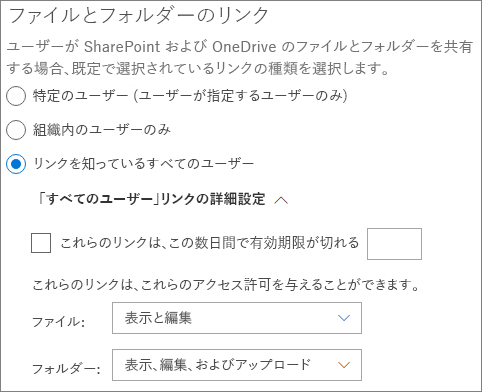

# ゲストと共同でドキュメントの作業をする

SharePoint または OneDrive のドキュメントで組織外のユーザーと共同作業する必要がある場合は、ドキュメントへの共有リンクを送信できます。 この記事では、組織のニーズに合った SharePoint と OneDrive の共有リンクを設定するために必要な Microsoft 365 構成手順について説明します。

## ビデオ デモンストレーション

このビデオでは、このドキュメントで説明されている構成手順を示します。 

> [!VIDEO https://www.microsoft.com/videoplayer/embed/RE450Vt?autoplay=false]

## Azure 外部コラボレーションの設定

Microsoft 365 での共有は、Azure Active Directory の B2B 外部コラボレーション設定によって最高レベル [で管理されます](https://docs.microsoft.com/azure/active-directory/external-identities/delegate-invitations)。 Azure AD でゲスト共有が無効または制限されている場合、この設定は Microsoft 365 で構成した共有設定より優先されます。

B2B 外部コラボレーション設定をチェックして、ゲストとの共有がブロックされていないか確認します。

外部コラボレーション設定を設定するには

1. Azure Active Directory にログインします [https://aad.portal.azure.com](https://aad.portal.azure.com) 。
2. 左側のナビゲーション ウィンドウで **、Azure Active Directory をクリックします**。
3. [外部 **ID] をクリックします**。
4. [作業の **開始] 画面** の左側のナビゲーション ウィンドウで、[外部コラボレーションの設定 **] をクリックします**。
5. 管理者と **ゲスト招待者の役割のユーザーが** 招待可能であり、 **メンバー** が招待可能な両方が [はい] **に設定されています**。
6. 変更を加えた場合は、[**保存**] をクリックします。

[コラボレーションの制限] セクション **の設定に注意** してください。 共同作業を行うゲストのドメインがブロックされていないか確認します。

複数の組織のゲストと連携する場合は、ディレクトリ データにアクセスする機能を制限できます。 これにより、他のユーザーがディレクトリのゲストであるのを見るのを防ぐのに使用できます。 これを行うには、[ゲストユーザーのアクセス制限]で、[ゲスト ユーザーがディレクトリ オブジェクトの設定のプロパティとメンバーシップに制限されたアクセス権を持っている] を選択するか、[ゲスト ユーザー アクセス] を自分のディレクトリ オブジェクトのプロパティとメンバーシップに制限 **します。**

## SharePoint 組織レベルの共有設定

組織外のユーザーが SharePoint または OneDrive のドキュメントにアクセスするには、SharePoint と OneDrive の組織レベルの共有設定で組織外のユーザーとの共有を許可する必要があります。

SharePoint の組織レベルの設定によって、個々の SharePoint サイトで使用できる設定が決なります。 サイトの設定を組織レベルの設定よりも制限することはできません。 OneDrive の組織レベルの設定によって、ユーザーの OneDrive ライブラリで使用できる共有のレベルが決なります。

SharePoint と OneDrive の場合、認証されていないファイルとフォルダーの共有を許可する場合は、[すべてのユーザー] を選択 **します**。 組織外のユーザーが認証を行う必要がある場合は、[新規および既存のゲスト] **を選択します**。 *誰* でもリンクを共有するのが最も簡単な方法です。組織外のユーザーは認証なしでリンクを開いて、他のユーザーに自由にリンクを渡します。

SharePoint の場合は、組織内の任意のサイトで必要になる最も制限の多い設定を選択します。

SharePoint 組織レベルの共有設定を設定するには

1. Microsoft 365 管理センターの左側のナビゲーション ウィンドウで、[管理センター] の下の **[SharePoint] をクリックします**。
2. SharePoint 管理センターの左側のナビゲーション ウィンドウで、[ポリシー ] の下の [共有] を **クリックします**。
3. SharePoint または OneDrive の外部共有が[すべてのユーザー] または [新規] および [既存のゲスト] に **設定されている必要があります**。 (OneDrive の設定は、SharePoint の設定よりも制限を制限できないことに注意してください)。
4. 変更を加えた場合は、[**保存**] をクリックします。

## SharePoint 組織レベルの既定のリンク設定

既定のファイルとフォルダーのリンク設定によって、ユーザーがファイルまたはフォルダーを共有するときに既定で表示されるリンク オプションが決きます。 ユーザーは、必要に応じて、共有する前にリンクの種類を他のオプションの 1 つに変更できます。

この設定は、組織内の SharePoint サイトと OneDrive に影響を与える点に気を付ける必要があります。

ユーザーがファイルやフォルダーを共有するときに既定で選択される次の種類のリンクを選択します。

- **リンクを持つすべてのユーザー** - 認証されていないファイルとフォルダーの共有を多く行う場合は、このオプションを選択します。 [すべてのユーザー]リンクを許可するが、認証されていない共有の偶発的な共有を懸念している場合は、他のオプションのいずれかを既定として検討します。 このリンクの種類は、[すべてのユーザー] 共有を有効にしている場合 **にのみ使用** できます。
- **組織内のユーザーのみ** - ほとんどのファイルとフォルダーの共有が組織内のユーザーと一緒に行う必要がある場合は、このオプションを選択します。
- **特定のユーザー** - ゲストと多くのファイルとフォルダーの共有を行う場合は、このオプションを検討してください。 この種類のリンクはゲストと一緒に機能し、認証を必要とします。
 

SharePoint と OneDrive の組織レベルの既定のリンク設定を設定するには

1. SharePoint 管理センターの [共有] ページに移動します。
2. [ **ファイルとフォルダーのリンク] で**、使用する既定の共有リンクを選択します。
3. 変更を加えた場合は、[**保存**] をクリックします。

共有リンクのアクセス許可を設定するには、共有リンクに対して既定で選択されているアクセス許可 **を選択します。**

1. 認証 **されていない** ユーザーがファイルとフォルダーを変更しない場合は、[表示] を選択します。
2. 認証 **されていない** ユーザーによるファイルとフォルダーの変更を許可する場合は、[編集] を選択します。

上記の 2 つの事前入力オプションは、ゲスト/外部ユーザーだけでなく内部ユーザーにも適用できます。 選択するアクセス許可オプションは、自己判断によって決まります。

すべてのユーザーとの共有を許可するリンクのアクセス許可を設定するには

1. [次 **のリンク] の下で、次のアクセス許可** を付与できます: サブウィンドウ、 
    1. [ **ファイル]** ドロップダウン リストから、 
        - 認証 **されていないユーザーによる** ファイルの変更を許可する場合は、[表示と編集] を選択します。
        - 認証 **されていない** ユーザーがファイルを変更しない場合は、[表示] を選択します。
    2. [ **フォルダー]** ドロップダウン リストから、
        - 認証 **されていないユーザーによるフォルダー** の変更を許可する場合は、[表示、編集、アップロード] を選択します。
        - 認証 **されていない** ユーザーがフォルダーを変更しない場合は、[表示] を選択します。

## SharePoint サイト レベルの共有設定

SharePoint サイト内のファイルとフォルダーを共有している場合は、そのサイトのサイト レベルの共有設定も確認する必要があります。

サイト レベルの共有設定を設定するには

1. SharePoint 管理センターの左側のナビゲーション ウィンドウで、[サイト] を展開 **し、[アクティブ** なサイト] **をクリックします**。
2. ファイルとフォルダーをゲストと共有するサイトを選択します。
3. (選択したサイトが存在する) 行を右にスクロールし、[外部共有] 列の任意の **場所をクリック** します。
4. 表示されるページで、[ポリシー] タブ **をクリック** します。
5. [外部共有 **] ウィンドウで、[** 編集] を **クリックします**。
6. 共有が [すべてのユーザー] または [ **新規** ] および [既存の **ゲスト] に設定されている必要があります**。
7. 変更を加えた場合は、[**保存**] をクリックします。

## ユーザーを招待する

ゲスト共有の設定が構成されています。これで、ユーザーは組織外のユーザーとファイルやフォルダーを共有できます。 詳細 [については、「OneDrive のファイルとフォルダーを共有](https://support.office.com/article/9fcc2f7d-de0c-4cec-93b0-a82024800c07) する [」および「SharePoint ファイルまたはフォルダー」](https://support.office.com/article/1fe37332-0f9a-4719-970e-d2578da4941c) を参照してください。

## 関連項目

[認証されていないユーザーとファイルおよびフォルダーを共有するためのベスト プラクティス](best-practices-anonymous-sharing.md)

[ゲストと共有するときにファイルの偶発的な公開を制限する](share-limit-accidental-exposure.md)

[SharePoint と OneDrive と Azure AD B2B の統合](https://docs.microsoft.com/sharepoint/sharepoint-azureb2b-integration-preview)
