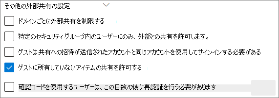

# Microsoft 365 ゲストの共有設定のリファレンス

この記事では、Microsoft 365 のワークロードについて、Teams、Microsoft 365 グループ、SharePoint、OneDrive の組織外のユーザーとの共有に影響を与える可能性のあるさまざまな設定について説明します。 これらの設定は、Azure Active Directory、Microsoft 365、Teams、および SharePoint 管理センターにあります。

## Azure Active Directory

**管理者ロール:** グローバル管理者

Azure Active Directory は、Microsoft 365 により使用されるディレクトリ サービスです。 Azure Active Directory の組織の関係設定は、Teams、Microsoft 365 グループ、SharePoint、OneDrive での共有に直接影響します。

> [!NOTE]
> これらの設定は、[SharePoint および OneDrive の Azure AD B2B との統合](/sharepoint/sharepoint-azureb2b-integration-preview)が構成された場合にのみ、SharePoint に反映されます。 次の表では、この設定が構成されていることを前提としています。

### 組織の関係の設定

**ナビゲーション:** [[Azure Active Directory 管理センター]](https://aad.portal.azure.com) > [Azure Active Directory] > [外部 ID] > [外部コラボレーションの設定]

| 設定 | 既定値 | 説明 |
|:-----|:-----|:-----|
|ゲスト ユーザーのアクセス許可が制限されている|はい|この設定は、ゲストが実行できるディレクトリ タスクに影響します。|
|管理者と、ゲストの招待元ロールのユーザーが招待できる|はい|**[はい]** に設定すると、管理者は、Azure AD と Teams や SharePoint などの Microsoft 365 共有エクスペリエンスを使用してゲストを招待できます。**[いいえ]** に設定するとゲストを招待できません。|
|メンバーが招待できる|はい|**[はい]** に設定すると、Azure AD メンバーは Azure AD を使用してゲストを招待できます。**[いいえ]** に設定すると招待できません。 **[はい]** に設定すると、Microsoft 365 グループのメンバーは所有者の承認を受けているゲストを招待できます。**[いいえ]** に設定すると、Microsoft 365 グループのメンバーは所有者の承認を受けているゲストを招待できますが、所有者が承認するにはグローバル管理者でなければなりません。   **[メンバーが招待できる]** は、(ゲストではなく) Azure AD のメンバーを参照し、Microsoft 365 のサイトまたはグループ メンバーを参照しない点に注意してください。   これは、Microsoft 365 セキュリティとプライバシーの **[ユーザーが組織に新しいゲストを追加できるようにする]** 設定と同じです。|
|ゲストが招待できる|はい|**[はい]** に設定すると、ディレクトリ内のゲストは他のゲストを招待して、Azure AD リソースおよび SharePoint と OneDrive のファイルとフォルダーで共同作業を行うことができます。**[いいえ]** に設定するとこれができません。   SharePoint 管理センターでは、**[一致する電子メール アドレスを正確に入力して外部ユーザーによるディレクトリ内のユーザー アカウントの検索を許可する]** を有効にする必要があることに注意してください。|
|ゲストの電子メール ワンタイム パスコードを有効にする (プレビュー)|いいえ|**[はい]** に設定すると、MSA、職場または学校のアカウントを持っていないゲストは、[ワンタイム パスコードを使用して Azure AD で認証](/azure/active-directory/b2b/one-time-passcode)できます。**[いいえ]** に設定すると、ユーザーは認証を行うために Microsoft アカウントを作成する必要があります。 [SharePoint および OneDrive の Azure AD B2B (プレビュー) との統合](/sharepoint/sharepoint-azureb2b-integration-preview)を機能させるには、この設定を **[はい]** に設定する必要があります。|
|共同作業における制限事項|招待を任意のドメインに送信することを許可する|この設定では、共有するドメインの許可またはブロックのリストを指定できます。 許可されたドメインを指定すると、共有の招待をそのドメインにのみ送信できます。 拒否されたドメインを指定すると、共有の招待はそのドメインに送信できません。   この設定は、Teams や SharePoint などの Microsoft 365 共有エクスペリエンスに影響します。 SharePoint と Teams でドメインのフィルタリングを使用して、より詳細にドメインを許可したりブロックしたりできます。|

これらの設定は、ユーザーがディレクトリに招待される方法に影響します。 ディレクトリにすでに存在しているゲストとの共有には影響しません。

## Microsoft 365

**管理者ロール:** グローバル管理者

Microsoft 365 管理センターには、共有および Microsoft 365 グループ用の組織レベル設定があります。

### 共有

**ナビゲーション:** [Microsoft 365 管理センター](https://admin.microsoft.com) > [設定] > [組織の設定] > [セキュリティとプライバシー] タブ > [共有]

| 設定 | 既定値 | 説明 |
|:-----|:-----|:-----|
|ユーザーが組織に新しいゲストを追加できるようにする|オン|**[はい]** に設定すると、Azure AD メンバーは Azure AD を使用してゲストを招待できます。**[いいえ]** に設定すると招待できません。 **[はい]** に設定すると、Microsoft 365 グループのメンバーは所有者の承認を受けているゲストを招待できます。**[いいえ]** に設定すると、Microsoft 365 グループのメンバーは所有者の承認を受けているゲストを招待できますが、所有者が承認するにはグローバル管理者でなければなりません。   **[メンバーが招待できる]** は、(ゲストではなく) Azure AD のメンバーを参照し、Microsoft 365 のサイトまたはグループ メンバーを参照しない点に注意してください。   これは、Azure Active Directory の組織の関係設定で **[メンバーが招待できる]** 設定と同じです。|

### Microsoft 365 グループ

**ナビゲーション:**[Microsoft 365 管理センター](https://admin.microsoft.com) > [設定] > [設定] > [Microsoft 365 グループ]

| 設定 | 既定値 | 説明 |
|:-----|:-----|:-----|
|組織の外部のグループ メンバーがグループのコンテンツにアクセスできるようにする|オン|**[オン]** に設定すると、ゲストはグループのコンテンツにアクセスできます。**[オフ]** に設定するとアクセスできません。 この設定は、ゲストが Microsoft 365 グループまたは Teams と連携している場合に **[オン]** にしてください。|
|グループ所有者が組織外のユーザーをグループに追加できるようにする|オン|**[オン]** の場合、Microsoft 365 グループ または Teams の所有者は新しいゲストをグループに招待できます。 **[オフ]** の場合、所有者はディレクトリ内にすでに存在しているゲストのみを招待できます。|

これらを、組織レベルで設定できます。 PowerShell を使用し、グループ レベルでこれらの設定を変更する方法の詳細については、「[特定のグループに対する設定を作成する](/azure/active-directory/users-groups-roles/groups-settings-cmdlets#create-settings-for-a-specific-group)」を参照してください。

## Teams

Teams のマスター ゲスト アクセスのスイッチである **[Teams でのゲスト アクセスを許可する]** を **[オン]** にして、他のゲスト設定を選択できるようにする必要があります。

**管理者ロール:** Teams サービス管理者

### ゲスト アクセス

**ナビゲーション:** [[Teams 管理センター]](https://admin.teams.microsoft.com) > [組織全体の設定] > [ゲスト アクセス]

| 設定 | 既定値 | 説明 |
|:-----|:-----|:-----|
|Teams でのゲスト アクセスを許可する|オフ|Teams 全体でゲスト アクセスをオンまたはオフにします。 この設定は、一度変更し反映されるのに 24 時間かかることがあります。|

### ゲスト通話

**ナビゲーション:** [[Teams 管理センター]](https://admin.teams.microsoft.com) > [組織全体の設定] > [ゲスト アクセス]

| 設定 | 既定値 | 説明 |
|:-----|:-----|:-----|
|プライベート通話をする|オン|**[オン]** の場合、ゲストは Teams でピアツーピアの通話を行うことができます。**[オフ]** の場合は通話できません。|

### ゲスト会議

**ナビゲーション:** [[Teams 管理センター]](https://admin.teams.microsoft.com) > [組織全体の設定] > [ゲスト アクセス]

| 設定 | 既定値 | 説明 |
|:-----|:-----|:-----|
|IP のビデオを許可する|オン|**[オン]** の場合、ゲストは通話と会議でビデオを使用できます。**[オフ]** の場合は使用できません。|
|画面共有モード|画面全体|**[無効]** にすると、ゲストは Teams で画面を共有できません。 **[1 つのアプリケーション]** に設定すると、ゲストは画面上でアプリケーションを 1 つのみ共有できます。 **[画面全体]** に設定すると、ゲストはアプリケーションまたは画面全体を共有するよう選択できます。|
|[会議の開始] を許可する|オン|**[オン]** の場合、ゲストは Teams で [会議の開始] 機能を使用できます。**[オフ]** の場合は使用できません。|

### ゲスト メッセージング

**ナビゲーション:** [[Teams 管理センター]](https://admin.teams.microsoft.com) > [組織全体の設定] > [ゲスト アクセス]

| 設定 | 既定値 | 説明 |
|:-----|:-----|:-----|
|送信済みメッセージを編集する|オン|**[オン]** の場合、ゲストは以前に送信したメッセージを編集できます。**[オフ]** の場合は編集できません。|
|送信済みメッセージを削除する|オン|**[オン]** の場合、ゲストは以前に送信したメッセージを削除できます。**[オフ]** の場合は削除できません。|
|チャット|オン|**[オン]** の場合、ゲストは Teams でチャット機能を使用できます。**[オフ]** の場合は使用できません。|
|会話で Giphy を使用する|オン|**[オン]** の場合、ゲストは会話で Giphy を使用できます。**[オフ]** の場合は使用できません。|
|Giphy コンテンツの評価|中|**[すべてのコンテンツを許可]** に設定すると、ゲストはコンテンツ評価に関係なく、すべての Giphy をチャットに挿入できるようになります。 **[中]** に設定すると、ゲストは Giphy をチャットに挿入できますが、成人向けコンテンツの挿入についてはある程度制限されます。 **[高]** に設定すると、ゲストは Giphy をチャットに挿入できますが、成人向けコンテンツの挿入については制限されます。|
|会話でミームを使用する|オン|**[オン]** の場合、ゲストは会話でミームを使用できます。**[オフ]** の場合は使用できません。|
|会話でステッカーを使用する|オン|**[オン]** の場合、ゲストは会話でステッカーを使用できます。**[オフ]** の場合は使用できません。|
|イマーシブ リーダーがメッセージを表示するのを許可する|オン|**[オン]** の場合、ゲストはイマーシブ リーダーでメッセージを表示できます。**[オフ]** の場合は表示できません。|

## SharePoint と OneDrive (組織レベル)

**管理者ロール:** SharePoint 管理者

これらの設定は組織のすべてのサイトに影響します。 Microsoft 365 グループや Teams には直接影響しませんが、これらの設定を Microsoft 365 グループ と Teams の設定に合わせて、ユーザー エクスペリエンスの問題を回避することをお勧めします。 (たとえば、ゲスト共有が SharePoint ではなく Teams で許可されている場合、Teams ファイルは SharePoint に保存されているため、Teams のゲストは [ファイル] タブにアクセスできません)。

### SharePoint と OneDrive の共有設定

OneDrive はSharePoint のサイトの階層であるため、組織レベルの共有設定は、他の SharePoint サイトに影響するように OneDrive に直接影響します。

**ナビゲーション:** [SharePoint 管理センター] > [共有]

| 設定 | 既定値 | 説明 |
|:-----|:-----|:-----|
|SharePoint|すべてのユーザー|SharePoint サイトで許可されている制限が最も少ない共有アクセス許可を指定します。|
|OneDrive|すべてのユーザー|OneDrive サイトで許可されている制限が最も少ない共有アクセス許可を指定します。 この設定は SharePoint の設定よりも制限を少なくすることはできません。|

### SharePoint と OneDrive の詳細な共有設定

**ナビゲーション:** [SharePoint 管理センター] > [共有]

| 設定 | 既定値 | 説明 |
|:-----|:-----|:-----|
|ドメインごとに外部共有を制限する|オフ|この設定では、共有するドメインの許可またはブロックのリストを指定できます。 許可されたドメインを指定すると、共有の招待をそのドメインにのみ送信できます。 拒否されたドメインを指定すると、共有の招待はそのドメインに送信できません。   この設定は、組織内のすべての SharePoint サイトと OneDrive サイトに影響します。|
|ゲストは共有への招待が送信されたアカウントと同じアカウントを使用してサインインする必要がある|オフ|招待の送信先とは別のメールアドレスを使用して、ゲストがサイト共有の招待を交換しないようにします。  [SharePoint および OneDrive の Azure AD B2B (プレビュー) との統合](/sharepoint/sharepoint-azureb2b-integration-preview)では、招待の送信先のメールアドレスに基づいてすべてのゲストがディレクトリに追加されるため、この設定は使用されません。 代わりのメールアドレスは、サイトにアクセスする際に使用できません。|
|ゲストに所有していないアイテムの共有を許可する|オン|**[オン]** の場合、ゲストは他のユーザーやゲストと自分が所有していないアイテムを共有できます。**[オフ]** の場合は共有できません。 ゲストは常にフル コントロールのあるアイテムを共有できます。|

### SharePoint と OneDrive のファイルとフォルダーのリンク設定

SharePoint と OneDrive でファイルとフォルダーを共有すると、共有の受信者はファイルまたはフォルダーに直接アクセスできるようになるのではなく、ファイルまたはフォルダーへのアクセス許可のリンクが送信されます。 リンクにはいくつかの種類があり、ユーザーがファイルまたはフォルダーを共有するときに表示される既定のリンクの種類を選択できます。 また、*すべてのユーザー* のリンクのアクセス許可と有効期限のオプションを設定することもできます。

**ナビゲーション:** [SharePoint 管理センター] > [共有]

| 設定 | 既定値 | 説明 |
|:-----|:-----|:-----|
|ファイルとフォルダーのリンク|リンクを知っているすべてのユーザー|ユーザーがファイルまたはフォルダーを共有するときに、既定で表示される共有リンクを指定します。 ユーザーは必要に応じて、共有する前にオプションを変更できます。 既定値が **[リンクを知っているすべてのユーザー]** に設定されており、*[すべてのユーザー]* の共有が特定のサイトで許可されていない場合は、**組織内のユーザーのみ** がそのサイトの既定値として表示されます。|
|これらのリンクは指定された日数以内に有効期限が切れる|オフ (有効期限なし)|*[すべてのユーザー]* のリンクが作成されてから期限切れになるまでの日数を指定します。 期限切れのリンクは更新できません。 期限が切れた後も共有を続ける必要がある場合は、新しいリンクを作成します。|
|ファイルのアクセス許可|表示と編集|ユーザーが *[すべてのユーザー]* のリンクを作成するときに使用できるファイルのアクセス許可のレベルを指定します。 **[表示]** が選択されている場合、ユーザーは、表示のアクセス許可のある *[すべてのユーザー]* ファイルのリンクのみを作成できます。 **[表示と編集]** が選択されている場合、ユーザーはリンクを作成するときに、[表示] と [表示と編集] のアクセス許可の中から選択できます。|
|フォルダーのアクセス許可|表示、編集、およびアップロード|ユーザーが *[すべてのユーザー]* のリンクを作成するときに使用できるフォルダーのアクセス許可のレベルを指定します。 **[表示]** が選択されている場合、ユーザーは、表示のアクセス許可のある *[すべてのユーザー]* フォルダーのリンクのみを作成できます。 **[表示、編集、およびアップロード]** が選択されている場合、ユーザーはリンクを作成するときに、[表示] と [表示、編集、およびアップロード] のアクセス許可の中から選択できます。|

### SharePoint と OneDrive のセキュリティ グループ設定

SharePoint と OneDrive のゲストと共有できるユーザーを制限する場合は、指定したセキュリティ グループ内のユーザーへの共有を制限することで行うことができます。 これらの設定は、Microsoft 365 グループまたは Teams による共有には影響しません。 グループまたはチーム経由で招待されたゲストも、関連サイトにアクセスできます。ただし、ドキュメントとフォルダーの共有は、指定したセキュリティ グループのユーザーのみが行うことができます。

**ナビゲーション:** [SharePoint 管理センター] > [共有] > [特定のセキュリティ グループへの外部共有を制限]

| 設定 | 既定値 | 説明 |
|:-----|:-----|:-----|
|選択したセキュリティ グループのユーザーのみが認証済みの外部ユーザーと共有できるようにする|オフ|**[オン]** の場合、指定したセキュリティ グループのユーザーのみが組織外のユーザーと共有できます。 *[特定のユーザー]* のリンクのみが使用できます。 **[選択したセキュリティ グループのユーザーのみが、匿名リンクを使用して認証済みの外部ユーザーと共有できるようにする]** も合わせて **[オン]** になっていない限り、*[すべてのユーザー]* の共有は実質的に無効になります。|
|選択したセキュリティ グループのユーザーのみが、匿名リンクを使用して認証済みの外部ユーザーと共有できるようにする|オフ|**[オン]** の場合、指定したセキュリティ グループのユーザーのみがゲストと共有できます。 *[すべてのユーザー]* と *[特定のユーザー]* の両方のリンクが使用できます。|

この両方の設定は同時に使用できます。 ユーザーが両方の設定で指定されているセキュリティ グループにいる場合、より制限の少ないアクセス許可レベルが優先されます (*[すべてのユーザー]* と *[特定のユーザー]*)。 入れ子のセキュリティ グループがサポートされています。

## SharePoint (サイト レベル)

**管理者ロール:** SharePoint 管理者

これらの設定は SharePoint における組織全体の設定の対象になるため、組織レベルの設定が変更された場合は、サイトで有効な共有設定が変更される可能性があります。 ここで設定を選択し、組織レベルがより制限の多い値に設定された場合、このサイトはその制限の多い値で動作します。 たとえば、**[すべてのユーザー]** を選択した後に、組織レベルの設定を **[新規および既存のゲスト]** に設定した場合、このサイトでは新規および既存のゲストのみが許可されます。 組織レベルの設定を **[すべてのユーザー]** に戻すと、このサイトでは *[すべてのユーザー]* のリンクが再度許可されます。

### サイトの共有

SharePoint の各サイトにゲストの共有のアクセス許可を設定できます。 この設定は、サイトの共有と、ファイルとフォルダーの共有の両方に適用されます (*[すべてのユーザー]* の共有はサイトの共有には利用できません)。 **[すべてのユーザー]** を選択した場合、ユーザーは *[すべてのユーザー]* のリンクを使用してファイルとフォルダーを、新規および既存のゲストとはサイト自体を共有できます)。

サイトに機密ラベルが適用されている場合、そのラベルが外部共有設定を制御する場合があります。 詳細については、「[機密ラベルを使用して、Microsoft Teams、Office 365 グループ、SharePoint サイトのコンテンツを保護する](../compliance/sensitivity-labels-teams-groups-sites.md)」 をご覧ください。

**ナビゲーション:** SharePoint 管理センター > [アクティブなサイト] > サイトを選択 > [ポリシー] タブ > [外部共有の編集]

| 設定 | 既定値 | 説明 |
|:-----|:-----|:-----|
|サイトのコンテンツの共有先|サイトの種類によって異なります (次の表を参照してください)|このサイトに許可されている外部共有の種類を示します。 ここで使用できるオプションは、SharePoint における組織レベルの共有設定の対象です。|

### サイトのファイルとフォルダーのリンク設定

リンクの種類とアクセス許可の既定値と、各サイトの [*すべてのユーザー*] リンクの有効期限を設定できます。 サイト レベルで設定した場合、これらの設定は組織レベルの設定に優先します。 [*すべてのユーザー*] リンクが組織レベルで無効に設定されている場合、[*すべてのユーザー*] はサイト レベルで使用可能なリンクの種類として含まれません。

**ナビゲーション:** SharePoint 管理センター > [アクティブなサイト] > サイトを選択 > [ポリシー] タブ > [外部共有の編集]

| 設定 | 既定値 | 説明 |
|:-----|:-----|:-----|
|ドメイン共有を制限する|オフ|この設定では、共有するドメインの許可またはブロックのリストを指定できます。 許可されたドメインを指定すると、共有の招待をそのドメインにのみ送信できます。 拒否されたドメインを指定すると、共有の招待はそのドメインに送信できません。   この設定は、組織レベルまたは Azure AD レベルで設定されているドメインの制限を上書きするためには使用できません。|
|既定の共有リンクの種類|組織レベルの設定と同じ|この設定は、このサイトでユーザーに表示される既定の共有リンクを指定するために使用できます。 [*組織レベルの設定と同じ*] オプションは、組織とサイトの共有設定の組み合わせによって定義されます。|
|[すべてのユーザー] リンクの詳細設定|組織レベルの設定と同じ|このサイトのファイル用に [*すべてのユーザー*] のリンクが作成されてから期限切れになるまでの日数を指定します。 期限切れのリンクは更新できません。 期限が切れた後も共有を続ける必要がある場合は、新しいリンクを作成します。|
|既定のリンクのアクセス許可|組織レベルの設定と同じ|この設定は、このサイトのファイル用に作成された共有リンクの既定のアクセス許可 ([閲覧] または [編集]) を指定するために使用できます。|

### 既定のサイト共有設定

次の表は、各サイトの種類の既定の共有設定を示しています。

| サイトの種類 | 既定の共有設定 |
|:-----|:-----|
|クラシック|**組織内のユーザーのみ**|
|OneDrive|**すべてのユーザー**|
|グループに接続されたサイト (チームを含む)|Microsoft 365 グループの設定の、**[グループ所有者が組織外のユーザーをグループに追加できるようにする]** が **[オン]** の場合、**[新規および既存のゲスト]** になり、オフの場合は **[既存のゲストのみ]** になります。|
|コミュニケーション|**組織内のユーザーのみ**|
|グループのないモダン サイト (#STS3 TeamSite)|**組織内のユーザーのみ**|

> [!NOTE]
> ルート通信サイト (tenant-name.sharepoint.com) には、**すべてのユーザー** の既定の共有設定があります。

## 関連項目

[SharePoint と OneDrive の外部共有の概要](/sharepoint/external-sharing-overview)

[Microsoft Teams でのゲスト アクセス](/MicrosoftTeams/guest-access)

[Microsoft 365 グループへのゲストの追加](https://support.office.com/article/bfc7a840-868f-4fd6-a390-f347bf51aff6)
