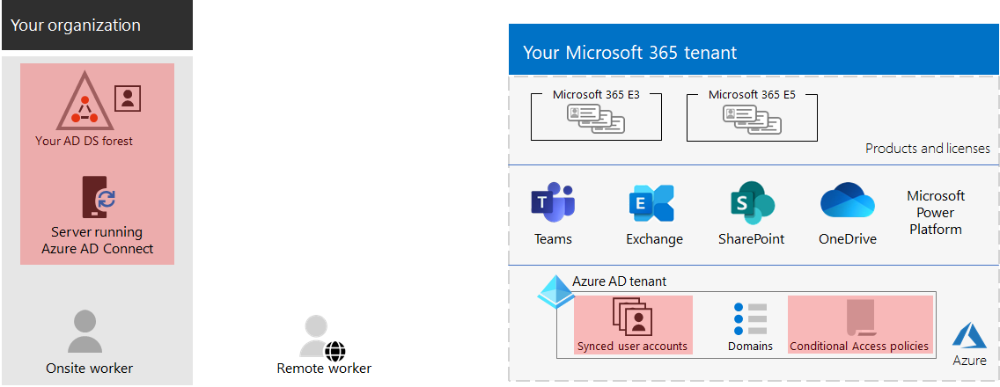

# 手順 3. エンタープライズ テナントのMicrosoft 365 ID

ユーザー Microsoft 365には、サインインAzure Active Directory ID と認証を管理AD (Azure AD) テナントが含まれています。ID インフラストラクチャを正しく構成することは、組織のユーザー アクセスMicrosoft 365アクセス許可を管理する上で重要です。

## クラウド専用とハイブリッド

ID モデルの 2 種類と、最適な適合と利点を次に示します。

| モデル | 説明 | ユーザー Microsoft 365認証方法 | 最適シナリオ | 最大のメリット |
|:-------|:-----|:-----|:-----|:-----|
| クラウド専用 | ユーザー アカウントは、Azure ADテナントにのみMicrosoft 365されます。 | Azure ADテナントMicrosoft 365クラウド ID アカウントで認証を実行します。 | DS を使用するオンプレミスの組織または必要AD組織。 | 使いやすい。 追加のディレクトリ ツールやサーバーは必要ありません。 |
| ハイブリッド |  ユーザー アカウントはオンプレミスの Active Directory ドメイン サービス (AD DS) に存在し、コピーは azure AD テナントMicrosoft 365にあります。 Azure AD Connectオンプレミス サーバー上で実行して、DS の変更AD Azure サーバーテナントADします。 Azure ADのユーザー アカウントには、既にハッシュされた DS ユーザー アカウント のパスワードADが含まれる場合があります。 | Azure ADテナントMicrosoft 365認証プロセスを処理するか、ユーザーを別の ID プロバイダーにリダイレクトします。 | DS または別AD ID プロバイダーを使用している組織。 | ユーザーは、オンプレミスまたはクラウドベースのリソースにアクセスするときに同じ資格情報を使用できます。 |
||||||

クラウド専用 ID の基本的なコンポーネントを次に示します。
 

この図では、オンプレミスユーザーとリモート ユーザーは、自分のテナントの Azure ADテナントでアカウントMicrosoft 365します。

ハイブリッド ID の基本的なコンポーネントを次に示します。

この図では、オンプレミスユーザーとリモート ユーザーは、オンプレミスの Microsoft 365 テナントからコピーされた Azure AD テナントのアカウントを使用して Microsoft 365 テナントにサインイン ADします。

## オンプレミスの DS のADする

ビジネス ニーズと技術的要件に応じて、ハイブリッド ID モデルとディレクトリ同期は、ハイブリッド ID モデルとディレクトリ同期を採用している企業のお客様にとって最も一般的な選択肢Microsoft 365。 ディレクトリ同期を使用すると、AD DS の ID を管理し、ユーザー アカウント、グループ、連絡先に対する更新はすべて、Microsoft 365 テナントの Azure AD テナントに同期されます。

>[!Note]
>DS ADアカウントが初めて同期された場合、ds ユーザー アカウントには Microsoft 365 ライセンスが自動的に割り当てられるのではなく、電子メールなどの Microsoft 365 サービスにアクセスできません。 最初に使用場所を割り当てる必要があります。 次に、グループ メンバーシップを使用して、個別または動的にこれらのユーザー アカウントにライセンスを割り当てる。
>

ハイブリッド ID モデルを使用する場合の 2 種類の認証を次に示します。

| 認証の種類 | 説明 |
|:-------|:-----|
| 管理された認証 | Azure ADは、ローカルに保存されたハッシュ バージョンのパスワードを使用して認証プロセスを処理するか、オンプレミスのソフトウェア エージェントに資格情報を送信して、オンプレミスの AD DS によって認証されます。      管理認証には、パスワード ハッシュ同期 (PHS) とパススルー認証 (PTA) の 2 種類があります。 PHS を使用すると、Azure AD認証自体が実行されます。 PTA を使用すると、Azure AD DS AD認証が実行されます。 |
| フェデレーション認証 | Azure AD認証を要求するクライアント コンピューターを別の ID プロバイダーにリダイレクトします。 |
|  |  |

詳細 [については、「適切な認証方法の選択](/azure/active-directory/hybrid/choose-ad-authn) 」を参照してください。

## 強力なサインインのエンフォース

ユーザー サインインのセキュリティを強化するには、次の表の機能を使用します。

| 機能 | 説明 | 詳細情報 | ライセンスの要件 |
|:-------|:-----|:-----|:-----|:-----|
| Windows Hello for Business | デバイスにサインインするときに、パスワードを強力な 2 要素認証Windowsします。 この 2 要素認証は、デバイスと生体認証または PIN に関連付けられる新しい種類のユーザー資格情報です。 | [Windows Hello for Business の概要](/windows/security/identity-protection/hello-for-business/hello-overview) | Microsoft 365 E3 または E5 |
| Azure AD パスワード保護 | 既知の脆弱なパスワードとそのバリアントを検出してブロックし、組織に固有の追加の弱い用語をブロックすることもできます。 | [Azure ADパスワード保護を構成する](/azure/active-directory/authentication/concept-password-ban-bad) | Microsoft 365 E3 または E5 |
| 多要素認証 (MFA) を使用する | MFA では、ユーザー サインインは、スマートフォン アプリでの検証やスマートフォンに送信されるテキスト メッセージなど、ユーザー アカウントのパスワードを超えた追加の検証の対象となる必要があります。 ユーザー [が MFA を](https://support.microsoft.com/office/set-up-multi-factor-authentication-in-microsoft-365-business-a32541df-079c-420d-9395-9d59354f7225) 設定する方法については、このビデオを参照してください。 | [エンタープライズ向けMicrosoft 365 MFA](../enterprise/microsoft-365-secure-sign-in.md#mfa) | Microsoft 365 E3 または E5 |
| ID とデバイスのアクセス構成 | 設定の前提条件機能と設定と条件付きアクセス、Intune、Azure AD Identity Protection ポリシーを組み合わせて構成されるポリシーとポリシーを使用して、特定のアクセス要求をどの条件で付与するか判断します。  | [ID とデバイスのアクセス構成](../security/defender-365-security/microsoft-365-policies-configurations.md) | Microsoft 365 E3 または E5 |
| Azure AD Identity Protection | 資格情報の侵害から保護します。攻撃者がユーザーのアカウント名とパスワードを決定して、組織のクラウド サービスとデータにアクセスします。 | [Azure AD Identity Protection](/azure/active-directory/active-directory-identityprotection) | Microsoft 365 E5脅威Microsoft 365 E3アドオンを使用&または変更する |
|  |  |  |

## 手順 3 の結果

テナントの ID についてはMicrosoft 365決定しました。

- 使用する ID モデル。
- ユーザーとデバイスへの強力なアクセスを強制する方法。

新しいハイブリッド ID 要素が強調表示されたテナントの例を次に示します。

この図では、テナントには次の機能があります。

- DirSync ADおよび Azure サーバーを使用して Azure AD テナントと同期されている DS フォレストAD Connect。
- DS フォレストからAD DS ユーザー アカウントおよび他のオブジェクトADコピー。
- ユーザー アカウントに基づいてセキュリティで保護されたユーザー サインインとアクセスを強制するための一連の条件付きアクセス ポリシー。 

## ID の継続的なメンテナンス

継続的に、次の必要が生じ得る場合があります。

- ユーザー アカウントとグループを追加または変更します。 クラウド専用 ID の場合は、クラウド ベースのユーザーとグループを Azure AD管理センターや PowerShell などのMicrosoft 365管理します。 ハイブリッド ID の場合は、DS ツールを使用してオンプレミスのユーザーとグループAD維持します。
- サインイン セキュリティ要件を適用するために、ID とデバイス アクセス構成を追加または変更します。

## 次の手順

移行を[続行して](tenant-management-migration.md)、オンプレミスのサーバーとそのOfficeデータを移行して、Microsoft 365。