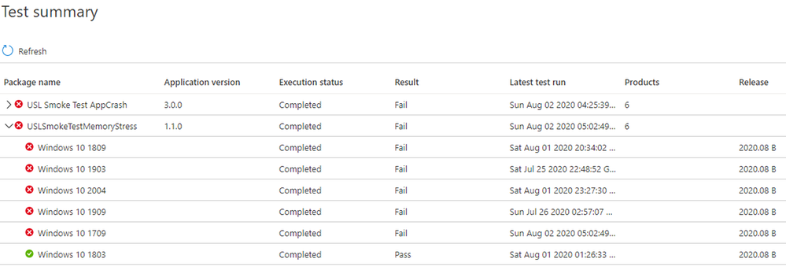

# <a name="memory-regression-analysis"></a><span data-ttu-id="6de34-103">メモリ回帰分析</span><span class="sxs-lookup"><span data-stu-id="6de34-103">Memory Regression Analysis</span></span>

<span data-ttu-id="6de34-104">Test Base を使用すると、アプリを実行しているテスト VM のメモリ使用量が大幅に増加しているのを明確に確認できます。</span><span class="sxs-lookup"><span data-stu-id="6de34-104">Test Base helps you more clearly notice significant memory usage increases in the test VMs running your apps.</span></span> <span data-ttu-id="6de34-105">メモリ使用量などのパフォーマンス指標は、アプリケーション全体の正常性を示す可能性があります。この追加は、アプリのパフォーマンスを最適に維持するのに大いに役立つと考えます。</span><span class="sxs-lookup"><span data-stu-id="6de34-105">Performance metrics, such as memory usage, can be indicative of overall application health and we believe this addition will greatly help keep your apps performing optimally.</span></span>

<span data-ttu-id="6de34-106">詳しくは、このビデオをご覧ください。最新の改善点を簡単に確認してください。</span><span class="sxs-lookup"><span data-stu-id="6de34-106">Read on for more details or watch this video for a quick walk through of the latest improvements.</span></span> 

<span data-ttu-id="6de34-107">回帰分析に役立つ M365 の Test Base の詳細については、「プロセスの信頼性に基づく回帰結果」を参照してください。</span><span class="sxs-lookup"><span data-stu-id="6de34-107">For more information on Test Base for M365's ability to help with regression analysis, see Regression results based on process reliability.</span></span>

<span data-ttu-id="6de34-108"><b>メモリ回帰を詳しく見る</b></span><span class="sxs-lookup"><span data-stu-id="6de34-108"><b>Looking closer at memory regressions</b></span></span>

<span data-ttu-id="6de34-109">M365 のテスト ベース ダッシュボードは、新しいリリース済みの Windows 更新プログラムでアプリケーションが消費したメモリを表示し、前回リリースされた Windows 更新プログラムで使用されたメモリと比較します。</span><span class="sxs-lookup"><span data-stu-id="6de34-109">The Test Base for M365 dashboard shows the memory consumed by your application on a new pre-released Windows update and compares it with the memory used by the last released Windows update.</span></span> 

<span data-ttu-id="6de34-110">今月の機能強化により、メモリ回帰分析は、お気に入りのプロセスで取り上がっています。</span><span class="sxs-lookup"><span data-stu-id="6de34-110">With this month’s enhancements, memory regression analysis is now featured in your favorited processes.</span></span> <span data-ttu-id="6de34-111">アプリケーションには複数のプロセスを含め、信頼性タブを使用して、お気に入りのプロセスを手動で選択できます。次に、これらのお気に入りのプロセスのメモリ回帰を特定し、さまざまな更新プログラム リリースでテストの実行Windowsします。</span><span class="sxs-lookup"><span data-stu-id="6de34-111">Applications can contain multiple processes and you can manually select your favorite processes through the Reliability tab. Our service will then identify memory regressions in these favorited processes while comparing test runs across different Windows update releases.</span></span> <span data-ttu-id="6de34-112">回帰が検出された場合は、回帰に関する詳細を簡単に利用できます。</span><span class="sxs-lookup"><span data-stu-id="6de34-112">If a regression is detected, details about the regression are easily available.</span></span>

<span data-ttu-id="6de34-113">次に、この機能について詳しく説明し、パフォーマンス アナライザーを使用してメモリ回帰をトラブルシューティングするWindowsします。</span><span class="sxs-lookup"><span data-stu-id="6de34-113">Now let's look at this feature in detail and discuss how you can troubleshoot memory regressions using Windows Performance Analyzer.</span></span>

<span data-ttu-id="6de34-114">メモリ回帰によって発生する障害信号は、[メモリ使用率] の [テスト結果] ページの [M365 のテスト ベース] ダッシュボードに表示されます。</span><span class="sxs-lookup"><span data-stu-id="6de34-114">The failure signal caused by a memory regression is shown in the Test Base for M365 dashboard on the Test results page under Memory Utilization:</span></span>


<span data-ttu-id="6de34-116">メモリ消費量が多いアプリケーションのエラーは、[テストの概要] ページ ```Fail``` にも表示されます。</span><span class="sxs-lookup"><span data-stu-id="6de34-116">Failure for the application due to higher memory consumption, will also be displayed as ```Fail``` on the Test Summary page:</span></span>



<span data-ttu-id="6de34-118">これらの障害信号を前もって提供することで、アプリケーションのエンド ユーザー エクスペリエンスを中断し、影響を与える可能性のある問題に明確にフラグを設定します。</span><span class="sxs-lookup"><span data-stu-id="6de34-118">By providing these failure signals upfront, our goal is to clearly flag potential issues that can disrupt and impact the end user experience for your application.</span></span> 

<span data-ttu-id="6de34-119">その後、ログ ファイルをダウンロードし、パフォーマンス アナライザーまたはWindowsツールキットを使用して、詳細を調査できます。</span><span class="sxs-lookup"><span data-stu-id="6de34-119">You can then download the log files and use the Windows Performance Analyzer, or your preferred toolkit, to investigate further.</span></span> <span data-ttu-id="6de34-120">また、M365 のテスト ベース チームと共同で問題の修復に取り組み、エンド ユーザーに影響を与える問題を防ぐのに役立ちます。</span><span class="sxs-lookup"><span data-stu-id="6de34-120">You can also work jointly with the Test Base for M365 team on remediating the issue and help prevent issues impacting end users.</span></span>

<span data-ttu-id="6de34-121">メモリ信号は、すべてのテスト実行の M365 サービスのテスト ベースの [メモリ使用率] タブにキャプチャされます。</span><span class="sxs-lookup"><span data-stu-id="6de34-121">Memory signals are captured in the Memory Utilization tab in the Test Base for M365 service for all test runs.</span></span> <span data-ttu-id="6de34-122">次の例は、2020 年 8 月のプレリリースセキュリティ更新プログラムに対するオンボード アプリケーション "Smoke Test Memory Stress" を使用した最近のテスト実行を示しています。</span><span class="sxs-lookup"><span data-stu-id="6de34-122">The example below shows a recent test run with the onboarded application “Smoke Test Memory Stress” against the pre-release August 2020 security update.</span></span> <span data-ttu-id="6de34-123">(このアプリケーションは、メモリ回帰を説明するためにチームによって作成されています)。</span><span class="sxs-lookup"><span data-stu-id="6de34-123">(This application was written by our team to illustrate memory regressions.)</span></span>


<span data-ttu-id="6de34-125">この例では、お気に入りのプロセス "USLTestMemoryStress.exe" プロセスは、リリース前の 8 月の更新プログラムで、リリース済みの 7 月の更新プログラムと比較して平均約 100 MB を消費するため、M365 のテスト ベースで回帰が特定されました。</span><span class="sxs-lookup"><span data-stu-id="6de34-125">In this example, the favorite process “USLTestMemoryStress.exe” process consumed an average of approximately 100 MB on the pre-release August update compared to the released July update, hence the Test Base for M365 identified a regression.</span></span> 

<span data-ttu-id="6de34-126">"USLTestMemoryStress_Aux1.exe" と "USLTestMemoryStress_Aux2.exe" と示す他のプロセスも同じアプリケーションに属しますが、2 つのリリースでほぼ同じ量のメモリを消費し、"渡された" ので正常と見なされました。</span><span class="sxs-lookup"><span data-stu-id="6de34-126">The other processes—shown here as “USLTestMemoryStress_Aux1.exe” and “USLTestMemoryStress_Aux2.exe”—also belong to the same application, but consumed approximately the same amount of memory for the two releases so they "passed" and were considered healthy.</span></span>

<span data-ttu-id="6de34-127">メイン プロセスの回帰は"統計的に有意" と判断されたので、サービスはユーザーにこの違いを伝え、強調しました。</span><span class="sxs-lookup"><span data-stu-id="6de34-127">The regression on the main process was determined to be “statistically significant” so the service communicated and highlighted this difference to the user.</span></span> <span data-ttu-id="6de34-128">比較が統計的に有意ではない場合、強調表示されません。</span><span class="sxs-lookup"><span data-stu-id="6de34-128">If the comparison was not statistically significant, it would not be highlighted.</span></span> <span data-ttu-id="6de34-129">メモリ使用率はノイズが大きいので、統計的モデルを使用して、ビルドとリリース間で重要な違いを区別します。</span><span class="sxs-lookup"><span data-stu-id="6de34-129">Memory utilization can be noisy, so we use statistical models to distinguish, across builds and releases, meaningful differences from inconsequential differences.</span></span> 

<span data-ttu-id="6de34-130">真の差 (誤検知) がない場合、比較にフラグが設定されることはほとんどありませんが、これは回帰 (または正の値) を正しく識別する可能性を向上させるために必要なトレードオフです。</span><span class="sxs-lookup"><span data-stu-id="6de34-130">A comparison may rarely be flagged when there is no true difference (a false positive), but this is a necessary tradeoff to improve the likelihood of correctly identifying regressions (or true positives.)</span></span>

<span data-ttu-id="6de34-131">次の手順では、メモリ回帰の原因を理解します。</span><span class="sxs-lookup"><span data-stu-id="6de34-131">The next step is to understand what caused the memory regression.</span></span> <span data-ttu-id="6de34-132">以下に示すように、[ログ ファイルのダウンロード] オプションから両方の実行の zip ファイルをダウンロードできます。</span><span class="sxs-lookup"><span data-stu-id="6de34-132">You can download the zip files for both executions from the Download log files option, as shown below.</span></span> 

<span data-ttu-id="6de34-133">これらの zip ファイルには、ETL ファイルに含まれるスクリプトの結果、メモリ、CPU パフォーマンス データなど、テスト実行の結果が含まれます。</span><span class="sxs-lookup"><span data-stu-id="6de34-133">These zip files contain the results of your test run, including script results and memory and CPU performance data which is included in the ETL file.</span></span>


<span data-ttu-id="6de34-135">2 つのテスト実行のログをダウンロードして解凍し、各フォルダー内の ETL ファイルを見つけて、それらを target.etl (プレリリース更新プログラムのテスト実行の場合) と baseline.etl (前回リリースされた更新プログラムのテスト実行用) に名前を変更して、探索とナビゲーションを簡略化できます。</span><span class="sxs-lookup"><span data-stu-id="6de34-135">You can download and unzip the logs for the two test runs, then locate the ETL file within each folder and rename them as target.etl (for the test run on the pre-release update) and baseline.etl (for the test run on last released update) to simplify exploration and navigation.</span></span>
 
## <a name="next-steps"></a><span data-ttu-id="6de34-136">次の手順</span><span class="sxs-lookup"><span data-stu-id="6de34-136">Next steps</span></span>

<span data-ttu-id="6de34-137">次の記事に進み、インテリジェントな CPU 回帰分析について説明します。</span><span class="sxs-lookup"><span data-stu-id="6de34-137">Advance to the next article to get started with understanding intelligent CPU regression analysis.</span></span>
> [!div class="nextstepaction"]
> [<span data-ttu-id="6de34-138">次の手順</span><span class="sxs-lookup"><span data-stu-id="6de34-138">Next step</span></span>](cpu.md)

<!---
Add button for next page
-->
